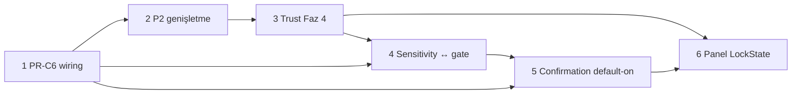

# ADR-012 Enforcement — Uygulama Sırası Planı

| Alan | Değer |
|------|-------|
| **Belge türü** | Uygulama sırası planı (plan only) |
| **Tarih** | 2026-06-21 |
| **Durum** | Kullanıcı onaylı sıra sabitlendi — kod/PR yok |
| **Referans ADR** | [ADR-012](../decisions/ADR-012-lumos-security-codex.md) |
| **Kaynak analizler** | [Karar matrisi](ADR-012-enforcement-decision-matrix.md), [Enforcement prep assessment](ADR-012-enforcement-prep-assessment.md), [Teknik borç bağımlılık grafiği](technical-debt-dependency-graph.md), [Teknik borç uygulanabilirlik haritası](technical-debt-execution-map.md), [Release blockers](release-blockers.md) |
| **Kapsam** | Altı enforcement maddesinin sıralı PR dilimi planı; runtime değişikliği **yok** |
| **Hariç** | Kod, enforcement uygulaması, PR açma, tavsiye/alternatif önerisi |

---

## Giriş

### Sabit uygulama sırası (kullanıcı onayı)

Aşağıdaki sıra **değiştirilmez**; altı madde tam uygulama (Seçenek B / birleşim hedefi) kapsamında planlanır:

| Sıra | Madde | Karar matrisi hedefi |
|------|-------|----------------------|
| 1 | PR-C6 wiring | Seçenek B — köprü approve/resume `consume_confirmation` + opt-in env birleşimi |
| 2 | P2 genişletme | Seçenek B — tam `SECURITY_NEVER_AUTO` × action/kind eşleme tablosu |
| 3 | Trust Faz 4 | Seçenek A hedefi — merkezi trust tüketimi; codex C3 kanıt zinciri |
| 4 | Sensitivity ↔ gate | Seçenek B — `classify_sensitivity` + `lumos_gate` birleşik zincir + eşik politikası |
| 5 | Confirmation varsayılanı | Seçenek B — default-on (`LUMOS_CONFIRMATION_ENABLED` varsayılan true) |
| 6 | Panel LockState | Seçenek B — runtime `LockState` / trust snapshot; env vekili kaldırma veya fallback |

### Kapsam

- Bu belge yalnızca **plan ve uygulanabilirlik dokümantasyonu**dur.
- Her madde bir veya daha fazla mantıksal PR dilimine ayrılır; PR sınırları dosya kapsamı ve geri alınabilirlik ile tanımlanır.
- Bu görevde **kod yazılmaz**, runtime davranışı değiştirilmez, PR açılmaz.

### Codex kapanış bağlamı

ADR-012 Security Codex **CLOSED değildir**. Bu sıra, checkpoint tablosundaki dört açık teknik madde (PR-C6, P2 tam, Trust Faz 4, Panel LockState) ile Madde 4–5 enforcement kararlarını kapatma yolunu tanımlar. Bkz. [ADR-012 § Açık kalan maddeler](../decisions/ADR-012-lumos-security-codex.md).

---

## Madde 1 — PR-C6 wiring

### 1. Kısa ad + sıra numarası

**1 / PR-C6 wiring** — Köprü approve/resume yolunun CU4 `consume_confirmation` zincirine birleştirilmesi.

### 2. Uygulama hedefi

- Köprü yüksek riskli görevlerde shadow adapter (`attach_bridge_pending_confirmation`) korunarak veya geçiş süresince ikili desteklenerek, **approve/resume yürütmesi** panel/CLI ile aynı CU4 zincirine bağlanır: `consume_confirmation` + `LUMOS_CONFIRMATION_ENABLED` opt-in env.
- Legacy `pending_approvals/` + `approval_token` yolu kaldırılır veya deprecate + migration ile sınırlı geçiş süresi tanımlanır.
- Tek onay tüketim yolu — duplicate onay ve onaysız yürütme riskinin codex C3/C6 hizasına alınması.
- E2E confirmation testleri (#459, #460) köprü yüzeyine genişletilebilir hale gelir.

### 3. PR sınırları

| PR | Amaç | Dosya kapsamı |
|----|------|---------------|
| **PR-1a** | Karakterizasyon | Mevcut iki pending şeması (`pending_approvals/`, `pending_confirmations/`) ve approve davranışı test matrisi. Yeni: bridge approve sözleşme testi. Dosyalar: `tests/test_bridge_confirmation_adapter.py`, `tests/test_confirmation_policy.py`, `tests/test_task_dispatch.py`, `tests/test_pending_approvals_list.py` |
| **PR-1b** | Consume/validate sınırı | Side-effect sırası açık bridge yardımcı sınırı. Dosyalar: `src/policy/confirmation_policy.py`, `packages/kando_bridge/src/kando_bridge/server.py` (~L2230–2290) |
| **PR-1c** | Gate + dispatch wiring | Köprü yürütme resume entegrasyonu. Dosyalar: `packages/kando_runtime/src/kando_runtime/lumos_gate.py` (~L1161–1168, L2617+), `packages/kando_runtime/src/kando_runtime/task_dispatch.py` (~L695–706), `src/kando/cursor_bridge.py` (~L720+) |

**Tahmini PR sayısı:** 2–3.

### 4. Ön koşullar

- Faz-2 dalgası (#459–#464) merge durumu stabil; CI yeşil.
- Mevcut shadow adapter (#462) davranışı karakterize edilmiş testlerle sabitlenmiş olmalı (PR-1a).
- Legacy `approval_token` geriye uyumluluk senaryosu test matrisinde tanımlı (execution-map td-02).

### 5. Riskler

- Mevcut köprü istemcileri `approval_token` → CU4 grant migration gerektirir.
- `LUMOS_CONFIRMATION_ENABLED` opt-in iken birleşim tam etkisiz kalabilir (env kapalı = no-op).
- Geçiş süresinde ikili path desteği karmaşıklık ve regresyon riski taşır.
- Yanlış side-effect sırası: onaylı işin çalışmaması veya grant'ın erken tüketilmesi (td-02: **kritik**).

### 6. Gerekli testler

| Tür | Dosya / kapsam |
|-----|----------------|
| Unit | `tests/test_confirmation_policy.py` — consume, scope hash, expiry, ikinci kullanım |
| Unit | `tests/test_bridge_confirmation_adapter.py` — shadow → consume geçişi |
| Integration | `tests/test_task_dispatch.py` — high/medium risk pending şemaları |
| Integration | `tests/test_pending_approvals_list.py` — legacy kayıt okuma |
| Integration | `tests/test_panel_bridge_codex_gate.py` — köprü yüzeyi gate korelasyonu (genişletme) |
| E2E | Mevcut #459 CLI, #460 panel+API — köprü approve senaryosu ek dilimi (plan aşamasında tanım) |

Senaryolar: başarılı consume + execute; yanlış scope; süresi geçmiş kayıt; ikinci kullanım; execute hatasında kayıt durumu; legacy token geriye uyumluluk.

### 7. Blokaj ilişkileri

| Yön | İlişki |
|-----|--------|
| **Bloklar** | Madde 5 (Confirmation varsayılanı) — default-on ile birleşince duplicate/çift blok riski; PR-C6 wiring önce tamamlanmalı |
| **Bloklar** | Madde 4 (Sensitivity ↔ gate) — köprü risk path değişiklikleri sırasında gate sözleşmesi sabitlenmeli; sıra 1→4 korunur |
| **Bloklanır** | — (sıra 1; önceki madde yok) |
| **Paralel** | Madde 2 (P2) dosya çakışması yok (Grup C vs Grup B); karakterizasyon dilimleri teorik paralel, **sıra kullanıcı tarafından 1→2 sabit** |

### 8. Geri dönüş maliyeti

**Orta–yüksek.** Approve handler, dispatch ve gate'de wiring geri sarılır; migration verisi (`pending_confirmations`) temizlenmesi gerekebilir; köprü istemci sözleşmesi değişmiş olur. (Kaynak: karar matrisi Madde 1, Seçenek B geri alım.)

### 9. Codex / RB çapraz referans

| Ref | Bağlantı |
|-----|----------|
| Codex C3, C6 | Üçüncü kapı + stop-on-risk köprü yüzeyi |
| RB-02 | Hard blocker — köprü CU4 consume wiring eksik |
| RB-01 | Codex CLOSED değil — PR-C6 tam wiring koşulu |
| td-02, td-08 | Bridge approve/consume; paralel pending store |
| ADR-012 checkpoint | «PR-C6 köprü confirmation namespace hizalama — Kısmi» |

---

## Madde 2 — P2 genişletme

### 1. Kısa ad + sıra numarası

**2 / P2 genişletme** — `SECURITY_NEVER_AUTO` tam action/kind eşleme tablosu.

### 2. Uygulama hedefi

- `action_policy`, panel/CLI action sabitleri, step metadata ve engine için resmi `SECURITY_NEVER_AUTO` × action/kind eşleme tablosu eklenir.
- Helper (`is_security_never_auto`, `get_security_never_auto_member`) tüm yüzeylerde aynı tabloyu kullanır.
- Küme üyeleri (`external_write`, `irreversible_user_op`, `critical_system_config`, `permanent_delete`) silme/yazma/yürütme yollarında tutarlı red.
- Codex C6 (stop-on-risk) ve CU6 (geri dönüşsüz otomatik yok) kanıt zinciri güçlenir.

### 3. PR sınırları

| PR | Amaç | Dosya kapsamı |
|----|------|---------------|
| **PR-2a** | Producer envanteri + karakterizasyon | `TaskStep` üreten yollar; dört metadata alanı (`step_kind`, `action_key`, `action_tag`, `policy_action`) doluluk testleri. Dosyalar: `tests/test_security_never_auto_engine.py`, yeni producer-contract testleri; okuma: `src/task_engine/planner.py`, `src/task_engine/action_registry.py`, `src/task_engine/diagnostics.py` |
| **PR-2b** | Eşleme tablosu + helper merkezileştirme | Tek kaynak tablo. Dosyalar: `src/task_engine/profiles.py` (L47–113), `src/core/inviolable.py`, `src/policy/action_policy.py` |
| **PR-2c** | Engine + yüzey senkronizasyonu | Engine branch genişletme; panel/CLI/store yolları. Dosyalar: `src/task_engine/engine.py` (L531–594), `src/core/workspace_contract.py`, `panel/scripts/panel_tasks_server.py`, `src/cli/cli_tasks_mutation.py` |

**Tahmini PR sayısı:** 2–3.

### 4. Ön koşullar

- Madde 1 (PR-C6) merge — köprü risk gate ile engine/policy tutarlılığı için sıra korunur (kullanıcı sırası).
- Mevcut dar engine branch (#463) testleri geçiyor (`tests/test_security_never_auto_engine.py` — 7 test).
- `permanent_delete` mevcut istisna davranışı snapshot olarak karakterize edilmiş (td-09).

### 5. Riskler

- Matris genişlemesi breaking change ve false positive riski (meşru adımların durması).
- `profiles.py`, `action_policy.py`, panel action sabitleri ve testler senkron tutulmalı.
- Bakım yükü — yeni action eklenince tablo güncellemesi zorunlu.
- Sorun engine kontrolünün varlığından çok producer metadata eksikliğinde sessiz bypass (td-09).

### 6. Gerekli testler

| Tür | Dosya / kapsam |
|-----|----------------|
| Unit | `tests/test_security_never_auto_engine.py` — küme üyeleri, helper API, engine branch |
| Unit | `tests/test_core_inviolable.py` — küme bütünlük doğrulama |
| Unit | `tests/test_task_engine.py` — engine döngüsü regresyon |
| Integration | Producer-contract testleri — planner/registry yollarında metadata taşınması |
| Integration | `tests/test_panel_delete_permanent_policy_gate.py` — `permanent_delete` panel yolu |
| Integration | Serialize/deserialize sonrası `action_key` kaybı yok |

### 7. Blokaj ilişkileri

| Yön | İlişki |
|-----|--------|
| **Bloklar** | RB-04 kapanışı; codex «SECURITY_NEVER_AUTO tüm silme/yazma yolları» checkpoint |
| **Bloklanır** | Madde 1 tamamlanmış olmalı (kullanıcı sırası 1→2) |
| **Paralel** | Madde 3 (Trust Faz 4) farklı modül ailesi (`src/security/*`); dosya çakışması yok — **sıra 2→3 kullanıcı sabit** |

### 8. Geri dönüş maliyeti

**Orta–yüksek.** Çoklu modülde eşleme tablosu ve policy genişlemesi geri sarılır; false positive düzeltmeleri gerekmiş olabilir. (Kaynak: karar matrisi Madde 2, Seçenek B geri alım.)

### 9. Codex / RB çapraz referans

| Ref | Bağlantı |
|-----|----------|
| Codex C6, CU6 | Stop-on-risk; geri dönüşsüz otomatik yok |
| RB-04 | Hard blocker — P2 dar engine kapsamı |
| RB-01 | Codex CLOSED koşulu |
| td-09 | SECURITY_NEVER_AUTO engine kapsamı |
| ADR-012 checkpoint | «Kısmi kapandı — tam küme eşlemesi açık» |

---

## Madde 3 — Trust Faz 4

### 1. Kısa ad + sıra numarası

**3 / Trust Faz 4** — ADR-007 merkezi trust motor tüketimi; dağınık sinyallerin birleştirilmesi.

### 2. Uygulama hedefi

- Merkezi trust tüketim katmanı: `keystore_ready`, `session_unlocked`, `consent` sinyalleri tek motor altında toplanır (ADR-007, ADR-011 Faz 4).
- Policy `koruma_active` ve panel read payload tutarlı sinyal kullanır.
- CLI `durum`/`hazir` ayrımı (#436–#438) korunarak codex C3 kanıt zinciri genişletilir.
- Panel `session_unlocked` runtime kaynağına bağlanmaya hazır trust snapshot veya doğrudan `LockState` tüketimi tanımlanır (Madde 6 ön hazırlığı).

### 3. PR sınırları

| PR | Amaç | Dosya kapsamı |
|----|------|---------------|
| **PR-3a** | Trust motor modülü + sözleşme | Yeni modül sınırı (public OSS uyumlu, demo-safe). Dosyalar: `src/security/` altında trust tüketim API; ADR: `docs/decisions/ADR-007-trust-engine-layer.md`. Okuma: `src/security/lock.py`, `src/core/startup_health.py`, `src/security/presence_lock.py`, `src/security/permissions.py` |
| **PR-3b** | CLI + startup health entegrasyonu | `keystore_ready` ≠ `session_unlocked` drift çözümü. Dosyalar: `src/cli/cli_router.py`, `src/core/lumos_runtime.py`, `src/core/startup_health.py`, `src/core/lumos.py` |
| **PR-3c** | Policy + panel read-state sinyal hizası | Trust snapshot policy gate ve read payload'a. Dosyalar: `src/core/panel_bridge_state.py` (L48–66, L900–925), `src/policy/action_policy.py`, `panel/scripts/panel_tasks_server.py` (read payload) |

**Tahmini PR sayısı:** 3.

### 4. Ön koşullar

- Madde 1–2 tamamlanmış (kullanıcı sırası).
- ADR-011 Faz 1–3 (#436–#438) merge durumu stabil.
- Public OSS sınırı gözden geçirilmiş — trust motor kapsamı demo-safe kalır ([public-repo-boundary](../memory/public-repo-boundary.md)).

### 5. Riskler

- Trust motor tasarımı/uygulaması takvimi uzatabilir.
- Panel process modeli (ayrı HTTP sunucu vs CLI runtime) LockState erişimini karmaşıklaştırabilir.
- ADR-007 kapsamı genişlerse public/private sınır ihlali riski.
- Geri dönüş maliyeti **yüksek** — yeni modül ve sinyal sözleşmesi değişimi.

### 6. Gerekli testler

| Tür | Dosya / kapsam |
|-----|----------------|
| Unit | Trust motor API — sinyal birleştirme, `keystore_ready` vs `session_unlocked` ayrımı |
| Unit | `tests/test_panel_bridge_adr011_faz3.py` — ADR-011 faz regresyon |
| Integration | CLI `durum`/`hazir` — iki lock sinyali gösterimi |
| Integration | `tests/test_panel_bridge_codex_gate.py` — policy context sinyal kaynağı |
| Integration | Startup health — consent, lock, keystore kombinasyon matrisi |

Referans harita: `docs/analysis/ADR-010-guard-policy-trust-usage-map.md`.

### 7. Blokaj ilişkileri

| Yön | İlişki |
|-----|--------|
| **Bloklar** | Madde 6 (Panel LockState) — trust snapshot veya LockState tüketim kaynağı; Madde 3→6 sıra |
| **Bloklar** | RB-11 kapanışı; codex Trust Faz 4 checkpoint |
| **Bloklanır** | Madde 1–2 (kullanıcı sırası) |
| **Paralel** | Madde 4 (Sensitivity) farklı kod yolu (`change_sensitivity` vs `src/security`); **sıra 3→4 kullanıcı sabit** |

### 8. Geri dönüş maliyeti

**Yüksek.** Yeni trust motor modülü, panel/CLI/policy entegrasyonu geri sarılır; sinyal sözleşmesi değişmiş olur. (Kaynak: karar matrisi Madde 3, Seçenek A geri alım.)

### 9. Codex / RB çapraz referans

| Ref | Bağlantı |
|-----|----------|
| Codex C3 | Onay + kanıt — trust kanıt zinciri |
| RB-11 | Soft blocker — Trust Faz 4 kod yok |
| RB-03 | Panel LockState ile örtüşen sinyal drift |
| RB-01 | Codex CLOSED koşulu |
| td-11 | Trust motor (release-blockers çapraz) |
| ADR-007, ADR-011 | Trust sözleşmesi; iki lock sinyali |

---

## Madde 4 — Sensitivity ↔ gate

### 1. Kısa ad + sıra numarası

**4 / Sensitivity ↔ gate** — `classify_sensitivity` ile `lumos_gate` risk değerlendirmesinin birleşik zinciri.

### 2. Uygulama hedefi

- `lumos_gate` risk değerlendirmesinde `classify_sensitivity` çıktısı kullanılır veya birleşik eşik politikası tanımlanır.
- CRITICAL path + gate risk tek karar noktasında birleşir; HIGH/CRITICAL → gate modu (`no_op`, `agent`, pending approval) eşlemesi tanımlanır.
- `decision_explorer` ve gate aynı hassasiyet sınıflandırmasını paylaşır.
- ADR-006 gap kapanır; codex C6 stop-on-risk tek sinyal zincirinde kanıtlanabilir.

### 3. PR sınırları

| PR | Amaç | Dosya kapsamı |
|----|------|---------------|
| **PR-4a** | Model giriş/çıkış karakterizasyonu | İki modelin edge-case matrisi. Dosyalar: `tests/test_change_sensitivity.py`, `tests/test_write_interceptor_sensitivity.py`; yeni gate-context sözleşme testi |
| **PR-4b** | Sensitivity context/port | Runtime package'ın `src/core`'a ters bağımlılığını önleyen port. Dosyalar: `src/core/change_sensitivity.py` (L26–89), yeni port/adaptör sınırı; okuma: `packages/kando_runtime/src/kando_runtime/lumos_gate.py` |
| **PR-4c** | Gate risk path entegrasyonu + eşik politikası | Birleşik karar noktası. Dosyalar: `packages/kando_runtime/src/kando_runtime/lumos_gate.py` (~L1440+), `packages/kando_runtime/src/kando_runtime/task_dispatch.py`, `src/core/guard_audit.py` |

**Tahmini PR sayısı:** 2–3.

### 4. Ön koşullar

- Madde 1 (PR-C6) tamamlanmış — köprü risk path sözleşmesi sabit (td-04 bağımlılığı: pending sözleşmesi önce).
- Madde 3 (Trust Faz 4) tamamlanmış (kullanıcı sırası) — gate kararları trust sinyalleri ile tutarlı olmalı.
- Mevcut `write_interceptor`, `decision_explorer`, `change_plan` davranışı karakterize edilmiş.

### 5. Riskler

- Gate prompt sözleşmesi ve runtime assert değişir; köprü görev regresyonu.
- Path tabanlı sensitivity ile intent tabanlı gate risk farklı girdi türleri — yanlış eşleme false positive/negative.
- Eşik politikası tanımı ve test kapsamı genişler.
- Modeller farklı enum/etiket kullanır; paket sınırı ve `sys.path` etkisi (td-10: **orta** risk).

### 6. Gerekli testler

| Tür | Dosya / kapsam |
|-----|----------------|
| Unit | `tests/test_change_sensitivity.py` — CRITICAL heuristic |
| Unit | `tests/test_write_interceptor.py`, `tests/test_write_interceptor_sensitivity.py` — patch pipeline |
| Unit | `tests/test_change_plan.py` — patch plan etiketi |
| Integration | Gate-context port — aynı path için sensitivity context taşınması |
| Integration | `tests/test_lumos_plan_substep_gate.py`, `tests/test_task_dispatch.py` — gate risk regresyon |
| Integration | `tests/test_persona_security_simdi_checkpoint.py` — lumos_gate kullanımı |
| Karakterizasyon | Repo kökü dışı, göreli path, bulunmayan dosya, çoklu hedef senaryoları |

### 7. Blokaj ilişkileri

| Yön | İlişki |
|-----|--------|
| **Bloklar** | RB-12 kapanışı; ADR-006 gap |
| **Bloklanır** | Madde 1 (köprü pending sözleşmesi), Madde 3 (kullanıcı sırası) |
| **Paralel** | Madde 2 (P2) dosya çakışması yok — **sıra 4 kullanıcı sabit** |
| **Not** | td-04 (`lumos_gate` modül ayrıştırması) bu maddeden **sonra** planlanmalı — risk path entegrasyonu önce |

### 8. Geri dönüş maliyeti

**Orta.** Gate risk path ve olası dispatch dallanması geri sarılır; eşik politikası config kaldırılır. (Kaynak: karar matrisi Madde 4, Seçenek B geri alım.)

### 9. Codex / RB çapraz referans

| Ref | Bağlantı |
|-----|----------|
| Codex C6 | Stop-on-risk — birleşik sinyal |
| RB-12 | Soft blocker — sensitivity ↔ gate kopuk |
| td-10 | change_sensitivity ↔ gate gap |
| ADR-006 | Zincir özeti — gap kayıtlı |
| `lumos-runtime-enforcement-map.md` §4 | Documented-only gap |

---

## Madde 5 — Confirmation varsayılanı

### 1. Kısa ad + sıra numarası

**5 / Confirmation varsayılanı** — CU4 3. kapının default-on yapılması.

### 2. Uygulama hedefi

- `is_confirmation_enabled()` varsayılan **True** — env yok veya true iken confirmation aktif.
- Explicit `LUMOS_CONFIRMATION_ENABLED=false` ile kapatılır.
- Codex C3 üçüncü kapı prod'da varsayılan devrede; `write_local` mutasyonları ek koruma alır.
- DL-C18 (#461) docs kararı ile runtime flip uyumu — ADR-012 ve decision-log güncellemesi gerekir.

### 3. PR sınırları

| PR | Amaç | Dosya kapsamı |
|----|------|---------------|
| **PR-5a** | Default flip + env gate | `src/policy/confirmation_policy.py` (L101–104 `is_confirmation_enabled`) |
| **PR-5b** | Test + docs sync | `tests/test_panel_bridge_codex_gate.py`, E2E (#459, #460) env varsayılanı; `docs/decisions/ADR-012-lumos-security-codex.md` §7, `docs/decision-log.md` DL-C18; `docs/analysis/lumos-cu4-confirmation-skeleton-draft.md` false positive tablosu |

**Tahmini PR sayısı:** 1–2.

### 4. Ön koşullar

- **Madde 1 (PR-C6 wiring) zorunlu** — köprü duplicate onay gap'i kapatılmadan default-on güvenli değil (karar matrisi Madde 5 risk).
- E2E kanıt (#459, #460) mevcut ve geçiyor.
- False positive profili dokümante (`lumos-cu4-confirmation-skeleton-draft.md`).

### 5. Riskler

- Mevcut otomasyon/scriptler env ayarlamadan confirmation grant bekler — kırılma.
- False positive: meşru mutasyonlar modal/onay bekler; panel E2E dışı akışlar etkilenir.
- PR-C6 köprü wiring gap'i default-on ile birleşince duplicate veya çift blok riski (Madde 1 önce tamamlanmalı).
- UX drift: dokümantasyon ve varsayılan davranış senkron tutulmalı.

### 6. Gerekli testler

| Tür | Dosya / kapsam |
|-----|----------------|
| Unit | `tests/test_confirmation_policy.py` — varsayılan enabled; explicit false |
| Integration | `tests/test_panel_bridge_codex_gate.py` — 3. kapı varsayılan aktif |
| Integration | `tests/test_panel_put_tasks_json_policy_gate.py`, delete/restore gate testleri |
| Integration | `src/cli/cli_tasks_mutation.py` yolu — CLI confirmation varsayılan |
| E2E | #459 CLI, #460 panel+API — env olmadan confirmation akışı |
| CI | Mevcut test suite — env beklentisi güncellemesi |

### 7. Blokaj ilişkileri

| Yön | İlişki |
|-----|--------|
| **Bloklanır** | Madde 1 (PR-C6) — **zorunlu ön koşul** |
| **Bloklanır** | Madde 2–4 (kullanıcı sırası 1→5) |
| **Bloklar** | RB-13 kapanışı (soft → hard bağlamında codex tam enforcement) |
| **Paralel** | Madde 6 (Panel LockState) farklı dosya seti — **sıra 5→6 kullanıcı sabit** |

### 8. Geri dönüş maliyeti

**Orta.** `is_confirmation_enabled` default flip + dokümantasyon sync; kullanıcı/CI env beklentileri değişmiş olur; testler güncellenmeli. (Kaynak: karar matrisi Madde 5, Seçenek B geri alım.)

### 9. Codex / RB çapraz referans

| Ref | Bağlantı |
|-----|----------|
| Codex C3 | Üçüncü kapı — confirmation |
| RB-13 | Soft blocker — opt-in varsayılan kapalı |
| ADR-012 §7 | Opt-in kaydı; DL-C18 defer |
| #461 | Docs: opt-in korunur (runtime flip öncesi durum) |

---

## Madde 6 — Panel LockState

### 1. Kısa ad + sıra numarası

**6 / Panel LockState** — Panel policy context'in runtime `LockState` / trust snapshot'a bağlanması.

### 2. Uygulama hedefi

- Panel sunucusu CLI runtime ile aynı kilit gerçeğini yansıtır: `LockState` / `CoreState.lock_status()` veya Madde 3 trust motor snapshot'ı.
- `_panel_policy_context` içinde `koruma_active` env vekili (`LUMOS_SESSION_UNLOCKED`) kaldırılır veya yalnızca fallback.
- CLI ve panel aynı `session_unlocked` sinyalini kullanır — ADR-011 Faz 4 enforcement hizası.
- Codex C6 koruma+delete gate gerçek runtime sinyaline dayanır.

### 3. PR sınırları

| PR | Amaç | Dosya kapsamı |
|----|------|---------------|
| **PR-6a** | Karakterizasyon + provider arayüzü | Env vs `LockState` yaşam döngüsü testleri; injectable session-state provider. Dosyalar: `tests/test_panel_bridge_codex_gate.py`, `tests/test_panel_put_tasks_json_policy_gate.py`, `tests/test_panel_restore_policy_gate.py`, `tests/test_panel_delete_permanent_policy_gate.py` |
| **PR-6b** | Runtime LockState / trust adaptörü | Canonical kaynak bağlantısı. Dosyalar: `src/core/panel_bridge_state.py` (L48–66, L900–925), `src/security/lock.py`, `src/core/lumos.py`, `src/core/lumos_runtime.py` |
| **PR-6c** | Panel server + read payload | `session_unlocked` runtime doğrulaması. Dosyalar: `panel/scripts/panel_tasks_server.py`, `src/policy/action_policy.py`, `src/core/startup_health.py` |

**Tahmini PR sayısı:** 2–3.

### 4. Ön koşullar

- **Madde 3 (Trust Faz 4) zorunlu** — trust snapshot veya merkezi sinyal kaynağı (kullanıcı sırası 3→6).
- Madde 1–5 tamamlanmış (kullanıcı sırası).
- Process model kararı: panel embedded vs ayrı HTTP sunucu; LockState erişim mekanizması (IPC, socket, startup sync) tanımlı.
- td-07 modül sınırları (Wave 2) — dar entegrasyon yüzeyi tercih edilir.

### 5. Riskler

- Panel process modeli değişikliği gerekebilir (embedded server, state paylaşımı).
- Ayrı process panel LockState'e erişemezse yeni IPC katmanı.
- Mevcut panel deployment/script akışları (`panel_tasks_server.py` standalone) etkilenir.
- Farklı process'lerde in-memory `LockState` doğrudan paylaşılamaz (td-03: **kritik**).

### 6. Gerekli testler

| Tür | Dosya / kapsam |
|-----|----------------|
| Unit | Provider arayüzü — env adaptör vs runtime adaptör |
| Integration | `tests/test_panel_bridge_codex_gate.py` — `koruma_active` runtime kaynaklı |
| Integration | `tests/test_panel_delete_permanent_policy_gate.py` — kilitli oturumda delete red |
| Integration | `tests/test_panel_restore_policy_gate.py` — gate reason tutarlılığı |
| Integration | Panel read payload — `session_unlocked` alanı runtime ile hizalı |
| Senaryo | Kilitli/kilitsiz/unknown state; process yeniden başlatma |

### 7. Blokaj ilişkileri

| Yön | İlişki |
|-----|--------|
| **Bloklanır** | Madde 3 (Trust Faz 4) — **zorunlu**; Madde 1–5 (kullanıcı sırası) |
| **Bloklar** | RB-03 kapanışı; codex «Panel LockState» checkpoint; RB-01 codex CLOSED |
| **Paralel** | — (sıra 6; son madde) |
| **Not** | td-01 UI modül çıkarımı bu maddeden sonra (panel backend yüzeyi stabil olmalı) |

### 8. Geri dönüş maliyeti

**Orta–yüksek.** Process model / IPC değişikliği geri sarılır; panel startup scriptleri etkilenmiş olur. (Kaynak: karar matrisi Madde 6, Seçenek B geri alım.)

### 9. Codex / RB çapraz referans

| Ref | Bağlantı |
|-----|----------|
| Codex C6 | `koruma_active` + delete gate |
| RB-03 | Hard blocker — Panel LockState env vekili |
| RB-01 | Codex CLOSED koşulu |
| td-03 | Panel env / LockState kopukluğu |
| ADR-011 | İki lock sinyali, Faz 4 |

---

## Sıra diyagramı (Mermaid)

**Kenar gerekçeleri (kaynak belgelerden):**

- `M1 → M2`, `M2 → M3`, `M3 → M4`, `M4 → M5`: Kullanıcı onaylı sabit sıra 1→6.
- `M1 → M5`: PR-C6 köprü wiring, default-on öncesi zorunlu (karar matrisi Madde 5 risk).
- `M1 → M4`: Köprü pending/risk path sözleşmesi sensitivity entegrasyonu öncesi sabitlenmeli (td-04 bağımlılığı).
- `M3 → M6`: Trust Faz 4, Panel LockState sinyal kaynağı (karar matrisi Madde 3/6).
- `M5 → M6`: Kullanıcı sırası; confirmation gate panel policy ile aynı yüzeyde (`panel_bridge_state`).

---

## Özet tablo

| Sıra | Madde | PR sayısı (tahmini) | Ön koşul | Bloklar |
|------|-------|---------------------|----------|---------|
| 1 | PR-C6 wiring | 2–3 | Faz-2 stabil; shadow adapter karakterize | RB-02; Madde 5; köprü risk path (Madde 4) |
| 2 | P2 genişletme | 2–3 | Madde 1 | RB-04; codex P2 checkpoint |
| 3 | Trust Faz 4 | 3 | Madde 1–2 | RB-11; Madde 6 |
| 4 | Sensitivity ↔ gate | 2–3 | Madde 1, 3 | RB-12; ADR-006 gap |
| 5 | Confirmation default-on | 1–2 | Madde 1 (**zorunlu**), 2–4 | RB-13 |
| 6 | Panel LockState | 2–3 | Madde 3 (**zorunlu**), 1–5 | RB-03; RB-01 (codex CLOSED) |

**Toplam tahmini PR:** 12–17 (madde başına 1–3; overlap yok).

---

## Uygulanabilirlik bayrakları (plan only)

| Bayrak | Madde | Açıklama |
|--------|-------|----------|
| **Blocker** | 1 | Side-effect sırası hatası onaylı yürütmeyi kırar (td-02 kritik) |
| **Blocker** | 6 | Process model — ayrı panel process'te LockState paylaşımı IPC gerektirir |
| **Doğruluğu etkileyen** | 2 | Producer metadata eksikliği engine-only değişiklikle kapanmayabilir |
| **Doğruluğu etkileyen** | 3 | Public OSS sınırı — trust motor kapsamı dar tutulmalı |
| **Doğruluğu etkileyen** | 4 | Path vs intent sınıflandırma yanlış eşleme riski |
| **Doğruluğu etkileyen** | 5 | Madde 1 tamamlanmadan default-on duplicate/çift blok üretir |
| **İyileştirme** | — | td-04/05/06 modül ayrıştırması bu sıranın **sonrasında** planlanır |

**Codex CLOSED:** Altı madde merge + test kanıtı sonrası ADR-012 checkpoint tablosu güncellenir; RB-01 hard blocker kapanış koşulu sağlanır.

---

## İlgili belgeler

| Belge | İçerik |
|-------|--------|
| [ADR-012 Security Codex](../decisions/ADR-012-lumos-security-codex.md) | C1–C6 sözleşmesi, checkpoint tablosu |
| [ADR-012 enforcement decision matrix](ADR-012-enforcement-decision-matrix.md) | Altı madde seçenek A/B, fayda/risk, geri dönüş maliyeti |
| [ADR-012 enforcement prep assessment](ADR-012-enforcement-prep-assessment.md) | Wired/shadow/gap haritası, karar maddeleri kaynağı |
| [Teknik borç bağımlılık grafiği](technical-debt-dependency-graph.md) | td-02..td-10 dalga topolojisi |
| [Teknik borç uygulanabilirlik haritası](technical-debt-execution-map.md) | PR dilimi, test yüzeyi, geri dönüş planları |
| [Release blockers](release-blockers.md) | RB-01..RB-13 çapraz |
| [Runtime enforcement map](lumos-runtime-enforcement-map.md) | Wired / shadow / gap |
| [CU4 confirmation skeleton](lumos-cu4-confirmation-skeleton-draft.md) | PR-C6, false positive |
| [P2 SECURITY_NEVER_AUTO analiz](security-never-auto-p2-and-helper-proposal.md) | Engine branch, helper API |
| [ADR-011 lock semantics](../decisions/ADR-011-lock-semantics-decision.md) | İki lock sinyali, Faz 4 |
| [ADR-007 trust engine](../decisions/ADR-007-trust-engine-layer.md) | Trust sözleşmesi |

---

## Yasaklar (bu belge)

- Kod veya enforcement değişikliği **yapılmaz**
- PR **açılmaz**
- Uygulama sırası **değiştirilmez** — alternatif sıra veya seçenek **önerilmez**
- Bu belge karar **vermez** — sıra kullanıcı tarafından sabitlenmiştir
