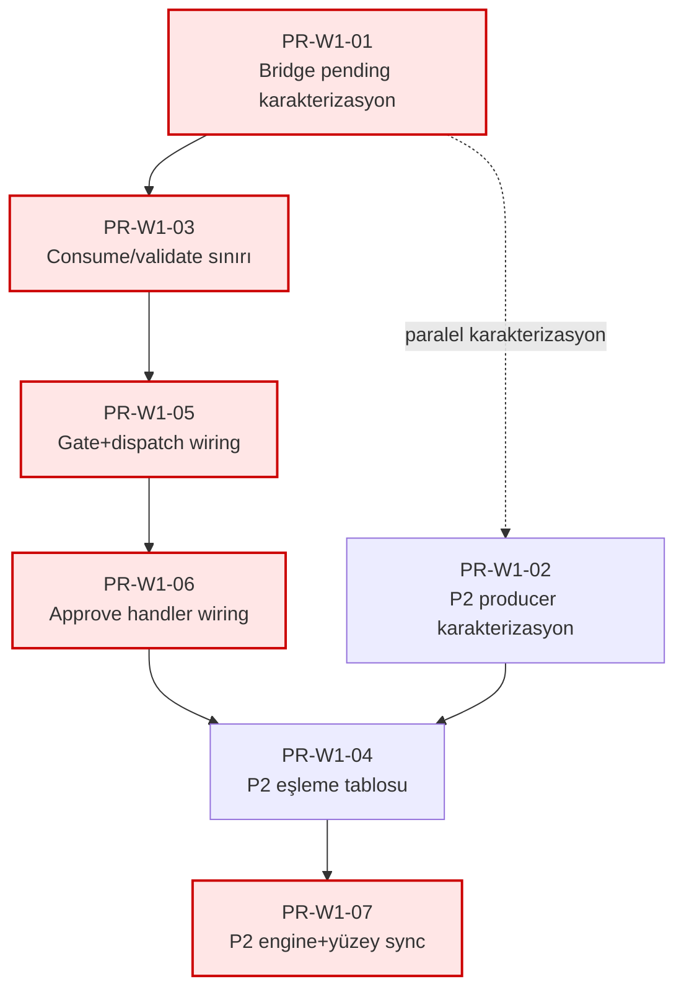

# ADR-012 Wave 1 — Uygulama Planı (PR-C6 + P2)

| Alan | Değer |
|------|-------|
| **Belge türü** | Wave 1 execution plan (plan only) |
| **Tarih** | 2026-06-21 |
| **Durum** | Plan — kod/PR/enforcement uygulaması yok |
| **Referans ADR** | [ADR-012](../decisions/ADR-012-lumos-security-codex.md) |
| **Kaynak sıra** | [ADR-012 uygulama sırası](adr-012-implementation-sequence.md) (Madde 1–2) |
| **Karar hedefi** | Seçenek B — PR-C6 `consume_confirmation` birleşimi; P2 tam `SECURITY_NEVER_AUTO` eşleme tablosu |
| **Kapsam** | Yalnızca Madde 1 (PR-C6 wiring) ve Madde 2 (P2 genişletme) |
| **Hariç** | Trust Faz 4, Sensitivity↔gate, Confirmation default-on, Panel LockState; kod; PR açma; enforcement uygulaması |
| **Teknik borç** | [td-02](technical-debt-dependency-graph.md#td-02-bridge-cu4-gap), [td-08](technical-debt-dependency-graph.md#td-08-parallel-pending-stores), [td-09](technical-debt-dependency-graph.md#td-09-p2-never-auto-narrow) |

---

## Wave 1 overview

Wave 1, kullanıcı onaylı ADR-012 enforcement sırasının ilk iki maddesini kapatır:

| Sıra | Madde | Hedef | RB |
|------|-------|-------|-----|
| 1 | PR-C6 wiring | Köprü approve/resume → `consume_confirmation` + `LUMOS_CONFIRMATION_ENABLED` opt-in env; legacy `pending_approvals` / `approval_token` deprecate veya geçiş süresi ikili destek | RB-02 |
| 2 | P2 genişletme | Tam `SECURITY_NEVER_AUTO` × action/kind eşleme tablosu; helper tüm yüzeylerde tek kaynak | RB-04 |

**Tahmini PR sayısı:** 7 (`PR-W1-01` … `PR-W1-07`).

### Madde 1 ↔ Madde 2 bağımlılığı

| Kaynak | İlişki |
|--------|--------|
| [Uygulama sırası § Madde 2 ön koşul](adr-012-implementation-sequence.md) | **Kullanıcı sırası 1→2 sabit:** P2 uygulama PR'ları (`PR-W1-04`, `PR-W1-07`) Madde 1 wiring tamamlanmadan merge edilmemeli — köprü risk gate ile engine/policy tutarlılığı |
| [Uygulama sırası § Madde 1 blokaj](adr-012-implementation-sequence.md) | Madde 2 ile **dosya çakışması yok** (Grup B köprü vs Grup C engine); karakterizasyon dilimleri teorik paralel |
| [Bağımlılık grafiği td-09](technical-debt-dependency-graph.md#td-09-p2-never-auto-narrow) | td-09 (P2) td-02 (PR-C6) ile **ortak dosya taşımaz**; karakterizasyon (`PR-W1-02`) td-02 karakterizasyonu (`PR-W1-01`) ile **paralel** yürütülebilir |
| [Execution-map sıra 2 vs 3](technical-debt-execution-map.md) | td-02/td-08 store karakterizasyonu ile td-09 producer envanteri bağımsız dalga-1 dilimleri |

**Özet sıra:**

1. **Paralel (karakterizasyon):** `PR-W1-01` ∥ `PR-W1-02`
2. **Madde 1 zinciri (sıralı):** `PR-W1-01` → `PR-W1-03` → `PR-W1-05` → `PR-W1-06`
3. **Madde 2 zinciri (kullanıcı sırası):** `PR-W1-02` → `PR-W1-04` → `PR-W1-07`; **`PR-W1-04` ve `PR-W1-07` ön koşulu: `PR-W1-06` merge**

---

## PR paketleri

### PR-W1-01 — Köprü pending store / approve karakterizasyonu

| Alan | Değer |
|------|-------|
| **Madde** | 1 — PR-C6 |
| **td** | td-02, td-08 |

**Amaç**

İki pending şemasının (`pending_approvals/`, `pending_confirmations/`) ve üç fiziksel store'un (legacy bridge, CU4 grant, cursor_bridge JSON) mevcut approve davranışını test matrisi ile sabitlemek. Shadow adapter (#462) davranışı regresyon altına alınır; legacy `approval_token` geriye uyumluluk senaryoları tanımlanır. Wiring PR'larına geçmeden önce side-effect sırası ve şema sözleşmesi kanıtlanır.

**Ön koşul PR'lar**

- Yok (Wave 1 giriş). Repo: Faz-2 dalgası (#459–#464) CI yeşil; #462 shadow adapter merge durumu stabil.

**Dosyalar**

| Tür | Yol |
|-----|-----|
| Test (genişlet) | `tests/test_bridge_confirmation_adapter.py` |
| Test (genişlet) | `tests/test_confirmation_policy.py` |
| Test (genişlet) | `tests/test_task_dispatch.py` |
| Test (genişlet) | `tests/test_pending_approvals_list.py` |
| Test (yeni) | `tests/test_bridge_approve_contract.py` (bridge approve sözleşme matrisi) |
| Okuma | `src/policy/confirmation_policy.py` |
| Okuma | `packages/kando_runtime/src/kando_runtime/lumos_gate.py` (~L1161–1168) |
| Okuma | `packages/kando_runtime/src/kando_runtime/task_dispatch.py` (~L695–702) |
| Okuma | `packages/kando_bridge/src/kando_bridge/server.py` (~L2230–2288) |
| Okuma | `src/kando/cursor_bridge.py` (~L720+) |
| Fixture | `.lumos/pending_approvals/`, `.lumos/pending_confirmations/`, `.lumos/cursor_bridge/pending_approvals.json` (test fixture) |

**Testler**

- Unit/integration: başarılı shadow grant yazımı; legacy token doğrulama; yanlış scope; süresi geçmiş kayıt; ikinci kullanım; high/medium risk pending şema ayrımı
- Cross-store: confirmation_id / confirmation_scope_hash korelasyon alanları
- Legacy: `approval_token` geriye uyumluluk matrisi (execution-map td-02)

**Rollback sınırı**

Yalnızca test ve fixture dosyaları geri alınır. Runtime davranış değişmez. **Maliyet: düşük.**

**Blokaj**

Bloklar: `PR-W1-03`, `PR-W1-05`, `PR-W1-06` (Madde 1 wiring dilimleri).

---

### PR-W1-02 — P2 TaskStep producer envanteri + karakterizasyon

| Alan | Değer |
|------|-------|
| **Madde** | 2 — P2 |
| **td** | td-09 |

**Amaç**

`TaskStep` üreten planner/registry yollarında dört metadata alanının (`step_kind`, `action_key`, `action_tag`, `policy_action`) doluluk envanterini çıkarmak ve producer-contract testleri ile sabitlemek. Mevcut dar engine branch (#463, 7 test) regresyon altına alınır; `permanent_delete` istisna davranışı snapshot olarak korunur. Engine-only genişlemenin sessiz bypass riskini (td-09) ölçülebilir kılar.

**Ön koşul PR'lar**

- Yok. **`PR-W1-01` ile paralel** (dosya çakışması yok — dependency-graph Grup C vs Grup B).

**Dosyalar**

| Tür | Yol |
|-----|-----|
| Test (genişlet) | `tests/test_security_never_auto_engine.py` |
| Test (genişlet) | `tests/test_core_inviolable.py` |
| Test (genişlet) | `tests/test_task_engine.py` |
| Test (yeni) | `tests/test_taskstep_producer_contract.py` (planner/registry metadata taşınması) |
| Okuma | `src/task_engine/planner.py` |
| Okuma | `src/task_engine/action_registry.py` |
| Okuma | `src/task_engine/diagnostics.py` |
| Okuma | `src/task_engine/profiles.py` (L47–113) |
| Okuma | `src/task_engine/engine.py` (L531–594) |

**Testler**

- Mevcut 7 engine testi korunur
- Producer-contract: her üretim yolunda dört alanın beklenen taşınması
- Serialize/deserialize sonrası `action_key` kaybı yok
- `permanent_delete` mevcut istisna snapshot'ı

**Rollback sınırı**

Yalnızca test dosyaları. **Maliyet: düşük.**

**Blokaj**

Bloklar: `PR-W1-04`, `PR-W1-07` (P2 uygulama dilimleri).

---

### PR-W1-03 — Bridge consume/validate yardımcı sınırı

| Alan | Değer |
|------|-------|
| **Madde** | 1 — PR-C6 |
| **td** | td-02 |

**Amaç**

Token doğrulama, pending doğrulama, `consume_confirmation` ve execute adımlarını side-effect sırası açık tek bridge yardımcı sınırına ayırmak. Handler entegrasyonu (`PR-W1-05`/`PR-W1-06`) öncesinde consume/validate mantığı izole test edilebilir hale gelir; grant erken tüketimi veya onaylı işin çalışmaması riski (td-02 kritik) daraltılır.

**Ön koşul PR'lar**

- `PR-W1-01` (karakterizasyon matrisi merge)

**Dosyalar**

| Tür | Yol |
|-----|-----|
| Uygulama | `src/policy/confirmation_policy.py` (bridge consume/validate yardımcıları) |
| Uygulama | `packages/kando_bridge/src/kando_bridge/server.py` (~L2230–2290 — yardımcı delegasyonu, handler henüz tam wiring değil) |
| Test (genişlet) | `tests/test_confirmation_policy.py` |
| Test (genişlet) | `tests/test_bridge_confirmation_adapter.py` |
| Test (genişlet) | `tests/test_bridge_approve_contract.py` |

**Testler**

- consume + scope hash + expiry + ikinci kullanım
- execute hatasında grant/kayıt durumu
- `LUMOS_CONFIRMATION_ENABLED=false` iken no-op davranışı (opt-in korunur)
- Legacy token yolu yardımcı sınırından bağımsız çalışmaya devam (geçiş süresi)

**Rollback sınırı**

`confirmation_policy.py` bridge yardımcıları ve `server.py` delegasyon katmanı geri alınır; approve handler eski inline davranışa döner. Pending şemaları değişmediyse veri migration yok. **Maliyet: orta.**

**Blokaj**

Bloklar: `PR-W1-05`, `PR-W1-06`.

---

### PR-W1-04 — SECURITY_NEVER_AUTO eşleme tablosu + helper merkezileştirme

| Alan | Değer |
|------|-------|
| **Madde** | 2 — P2 |
| **td** | td-09 |

**Amaç**

Resmi `SECURITY_NEVER_AUTO` × action/kind eşleme tablosunu tek kaynak olarak tanımlamak; `is_security_never_auto` / `get_security_never_auto_member` helper'larının tüm yüzeylerde aynı tabloyu kullanmasını sağlamak. Engine branch genişlemesi (`PR-W1-07`) öncesinde policy/profil/inviolable katmanları hizalanır; drift azaltılır.

**Ön koşul PR'lar**

- `PR-W1-02` (producer envanteri merge)
- **`PR-W1-06` (Madde 1 wiring tamam)** — kullanıcı onaylı sıra 1→2; köprü risk gate ile policy tutarlılığı

**Dosyalar**

| Tür | Yol |
|-----|-----|
| Uygulama | `src/task_engine/profiles.py` (L47–113) |
| Uygulama | `src/core/inviolable.py` |
| Uygulama | `src/policy/action_policy.py` |
| Test (genişlet) | `tests/test_security_never_auto_engine.py` |
| Test (genişlet) | `tests/test_core_inviolable.py` |
| Okuma | `docs/analysis/security-never-auto-p2-and-helper-proposal.md` |

**Testler**

- Küme bütünlük doğrulama (`inviolable`)
- Helper API: dört üye (`external_write`, `irreversible_user_op`, `critical_system_config`, `permanent_delete`) tablo eşlemesi
- `action_policy` hardcoded liste ile tablo senkronizasyonu
- Engine branch **henüz genişletilmez** — mevcut dar davranış regresyon testleri geçer

**Rollback sınırı**

Tablo ve helper merkezileştirmesi `profiles.py`, `inviolable.py`, `action_policy.py` geri alınır. **Maliyet: orta.**

**Blokaj**

Bloklar: `PR-W1-07`.

---

### PR-W1-05 — lumos_gate + task_dispatch consume wiring (risk path)

| Alan | Değer |
|------|-------|
| **Madde** | 1 — PR-C6 |
| **td** | td-02, td-08 |

**Amaç**

Yüksek/orta risk pending kaydı oluşturma yolunda shadow grant yazımından (`attach_bridge_pending_confirmation`) consume zincirine geçişin ilk dilimi: `lumos_gate` risk kaydı ve `task_dispatch` approve executor yollarında `PR-W1-03` yardımcı sınırının tüketilmesi. `lumos_gate_execute` resume (~L2617+) bu PR'da dokunulmaz — `PR-W1-06`'ya bırakılır.

**Ön koşul PR'lar**

- `PR-W1-03` (consume/validate sınırı merge)

**Dosyalar**

| Tür | Yol |
|-----|-----|
| Uygulama | `packages/kando_runtime/src/kando_runtime/lumos_gate.py` (~L1161–1168, risk pending path) |
| Uygulama | `packages/kando_runtime/src/kando_runtime/task_dispatch.py` (~L695–706) |
| Test (genişlet) | `tests/test_bridge_confirmation_adapter.py` |
| Test (genişlet) | `tests/test_task_dispatch.py` |
| Test (genişlet) | `tests/test_lumos_plan_substep_gate.py` |
| Test (genişlet) | `tests/test_persona_security_simdi_checkpoint.py` |

**Testler**

- Shadow → consume geçişi: env on iken grant tüketimi
- High-risk ve medium-risk pending şema ayrımı
- Gate/dispatch regresyon: plan substep, persona checkpoint

**Rollback sınırı**

`lumos_gate.py` ve `task_dispatch.py` risk path geri sarılır; shadow-only davranışa dönüş. **Maliyet: orta–yüksek** (td-02).

**Blokaj**

Bloklar: `PR-W1-06`.

---

### PR-W1-06 — Köprü approve handler + cursor_bridge resume wiring

| Alan | Değer |
|------|-------|
| **Madde** | 1 — PR-C6 |
| **td** | td-02, td-08 |

**Amaç**

Köprü approve/resume yürütmesini panel/CLI ile aynı CU4 zincirine bağlamak: `kando_bridge/server.py` approve handler, `cursor_bridge.py` `_handle_approve_goal` ve `lumos_gate_execute` resume yolunda `consume_confirmation` + opt-in env. Legacy `pending_approvals` / `approval_token` deprecate veya geçiş süresi ikili destek (karar matrisi alt karar). Madde 1 **exit** PR'si.

**Ön koşul PR'lar**

- `PR-W1-05` (gate/dispatch risk path merge)

**Dosyalar**

| Tür | Yol |
|-----|-----|
| Uygulama | `packages/kando_bridge/src/kando_bridge/server.py` (~L2230–2290) |
| Uygulama | `src/kando/cursor_bridge.py` (~L720+) |
| Uygulama | `packages/kando_runtime/src/kando_runtime/lumos_gate.py` (~L2617+ `lumos_gate_execute`) |
| Test (genişlet) | `tests/test_bridge_approve_contract.py` |
| Test (genişlet) | `tests/test_pending_approvals_list.py` |
| Test (genişlet) | `tests/test_panel_bridge_codex_gate.py` (köprü yüzeyi gate korelasyonu) |
| Test (genişlet) | `tests/kando/test_cursor_bridge_contract.py` |
| E2E (genişletme tanımı) | Mevcut #459 CLI, #460 panel+API — köprü approve senaryosu ek dilimi; `ui/e2e/confirmation-panel-api.mjs` referans |

**Testler**

- Başarılı consume + execute; execute hatasında kayıt durumu
- Legacy token geriye uyumluluk (geçiş süresi tanımlıysa)
- Cursor APPROVE → CU4 grant tüketimi
- Integration: panel bridge codex gate korelasyonu

**Rollback sınırı**

Approve handler, cursor_bridge approve, gate execute resume geri sarılır; migration verisi (`pending_confirmations`) temizliği gerekebilir; köprü istemci sözleşmesi değişmiş olur. **Maliyet: orta–yüksek** (karar matrisi Madde 1 Seçenek B).

**Blokaj**

Bloklar: `PR-W1-04`, `PR-W1-07` (Madde 2 uygulama); Wave 2 Madde 3+ (Trust Faz 4) için Madde 1 tamamlanmış olmalı.

---

### PR-W1-07 — P2 engine branch genişletme + yüzey senkronizasyonu

| Alan | Değer |
|------|-------|
| **Madde** | 2 — P2 |
| **td** | td-09 |

**Amaç**

`PR-W1-04` eşleme tablosunu engine döngüsü, panel/CLI/store yollarına uygulayarak tam küme kapsamını tamamlamak. `permanent_delete` panel (#445) ve `workspace_contract` yolu tablo ile hizalanır; tag eşleşmeyen bypass yüzeyleri kapatılır. Wave 1 **exit** PR'si — RB-04 ve codex P2 checkpoint hedefi.

**Ön koşul PR'lar**

- `PR-W1-04` (eşleme tablosu merge)
- `PR-W1-06` (Madde 1 tam — kullanıcı sırası)

**Dosyalar**

| Tür | Yol |
|-----|-----|
| Uygulama | `src/task_engine/engine.py` (L531–594) |
| Uygulama | `src/core/workspace_contract.py` |
| Uygulama | `panel/scripts/panel_tasks_server.py` |
| Uygulama | `src/cli/cli_tasks_mutation.py` |
| Test (genişlet) | `tests/test_security_never_auto_engine.py` |
| Test (genişlet) | `tests/test_task_engine.py` |
| Test (genişlet) | `tests/test_panel_delete_permanent_policy_gate.py` |
| Test (genişlet) | `tests/test_taskstep_producer_contract.py` |

**Testler**

- Engine branch: dört küme üyesi + false positive profili
- Panel delete-permanent gate; CLI mutation yolu
- Producer metadata eksikliği senaryoları (td-09)
- Engine döngüsü regresyon

**Rollback sınırı**

Engine branch genişlemesi, panel/CLI/store policy genişlemesi geri sarılır; false positive düzeltmeleri gerekebilir. **Maliyet: orta–yüksek** (karar matrisi Madde 2 Seçenek B).

**Blokaj**

Bloklar: Wave 2 Madde 3 (Trust Faz 4) — kullanıcı sırası 2→3; RB-04 kapanışı.

---

## Dependency order

### Numaralı sıra

```
PR-W1-01 ──┬──► PR-W1-03 ──► PR-W1-05 ──► PR-W1-06 ──┬──► PR-W1-04 ──► PR-W1-07
           │                                          │
PR-W1-02 ──┴──────────────────────────────────────────┘
           (W1-02 ∥ W1-01 karakterizasyon; W1-04/W1-07 W1-06 sonrası)
```

### Mermaid (kritik path vurgulu)



**Kritik path:** `PR-W1-01 → PR-W1-03 → PR-W1-05 → PR-W1-06 → PR-W1-04 → PR-W1-07` (7 PR, ~6 sıralı merge dilimi; karakterizasyon paralel dilimi kritik path süresini kısaltır).

---

## Wave 1 exit criteria

### Madde 1 — PR-C6 wiring (done)

| Checkpoint | Kanıt |
|------------|-------|
| Köprü approve/resume `consume_confirmation` kullanır | `kando_bridge/server.py`, `cursor_bridge.py`, `lumos_gate_execute` wiring merge (`PR-W1-06`) |
| Panel/CLI ile aynı CU4 grant store | `.lumos/pending_confirmations/` tek tüketim yolu (opt-in env açıkken) |
| Legacy path | Deprecate veya geçiş ikili destek test matrisinde tanımlı ve geçiyor |
| Shadow adapter | Consume zincirine entegre veya geçiş tamamlandıktan sonra kaldırıldı |
| Test kanıtı | Unit/integration + köprü approve E2E dilimi (#459/#460 genişletme) yeşil |
| RB-02 | Hard blocker kapanış koşulu sağlandı (codex PR-C6 checkpoint «Kısmi» → «Kapandı») |

### Madde 2 — P2 genişletme (done)

| Checkpoint | Kanıt |
|------------|-------|
| Tam eşleme tablosu | `profiles.py` + `action_policy.py` + helper tek kaynak (`PR-W1-04`) |
| Engine + yüzey sync | `engine.py`, panel, CLI, `workspace_contract` tablo kullanır (`PR-W1-07`) |
| Producer metadata | Contract testleri geçiyor; serialize `action_key` kaybı yok |
| Küme üyeleri | Dört üye silme/yazma/yürütme yollarında tutarlı red |
| Test kanıtı | `test_security_never_auto_engine.py`, panel delete-permanent, engine regresyon yeşil |
| RB-04 | Hard blocker kapanış; codex «P2 tam küme eşlemesi» checkpoint güncellenir |

### Wave 1 genel

- CI yeşil (commit guard: ruff + pytest)
- [ADR-012 checkpoint tablosu](../decisions/ADR-012-lumos-security-codex.md) PR-C6 ve P2 maddeleri güncellendi (docs PR ayrı dilim olabilir)
- Codex **henüz CLOSED değil** — dört madde (Trust Faz 4, Sensitivity↔gate, Confirmation default, Panel LockState) Wave 2+

### Wave 2 pointer (tek paragraf)

Wave 2, [uygulama sırası](adr-012-implementation-sequence.md) Madde 3–6 ile devam eder: Trust Faz 4 (ADR-007 merkezi trust tüketimi), Sensitivity↔gate birleşik zincir (ADR-006 gap), Confirmation varsayılan-on (`LUMOS_CONFIRMATION_ENABLED` default true — **Madde 1 zorunlu ön koşul**), Panel LockState runtime bağlantısı (**Madde 3 zorunlu ön koşul**). Modül ayrıştırma borçları (td-04 lumos_gate, td-06 bridge server) enforcement Wave 2 sonrasına planlanır (execution-map sıra 7–8).

---

## Özet tablo

| PR | Madde | Amaç (kısa) | Ön koşul | Rollback | Bloklar |
|----|-------|-------------|----------|----------|---------|
| PR-W1-01 | 1 | Pending store/approve karakterizasyon | — | Düşük | W1-03,05,06 |
| PR-W1-02 | 2 | P2 producer envanteri | — (∥ W1-01) | Düşük | W1-04,07 |
| PR-W1-03 | 1 | Consume/validate yardımcı sınırı | W1-01 | Orta | W1-05,06 |
| PR-W1-04 | 2 | Eşleme tablosu + helper | W1-02, **W1-06** | Orta | W1-07 |
| PR-W1-05 | 1 | Gate+dispatch consume wiring | W1-03 | Orta–yüksek | W1-06 |
| PR-W1-06 | 1 | Approve handler + resume wiring | W1-05 | Orta–yüksek | W1-04,07; Wave 2 M3+ |
| PR-W1-07 | 2 | Engine + yüzey sync | W1-04, W1-06 | Orta–yüksek | Wave 2 M3 |

---

## Cross-refs

| Belge | İçerik |
|-------|--------|
| [ADR-012 uygulama sırası](adr-012-implementation-sequence.md) | Altı madde sabit sıra; Madde 1–2 PR sınırları, testler, blokaj |
| [ADR-012 enforcement decision matrix](ADR-012-enforcement-decision-matrix.md) | Seçenek B hedefleri; etkilenen dosyalar; geri dönüş maliyeti |
| [ADR-012 enforcement prep assessment](ADR-012-enforcement-prep-assessment.md) | Wired/shadow/gap haritası; #459–#464 bağlamı |
| [Teknik borç bağımlılık grafiği](technical-debt-dependency-graph.md) | td-02, td-08, td-09; paralel/çakışma topolojisi |
| [Teknik borç execution map](technical-debt-execution-map.md) | PR dilimi, test yüzeyi, geri dönüş planları |
| [Release blockers](release-blockers.md) | RB-01, RB-02, RB-04 |
| [CU4 confirmation skeleton](lumos-cu4-confirmation-skeleton-draft.md) | PR-C6, false positive |
| [P2 SECURITY_NEVER_AUTO analiz](security-never-auto-p2-and-helper-proposal.md) | Engine branch, helper API |

---

## Yasaklar (bu belge)

- Kod veya enforcement değişikliği **yapılmaz**
- PR **açılmaz**
- Wave 1 kapsamı dışı maddeler (Trust Faz 4, Sensitivity↔gate, Confirmation default, Panel LockState) **planlanmaz**
- Uygulama sırası **değiştirilmez**
