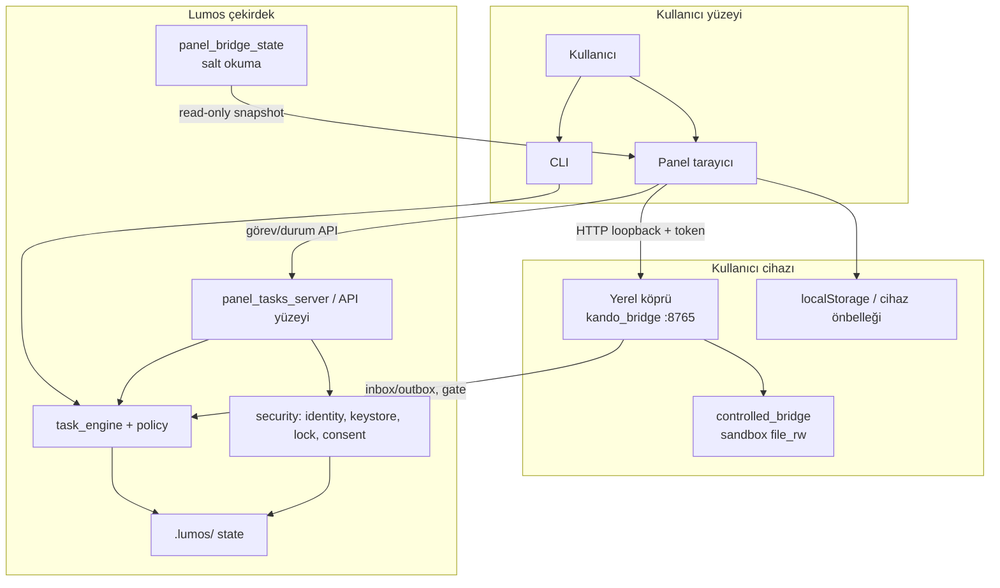

# Cihaz Bağlantı Mimarisi — Taslak

| Alan | Değer |
|------|-------|
| Durum | **Taslak** — mimari tanım; uygulama yok |
| Tarih | 2026-06-21 |
| Kapsam | Kullanıcı modeli, panel bilgi mimarisi, güven ilişkisi, görünür alanlar |
| İlgili | [ADR-012](../decisions/ADR-012-lumos-security-codex.md), [ADR-010](../decisions/ADR-010-guard-policy-trust-terminology.md), [ADR-011](../decisions/ADR-011-lock-semantics-decision.md), [ADR-007](../decisions/ADR-007-trust-engine-layer.md), [BRIDGE_AGENT_AUTHORITY_MODEL](../BRIDGE_AGENT_AUTHORITY_MODEL.md), [external-integrations-permissions](../memory/external-integrations-permissions.md), [public-repo-boundary](../memory/public-repo-boundary.md) |

## Amaç

Lumos'ta **kullanıcı cihazı**, **yerel köprü** ve **bağlı cihaz** kavramlarını net sınırlarla tanımlamak; güven ilişkisinin nasıl kurulduğunu üst düzeyde kaydetmek; panelde kullanıcıya **ne görünür / ne asla görünmez** ayrımını sabitlemek.

Bu belge **yalnızca dokümantasyon taslağıdır**. Kod, yeni ürün yol haritası veya private katman uygulaması **içermez**. Mevcut repo gerçeği ile çelişen ürün iddiası üretilmez; repo sessiz kaldığı yerler **varsayım** olarak işaretlenir.

**Public OSS sınırı:** Bu taslak açık kaynak Lumos çekirdeğini kapsar; üretim cihaz orkestrasyonu, prod auth ve operasyonel backend **private katmandadır** ([public-repo-boundary](../memory/public-repo-boundary.md)).

---

## 1. Kullanıcı modeli

### 1.1 Aktörler

| Aktör | Tanım | Repo karşılığı (doğrulanmış) |
|-------|--------|------------------------------|
| **Kullanıcı** | Lumos'u işleten gerçek kişi; niyet, onay ve rıza kaynağı | `lumos-karar-sozlesmesi` — profil, consent, confirmation |
| **Kullanıcı cihazı** | Kullanıcının Lumos ile etkileştiği **birincil yerel makine veya oturum yüzeyi** — panel tarayıcısı, CLI oturumu ve `.lumos/` workspace'in barındığı ortam | `DeviceIdentity` (`src/security/identity.py`); panel `panel.astro`; CLI router |
| **Yerel köprü** | Kullanıcı cihazında çalışan, **localhost** üzerinden Lumos çekirdeğine sınırlı HTTP/aracı katman; dış dünyayı doğrudan çekirdeğe bağlamaz | `packages/kando_bridge` (`127.0.0.1`, `KANDO_BRIDGE_SECRET`); `controlled_bridge` (sandbox `file_rw`); `panel_tasks_server` köprüsü |
| **Bağlı cihaz** | Yerel köprü ve kimlik sinyalleri ile Lumos'a **güven ilişkisi kurulmuş** kullanıcı cihazı; panel rozeti ve altyapı özeti bu ilişkinin **kullanıcıya görünen** yüzüdür | Panel `#panel-conn-badge` (`ok` / `limited` / `bad` / `pending`); `GET /health` köprü sağlığı |
| **Lumos çekirdek** | Tek dış kapı (facade) arkasındaki iç katman: görev motoru, policy, security, `.lumos/` state | ADR-012 C1–C2; `task_engine`, `src/security`, `src/policy`, `panel_bridge_state` |

**Not — `cursor_bridge` ayrımı:** `src/kando/cursor_bridge.py` geliştirici IDE / patch yürütme hattıdır; **cihaz bağlantı mimarisinde yerel köprü tanımına dahil değildir**. Kullanıcıya "bağlı cihaz" diliyle sunulmaz ([BRIDGE_AGENT_AUTHORITY_MODEL](../BRIDGE_AGENT_AUTHORITY_MODEL.md) — iç katman adları ürün yüzeyinde gösterilmez).

**Not — `device_guard` ayrımı:** `src/device/device_guard.py` salt okuma OS gözlem katmanıdır; bağlantı veya eşleştirme **değildir**. Cihaz koruma raporu ayrı ürün yüzeyidir.

### 1.2 Kavram sınırları (net tanımlar)

#### Kullanıcı cihazı

- Kullanıcının paneli açtığı tarayıcı oturumu **ve/veya** aynı makinedeki CLI.
- `.lumos/` workspace'in fiziksel konumu (CWD tabanlı omurga: `tasks/`, `config/`, `logs/`, `trash/`).
- `DeviceIdentity` ile temsil edilen **local-first** kimlik (`lumos_id` = public key hash).
- OS düzeyi izinler (kamera, mikrofon, dosya seçici) bu cihazın tarayıcı/OS kabuğuna bağlıdır (panel: «Kamera ve mikrofon cihaz iznine bağlıdır»).

**Ne değildir:**

- Uzak sunucu veya bulut "Lumos instance"ı (public foundation'da prod backend yok).
- Köprü sürecinin kendisi (köprü, cihaz **üzerinde** çalışan ayrı bir süreçtir).
- Bağlı bir **ikinci** telefon/tablet — çoklu cihaz kaydı repo'da **tam tanımlı değil** (bkz. §5 varsayımlar).

#### Yerel köprü

- Kullanıcı cihazında **yalnızca loopback** (`127.0.0.1` / `::1`) dinleyen HTTP aracısı (`kando_bridge`).
- Panel, sohbet yükleme ve görev iletimi için köprü tabanına istek atar; token (`KANDO_BRIDGE_SECRET` / `X-Kando-Token`) ile korunur.
- Lumos Security Codex **tek dış kapı** ilkesine uygun: köprü **yüzey**dir; `task_engine` veya `FileKeyStore`'a atlama yok (ADR-012 C1–C2).
- `controlled_bridge` modu: dar izin (`file_rw`), yalnızca `workspace/` altı; terminal, kalıcı silme, mail/takvim yüzeyleri **kapalı**.

**Ne değildir:**

- Lumos çekirdeğinin kendisi veya "bulut senkron" servisi.
- Credential vault veya prod OAuth sunucusu (OD-001–005 implementation-pending).
- Kullanıcıya gösterilen "Lumos hesabı" — köprü **teknik altyapı** dilinde kalır (panel: «Altyapı: köprü bağlantısı»).

#### Bağlı cihaz

- **Güven ilişkisi kurulmuş** kullanıcı cihazı: köprü sağlığı + yapılandırılmış paylaşımlı secret + (hedef) kimlik/consent sinyalleri bir arada **trusted** sayılır.
- Panel üst rozeti bu durumu özetler: «Bağlı» (`ok`), «Sınırlı mod» (`limited`), «Çevrimdışı» (`bad`), «Bağlanıyor» (`pending`).
- Bağlı cihaz, kullanıcının **onay verdiği kapsamda** yerel iş yürütme yetkisine sahip **aday**dır; otomatik geniş yetki **yok** ([BRIDGE_AGENT_AUTHORITY_MODEL](../BRIDGE_AGENT_AUTHORITY_MODEL.md)).

**Ne değildir:**

- Her `GET /health` yanıtı — sağlık ≠ tam güven (token/consent/lock eksik olabilir → `limited`).
- «Eşleştirilmiş cihaz kaydı» UI'si — public repoda çoklu cihaz envanteri **henüz yok** (varsayım).
- Başka kullanıcının cihazı — Lumos modeli **tek kullanıcı / local-first** omurgasındadır.

#### Lumos çekirdek

- Policy, profil, consent, lock ve confirmation zincirinin uygulandığı iç katman.
- Panel salt okuma: `panel_bridge_state.build_panel_read_state()` — **okur, yazmaz** (ADR-012).
- Dış istemci (panel POST, köprü POST) yalnızca tanımlı yüzeylerden etki eder.

**Ne değildir:**

- Tarayıcı `localStorage` önbelleği (görev listesi cihaz içi önbellek; sunucu senkronu ayrı kavram).
- Demo/mock panel alanları — enforcement değildir (ADR-010: panel görünürlüğü ≠ runtime enforcement).

### 1.3 Anti-karışıklık özeti

| Yanlış eşleme | Doğru ayrım |
|---------------|-------------|
| Köprü = Lumos | Köprü **yüzey**; çekirdek **iç katman** |
| Bağlı = kilitsiz | `session_unlocked` ayrı sinyal (ADR-011); bağlı olmak passphrase unlock **garanti etmez** |
| Consent = köprü token | Consent **rıza kaydı**; köprü token **yerel HTTP auth** — farklı katmanlar (ADR-010) |
| device_guard raporu = bağlantı durumu | device_guard **salt okuma gözlem**; bağlantı **köprü + trust state** |
| Panel rozeti = runtime enforcement | Rozet **görünürlük**; gerçek durdurma CLI/köprü/policy'de — senkron garantisi yok |

---

## 2. Bilgi mimarisi (panel-first)

### 2.1 İlke: kullanıcı görür / yerelde kalır

| Kategori | Panelde görünür | Yerelde kalır (asla panel metni / ham dump değil) |
|----------|-----------------|-----------------------------------------------------|
| Altyapı özeti | Köprü durumu, sağlık, anahtar **yapılandırıldı mı** (boolean/etiket) | `KANDO_BRIDGE_SECRET` değeri, Bearer token, passphrase |
| Kimlik | `lumos_id` kısaltması veya «Kimlik hazır» benzeri durum | Private key, root key, keystore içeriği |
| Güven | Consent var/yok, koruma kilidi etiketi, profil adı | Consent dosyası ham içeriği, env vekili ayrıntıları |
| Cihaz işlemleri | Son köprü iletimi özeti (route, zaman, accepted) | Ham terminal çıktısı, tam dosya yolları (gereksiz PII) |
| Gözlem | device_guard **özet** uyarıları (gelecek yüzey) | Süreç listesi ham dump, PID detayları (varsayılan gizli) |
| Modül durumu | Aktif / «Önizleme» (RB-17) | İç modül adları (`kando_*`, `cursor_bridge`) |

**Codex hizası:** Simülasyon/demo gerçek başarı gibi sunulmaz (ADR-012 C4). Köprü yokken panel yerel listeyi tutabilir; «iletim beklendi» dili **gerçek/simüle** ayrımını korur.

### 2.2 Panel bilgi hiyerarşisi

```
[Katman 1 — Global durum çubuğu]
  └─ Altyapı rozeti (#panel-conn-badge): pending | ok | limited | bad
  └─ Kullanıcı modu rozeti (offline | limited | full) — köprüden BAĞIMSIZ

[Katman 2 — Modül bağlamı]
  └─ Sohbet: yetenek kartı (yapabilir / yapmaz); cihaz izni notları
  └─ Görevler: yerel kayıt + «Son köprü» / «İletim köprü bekliyor»
  └─ Dosyalar: «Bu cihazda saklanır»
  └─ Yetenekler: köprü bekleyen özelliklerde «Yerel cihaz köprüsü bekleniyor»

[Katman 3 — Ayarlar → Altyapı durumu]
  └─ Köprü | Anahtar | Sağlık | İnternet (teknik özet, kullanıcı modundan bağımsız)

[Katman 4 — Ayarlar → Sınırlar ve bağlantılar (hedef)]
  └─ Harici entegrasyonlar (mail, takvim, platform) — varsayılan pasif ([external-integrations-permissions](../memory/external-integrations-permissions.md))
```

**Trust göstergeleri (hedef dil):**

- **Bağlı (`ok`):** Köprü erişilebilir; token yapılandırılmış; kullanıcı modu tam/sınırlı izin veriyor.
- **Sınırlı mod (`limited`):** Köprü kısmen erişilebilir veya token/ mod eksik; kurulum ipucu linki (`/#kurulum`).
- **Çevrimdışı (`bad`):** Köprü yok veya kullanıcı «çevrimdışı» mod seçti.
- **Bağlanıyor (`pending`):** Sağlık sondası devam ediyor — kesin iddia yok.

Kimlik/consent/kilit: Ayarlar ve sistem özeti kartlarında **ayrı satırlar**; tek «Bağlı» rozeti ile **birleştirilmez** (ADR-011: `keystore_ready` ≠ `session_unlocked`).

### 2.3 Boş / bilinmiyor / bağlantı kesik dili (RB-17 hizası)

Internal Alpha'da inactive modüller **«Önizleme»** rozeti kullanır — korkutmadan, success/error ile karışmayan nötr ton ([lumos-design-language-proposals](../analysis/lumos-design-language-proposals.md) RB-17).

Cihaz bağlantı durumları için **paralel dil**:

| Durum | Kullanıcı metni (TR) | RB-17 paraleli |
|-------|----------------------|----------------|
| Henüz sorgulanmadı | «Bağlanıyor» | pending — kesin yok |
| Bilinmiyor / çelişkili sinyal | «Durum doğrulanamadı» | inactive tonu; kırmızı alarm değil |
| Köprü yok | «Çevrimdışı» + kurulum ipucu | «Henüz aktif değil» mantığı |
| Kısmi yapılandırma | «Sınırlı mod» | «Önizleme» — tam yetki iddiası yok |
| Eşleştirme sürecinde | «Eşleştiriliyor…» *(varsayım — UI yok)* | Önizleme / bekleme |
| Güven iptal | «Bağlantı kaldırıldı» *(varsayım)* | Nötr bilgi; otomatik yeniden bağlanma yok |

**Yasak dil:** «Tam güvenli», «%100 korumalı», «otomatik senkron» — kanıt ve enforcement olmadan iddia yok.

---

## 3. Mimari taslak

### 3.1 Güven ilişkisi kurulumu (üst düzey)

Güven **tek adımda** kurulmaz; katmanlı sinyaller (ADR-007, ADR-010, ADR-011):

```
1. Kimlik hazırlığı (kullanıcı cihazı)
   └─ DeviceIdentity init → lumos_id (Ed25519 public key hash)
   └─ FileKeyStore init → keystore_ready (ADR-011)

2. Rıza (consent)
   └─ Kullanıcı açık oturum/consent kaydı → effective_consent
   └─ Consent ≠ köprü token ≠ işlem confirmation (ADR-010)

3. Yerel köprü yapılandırması
   └─ KANDO_BRIDGE_SECRET (yerel dev placeholder; prod secret public repoda yok)
   └─ bridge_start.sh → 127.0.0.1 dinleme
   └─ Panel: PUBLIC_KANDO_TOKEN / istemci yapılandırması (secret panel bundle'a gömülmez)

4. Oturum kilidi (isteğe bağlı hassas yol)
   └─ Passphrase → session_unlocked (LockState)
   └─ keystore_ready olmadan unlock veya tersi mümkün — ayrı sinyaller (ADR-011)

5. İşlem bazlı onay (guard)
   └─ Profil matrisi + check_policy + (opt-in) confirmation (ADR-012)
   └─ Köprü yüksek risk → pending_approval / consume_confirmation (Wave 1 kapandı)
```

**Kripto detayı:** Ed25519 kimlik ve AES-GCM keystore mevcut repo'da dokümante (`identity.py`, `keystore.py`); çoklu cihaz eşleştirme protokolü **repo'da tanımlı değil** — §5 varsayım.

### 3.2 Veri akışı



**Akış kuralları:**

- Panel → köprü: görev iletimi, dosya yükleme, sohbet (ortama bağlı); ağ hatasında **yerel kayıt geri alınmaz** ([ui_panel_gorevler_bridge](../ui_panel_gorevler_bridge.md)).
- Köprü → çekirdek: `lumos_gate`, `task_dispatch`, profil guard — doğrudan iç modül bypass **yasak** (ADR-012 C2).
- Dış entegrasyon (mail, takvim, platform): yalnızca kullanıcı onayı + gateway; varsayılan **kapalı** ([external-integrations-permissions](../memory/external-integrations-permissions.md)).

### 3.3 Güven durumları (trust states)

Hedef durum makinesi — ADR-007 sekizliği ile uyumlu, cihaz bağlantı diline indirgenmiş:

| Durum | Anlam | Tipik tetikleyici | Panel yüzü |
|-------|--------|-------------------|------------|
| **unknown** | Sinyaller yetersiz veya çelişkili | İlk yükleme; env/panel drift | «Bağlanıyor» / «Durum doğrulanamadı» |
| **pairing** | Eşleştirme / ilk kurulum devam ediyor | Kimlik veya köprü secret henüz tamamlanmadı | «Sınırlı mod» + kurulum linki *(pairing UI varsayım)* |
| **trusted** | Kimlik + consent + köprü sağlığı + policy izin verdiği ölçüde | `/health` ok; token tanımlı; consent true | «Bağlı» — yine de işlem onayı ayrı |
| **revoked** | Kullanıcı bağlantıyı kesti veya secret/consent geri alındı | Consent kapatma; token rotation *(revoke UX varsayım)* | «Bağlantı kaldırıldı» / «Çevrimdışı» |
| **offline** | Kullanıcı modu veya ağ/köprü bilinçli kapalı | `offline` mod; köprü süreci yok | «Çevrimdışı» |

**Önemli:** `trusted` **genel otonomi** anlamına gelmez — yalnızca «bu cihaz üzerinden tanımlı yerel yüzey erişilebilir». `kisitli_otonom` + `write_local` hâlâ genel onay ister; `SECURITY_NEVER_AUTO` asla otomatik değildir.

**ADR-011 hatırlatma:** `trusted` iken bile `session_unlocked` false ise hassas işlemler **locked / consent_required** altında kalabilir.

---

## 4. Panel görünür alanlar tablosu

| Alan | Görünür bilgi | Gizli / yerelde kalır | Not |
|------|---------------|----------------------|-----|
| Altyapı rozeti | Bağlanıyor / Bağlı / Sınırlı mod / Çevrimdışı | Sondalama hata stack trace | `panel.shell.conn.*` i18n |
| Kullanıcı modu | Çevrimdışı / Sınırlı / Tam | Mod değişim audit detayı | Mod ≠ köprü durumu |
| Köprü (Ayarlar) | Özet metin (rozete yansıyan) | Host/port iç yapılandırması | Kullanıcıya «Köprü» etiketi |
| Anahtar (Ayarlar) | «Tanımlı» / «Yapılandırılmamış» | Secret değeri, `KANDO_BRIDGE_SECRET` | Token varlığı boolean |
| Sağlık | Erişilebilir / erişilemiyor | Ham JSON health body | `GET /health` |
| İnternet | Çevrimiçi / çevrimdışı (mod sinyali) | — | Policy offline engine ile hizalı |
| Kimlik | lumos_id kısaltması veya hazır değil | Private key, tam public key dump | `panel_bridge_state` identity |
| Keystore | Kilitli / hazır (init) | Passphrase, root key | `keystore_ready` ≠ unlock (ADR-011) |
| Consent | Var / gerekli | Consent dosyası içeriği | `effective_consent` |
| Koruma kilidi | Kilitli / açık (etiket) | Passphrase girişi | `session_unlocked` |
| Görev iletimi | Son köprü zamanı, route, accepted | Tam execution JSON | Görevler detay paneli |
| Dosya yükleme | Ad, tür, boyut özeti | Ham dosya içeriği (panel dışı saklanır) | «Bu cihazda saklanır» |
| Yetenek matrisi | AKTİF / GELİŞTİRME AŞAMASINDA / köprü bekliyor | İç executor adları | Capabilities bölümü |
| Harici bağlantılar | «Henüz bağlı değil» / pasif *(hedef)* | OAuth token, refresh token | OD-031–033 pending |
| device_guard özeti | Uyarı sayısı / «Gözlem aktif» *(hedef)* | Tam süreç listesi | Salt okuma; onaysız müdahale yok |
| Presence | «Burada» / «Bilinmiyor» *(demo)* | Kamera frame | Demo düzeyi; prod private |
| Inactive modüller | «Önizleme» rozeti | — | RB-17; Ses, Medya, Posta vb. |

---

## 5. Açık sorular / karar bekleyen

| # | Soru | Durum | Referans |
|---|------|--------|----------|
| 1 | **Çoklu cihaz kaydı** — ikinci telefon/tablet «bağlı cihaz» olarak nasıl listelenecek? | **Varsayım:** v1 tek birincil cihaz + yerel köprü; multi-device registry private katman | Repo'da cihaz envanteri API'si yok |
| 2 | **Trust Faz 4** — merkezi trust motoru cihaz durumunu tek enum'da birleştirecek mi? | **Karar bekliyor** | [open-decisions](../memory/open-decisions-needs-review.md) — ADR-007 Faz 4 |
| 3 | **Panel LockState** — env vekili vs runtime kilit doğrulaması | **Açık** | ADR-012 açık maddeler; `panel_bridge_state` env fallback |
| 4 | **Pairing UX** — QR / kod ile eşleştirme gerekli mi? | **Varsayım:** yerel kurulum dokümantasyonu (`/#kurulum`) yeterli v1 | Pairing UI yok |
| 5 | **Revoke akışı** — «bu cihazı kaldır» tek tık | **Varsayım:** consent kapat + köprü secret rotation; UX tasarlanmadı | — |
| 6 | **Production cihaz presence** | **Private katman** | ADR-007, ADR-010 |
| 7 | **Vault ↔ köprü credential** | **Implementation-pending** | OD-001, OD-002 |
| 8 | **Agent Network ↔ cihaz delegasyonu** | **Taslak karar** | ADR-008 — orchestration public'te yok |

**Açık karar indeksi:** Detay ve öncelik için [`docs/memory/open-decisions-needs-review.md`](../memory/open-decisions-needs-review.md).

**Bilinen varsayımlar (repo sessiz):**

- «Bağlı cihaz» v1 = **aynı makinede** köprü + panel; uzaktan cihaz **ürün dışı** public foundation'da.
- «Pairing» ve «revoked» panel metinleri hedef sözleşmedir; **mevcut UI yalnızca** `pending|ok|limited|bad` dört durumu uygular.
- Güven kurulumunda ek PKI veya QR protokolü **tanımlanmadı** — kimlik + yerel secret + consent yeterli OSS demo omurgası.

---

## 6. Public repo notu

| Public OSS foundation (`lumos-core`) | Private / professional katman |
|----------------------------------------|------------------------------|
| `kando_bridge` localhost demo, token auth dokümantasyonu | Prod cihaz orkestrasyonu, uzaktan yönetim |
| `DeviceIdentity`, `FileKeyStore`, demo lock/consent | Prod presence, HSM, secure enclave |
| Panel altyapı rozeti, salt okuma `panel_bridge_state` | Gerçek multi-device registry, push notification |
| `device_guard` salt okuma gözlem stub | Agresif müdahale, MDM entegrasyonu |
| `controlled_bridge` sandbox `file_rw` | Terminal, mail, takvim, uygulama kontrolü |
| Bu mimari taslak (terminoloji + sınırlar) | Eşleştirme protokolü, vault bridge operasyon modeli |
| ADR-012 codex, profil matrisi, opt-in confirmation | Prod auth, ödeme, operasyonel backend |

Public repoda **«bağlı cihaz = tam ürün güveni»** iddiası bilinçli olarak yapılmamalıdır ([ADR-010](../decisions/ADR-010-guard-policy-trust-terminology.md) — local demo ≠ production).

---

## Referanslar (repo)

| Kaynak | İçerik |
|--------|--------|
| `packages/kando_bridge/src/kando_bridge/server.py` | Yerel HTTP köprü sunucusu |
| `packages/kando_runtime/src/kando_runtime/controlled_bridge.py` | Kontrollü sandbox köprü |
| `src/kando/cursor_bridge.py` | IDE patch hattı (cihaz bağlantısı değil) |
| `src/security/identity.py` | DeviceIdentity / lumos_id |
| `src/core/panel_bridge_state.py` | Panel salt okuma trust görünürlüğü |
| `ui/src/pages/panel.astro` | Köprü rozeti, altyapı durumu, RB-17 inactive |
| `ui/src/i18n/messages/panel/tr.ts` | Bağlantı durumu metinleri |
| `docs/BRIDGE_AGENT_AUTHORITY_MODEL.md` | Köprü/agent yetki sınırları |
| `scripts/README_kando_bridge_server.md` | Köprü güvenlik ve API |

---

*Son güncelleme: 2026-06-21 — mimari taslak (dokümantasyon only)*
