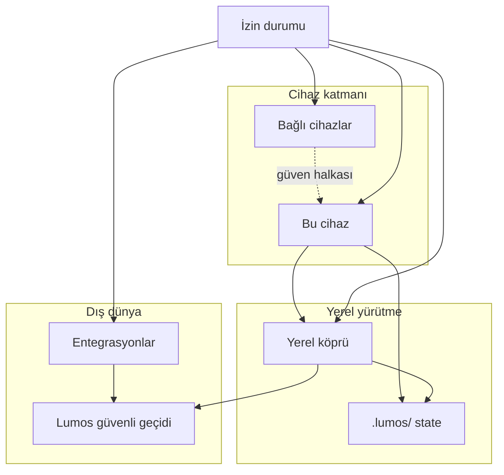

# Lumos cihaz bağlantıları — bilgi mimarisi

| Alan | Değer |
|------|-------|
| Durum | **Taslak (IA önerisi)** — kod yok; uygulama bekliyor |
| Tarih | 2026-06-21 |
| Kapsam | Panel UX bilgi mimarisi; public OSS sınırı |
| İlgili | [`external-integrations-permissions.md`](../memory/external-integrations-permissions.md), [`ADR-012`](../decisions/ADR-012-lumos-security-codex.md), [`public-repo-boundary.md`](../memory/public-repo-boundary.md), `ui/src/pages/panel.astro` (nav iskelet), RB-17 inactive rozet dili |

**Not:** Önceki `device-connection-architecture-draft.md` bu repoda yok; bu belge sıfırdan, mevcut panel iskeleti ve canonical izin kayıtlarına dayanır.

---

## 1. Bilgi mimarisi özeti

### 1.1 Bu cihaz

Paneli açtığınız tarayıcı ve işletim sistemi birleşimidir: cihaz adı (kullanıcı tanımlı veya OS), platform, Lumos çalışma kökü (`.lumos/`), kullanıcı modu (çevrimdışı / sınırlı / tam) ve cihaz düzeyi izinler (kamera, mikrofon, bildirim). Bu alan **yerel kimlik** ve **mahremiyet sınırı**nı anlatır; dış servis hesabı değildir. Kullanıcıya «Lumos şu an nerede çalışıyor?» sorusunun cevabını verir.

### 1.2 Bağlı cihazlar

Aynı Lumos hesabı / güven halkası altında eşleştirilmiş veya güvenilen diğer uç noktalardır (telefon, masaüstü ajan, ikinci tarayıcı oturumu vb.). Amaç çoklu cihaz senkronu vaat etmek değil; **hangi cihazın hangi yetkiyle bağlandığını** şeffaf göstermektir. Eşleştirme, güven kaldırma ve son görülme bilgisi kullanıcı kontrolündedir; otomatik genişleme yoktur.

### 1.3 Yerel köprü

Panel ile cihaz üzerindeki yürütme katmanı (`kando_bridge`, görev sunucusu, `/api/bridge/*` proxy) arasındaki **teknik bağlantıdır**. Sohbet, dosya, görev iletimi ve capability probe bu hat üzerinden geçer. Kullanıcı modundan bağımsızdır: köprü rozeti teknik durumu, mod rozeti kullanıcı tercihini gösterir. Secret/token değerleri panelde **asla** gösterilmez; yalnızca «yapılandırıldı / eksik / doğrulanamadı» sinyali.

### 1.4 Entegrasyonlar

Mail, takvim, kişiler, GitHub, Slack vb. **dış sistem bağlantılarıdır**. Lumos bunları otomatik eklemez; her biri ayrı izin paketi, provenance ve onay omurgasına tabidir ([`external-integrations-permissions.md`](../memory/external-integrations-permissions.md)). UI kısayolu (manuel tarayıcı yönlendirmesi) ile gerçek connector ayrımı net tutulur. Public repoda çoğu entegrasyon **önizleme / karar onaylı — uygulama bekliyor** durumundadır.

### 1.5 İzin durumu

Tüm bağlantı türlerinin **consent ve grant özetidir**: hangi kapsam açık, hangisi iptal edildi, hangi işlem için son onay verildi. ADR-012 ile hizalı: `rapor` / `guvenli_yurut` / `kisitli_otonom` profil sınırları, genel onay, işlem bazlı onay ve `SECURITY_NEVER_AUTO` alanları ayrı gösterilir. İzin sessizce genişletilmez; iptal anında etkisi açık yazılır.

### 1.6 Alanlar arası ilişki



**Okuma kuralı:** Kullanıcı yukarıdan aşağı «nerede çalışıyorum → kimlerle bağlıyım → teknik hat açık mı → dış servisler → tüm izinler» akışını takip eder. İzin durumu yatay özet; diğer dört alandan drill-down ile açılır.

---

## 2. Menü yapısı önerisi

### 2.1 Konum: yeni üst düzey, Lumos çekirdeği altında

Mevcut panel (`panel.astro`):

| Grup | Modüller |
|------|----------|
| **Çalışma** (sol birincil) | Sohbet, Görevler, Ses†, Medya†, Sosyal†, Posta†, Dosyalar, Kuantum† |
| **Lumos çekirdeği** (sağ ikincil) | Yayıncılık†, Yapay Zekâ†, Kuantum†, Entegrasyon†, Kimlik†, **Yetenekler**, Güvenlik†, Dünya†, Ayarlar† |

† = RB-17 `Önizleme` rozeti (`inactiveBadge` / `inactiveBadgeTitle`)

**Öneri:** **Bağlantılar** adlı yeni bir Lumos çekirdeği modülü; Internal Alpha'da **Önizleme** rozeti ile açılır. İlk sürümde mevcut **Yetenekler** içeriği (capability listesi + bağlantı testi) ve **Ayarlar → Altyapı durumu** kartı buraya taşınır; Yetenekler nav'dan kaldırılmaz — «Bağlantılar → Yetenekler sekmesi» altına alınır (kırılma yok).

**Neden Ayarlar altında değil:** Ayarlar kullanıcı tercihleri (dil, tema, mod) ile teknik bağlantıyı karıştırıyor; ADR-012 «mod ≠ altyapı» ayrımı shell'de zaten var. Bağlantılar ayrı modül olunca «Bağlantı Ayarları» kartı (Ayarlar c5) Bağlantılar hub'a yönlendirir.

**Neden Entegrasyon birleştirilmez:** Entegrasyon modülü felsefe/kapsam anlatımı (placeholder kartlar); Bağlantılar operasyonel durum. Entegrasyon nav'da kalır; hub'dan «Entegrasyon kataloğu → tam modül» linki verilir.

### 2.2 Birincil + ikincil navigasyon

```
Lumos çekirdeği
└── Bağlantılar [Önizleme]          ← yeni hub
    ├── Genel bakış                 (varsayılan)
    ├── Bu cihaz
    ├── Bağlı cihazlar
    ├── Yerel köprü
    ├── Entegrasyonlar              → mevcut Entegrasyon modülüne deep link
    └── İzinler & güven

Shell (her zaman görünür)
├── Kullanıcı modu rozeti           (Çevrimdışı / Sınırlı / Tam)
└── Köprü rozeti                    (Bağlanıyor / Sınırlı / Bağlı) → Yerel köprü sekmesine git
```

### 2.3 RB-17 inactive / preview etiketleme

| Durum | Nav rozeti | Ekran banner |
|-------|------------|--------------|
| Modül iskelet (Bağlantılar v1) | `Önizleme` | «Bilgi ve önizleme ekranı — tam modül işlevi aktif değil» |
| Alt sekme kısmen çalışır (köprü özeti) | — | `[Yerel]` veya `[Köprü]` data-flow badge |
| Karar onaylı, uygulama yok (mail connector) | `Önizleme` | «Karar onaylandı — bağlantı henüz yok» |
| Demo / mock içerik | — | `[DEMO]` badge (Kuantum readiness ile aynı dil) |

Rozet stili: outline, `text-secondary`; success/error renkleriyle karışmaz (RB-17 / `lumos-design-language-proposals.md`).

---

## 3. Ekran envanteri

### 3.1 Bağlantılar hub (genel bakış)

| | |
|--|--|
| **Route (kavramsal)** | `/panel/baglanti` veya `/panel?module=baglanti` |
| **Amaç** | Beş kapsam alanının tek bakışta özeti; kritik uyarılar; shell rozetleriyle tutarlılık |
| **Birincil aksiyonlar** | Sekme drill-down; «Bağlantı testi» (mevcut Yetenekler düğmesi); köprü rozeti tıklama → Yerel köprü |
| **Gösterme** | Token/secret değeri; ham URL'de credential; otomatik eşleştirme CTA |

**Bölüm hiyerarşisi (wireframe):**

```
[Başlık] Bağlantılar
[Banner] Önizleme — tam modül aktif değil (RB-17)
[Özet şerit] Bu cihaz · Köprü · Entegrasyon sayısı · Açık izin sayısı
[Durum kartları grid] 5 alan × 1 kart (bkz. §4)
[Hızlı bağlantılar] Bu cihaz | Bağlı cihazlar | Köprü | Entegrasyonlar | İzinler
[Not] Kullanıcı modu altyapıdan ayrıdır → Ayarlar linki
```

---

### 3.2 Bu cihaz

| | |
|--|--|
| **Route** | `/panel/baglanti/bu-cihaz` |
| **Amaç** | Panelin çalıştığı uç noktayı tanımlamak; yerel state ve OS izinlerini göstermek |
| **Birincil aksiyonlar** | Cihaz adı düzenle (yerel); OS izinlerine yönlendirme (sistem ayarları); çalışma kökü bilgisi (salt okuma) |
| **Gösterme** | `keystore` içeriği; `notes.enc` içeriği; tam dosya yolu listesi |

```
[Başlık] Bu cihaz
[Kart] Cihaz kimliği — ad, platform, son aktif
[Kart] Kullanıcı modu — Çevrimdışı/Sınırlı/Tam (Ayarlar'a link)
[Kart] Yerel veri — [Yerel] badge; .lumos özet (tasks, config var/yok)
[Kart] Cihaz izinleri — kamera, mikrofon, bildirim: verildi / reddedildi / bilinmiyor
[Bölüm] Bu cihazda çalışan yetenekler — Yetenekler sekmesine özet link
[Güvenlik notu] Gizli bilgileri sohbete yazmayın
```

---

### 3.3 Bağlı cihazlar — liste + detay

| | |
|--|--|
| **Route** | `/panel/baglanti/cihazlar` · `/panel/baglanti/cihazlar/:id` |
| **Amaç** | Güvenilen / eşleştirilmiş cihazları listelemek; güven kaldırma |
| **Birincil aksiyonlar** | Yeni cihaz eşleştir (onaylı akış); güveni kaldır; detay görüntüle |
| **Gösterme** | Eşleştirme QR/secret içeriği ekranda kalıcı; otomatik «tüm cihazlara güven» |

**Liste:**

```
[Başlık] Bağlı cihazlar
[CTA] Cihaz eşleştir (onay diyaloğu önizlemesi)
[Liste] Durum kartları — cihaz adı, tür, son görülme, güven durumu
[Empty] Henüz başka cihaz eşleştirmediniz.
```

**Detay:**

```
[Breadcrumb] Bağlı cihazlar › {ad}
[Kart] Durum — connected / offline / pairing / revoked
[Kart] Yetki özeti — salt okuma / görev iletimi / … (grant listesi, secret yok)
[Kart] Son aktivite — zaman + kaynak (provenance)
[Aksiyon] Güveni kaldır (tek satır uyarı, geri alınamaz değilse «oturumu sonlandır» dili)
```

---

### 3.4 Yerel köprü durumu

| | |
|--|--|
| **Route** | `/panel/baglanti/kopru` |
| **Amaç** | Shell köprü rozeti ile aynı gerçeği detaylandırmak; mevcut Ayarlar «Altyapı durumu» + Yetenekler testini birleştirmek |
| **Birincil aksiyonlar** | Bağlantı testi; sorun giderme kısa rehber (public runbook linki, secret yok); yeniden dene |
| **Gösterme** | `KANDO_BRIDGE_SECRET` değeri; proxy token; production endpoint |

```
[Başlık] Yerel köprü
[Durum kartı] Köprü — connected / offline / limited / unknown
[Durum kartı] Anahtar — yapılandırıldı / eksik (değer yok)
[Durum kartı] Sağlık — son probe zamanı
[Durum kartı] Görev sunucusu — panel_tasks_server erişilebilir mi
[Liste] Capability satırları (Yetenekler 1–7 özeti)
[CTA] Bağlantı testi
[Bölüm] Sınırlı modda ne çalışır — yerel görev listesi vs köprü gerektiren işlemler
[Not] Kullanıcı modu ≠ köprü durumu
```

---

### 3.5 Entegrasyonlar kataloğu

| | |
|--|--|
| **Route** | `/panel/baglanti/entegrasyonlar` (hub) · mevcut `/panel?module=entegrasyon` (felsefe) |
| **Amaç** | OD-031/032/033 kapsamındaki dış sistemleri kataloglamak; bağlı / mevcut değil / önizleme ayrımı |
| **Birincil aksiyonlar** | Entegrasyon iste (değerlendirme listesi); bağlantıyı kes; kapsam görüntüle; manuel kısayol (GitHub vb.) |
| **Gösterme** | OAuth token; vault credential; otomatik «hepsini bağla» |

```
[Başlık] Entegrasyonlar
[Filtre] Tümü | Bağlı | Kullanılabilir | Önizleme
[Kategori] İletişim (Mail) · Takvim & Kişiler · Çalışma araçları · Ajan araçları
[Kart grid] Her platform — durum, kapsam özeti, son senkron (provenance)
[Empty kategori] Bu kategoride henüz bağlantı yok. Bağlamak için izin gerekir.
[Link] Entegrasyon felsefesi → mevcut Entegrasyon modülü
```

---

### 3.6 İzinler & güven özeti

| | |
|--|--|
| **Route** | `/panel/baglanti/izinler` |
| **Amaç** | Tüm grant/revoke/consent durumunu tek güven panosunda toplamak |
| **Birincil aksiyonlar** | İzin iptali; genel onay aç/kapa (onaylı); işlem geçmişi (salt metadata) |
| **Gösterme** | SECURITY_NEVER_AUTO işlemler için «otomatik aç»; gizli anahtar |

```
[Başlık] İzinler & güven
[Özet şerit] Açık entegrasyon · Aktif cihaz grant · Genel onay durumu
[Bölüm] Profil sınırı — rapor / güvenli yürüt / kısıtlı otonom (salt okuma)
[Bölüm] Entegrasyon izinleri — granüler grant listesi (mail_read, cal_create, …)
[Bölüm] Cihaz & köprü — eşleştirme, köprü capability
[Bölüm] Asla otomatik — kalıcı silme, dış yazma, kritik config (⛔ liste, bilgi only)
[CTA] Tüm izinleri gözden geçir (yönlendirici, tek tıkla iptal yok)
[Link] Güvenlik modülü · Kimlik modülü
```

---

## 4. Durum kartları kataloğu

| Kart adı | Durumlar | Görünen alanlar | CTA | Empty state metni |
|----------|----------|-----------------|-----|-------------------|
| **Bu cihaz özeti** | active · limited · offline | Cihaz adı, platform, kullanıcı modu, [Yerel] badge | «Detay» → Bu cihaz | «Bu oturum cihaz bilgisi yüklenemedi.» |
| **Bağlı cihaz** | connected · offline · pairing · revoked · unknown | Ad, tür, son görülme, güven rozeti | «Yönet» / «Eşleştir» | «Henüz başka cihaz eşleştirmediniz.» |
| **Yerel köprü** | connected · offline · limited · unknown · preview | Köprü, sağlık, anahtar (var/yok), son test | «Bağlantı testi» / «Köprü rehberi» | «Köprü yapılandırılmadı. Yerel görevler kullanılabilir; dış iletim beklemede.» |
| **Entegrasyon** | connected · disconnected · preview · revoked | Platform adı, kapsam özeti, provenance, [Önizleme] | «Bağlan» / «Kapsam» / «Kes» | «Bağlı entegrasyon yok. İzin vermeden veri çekilmez.» |
| **İzin paketi** | granted · denied · revoked · pending · preview | İzin adı, kapsam, son değişiklik, kaynak | «İptal et» / «Onayla» | «Henüz dış izin tanımlanmadı.» |
| **Capability satırı** | active · passive · dev · preview | Yetenek adı, route özeti, limit notu | — (satır içi) | «Capability listesi yüklenemedi.» |
| **Genel onay** | on · off · preview | Durum, etki özeti (write_local) | «Ayarlar» | «Genel onay kapalı — kısıtlı yazma işlemleri durur.» |
| **Hub uyarı** | ok · warning · blocked | Kısa neden (köprü yok, izin iptal, vb.) | İlgili sekmeye git | «Tüm bağlantılar nominal görünüyor.» |

**Durum renkleri:** Semantic success/error yalnızca «connected / revoked» gibi net durumlarda; `preview` ve `unknown` nötr/outline (RB-17).

---

## 5. Kullanıcı yolculukları

### 5.1 İlk kurulum

Kullanıcı paneli ilk açar → shell **Sınırlı mod** + köprü **Bağlanıyor/Sınırlı** gösterir → Bağlantılar hub'a yönlendirme (isteğe bağlı banner) → **Bu cihaz** ekranında mod ve yerel görevler açıklanır → **Yerel köprü** ekranında anahtar «eksik» veya sağlık «doğrulanamadı» → kullanıcı public runbook'a göre köprüyü kurar (panel secret göstermez) → **Bağlantı testi** capability satırlarını günceller → kullanıcı entegrasyon eklemeden Sohbet/Görevler ile devam edebilir.

### 5.2 Yeni cihaz eşleştirme

Kullanıcı **Bağlı cihazlar** → «Cihaz eşleştir» → onay diyaloğu (ne paylaşılacak, hangi yetkiler) → eşleştirme kodu/QR **tek seferlik** gösterilir (ekranda kalıcı değil) → `pairing` kartı → karşı cihaz onaylayınca `connected` → **İzinler** ekranında yeni cihaz grant satırı belirir. İptal edilirse `revoked`; liste empty state'e döner.

### 5.3 İzin iptali / güven kaldırma

Kullanıcı **İzinler & güven** veya entegrasyon detayından «İptal et» / «Güveni kaldır» → tek satır uyarı (etki: okuma durur, oturum kapanır, geri alma yolu) → onay → durum `revoked` → provenance kaydı «kullanıcı iptali» → ilgili modüllerde (Posta, Görev iletimi vb.) pasif empty state. **SECURITY_NEVER_AUTO** alanları bu akışla açılmaz; ayrı açık komut gerekir (ADR-012).

---

## 6. Panel görünürlük matrisi

| Veri / sinyal | Panelde göster | Yalnızca yerel / vault | Asla panel |
|---------------|----------------|------------------------|------------|
| Köprü bağlı mı (health) | ✓ özet + zaman | probe detayı | — |
| Anahtar/token yapılandırıldı mı | ✓ boolean / «yapılandırıldı» | sunucu env | secret değeri |
| OAuth / API credential | ✓ «bağlı» + kapsam | vault (OD-001/002) | token, refresh |
| Cihaz eşleştirme kodu | ✓ tek seferlik UI | — | kalıcı liste |
| `.lumos/tasks.json` içeriği | ✓ Görevler modülü | dosya yolu debug | — |
| `keystore`, `identity`, `presence` | ✓ var/yok, kilit durumu | şifreli içerik | passphrase, anahtar materyali |
| Entegrasyon ham verisi | ✓ özet + provenance | connector cache | toplu import ham |
| Profil / genel onay | ✓ durum | `LUMOS_PROFILE` env | — |
| Bridge upstream URL | ✓ debug modda (mevcut) | deploy config | prod secret URL |
| Onay geçmişi metadata | ✓ ne/zaman/kaynak | evidence journal tam | — |

**Sync ilkesi:** Panel **read-only mirror** + sınırlı mutasyon (onaylı); vault ve trash içeriği panel sync kaynağı değildir (ADR-012, workspace sözleşmesi).

**Public boundary:** Demo-safe stub ve placeholder; production connector credential, webhook secret ve operasyonel endpoint public repoda ve panelde **yer almaz** ([`public-repo-boundary.md`](../memory/public-repo-boundary.md)).

---

## 7. Varsayımlar ve açık kararlar

### Varsayımlar

1. Bağlantılar modülü Internal Alpha'da **Önizleme** (RB-17) olarak ship edilir; köprü özeti mevcut JS ile kısmen doldurulabilir.
2. Bağlı cihazlar için backend/eşleştirme protokolü henüz public repoda yok; v1 **empty + bilgi mimarisi** yeterli.
3. Entegrasyon kataloğu OD-031/032/033 karar listesi ile hizalanır; otomatik connector eklenmez.
4. Shell köprü rozeti (`panel-conn-badge`) Bağlantılar → Yerel köprü ile aynı durum sözlüğünü paylaşır.
5. Türkçe birincil; `inactiveBadge` / `inactiveBadgeTitle` i18n anahtarları korunur.

### Açık kararlar

| # | Konu | Seçenekler | Not |
|---|------|------------|-----|
| D1 | Nav: «Bağlantılar» vs «Yetenekler» yeniden adlandırma | Yeni modül / Yetenekler'i genişlet | Bu belge: yeni modül + Yetenekler alt sekme |
| D2 | Bağlı cihazlar v1 kapsamı | Salt liste / tam eşleştirme akışı | Protokol private katmanda olabilir |
| D3 | Entegrasyon hub vs Entegrasyon modülü birleşme | Ayrı kal / tek modül | Felsefe + operasyon ayrımı korundu |
| D4 | İzinler ekranı vs Kimlik/Güvenlik modülleri | Merkezi / dağıtık | Merkezi özet + modül deep link |
| D5 | Mobile: Lumos çekirdeği gizli | Bağlantılar shell menüsünden | Mevcut mobil nav kısıtı (#3274 panel.astro) |
| D6 | Alpha'da hangi kartlar gerçek veri | Köprü+Bu cihaz gerçek; cihazlar mock | Uygulama fazlaması |

---

*Son güncelleme: 2026-06-21 — IA taslak; kod yok.*
