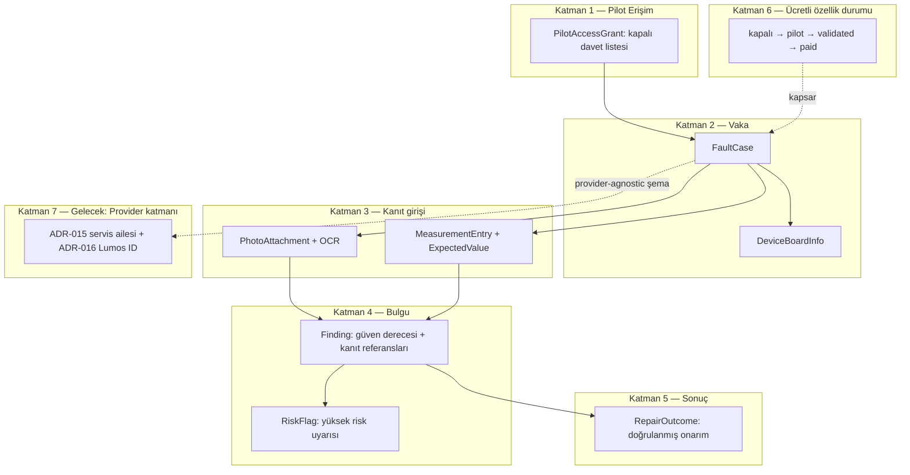

# Elektronik Uzmanı — Pilot Mimari ve Veri Modeli Tasarımı

| Alan | Değer |
|------|--------|
| **Durum** | **Taslak — docs only; kod veya PR yok.** Onay alınmadan uygulama fazına geçilmez. |
| **Tarih** | 2026-07-17 |
| **Çalışma adı** | **Elektronik Uzmanı** (kilitli değil — [`lumos-approved-naming-registry.md`](./lumos-approved-naming-registry.md) §C onayı gerekir) |
| **Kapsam** | Faz 1 pilot: tasarım + veri modeli (kod yok). Elektronik teşhis modülü ve gelecekteki Provider mimarisi için mimari foundation. |
| **Branch** | `codex/electronics-expert-pilot` (up-to-date `main`'den ayrı; `codex/lumos-entry-social-packages` branch'ine **dokunmaz**) |
| **Üst sınır** | [`docs/lumos-karar-sozlesmesi.md`](../lumos-karar-sozlesmesi.md), [`public-repo-boundary.md`](../memory/public-repo-boundary.md), ADR-012 |
| **İlgili** | [ADR-007](../decisions/ADR-007-trust-engine-layer.md), [ADR-010](../decisions/ADR-010-guard-policy-trust-terminology.md), [ADR-012](../decisions/ADR-012-lumos-security-codex.md), [ADR-015](../decisions/ADR-015-lumos-service-api-gateway.md), [ADR-016](../decisions/ADR-016-lumos-id-memory-gateway.md), [`lumos-action-permission-matrix.md`](./lumos-action-permission-matrix.md), [`pilot-user-program-design.md`](./pilot-user-program-design.md), [`secure-device-framework.md`](./secure-device-framework.md), [`commercial-product-packaging.md`](./commercial-product-packaging.md) |

**Public OSS sınırı:** Bu belge yalnızca mimari, politika ve veri modeli tanımlar. Gerçek OCR servisi, gerçek ölçüm cihazı sürücüsü, gerçek muadil parça API'si veya üretim ödeme akışı **kapsam dışıdır**.

---

## Yönetici özeti

**Elektronik Uzmanı**, kullanıcının kendi bildirdiği arıza belirtisi, kendi çektiği fotoğraf ve kendi elle girdiği ölçüm değerlerinden bir **arıza vakası** oluşturan; bulguyu **güven derecesi + kanıt** ile birlikte sunan; yüksek riskli durumları **uyarı** olarak işaretleyen (asla otomatik aksiyon almayan) bir Lumos pilot modülüdür.

Sistem **bilgilendirir, karar vermez** ilkesi ([ADR-012](../decisions/ADR-012-lumos-security-codex.md), `SECURITY_NEVER_AUTO`) burada da geçerlidir: Elektronik Uzmanı kesin arıza iddiası yapmaz, cihazı kontrol etmez, programlayıcıya yazmaz, parça siparişi vermez. Kullanıcı ölçer, fotoğraflar, karar verir; Lumos düzenler, karşılaştırır, olası bulguyu kanıtla birlikte gösterir.

**Hedef (uzun vadeli) konumlanma — kullanıcı notu ile hizalı:** Lumos'un asıl kazanımı her aracı yeniden yazmak değil, **karar + güvenlik + kanıt + kullanıcı deneyimi katmanı** olmaktır. Elektronik Uzmanı önce Lumos'un kendi deneyiminde (closed pilot) doğrulanır; veri modeli baştan **sağlayıcıdan bağımsız** tasarlanır ki aynı vaka/ölçüm/bulgu iskeleti ileride E-Helper gibi üçüncü taraf uygulamalara Lumos'u **sağlayıcı (Provider)** olarak sunmak için yeniden yazılmadan kullanılabilsin (bkz. §7).

---

## 1. Kapsam sınırı — bu fazda ne var, ne yok

| Kategori | Bu fazda (Kapalı/Pilot) | Kapsam dışı (bu fazda) |
|----------|--------------------------|------------------------|
| Teşhis girdisi | Kullanıcı metni + manuel ölçüm + fotoğraf/OCR (metin okuma) | Kamera görüntüsünden **kesin** arıza tespiti (görüntü sınıflandırma iddiası) |
| Cihaz etkileşimi | Yalnızca bilgi kaydı (marka/model/kart no) | Cihaz kontrolü (açma/kapama, port erişimi, uzaktan komut) |
| Donanım yazma | Yok | Programlayıcıya yazma / firmware flashing |
| Parça tedariki | Lumos yalnızca öneri/karşılaştırma **gösterebilir** (ileride, Provider fazında) | Otomatik muadil parça siparişi / ödeme |
| Ölçüm | Kullanıcı elle girer | Ölçüm cihazından otomatik veri okuma (auto-import) |
| Bulgu dili | "Olası bulgu", güven derecesi + kanıt zorunlu | "Kesin arıza", garanti dili |

Bu tablodaki "kapsam dışı" satırlar §6'daki NEVER_AUTO tablosuna karşılık gelir; bunlar geçici bir eksiklik değil, **bilinçli güvenlik/hukuk sınırıdır** — kaldırılmaları ayrı bir ADR ve açık onay gerektirir.

---

## 2. Modül mimarisi

**Yerleşim önerisi (kod fazı için — bu turda oluşturulmaz):**

| Yol | Rol |
|-----|-----|
| `src/electronics/models.py` | §3–§6 veri modelleri (dataclass) |
| `src/electronics/pilot_access.py` | Pilot erişim kontrolü; `src/task_engine/profiles.py` profil kavramına bağlanır |
| `src/electronics/risk_rules.py` | Şeffaf, kural/anahtar-kelime tabanlı yüksek risk işaretleme (ML "kesin teşhis" değil) |
| `src/integrations/providers/electronics_tools_registry.py` | (Faz 2+) `quantum_registry.py` deseniyle dış araç kayıtları — bu turda **yok** |
| `docs/decisions/ADR-017-electronics-expert-pilot.md` | Bu tasarım "Kabul edildi" olduğunda ADR'ye taşınır |
| `ui/src/i18n/messages/electronics/{en,tr}.ts` | Vaka formu, ölçüm formu, risk uyarısı, ücretli özellik rozeti metinleri |
| `tests/test_electronics_models.py` | Veri modeli birim testleri |

`src/device/*` (mevcut cihaz katmanı) ile **karıştırılmaz**: `src/device` işletim sistemi/masaüstü cihaz algısı içindir; `src/electronics` kullanıcının tamir ettiği **harici elektronik cihaz** hakkında veridir. İsim çakışması riskine karşı modül adı `electronics` olarak ayrılmıştır.

---

## 3. Pilot kullanıcı yetkilendirmesi — `PilotAccessGrant`

[`pilot-user-program-design.md`](./pilot-user-program-design.md) ile aynı **closed pilot / break-the-system** çerçevesi kullanılır; genel beta değildir.

| Alan | Tür | Açıklama |
|------|-----|----------|
| `grant_id` | UUID | Kayıt anahtarı |
| `lumos_id` | string | Sahip kimliği ([ADR-016](../decisions/ADR-016-lumos-id-memory-gateway.md)) — sağlayıcıdan bağımsız tekil kimlik |
| `pilot_program` | literal | `"electronics_expert_pilot"` (sabit) |
| `status` | enum | `invited` \| `active` \| `revoked` |
| `invited_at`, `activated_at`, `revoked_at` | datetime \| null | Yaşam döngüsü zaman damgaları |
| `consent_version` | string | Kabul edilen pilot sözleşmesi sürümü (break-the-system risk bilgilendirmesi dahil) |
| `case_quota` | int | Fair-use üst sınırı (pilot aşımı önler) |
| `scope` | literal | `"rapor"` — [permission matrix](./lumos-action-permission-matrix.md) `rapor` profiliyle hizalı: okuma/öneri, state değiştiren veya dış yazma yok |

**Karar:** Elektronik Uzmanı pilotu `profiles.py` anlamında yalnızca **`rapor`** profiliyle çalışır (analiz/öneri var; `safe_local`, `write_local`, `external` yok). Bu, §6'daki NEVER_AUTO sınırlarını izin matrisi seviyesinde de kilitler.

---

## 4. Arıza Vakası — `FaultCase`

| Alan | Tür | Açıklama |
|------|-----|----------|
| `case_id` | UUID | Vaka anahtarı |
| `lumos_id` | string | Sahip |
| `created_at` / `updated_at` | datetime | — |
| `title` | string | Kısa başlık (kullanıcı girer) |
| `symptom_description` | text | Serbest metin arıza tarifi |
| `status` | enum | `open` \| `in_progress` \| `resolved` \| `archived` |
| `device_ref` | FK → `DeviceBoardInfo` | — |
| `photo_refs` | FK[] → `PhotoAttachment` | — |
| `measurement_refs` | FK[] → `MeasurementEntry` | — |
| `finding_refs` | FK[] → `Finding` | — |
| `risk_refs` | FK[] → `RiskFlag` | Boş olabilir |
| `outcome_ref` | FK → `RepairOutcome` \| null | Vaka kapanışında dolar |
| `paid_feature_status_snapshot` | enum | Vaka oluşturulduğu andaki `kapalı/pilot/validated/paid` değeri — **denetim için donmuş kopya**, global durum değişse bile vaka geçmişi bozulmaz |
| `source` | string | `"lumos_native"` veya `"provider:<id>"` — §7 Provider mimarisi için köken etiketi, bu fazda yalnızca `"lumos_native"` üretilir |

### 4.1 Cihaz ve Kart Bilgisi — `DeviceBoardInfo`

| Alan | Tür | Açıklama |
|------|-----|----------|
| `device_id` | UUID | — |
| `case_id` | FK | — |
| `device_type` | string | Serbest metin/taksonomi (TV, PSU, anakart, …) |
| `brand`, `model` | string | Kullanıcı girer |
| `board_id` | string \| null | Kart üzeri seri/parça no (kullanıcı girer veya OCR ile okunur, §5) |
| `serial_number` | string \| null | Yalnızca kullanıcının açıkça girdiği durumda saklanır; otomatik toplanmaz |
| `user_notes` | text | — |

---

## 5. Fotoğraf ekleme ve OCR akışı

| Alan | Tür | Açıklama |
|------|-----|----------|
| `photo_id` | UUID | — |
| `case_id`, `device_id` | FK | — |
| `captured_at` | datetime | — |
| `storage_ref` | string | Yerel-öncelikli saklama; dışa aktarım yalnızca kullanıcı eylemiyle (AnchorUSB A-06 ilkesiyle hizalı — otomatik dışa POST yok) |
| `storage_scope` | enum | `local_private` \| `provider_transient` — pilot varsayılanı daima `local_private`; dış sağlayıcı kalıcı depolama hedefi değildir |
| `purpose_tag` | enum | `board_label` \| `component_marking` \| `damage_evidence` \| `measurement_photo` |
| `ocr_status` | enum | `none` \| `queued` \| `completed` \| `failed` |
| `ocr_raw_text` | text \| null | OCR motorunun ham çıktısı |
| `ocr_confidence` | float 0–1 \| null | OCR'a özgü güven skoru — §6'daki **bulgu güven derecesi** ile **karıştırılmaz** (biri metin okuma güveni, diğeri arıza yorumu güveni) |
| `user_verified_text` | text \| null | Kullanıcının OCR çıktısını düzelttiği alan — insan-onaylı; yanlış okunan parça numarası yanlış bulguya yol açmasın diye zorunlu düzeltme noktası |
| `metadata_redacted` | bool | OCR veya Provider işleminden önce EXIF konum/cihaz metadata'sının çalışma kopyasından çıkarıldığını gösterir |
| `egress_consent_ref` | string \| null | Fotoğrafın dış OCR/Provider'a gönderilmesine ait kapsamlı ve tekil onay kaydı; yerel işlemde `null` |

**Netlik notu (kapsam sınırı):** OCR burada yalnızca **metin okuma** yardımıdır (kart üstü parça/seri numarası okuma). Fotoğraftan "bu parça arızalı" gibi bir **görsel arıza sınıflandırması** yapılmaz — bu §6'da açıkça NEVER_AUTO listesindedir (E-01).

### 5.1 Fotoğraf ve OCR mahremiyet sınırı

- Pilot varsayılanı **yerel ve özel saklama**dır. Ham fotoğraf, OCR metni, kart/seri numarası veya dosya yolu public repo'ya, genel loglara ve telemetriye yazılmaz.
- OCR/Provider için ayrı bir çalışma kopyası üretilir; EXIF konum ve cihaz metadata'sı bu kopyadan işlemden önce çıkarılır. Kullanıcının yerel orijinali sessizce değiştirilmez.
- Pilot fazında dış OCR/Provider aktarımı kapalıdır. İleride açılırsa her fotoğraf için hedef sağlayıcı, gönderilecek veri ve amaç gösterilerek ayrı `egress_consent_ref` gerekir; genel pilot onayı dış aktarım izni sayılmaz.
- Dış sağlayıcıya yalnızca seçili kırpım veya gerekli en küçük veri gönderilir. Provider'ın modeli eğitmesi, içeriği yeniden kullanması veya süresiz saklaması varsayılan olarak yasaktır; sağlayıcı sözleşmesi doğrulanmadan adaptör `planned` durumundan çıkarılamaz.
- Vaka arşivlendiğinde fotoğraf otomatik olarak kalıcı silinmez. Kullanıcı silmek isterse repo ürün kuralıyla uyumlu biçimde önce geri alınabilir silinenler alanına taşınır; kalıcı silme ayrı ve açık onay gerektirir.

---

## 6. Ölçüm, beklenen değer, bulgu/güven ve yüksek risk

### 6.1 Manuel Ölçüm Girişi — `MeasurementEntry`

| Alan | Tür | Açıklama |
|------|-----|----------|
| `measurement_id` | UUID | — |
| `case_id`, `device_id` | FK | — |
| `test_point_label` | string | Örn. "C12 anot" |
| `measurement_type` | enum | `voltage` \| `resistance` \| `current` \| `capacitance` \| `continuity` \| `frequency` \| `other` |
| `measured_value`, `unit` | float, string | Kullanıcı girer |
| `expected_value` | float \| null | — |
| `expected_value_source` | enum | `user_entered` \| `datasheet_reference` \| `provider:<id>` (son değer yalnızca §7 Provider fazında; bu turda pasif) |
| `deviation_flag` | bool \| null | Basit tolerans dışı hesaplama (aritmetik yardım — "kesin arıza" iddiası değil) |
| `entered_by` | literal | `"user"` — bu fazda daima kullanıcı; cihazdan otomatik okuma yok |
| `recorded_at` | datetime | — |

### 6.2 Bulgu ve Güven Derecesi — `Finding` (kanıt sistemi)

| Alan | Tür | Açıklama |
|------|-----|----------|
| `finding_id` | UUID | — |
| `case_id` | FK | — |
| `statement` | text | Örn. "C12 kısa devre **olabilir**" — kesinlik dili yasak |
| `confidence_level` | enum | `low` \| `medium` \| `high` (kullanıcıya görünen) + isteğe bağlı `confidence_score` 0–100 (iç kullanım) |
| `evidence_refs` | FK[] → `PhotoAttachment` \| `MeasurementEntry` | **Zorunlu — en az bir kanıt** olmadan bulgu oluşturulamaz (kanıt sistemi) |
| `created_by` | enum | `"user"` \| `"lumos_assist"` |
| `disclaimer_shown` | bool | `lumos_assist` bulgularında zorunlu `true` — "bu kesin teşhis değildir" uyarısı |

### 6.3 Yüksek Risk Uyarısı — `RiskFlag`

| Alan | Tür | Açıklama |
|------|-----|----------|
| `risk_id` | UUID | — |
| `case_id` | FK | — |
| `risk_category` | enum | `mains_voltage` \| `capacitor_stored_charge` \| `fire_smoke_smell` \| `battery_swelling` \| `high_current` \| `unknown_high_voltage` \| `other` |
| `severity` | enum | `warn` \| `high` \| `critical` |
| `triggered_by` | literal | `"user_reported_symptom"` \| `"keyword_match"` — şeffaf kural eşleşmesi, gizli/ML "kesin" karar değil |
| `required_ack` | bool | `warn` ve `high` seviyelerinde kullanıcı uyarıyı açıkça görmeden izin verilen akış ilerlemez; `critical` seviyesinde onay, engeli kaldırmaz |
| `flow_action` | enum | `continue_after_ack` \| `restricted_after_ack` \| `block` — doğrudan `severity` değerinden türetilir; kullanıcı veya Provider tarafından gevşetilemez |
| `suppressed` | literal | Her zaman `false` — otomatik bastırma/gizleme yok |

**Zorunlu akış davranışı:**

- `warn`: Uyarı görünür biçimde kabul edildikten sonra kayıt ve ölçüm planı akışı devam edebilir (`continue_after_ack`).
- `high`: Akış duraklatılır; yalnızca enerjisiz gözlem, mevcut kanıtı kaydetme ve uzman desteğine yönlendirme alanları açık kalır (`restricted_after_ack`). Uyarıyı kabul etmek enerjili ölçüm önerilerini açmaz.
- `critical`: Teşhis/ölçüm yönlendirmesi zorunlu olarak durur (`block`). Vaka salt okunur kalır; yeni ölçüm, yeni bulgu veya Provider çağrısı oluşturulamaz. Lumos yalnızca enerjiyi güvenli biçimde kesme ve yetkin teknik destek alma yönlendirmesi gösterir. Kullanıcı onayı bu engeli kaldıramaz.

Bu ayrım, ADR-015 açık onay kapısının fiziksel güvenlikte tek başına yeterli olmadığını netleştirir: açık onay `warn/high` akışını sınırlı biçimde yönetebilir; `critical` riskte **hard stop** uygulanır.

### 6.4 Doğrulanmış Onarım Sonucu — `RepairOutcome`

| Alan | Tür | Açıklama |
|------|-----|----------|
| `outcome_id` | UUID | — |
| `case_id` | FK | — |
| `repaired` | bool | — |
| `repair_action_description` | text | Kullanıcı ne yaptığını yazar |
| `outcome_status` | enum | `unverified` \| `user_confirmed` \| `pilot_reviewed` |
| `verified_by` | string \| null | Pilot QA incelemesi yapan `lumos_id` (break-the-system pilot geri bildirim döngüsü) |
| `verified_at` | datetime \| null | — |
| `closes_case` | bool | — |

### 6.5 Ücretli Özellik Durumu — geçiş modeli

| Değer | Anlam | Çıkış kriteri (bir sonrakine geçmek için) |
|-------|-------|--------------------------------------------|
| **kapalı** | Görünür değil, yalnızca geliştirme | Tasarım onayı (bu belge) |
| **pilot** | Kapalı davet listesi ([`PilotAccessGrant`](#3-pilot-kullanıcı-yetkilendirmesi--pilotaccessgrant)), ücretsiz, break-the-system modunda | Tanımlı sayıda doğrulanmış `RepairOutcome`, 0 P0 güvenlik bulgusu, ayrı pilot kapanış raporu |
| **validated** | Daha geniş opt-in, hâlâ ücretsiz/sınırlı | Ticari paketleme kararı ([`commercial-product-packaging.md`](./commercial-product-packaging.md), OD-011) |
| **paid** | Faturalandırılan özellik | [`subscription-payment-control.md`](../subscription-payment-control.md) ile uygulama |

Geçişler **otomatik değildir**; her biri ayrı, numaralandırılmış bir karar kaydı (ADR/OD) gerektirir — mevcut repo pratiğiyle birebir aynı disiplin (bkz. OD-011 payment-scope-decision).

---

## 7. Gelecekteki Provider mimarisi (bu turda uygulanmaz)

Kullanıcı yönlendirmesiyle hizalı hedef: Lumos yalnızca kendi Elektronik Uzmanı deneyimi değil, **sağlayıcı/orkestrasyon katmanı** olabilmelidir.

| Yön | Model | Bu fazdaki karşılığı |
|-----|-------|------------------------|
| **1. Lumos'un kendi uygulaması** | Elektronik Uzmanı pilotu; kimlik burada oluşur | §2–§6 (bu belge) |
| **2. Diğer uygulamalarda Lumos sağlayıcısı** | E-Helper vb. kendi ürününde "Lumos ile arıza analizi / ölçüm planı / muadil doğrulama / vaka raporu" sunar | [ADR-015](../decisions/ADR-015-lumos-service-api-gateway.md) desenine yeni **servis ailesi**: hedef yol örneği `/v1/electronics/case`, `/v1/electronics/measurement-plan`, `/v1/electronics/finding` — **planlanan**, canlı değil |
| **3. Lumos içinden dış araç kullanımı** | Datasheet servisi, parça veritabanı, ölçüm cihazı servisleri Lumos'a **adaptör** olarak bağlanır | `quantum_registry.py` deseninde `electronics_tools_registry.py` (dataclass: `provider_id`, `tool_type` (`datasheet`\|`part_database`\|`measurement_device`\|`equivalent_finder`), `approval_tier`, `status`) — **bu turda yazılmaz** |

**Neden veri modeli bugünden hazır olmalı:** `FaultCase.source`, `MeasurementEntry.expected_value_source` ve `Finding.created_by` alanları **provider-agnostic** kurgulanmıştır — ileride bir üçüncü taraf vaka açtığında (`source="provider:e-helper"`) şema değişmeden, yalnızca yeni bir sağlayıcı kaydı eklenerek genişler ([ADR-016](../decisions/ADR-016-lumos-id-memory-gateway.md) I6 ilkesiyle aynı: "yeni sağlayıcı eklemek yalnızca yeni bir adaptör kaydı kadar basit olmalı").

**Sınır:** Her iki yönde de aynı 7 adımlı güven zinciri geçerlidir (istek doğrulama → güven anlık görüntüsü → politika kararı → açık onay kapısı → sağlayıcı yönlendirmesi → yürüt/reddet → hassas veriden arındırılmış denetim). Lumos yalnızca API'leri yeniden satan boş bir aracı olmamalı: araçlar veriyi sağlar, **Lumos veriyi vakaya dönüştürür, ölçüm sırasını kurar, riski yönetir, sonucu doğrulatır** — bu belgedeki §4–§6 veri modeli bu değeri taşıyan katmandır.

---

## 8. NEVER_AUTO — bu fazda kesin olarak yapılmayacaklar

[ADR-012](../decisions/ADR-012-lumos-security-codex.md) `SECURITY_NEVER_AUTO` ile kavramsal hizalı, Elektronik Uzmanı'na özgü genişletme.

| ID | Anti-pattern | Neden yasak | Bu fazdaki doğru alternatif |
|----|--------------|--------------|-------------------------------|
| E-01 | Kamera ile **kesin** arıza tespiti (görüntü sınıflandırma → "arıza budur" iddiası) | Yanlış teşhis riski; elektrik çarpması/yangın gibi fiziksel güvenlik sonucu; hukuki sorumluluk | Kullanıcı metni + manuel ölçüm + OCR (yalnızca metin okuma) → `Finding` düşük/orta/yüksek **güven** dili ile |
| E-02 | Cihaz kontrolü (açma/kapama, port erişimi, uzaktan komut) | Fiziksel güvenlik; Lumos gerçek devre durumunu uzaktan doğrulayamaz | Kullanıcı elle işlem yapar, Lumos yalnızca kaydeder |
| E-03 | Programlayıcıya yazma / firmware flashing | Geri dönüşsüz cihaz hasarı — `irreversible_user_op` kategorisiyle aynı risk sınıfı | Kapsam tamamen dışında; ileride gündeme gelirse ayrı ADR + yüksek sürtünmeli onay gerekir |
| E-04 | Otomatik muadil parça siparişi | Ödeme/dış yazma; [permission matrix](./lumos-action-permission-matrix.md) `payment` = `critical` + `SECURITY_NEVER_AUTO` | Lumos (ileride, Provider fazında) aday muadil **gösterebilir**; sipariş kullanıcının kendi kanalında kalır (AnchorUSB A-10 ile aynı ilke: "hedef seçimi kullanıcıya ait") |

---

## 9. Etkilenecek dosyalar — uygulama fazı için taslak liste (bu turda oluşturulmaz)

| Dosya/klasör | Amaç | Durum |
|--------------|------|-------|
| `src/electronics/__init__.py`, `models.py`, `pilot_access.py`, `risk_rules.py` | §2–§6 veri modeli ve pilot erişim mantığı | Yeni — yazılmadı |
| `src/integrations/providers/electronics_tools_registry.py` | §7 dış araç kayıt deseni (`quantum_registry.py` benzeri) | Yeni — **Faz 2**, bu turda yok |
| `docs/decisions/ADR-017-electronics-expert-pilot.md` | Bu tasarım onaylanınca ADR'ye taşınır | Bekliyor |
| `docs/analysis/lumos-approved-naming-registry.md` | "Elektronik Uzmanı" adı §C onayına eklenir | Güncellenecek (ayrı iş) |
| `ui/src/i18n/messages/electronics/{en,tr}.ts` | Vaka formu, ölçüm formu, risk uyarısı, ücretli özellik rozeti metinleri | Yeni — yazılmadı |
| `ui/src/pages/*` (panel altında yeni yüzey) | Pilot kullanıcı arayüzü | Yeni — yazılmadı |
| `tests/test_electronics_models.py` | Veri modeli birim testleri | Yeni — yazılmadı |
| `docs/analysis/lumos-action-permission-matrix.md` | Elektronik Uzmanı `rapor` profili satırı eklenir | Güncellenecek (ayrı iş) |

**Bu PR/branch'te yalnızca bu tasarım belgesi eklenir.** Yukarıdaki liste kapsam netliği içindir; kod yazımı ayrı onay gerektirir.

---

## 10. Onay noktası

Bu belge **tasarım ve veri modeli** fazının çıktısıdır. Bir sonraki adım (§9'daki dosyaların gerçek kodla doldurulması) **açık kullanıcı onayı** olmadan başlatılmaz. `codex/lumos-entry-social-packages` branch'i bu çalışmadan **etkilenmez**; oradaki birleştirme çakışmaları (`.env.example`, `ui/src/i18n/messages/panel/en.ts`, `ui/src/i18n/messages/panel/tr.ts`) ayrı ve önceliği kullanıcıya ait bir konudur.
