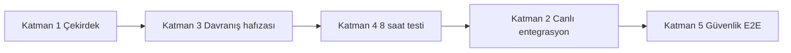

# Grounded Phase Roadmap — 5 Katman + Kuzey Yıldızı

| Alan | Değer |
|------|-------|
| Tarih | 2026-06-26 |
| Tür | Stratejik yol haritası (docs only) |
| Kapsam | Public `lumos-core` + Internal Alpha operasyon |
| Kaynak | Kullanıcı stratejik mesajı; mevcut audit/backlog/ops belgeleri |

**Kuzey yıldızı:** *«Lumos'u kendim için bütün gün kullanabilir miyim?»*

Bu belge **uygulama taahhüdü değildir**. OAuth, connector kodu veya çekirdek değişikliği içermez; mevcut durumu dürüstçe haritalar ve sonraki kapıları tanımlar.

---

## Katman özeti

| # | Katman | Durum | Sahip |
|---|--------|-------|-------|
| 1 | Çekirdek yerleşti | **done** (docs) | Ürün / güvenlik |
| 2 | Gerçek canlı entegrasyonlar | **stub** | Platform + owner (OAuth) |
| 3 | Lumos davranış hafızası | **partial** | Platform / ajan disiplini |
| 4 | Günlük «8 saat testi» | **stub** (runbook yeni) | Ürün / QA |
| 5 | Güvenlik E2E | **partial** | Güvenlik |

---

## Katman 1 — Çekirdek yerleşti

**Kapsam:** Charter, güven modeli, isimlendirme, doküman sınırları, OSS/private ayrımı.

| Alt alan | Durum | Kanıt |
|----------|-------|-------|
| Charter + güven modeli taslakları | **done** | [`welockai-charter-draft.md`](./welockai-charter-draft.md), [`welockai-trust-model-draft.md`](./welockai-trust-model-draft.md) — #531 |
| Onaylı isimlendirme kaydı | **done** | [`lumos-approved-naming-registry.md`](./lumos-approved-naming-registry.md) — §A.3 rotalar |
| Public repo sınırı | **done** | [`public-repo-boundary.md`](../memory/public-repo-boundary.md) |
| Entegrasyon izin modeli (charter) | **done** | [`integrations-overview.md`](../integrations-overview.md), [`external-integrations-permissions.md`](../memory/external-integrations-permissions.md) |
| Internal Alpha kapsam kilidi | **done** | [`INTERNAL_ALPHA_RELEASE_SCOPE.md`](../INTERNAL_ALPHA_RELEASE_SCOPE.md) |
| Karar sözleşmesi | **done** | [`lumos-karar-sozlesmesi.md`](../lumos-karar-sozlesmesi.md) |

**Boşluk:** Üretim tenant politikası, faturalama ve ticari TBD alanları **owner** — [`backlog-closure-report.md`](./backlog-closure-report.md) NA-05.

---

## Katman 2 — Gerçek canlı entegrasyonlar

**Kapsam:** Slack, GitHub, Gmail, Calendar, Drive — demo değil, gerçek bağlantı ve okuma/yazma yolları.

### Bugün: demo vs canlı (dürüst tablo)

| Entegrasyon | Ürün yüzeyi (welockai.com) | OSS kod | Canlı OAuth / API | Bugünkü gerçek |
|-------------|---------------------------|---------|-------------------|----------------|
| **GitHub** | `/integrations/github` — statik sayfa | Registry'de **yok**; connector pilot planlı (Katman 1) | **Yok** | **Demo** — politika + UI; «OAuth burada başlatılmaz» |
| **Slack** | `/slack` — statik sayfa | Registry'de **yok** | **Yok** | **Demo** — konumlandırma + izin matrisi |
| **Gmail** | `/integrations/mail` — statik sayfa | `src/integrations/mail/` Dar v1 stub; `gmail_oauth.py` iskelet | **Yok** (prod client secret yok) | **Stub** — `connection_status`, `list_unread`, `notify_check`; send/delete yok |
| **Google Calendar** | `/integrations/google` içinde örtük | **Yok** | **Yok** | **Demo** — OD-032 karar; kod yok |
| **Google Drive** | `/integrations/google` içinde örtük | **Yok** | **Yok** | **Demo** — charter matrisi; kod yok |
| **Linear** | `/integrations/linear` — planned yaprak | **Yok** | **Yok** | **Docs-first** — Katman 3 watchlist |

Kaynak: [`integrations-expansion-audit.md`](./integrations-expansion-audit.md), [`integrations-overview.md`](../integrations-overview.md).

### OSS'te gerçekten çalışan (connector olmayan)

| Bileşen | Durum |
|---------|-------|
| OpenAI provider (`OPENAI_API_KEY`) | **partial** — env ile yerel |
| Mail stub (OAuth'suz) | **stub** |
| Web search (Brave) | **partial** — env ile |
| Kando bridge (LAN) | **partial** — yerel dev; prod Vercel env **owner** |
| Vault Infisical PoC | **stub** — env-gated |

### Katman 2 durumu

| Alt alan | Durum | Sahip |
|----------|-------|-------|
| Statik entegrasyon hub + yapraklar | **done** | Platform — #530 |
| İzin modeli dokümantasyonu | **done** | Ürün / güvenlik |
| GitHub connector pilot (Katman 1) | **stub** | Platform |
| Production OAuth (GH / Slack / Google) | **owner** | Owner — NA-04 |
| Credential bridge / vault prod | **owner** | Güvenlik / ops |

**İlk canlı OAuth öncesi blokajlar** — ayrıntı § «İlk canlı OAuth öncesi blokajlar».

---

## Katman 3 — Lumos davranış hafızası

**Kapsam:** Ajanlar ve geliştiriciler için scope, test, CI, merge, deploy kültürü; «nasıl çalışılır» hafızası.

| Alt alan | Durum | Kanıt |
|----------|-------|-------|
| Karar katmanları + onay sözleşmesi | **done** | `.cursor/rules/lumos-karar-ozet.mdc`, `lumos-karar-sozlesmesi.md` |
| CI teşhis sırası (log önce) | **done** | `.cursor/rules/ci-diagnosis.mdc`, çok-ajan sırası |
| Commit öncesi zincir (ruff + pytest) | **done** | `make setup-commit-guard`, `commit-oncesi-zincir.mdc` |
| SECURITY_NEVER_AUTO test koruması | **done** | P0-05 izleme; 1220 passed @ `57e81ea` |
| Onboarding Katman A/B | **done** | [`getting-started.md`](../getting-started.md) — #539 |
| Entegrasyon / backlog audit hafızası | **partial** | Bu belge + [`integrations-expansion-audit.md`](./integrations-expansion-audit.md) |
| Kaynak modu danışmanı (active/beklemeli) | **partial** | [`lumos-resource-mode-advisor.md`](./lumos-resource-mode-advisor.md) — quantum ilk katman; Faz 1 eşikler |
| Günlük kullanım sürtünmesi kaydı | **stub** | [`INTERNAL_ALPHA_8HOUR_TEST.md`](../INTERNAL_ALPHA_8HOUR_TEST.md) (yeni) |
| Ajan «8 saat» davranış doğrulaması | **stub** | Runbook var; henüz doldurulmuş günlük yok |

**Boşluk:** Davranış hafızası **repo kuralları ve CI'da güçlü**; **gerçek gün boyu kullanım** henüz sistematik kayda alınmıyor (Katman 4 ile kapanır).

---

## Katman 4 — Günlük «8 saat testi»

**Kapsam:** Tek kişinin Lumos'u iş günü boyunca gerçek iş akışında kullanması; sürtünme ve gereksiz konuşma yakalanır.

| Alt alan | Durum | Sahip |
|----------|-------|-------|
| Runbook + sürtünme şablonu | **done** (bu PR) | Ürün / QA |
| Phase 2 kapısı (ops bağlantısı) | **done** (bu PR) | Ürün — [`INTERNAL_ALPHA_OPERATIONS.md`](../INTERNAL_ALPHA_OPERATIONS.md) §9 |
| İlk tam 8 saat oturumu | **stub** | @owner |
| Sürtünme günlüğü arşivi | **stub** | Ürün / QA |

### Kuzey yıldızı — «8 saat testi» başarı kriterleri

Aşağıdakilerin **hepsi** tek bir iş gününde (≥6 saat aktif kullanım, molalar hariç) karşılanırsa Katman 4 **ilk geçiş** sayılır:

1. **Sabah kurulumu ≤30 dk** — Katman B yerel *veya* prod Sınırlı mod + köprü (owner env varsa); [`INTERNAL_ALPHA_8HOUR_TEST.md`](../INTERNAL_ALPHA_8HOUR_TEST.md) checklist tamam.
2. **Panel + yerel görev** — En az 3 görev ekle/düzenle/tamamla (`[Yerel]` veya köprü yolu).
3. **En az bir köprü sohbet** — Soru → yanıt döngüsü (OpenAI key veya yapılandırılmış staging).
4. **Sürtünme günlüğü** — ≥5 madde (komut, kafa karışıklığı, gereksiz konuşma, blokaj); her blokaj «çözüldü / ertelendi / açık» etiketli.
5. **Gün sonu** — 3 soru yanıtlandı (runbook §4); «yarın tekrar kullanır mıyım?» evet/hayır + tek cümle gerekçe.
6. **Regresyon yok** — Gün içi `make test` veya eşdeğeri pass; P0-05 ihlali yok.

**Bilinçli olarak 8 saat testinde beklenmeyen:** Canlı GitHub/Slack/Gmail OAuth (Katman 2 henüz stub). Entegrasyon sürtünmesi ayrı faz kapısıdır.

---

## Katman 5 — Güvenlik E2E

**Kapsum:** İzin, onay, geri alma (undo), denetim — uçtan uca kullanıcı güveni.

| Alt alan | Durum | Kanıt |
|----------|-------|-------|
| SECURITY_NEVER_AUTO politika | **done** | `task_engine/profiles.py`, test regresyonu |
| Onay / profil matrisi (docs) | **done** | [`lumos-action-permission-matrix.md`](./lumos-action-permission-matrix.md) |
| Audit log sözleşmesi | **done** | [`lumos-audit-log-contract.md`](./lumos-audit-log-contract.md) |
| ADR-012 enforcement (Wave 1) | **partial** | Defer kaydı; tam CLOSED değil |
| Dış entegrasyon write onayı (canlı) | **stub** | Politika var; canlı connector yok |
| Undo / geri alma E2E (dış etki) | **stub** | Trash prensibi docs; dış SaaS undo yok |
| Güvenlik E2E senaryo paketi | **stub** | 8 saat testi güvenlik maddeleri runbook'ta |

**Boşluk:** Politika ve test **güçlü**; **canlı dış sistem** üzerinde onay → işlem → audit → undo zinciri **henüz doğrulanmadı** (Katman 2 + 5 birlikte).

---

## Faz sırası (grounded)

- **Şimdi:** Katman 1 kapalı; Katman 3 kısmi; Katman 4 runbook ile başlıyor.
- **Phase 2 kapısı:** İlk tam 8 saat testi + P1-02 Hafta 2 checkpoint → canlı OAuth planlaması.
- **Phase 3:** GitHub connector pilot (Katman 1) + ilk production OAuth.

---

## İlk canlı OAuth öncesi blokajlar (dürüst liste)

| # | Blokaj | Kategori | Sahip | Tetik |
|---|--------|----------|-------|-------|
| 1 | GitHub / Slack / Google **production OAuth uygulamaları** ve client secret'lar | **owner** | Owner | Katman 2 kickoff |
| 2 | **Credential vault / bridge** prod (Infisical veya eşdeğeri) | **owner** | Güvenlik | NA-04 |
| 3 | **GitHub connector** pilot kodu (registry + read path) | **stub** | Platform | OD-033 Katman 1 |
| 4 | Vercel **BRIDGE_UPSTREAM_URL** + secret (panel prod akışı) | **owner** | Owner | [`vercel-bridge-proxy-setup.md`](../vercel-bridge-proxy-setup.md) checklist |
| 5 | NA-01 `decision_runner` base_dir (güvenlik onayı) | **deferred** | Güvenlik | Ayrı PR |
| 6 | İlk **8 saat testi** tamamlanmamış | **stub** | Ürün / QA | Phase 2 kapısı |
| 7 | P1-02 **Hafta 2** checkpoint (≥14 gün) | **partial** | Ürün / QA | 2026-07-02+ |
| 8 | Closed Pilot **destek kanalı** gerçek adres | **owner** | Ops | P1-04 |

**Özet:** İlk canlı OAuth için **kod tek başına yetmez** — owner OAuth app'leri, vault/secret yönetimi ve Phase 2 (8 saat + P1-02) kapıları gerekir.

---

## Ayrı iz — AnchorUSB (güvenli taşınabilir vault)

**AnchorUSB** (USB vault + yerel olay günlüğü + insan-onaylı raporlama) bu 5 katmanlı Lumos yol haritasından **bağımsız paralel iz**dir; Katman 1–5 sırasını bloklamaz. Mimari: [`secure-device-framework.md`](./secure-device-framework.md) — paket: [`secure-device/README.md`](./secure-device/README.md).

---

## Çapraz referanslar

| Belge | Rol |
|-------|-----|
| [`secure-device-framework.md`](./secure-device-framework.md) | AnchorUSB — ayrı ürün izi (docs only) |
| [`integrations-expansion-audit.md`](./integrations-expansion-audit.md) | Entegrasyon envanteri |
| [`backlog-closure-report.md`](./backlog-closure-report.md) | NA / owner action listesi |
| [`INTERNAL_ALPHA_OPERATIONS.md`](../INTERNAL_ALPHA_OPERATIONS.md) | Alpha ops + Phase 2 kapısı |
| [`INTERNAL_ALPHA_8HOUR_TEST.md`](../INTERNAL_ALPHA_8HOUR_TEST.md) | 8 saat pratik runbook |
| [`getting-started.md`](../getting-started.md) | Katman A/B kurulum |
| [`local-kando-dev-runbook.md`](../local-kando-dev-runbook.md) | Yerel köprü |
| [`vercel-bridge-proxy-setup.md`](../vercel-bridge-proxy-setup.md) | Prod köprü owner checklist |

---

*Son güncelleme: 2026-06-26 — stratejik 5 katman grounded roadmap; uygulama yok.*
