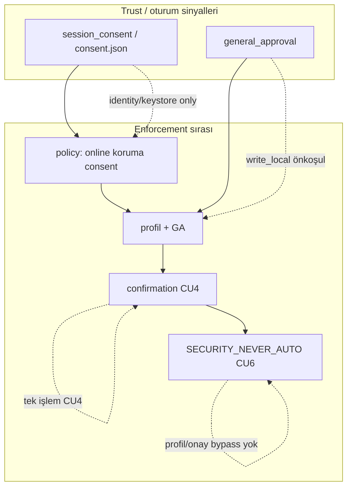

# CU4 Confirmation İskelet Taslağı — Analiz Raporu (lumos-core)

| Alan | Değer |
|------|-------|
| Durum | **Güncellendi** — PR-C0–C5 + CLI C4 merge (#452–#458); PR-C6 adapter **kısmi** (#462); confirmation **opt-in** |
| Tarih | 2026-06-21 (sync: post-#462) |
| İlgili | [ADR-010](../decisions/ADR-010-guard-policy-trust-terminology.md), [ADR-012](../decisions/ADR-012-lumos-security-codex.md), [consent/GA ayrımı](lumos-consent-general-approval-separation-draft.md), [runtime enforcement map](lumos-runtime-enforcement-map.md) |

**Kapsam:** Analiz + merge edilmiş CU4 confirmation zinciri (#452–#458). Kod referansı: `src/policy/confirmation_policy.py`, `panel_bridge_state.task_action_gate`, `panel_tasks_server`, CLI `onayla`.

**Opt-in:** `LUMOS_CONFIRMATION_ENABLED=true|1|yes` — varsayılan kapalı (no-op). Env yokken policy+profil gate (#443–#449) davranışı değişmez.

---

## 1. Teknik taslak (definitions, data model sketch, API shape — docs only)

### 1.1 Üç sinyalin tanımı (ADR-010 hizalı)

| Sinyal | Süre | Amaç | Bugün repo karşılığı |
|--------|------|------|------------------------|
| **session_consent** | Oturum / dosya | Identity, keystore, koruma alanı rızası | `consent.json` + CLI `session_consent[]` (#451); `effective_consent()` |
| **general_approval** | Oturum | `kisitli_otonom` yazma kapısı (`write_local`, `safe_local` önkoşulu) | `general_approval[]`, panel `LUMOS_GENERAL_APPROVAL` |
| **confirmation** *(merge #453–#458)* | Tek işlem / tek kapsam | CU4: dış etkili veya yükseltilmiş riskli adım için anlık onay | `confirmation_policy`; `task_action_gate` 3. kapı; `POST /lumos-confirm/*`; CLI `onayla` — **opt-in** |

**Zorunlu kural:** `general_approval=True` → CU4 için **yeterli değil**. `SECURITY_NEVER_AUTO` → üç sinyalden **bağımsız** ⛔.

### 1.2 Hedef enforcement zinciri

```
policy snapshot (online, koruma, consent)
        ↓
profil + general_approval (write_local kapısı)
        ↓
confirmation (işlem bazlı, CU4 + CU7 preview)
        ↓
SECURITY_NEVER_AUTO (asla otomatik değil)
```

### 1.3 Confirmation veri modeli (merge — #453)

**Kayıt:** `ConfirmationGrant` (tek kullanımlık, kapsam bağlı) — `src/policy/confirmation_policy.py`

| Alan | Tip | Açıklama |
|------|-----|----------|
| `schema_version` | string | örn. `lumos.confirmation.v1` |
| `confirmation_id` | string | UUID / kısa id |
| `action_key` | string | örn. `delete_task`, `delete_permanent`, `write_local`, `external_write`, `cu_act_step` |
| `scope_hash` | string | hedef + etki alanının hash'i (aynı işlem tekrarında yeniden onay) |
| `scope` | object | CU7: `{ what, where, effect, profile, step_kind }` |
| `created_at` / `expires_at` | ISO8601 | TTL (örn. 5–15 dk); varsayılan-onay yasağı |
| `consumed` | bool | tek kullanım sonrası true |
| `granted_by` | enum | `panel_confirm`, `cli_confirm`, `bridge_approve` |

**Depolama:** `.lumos/pending_confirmations/<id>.json` — merge (#453).

**Runtime ref (CLI):** `TaskMutationContext.pending_confirmation` + `onayla <id>` (#458). `pending_action` **consent akışına** aittir; confirmation ile karıştırılmaz.

### 1.4 API shape (merge — #453–#457)

**Modül:** `src/policy/confirmation_policy.py` — `check_confirmation`, `request_confirmation`, `consume_confirmation`, `is_confirmation_enabled`.

**Panel HTTP (merge):**

| Endpoint | Rol | PR |
|----------|-----|-----|
| `POST /lumos-confirm/request` | CU7 preview döner; `confirmation_id` üretir | #457 |
| `POST /lumos-confirm/grant` | Kullanıcı onayı → grant yazar | #457 |
| Mutasyon body | `{ ..., "confirmation_id": "..." }` veya legacy `confirm=true` (delete-permanent) | #454, #456 |

**Reason kodları (gate genişlemesi — PR-C0 tanımlandı):**

| Kod | Anlam |
|-----|-------|
| `confirmation_required` | Onay yok veya süresi dolmuş |
| `confirmation_expired` | Grant TTL doldu |
| `confirmation_scope_mismatch` | Id geçerli ama hedef farklı |
| `confirmation_preview_required` | CU7: önce preview endpoint |
| `[CONFIRMATION_BLOCKED] <action> → ...` | `task_action_gate` reason parçası |

Mevcut policy reason'ları korunur: `offline_mode`, `koruma_aktif_delete`, `consent_required`, `[PROFILE_BLOCKED]`, `[POLICY_BLOCKED]`.

### 1.5 Mevcut parça → iskelete taşıma

| Parça | Konum | Confirmation iskeletine rol |
|-------|-------|----------------------------|
| `confirm=true` body | `panel_tasks_server._body_confirm_user_initiated` | **Referans implementasyon** — `delete_permanent` için |
| `may_perform_permanent_delete(user_initiated)` | `workspace_contract.py` | NEVER_AUTO katmanı; confirmation **üstüne** oturur |
| `pending_approval` | `lumos_gate`, `task_dispatch`, köprü | Köprü confirmation; **PR-C6 merge #462** — `attach_bridge_pending_confirmation` shadow adapter; legacy `pending_approvals` korunur; yürütmede `consume_confirmation` **açık** |
| `pending_action` | `TaskMutationContext`, `live_brain` | **Consent/GA akışı** — confirmation'a taşınmaz |
| `requires_confirmation()` | `device_action_policy.py` | Cihaz yüzeyi için aynı API imzası hedeflenir |

---

## 2. Etkilenecek dosyalar (endpoints, state fields, UI, runtime)

### 2.1 Policy / runtime (çekirdek)

| Dosya | Değişiklik türü |
|-------|-----------------|
| `src/policy/action_policy.py` | `PolicyContext` + opsiyonel `confirmation_id`; veya ayrı `confirmation_policy.py` |
| `src/core/panel_bridge_state.py` | `task_action_gate` üçüncü kapı; `_panel_gate_reason_parts` + `[CONFIRMATION_BLOCKED]` |
| `src/cli/cli_tasks_mutation.py` | Mutasyon öncesi `check_confirmation`; `pending_confirmation` ref |
| `src/core/lumos_runtime.py` | `pending_confirmation[]` state; CLI `onayla <id>` komutu (hedef) |
| `src/core/startup_health.py` | Docstring only — confirmation consent/GA'ya karışmaz |
| `src/task_engine/profiles.py` | `requires_confirmation_for_action(action_key)` registry (SECURITY_NEVER_AUTO ayrı) |
| `src/core/workspace_contract.py` | `may_perform_permanent_delete` korunur; confirmation wrapper |

### 2.2 Panel sunucu / API

| Dosya | Değişiklik |
|-------|------------|
| `panel/scripts/panel_tasks_server.py` | Tüm mutasyon handler'ları: confirmation check; `POST /lumos-confirm/*` (yeni) |
| Mevcut: `POST /tasks`, `/complete`, `/delete`, `PUT /tasks.json`, `/delete-permanent`, `/restore` | Confirmation gereksinim matrisine göre kademeli |

### 2.3 UI / read state

| Dosya | Değişiklik |
|-------|------------|
| `ui/src/pages/panel.astro` | Onay modalı; CU7 preview kartı; `confirmation_required` gate mesajı |
| `src/core/panel_bridge_state.py` (`build_panel_read_state`) | `pending_confirmation`, `confirmation_preview` guidance alanları |

### 2.4 Test / docs

| Dosya | Rol |
|-------|-----|
| `tests/test_panel_delete_permanent_policy_gate.py` | Mevcut confirm pattern → genel framework'e migrate |
| Yeni: `tests/test_confirmation_policy.py` | Reason kodları, TTL, scope_hash |
| `tests/test_consent_flow.py` | Regresyon: GA/consent confirmation ile karışmaz |
| `docs/analysis/lumos-runtime-enforcement-map.md` | CU4 gap → PR-C0 reason kodları tanımlandı |
| `docs/analysis/lumos-consent-general-approval-separation-draft.md` | PR-4 → CU4 iskelet referansı |

### 2.5 Kapsam dışı (bu iskelet PR zincirinde dokunulmaz)

- `packages/kando_bridge/`, `packages/kando_runtime/lumos_gate.py` — ayrı hizalama PR'si (köprü `pending_approval` → confirmation namespace)
- Güvenlik çekirdeği gevşetme, lock semantiği birleştirme, Trust Engine

---

## 3. Örnek akışlar (old vs new, concrete scenarios)

### 3.1 İlişki tablosu: session_consent × general_approval × confirmation

| Durum | session_consent | general_approval | confirmation | Sonuç: `POST /tasks` (kisitli_otonom, online) |
|-------|-----------------|------------------|--------------|------------------------------------------------|
| A | ❌ | ❌ | — | Policy/consent red veya profil red |
| B | ✅ (consent.json) | ❌ | — | `[PROFILE_BLOCKED]` — GA gerekli |
| C | ✅ | ✅ | ❌ | **Eski:** izinli. **Yeni (CU4):** `confirmation_required` (write_local mutasyon) |
| D | ✅ | ✅ | ✅ (scope=eşleşen id) | İzinli |
| E | ✅ | ✅ | ✅ | `POST /tasks/delete-permanent` — yine `may_perform_permanent_delete` + elevated confirm (NEVER_AUTO) |



### 3.2 Senaryo 1 — Panel görev oluşturma (`kisitli_otonom`, GA açık)

**Eski:** `task_action_gate(CREATE_TASK)` → policy OK + profil OK → görev yazılır.

**Yeni:**
1. Gate policy + profil (aynı).
2. `confirmation_required` → UI CU7 kartı: "Görev oluştur: `<title>` → `.lumos/tasks.json` yazımı".
3. Kullanıcı onaylar → `confirmation_id` body'de → mutasyon commit.

### 3.3 Senaryo 2 — Kalıcı silme (mevcut pattern → iskelet)

**Eski (bugün, #445):**
1. `task_action_gate(DELETE_TASK, profile_guard=False)` — policy only.
2. `_body_confirm_user_initiated(body)` → `may_perform_permanent_delete`.
3. Trash dosyası unlink.

**Yeni:** Adım 2, genel `consume_confirmation("delete_permanent", scope)` ile birleşir; `confirm=true` legacy alias kalır. CU6: otomatik asla; confirmation bile otomatik tetiklenmez.

### 3.4 Senaryo 3 — CLI `görev sil <id>` (soft delete / trash)

**Eski:** Policy → tek satır uyarı print → `user_initiated=True`.

**Yeni:** Aynı uyarı + opsiyonel `onayla` / confirmation token (CLI CU7 metni); panel ile aynı `action_key=delete_task` scope.

### 3.5 Senaryo 4 — Computer Use dış-etkili adım (hedef, implementation-pending)

**Eski:** Entegrasyon yok.

**Yeni (iskelet hook):** Mod `act` + CU7 preview + `confirmation` + CU10 lock/consent snapshot → gateway. GA açık olsa bile her dış tıklama/yazma ayrı confirmation.

### 3.6 Senaryo 5 — Consent vs confirmation karışıklığı (regresyon)

**Eski drift (kapandı #450+#451):** `genel onay aç` → `consent_ok=True` (yanlış).

**Yeni:** `genel onay aç` → yalnızca `general_approval_active`; dış etkili işlem hâlâ `confirmation_required`. Kullanıcı üç ayrı kart görür: Consent / Genel onay / İşlem onayı.

---

## 4. Dar PR planı (sequence, which actions require confirmation)

### 4.1 PR-C6 adapter durumu (#462)

**Merge (kısmi):** `attach_bridge_pending_confirmation` — köprü `pending_approval` kaydı oluşturulurken paralel `.lumos/pending_confirmations/` shadow kaydı yazar (`lumos_gate`, `task_dispatch`). Legacy `.lumos/pending_approvals/` akışı **bozulmaz**.

| Tamamlanan | Açık |
|------------|------|
| `bridge_pending_action_key` / `bridge_pending_confirmation_spec` | Köprü yürütme yolunda `consume_confirmation` wiring |
| `attach_bridge_pending_confirmation` shadow grant | Köprü onayı hâlâ legacy `pending_approvals` üzerinden |
| Bridge action_key kayıtları (`BRIDGE_HIGH_RISK_ACTION`, `BRIDGE_MEDIUM_DISPATCH_ACTION`) | Tam namespace birleşimi (panel vs bridge tek consume path) |
| Test: `tests/test_bridge_confirmation_adapter.py` | Enforcement yalnızca `LUMOS_CONFIRMATION_ENABLED` ile (panel/CLI #453–458 ayrı) |

**Kalan gap:** Köprü risk onayı sonrası yürütme, CU4 grant tüketimi (`consume_confirmation`) ile bağlanmadı; duplicate onay riski devam eder (bkz. false positive tablosu).

### 4.2 PR sırası (minimal, tek sorumluluk)

| PR | Başlık | Kapsam | Durum |
|----|--------|--------|-------|
| **PR-C0** | Reason kodları + docs | `[CONFIRMATION_BLOCKED]`, enforcement map CU4 satırı | **Merge** #452 |
| **PR-C1** | `confirmation_policy` iskelet | `check/request/consume`; `.lumos/pending_confirmations/`; unit test | **Merge** #453 |
| **PR-C2** | `delete-permanent` unify | `confirm=true` → C1 API; regresyon testleri | **Merge** #454 |
| **PR-UI-C2a** | Trash modal UI | Panel onay modalı iskeleti | **Merge** #455 |
| **PR-C3** | Panel mutasyonlar (write_local) | `POST /tasks`, `PUT /tasks.json`, `complete`, soft `delete` — 3. kapı | **Merge** #456 (opt-in) |
| **PR-C5** | CU7 preview endpoint | `POST /lumos-confirm/request` + panel modal | **Merge** #457 |
| **PR-C4** | CLI confirmation | `onayla <id>` / inline confirm | **Merge** #458 |
| **PR-C6** | Köprü hizalama (opsiyonel) | `pending_approval` → confirmation namespace | **Kısmi merge** #462 |

**Önkoşul:** Consent ≠ GA ayrımı (#450+#451) **tamamlanmış** kabul edilir; CU4 iskelet bunun üstüne inşa edilir.

### 4.3 Hangi operasyonlar confirmation gerektirir?

| Operasyon | action_key | Confirmation katmanı | GA önkoşul? | NEVER_AUTO? | CU |
|-----------|------------|----------------------|-------------|-------------|-----|
| Panel / listeleme | — | ❌ Silent | — | — | — |
| `GET /evidence/*` | — | ❌ | — | — | — |
| `POST /tasks` (create) | `create_task` | ✅ Single | kisitli_otonom: GA | ❌ | CU4 |
| `POST /tasks/complete` | `complete_task` | ✅ Single | kisitli_otonom: GA | ❌ | CU4 |
| `POST /tasks/delete` (soft) | `delete_task` | ✅ Single | profil+policy | ❌ | CU4, CU6 (trash) |
| `PUT /tasks.json` | `write_local` | ✅ Single | kisitli_otonom: GA | ❌ | CU4 |
| `POST /tasks/restore` | `restore_task` | ✅ Single | policy | ❌ | CU4 |
| `POST /tasks/delete-permanent` | `delete_permanent` | ✅ **Every-time** + elevated | policy only (profil guard yok) | ✅ `permanent_delete` | CU4, CU6 |
| CLI `görev sil` | `delete_task` | ✅ (CLI metin/onay) | profil | trash sözleşmesi | CU6 |
| Identity / keystore erişim | `access_*` | ❌ (consent yeterli) | — | ❌ | CU10 |
| `genel onay aç/kapat` | — | ❌ (GA toggle) | — | ❌ | — |
| `consent oturum aç` / kilit | — | ❌ (session_consent) | — | ❌ | CU10 |
| External write / mail / CU act | `external_write`, `cu_act_*` | ✅ Every-time | GA yetmez | ✅ | CU4, CU5, CU6 |
| Payment / domain / kritik config | `irreversible_*`, `critical_*` | ⛔ Elevated + kullanıcı komutu | bypass yok | ✅ | CU6, CU10 |
| Device process kill (gelecek) | `device.process_control` | ✅ | `requires_confirmation` stub | ❌ | CU4 |

**Not:** `guvenli_yurut` + `safe_local` panel mutasyonları PR-C3'te **notification** (codex banner) yeterli sayılabilir; confirmation zorunluluğu primarily `write_local` ve dış etki için.

### 4.4 CU4 / CU6 / CU7 / CU10 hizalama

| CU | Confirmation iskelet karşılığı |
|----|-------------------------------|
| **CU4** | Üçüncü sinyal; GA sonrası zorunlu; dış etkili liste tabloda |
| **CU6** | NEVER_AUTO confirmation ile bypass edilemez; `delete_permanent` çift katman |
| **CU7** | `scope` preview + gate reason; sessiz uygulama yok |
| **CU10** | Confirmation öncesi policy `consent` + `koruma_active`; online CU oturumu hook |

### 4.5 UI sinyalleri ve enforcement noktaları

| Katman | UI sinyali | Enforcement |
|--------|------------|-------------|
| Consent | Keystore kartı, `consent_ok` | `action_policy` ACCESS_*; panel `consent.json` |
| GA | `general_approval_active`, env toggle | `may_execute_step_at_runtime`; gate `[PROFILE_BLOCKED]` |
| Confirmation | Modal / `confirmation_id`; `[CONFIRMATION_BLOCKED]` | `task_action_gate` 3. kapı; mutasyon handler |
| NEVER_AUTO | Tek satır uyarı + ⛔ | `may_perform_permanent_delete`; profil `external`/`critical` red |

---

## 5. Rollback planı

| Adım | Aksiyon | Etki |
|------|---------|------|
| 1 | PR-C6→C1 sırasıyla `git revert` (en yeni önce) | Confirmation katmanı kalkar |
| 2 | `.lumos/pending_confirmations/` kayıtları orphan kalır — okuma yolu yok sayılır | Veri zararsız |
| 3 | `delete-permanent` PR-C2 revert edilirse | Eski `confirm=true` + `may_perform_permanent_delete` doğrudan yol geri gelir |
| 4 | Panel/CLI mutasyonlar PR-C3/C4 revert | GA+policy-only gate (#443–446 davranışı) |
| 5 | CI | `test_panel_delete_permanent_policy_gate`, `test_consent_flow`, panel gate testleri yeşil |
| 6 | Docs | `lumos-runtime-enforcement-map.md` CU4 satırı tekrar "confirmation gap" |
| 7 | Deploy | Env değişikliği gerekmez; pending confirmation dosyaları manuel silinebilir |

**Bilinen geri dönüş riski:** Revert sonrası CU4 işlem bazlı onay yine yok; GA açıkken panel mutasyonları confirmation olmadan geçer — **mevcut kısmi duruma** dönülür (runtime map §7 ile uyumlu).

---

## False positive riskleri ve UX etkisi

| Risk | Kategori | Azaltma |
|------|----------|---------|
| GA açık sanıp işlem yapamama ("neden hâlâ blok?") | UX / doğruluk | Ayrı `[CONFIRMATION_BLOCKED]` etiketi; üç kart: consent / GA / işlem onayı |
| Her mutasyonda modal yorgunluğu | UX | Yalnızca `write_local`+ ve NEVER_AUTO elevated; read/list silent |
| `confirm=true` ile `confirmation_id` çift API | Teknik | PR-C2: legacy alias; tek consume path |
| `pending_action` (consent) vs `pending_confirmation` karışımı | Teknik | Farklı alan adları; ADR-010 doc |
| Panel env `LUMOS_SESSION_UNLOCKED` vs runtime `LockState` | CU10 false block/allow | Confirmation öncesi policy snapshot uyarısı; LockState checkpoint ayrı PR |
| Köprü `pending_approval` ile duplicate onay | UX | PR-C6 namespace; panel vs bridge ayrımı |
| Demo kırılması (`online`+`rapor`+confirmation) | Test | Fixture'larda profil/GA/confirmation explicit |

---

## Özet durum

- **Kapandı (öncül):** consent ≠ general_approval (#450+#451); panel profil guard (#449); ADR-010 terminoloji.
- **Merge (#452–#458):** Reason kodları, `confirmation_policy`, delete-permanent unify, trash modal UI, panel 3. kapı, CU7 preview, CLI `onayla`.
- **PR-C6 kısmi (#462):** Shadow adapter; legacy `pending_approvals` korunur.
- **Opt-in:** `LUMOS_CONFIRMATION_ENABLED=true|1|yes` — varsayılan no-op.
- **Kapandı:** E2E confirmation (#459+#460); varsayılan-on kararı opt-in (#461, DL-C18).
- **Açık:** Köprü yürütmede `consume_confirmation` wiring; P2 tam küme eşlemesi (engine branch dar merge #463).
