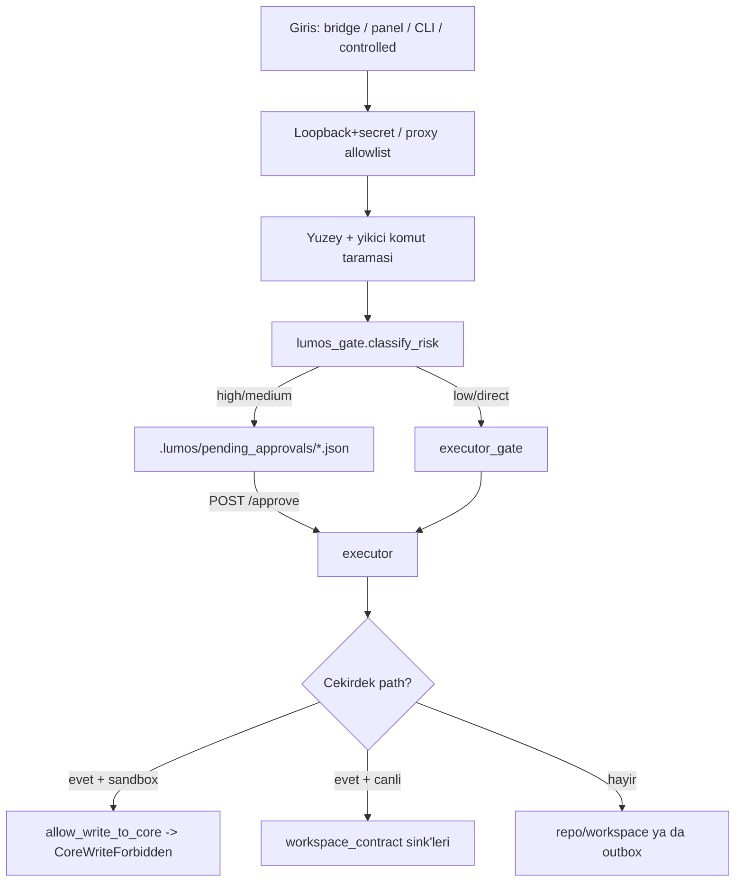

<!-- markdownlint-disable MD013 -->

# Dosya Akışı — Analiz ve Claim (yeni hedef)

| Alan | Değer |
|------|-------|
| Durum | **Analiz / claim** — yeni hedef kapsamı; **kod değişikliği yok** |
| Tarih | 2026-07-21 |
| Kapsam | Kullanıcı/ajan dosyalarının sisteme girişi → guard/sink omurgası → kalıcı yazım/silme; güvenlik ve kullanıcı-onayı sınırları |
| Kapsam dışı | **TD-02** (`ui/src/pages/panel.astro` bölme) — dokunulmadı; panel iç mantığı yalnız `UPLOAD_URL` env türetimi düzeyinde referanslandı |
| İlgili | [`lumos-log-vs-approval.md`](./lumos-log-vs-approval.md), [`lumos-audit-log-contract.md`](./lumos-audit-log-contract.md), [`lumos-action-permission-matrix.md`](./lumos-action-permission-matrix.md), [`../lumos-guard-zincir-durum.md`](../lumos-guard-zincir-durum.md), [`../lumos-phase3-sink-guard-checkpoint.md`](../lumos-phase3-sink-guard-checkpoint.md), [`../lumos-sandbox-hedef-dizin-sozlesmesi.md`](../lumos-sandbox-hedef-dizin-sozlesmesi.md), [`../contracts/task-store-v1.md`](../contracts/task-store-v1.md), [`../TECHNICAL_DEBT.md`](../TECHNICAL_DEBT.md) |

**Sınır notu:** Bu belge yalnızca **mevcut durumu** haritalar ve boşlukları listeler. Hiçbir üretim kodu yazılmadı/değiştirilmedi; önerilen adımlar "sonraki faz" olarak kayıtlıdır. Satır numaraları **`main` @ `8cf82bc`** (2026-07-22) durumuna göre tazelenmiştir; §7.1 çapaları bu SHA'ya karşı yeniden doğrulanmıştır.

---

## 1. Amaç

"Dosya akışı" (bir dosyanın yazma/kopyalama/silme/üzerine-yazma isteğinin) sistemde hangi kapılardan geçtiğini tek yerde görünür kılmak; **güvenlik sınırlarını** ve **kullanıcı-onayı sınırlarını** ayrıştırmak; **eksik halkaları** (kod ↔ doküman sapması, stub/handler eksikleri, guard'ı atlayan çift yollar) kanıtla çıkarmak. Bu, kod fazından önceki analiz/claim adımıdır.

---

## 2. Mevcut akış (sıralı pipeline)

Guard ayrı bir Rust crate değil; omurga büyük ölçüde `src/core/workspace_contract.py` içindeki **merkezi sink + sandbox guard** üzerine kuruludur. İstek şu aşamalardan geçer:

| # | Aşama | Rol | Kod (dosya : satır) |
|---|-------|-----|---------------------|
| A | Giriş (HTTP/CLI) | İstek gövdesi köprü/panel/CLI üzerinden girer | bkz. §3 |
| B | Transport güvenliği | Loopback + secret (köprü); Vercel proxy allowlist | `packages/kando_bridge/.../server.py` ~1555–1577; `api/bridge/[...path].js` 34–43 |
| C | Yüzey/komut filtresi | Yıkıcı shell fiilleri, terminal/mail yüzeyi reddi | `packages/kando_runtime/.../controlled_bridge.py` 108–109, 244–256; `.../dangerous_command.py` 74+ |
| D | Lumos gate (risk & mod) | `classify_risk` → `pending_approval` / `restricted` / `direct_patch` | `packages/kando_runtime/.../lumos_gate.py` 983–1096 |
| E | Onay bekletme | Yüksek/orta risk → `.lumos/pending_approvals/*.json` | `server.py` 1590–1624; `task_dispatch.py` 646–698 |
| F | Executor gate | Onay/netleştirme beklerken fiziksel yürütme yok | `packages/kando_runtime/.../executor_gate.py` 7–14; `file_executor.py` 96–104 |
| G | Yürütme | `workspace/` sandbox R/W; repo patch; simülasyon | `controlled_bridge.py` 144–221; `file_executor.py` 82–165; `src/kando/file_patch_executor.py` 259–344 |
| H | Çekirdek sink + sandbox guard | `.lumos` state → merkezi sink; sandbox'ta canlı çekirdeğe yazma reddi | `src/core/workspace_contract.py` 445–479, 501–600 |
| I | Write interceptor (planlı) | Protected path'te direct write → patch pipeline — **üretimde bağlı değil** | `src/core/write_interceptor.py` 56–163 |
| J | Patch lifecycle gate | Protected apply: `allow_protected_apply` + `READY_FOR_APPLY` | `src/core/patch_pipeline.py` 177–248 |
| K | Audit / evidence | Guard kararı → log; deny → evidence journal | `src/core/guard_audit.py` 51–82; `src/core/evidence_continuity.py` 773–798 |
| L | Kalıcı çıkış / silme | trash, soft/permanent delete, outbox | bkz. §6 |

---

## 3. Giriş noktaları (entry points)

| Kaynak | Uç / mekanizma | Dosya etkisi | Kod |
|--------|----------------|--------------|-----|
| Köprü — görev/patch | `POST /task` | Gate → dispatch → onay veya `file_patch_executor` | `kando_bridge/.../server.py` 2550–2581 |
| Köprü — kontrollü R/W | `POST /controlled` | Yalnız `<repo>/workspace/` altı | `controlled_bridge.py` 144–221 |
| Köprü — ses | `POST /transcribe` | multipart `audio`; kalıcı saklanmaz | `transcribe.py` 68–117 |
| Köprü — onay tüketimi | `POST /approve` | `execute_approved_*` → patch | `server.py` 2244–2503 |
| Köprü — PC remote picker | `POST /tools/execute` | pending approval; **stub yürütme** | `pc_remote_tools.py` 466–507 |
| Panel görev sunucusu | `POST/PUT /tasks`, `/tasks.json` | `.lumos/tasks.json` (direct write) | `panel/scripts/panel_tasks_server.py` 265–301 |
| Panel — soft/permanent delete | `/tasks/delete`, `/tasks/delete-permanent` | `.lumos/trash/*` / `unlink` | `panel_tasks_server.py` 1303–1364, 1480–1547 |
| Panel — consent | `POST /lumos-consent` | `.lumos/consent.json` (sink dışı) | `panel_tasks_server.py` 1125–1151 |
| Backend chat (vision) | `POST /chat` + `imageData` base64 | **Disk yok**; ≤256KB inline | `backend/index.js` 82–120 |
| Rust vault export | `anchorusb-core` report | Kullanıcı tetikli rapor; ana sink'ten ayrı | `crates/anchorusb-core/src/report.rs` |
| UI upload (hedeflenen) | `UPLOAD_URL` → proxy `panel/upload` | **Upstream handler eksik** (§7) | `ui/src/pages/panel.astro` 16–18; `api/bridge/[...path].js` 43 |

---

## 4. Güvenlik sınırları (security boundaries)

Hepsi `src/core/workspace_contract.py` (aksi belirtilmedikçe):

| Sınır | Kural | Enforcement | Satır |
|-------|-------|-------------|-------|
| Sandbox → canlı çekirdek yazma yasağı | `is_sandbox_mode=True` + core path → deny | `allow_write_to_core` → `CoreWriteForbidden` | 529–600, 603 |
| Çekirdek path tanımı | `CORE_STATE_PATH_NAMES` + `tasks/tasks.json` + `config/`,`logs/`,`trash/` altları | `is_core_state_path` | 501–526 |
| Tek trash hedefi | Yalnız `writing_base_dir(...)/trash` | `move_to_trash` + `is_allowed_trash_path` | 445–479 |
| Kalıcı silme | `user_initiated=True` zorunlu | `may_perform_permanent_delete` | 482–489 |
| SECURITY_NEVER_AUTO | `permanent_delete`, external_write vb. asla otomatik | `task_engine/profiles.py` | 47–61 |
| Controlled bridge sandbox | `workspace/` dışı, `..`, delete fiilleri reddi | `controlled_bridge.py` | 62–73, 124–125, 244–256 |
| Repo patch sınırı | Hedef, repo kökü altında olmalı | `file_patch_executor._apply_single` | 166–176 |
| Yıkıcı komut | `sudo rm -rf` vb. | `dangerous_command.destructive_surface_blocks_task` | 74+ |
| Çekirdek sabit bütünlüğü | Literaller değişmez | `inviolable.verify_core_constants` (**test ağırlıklı**) | 24–48 |

---

## 5. Kullanıcı-onayı sınırları (approval / consent)

**Karar ≠ Kayıt** ilkesi geçerli ([`lumos-log-vs-approval.md`](./lumos-log-vs-approval.md)). Dört ayrı mekanizma vardır; karıştırılmamalıdır:

| Katman | Ne | Nerede | Onay mı, log mu? |
|--------|-----|--------|------------------|
| **Consent** (`consent.json`) | Kimlik/keystore için oturum ön koşulu | `panel_tasks_server.py` 1140–1147; `startup_health.effective_consent`; `policy/action_policy.py` 81–82 | Ön-koşul kapısı (onay akışı **değil**) |
| **Genel onay** (`LUMOS_GENERAL_APPROVAL`) | `write_local` sınıfı adımların kapısı | `panel_bridge_state.py` 106–108; `task_engine/engine.py` 566–569; `profiles.py` 295–319 | Onay (kaba, env düzeyi) |
| **CU4 Confirmation** (`LUMOS_CONFIRMATION_ENABLED`) | İşlem-bazlı `confirmation_id`; panel mutasyonu / `delete_permanent` | `confirmation_policy.py` 28, 209–231, 397–434; panel 1071–1123, 1498–1514 | Onay (ince, tek-kullanımlık grant) |
| **Köprü pending approval** | Yüksek/orta risk dosya/komut → beklet → `/approve` | `lumos_gate.py` 1070–1096; `server.py` 1590–1624, 2463–2498 | Onay (risk tetikli) |
| **Audit / evidence** | Guard kararı + panel mutasyonu izi | `guard_audit.record_guard_event` 51–82; `evidence_continuity.append_evidence_event` 773–798 | **Log** (geçmiş koruma) |

Not: passphrase diske yazılmaz (`panel_tasks_server.py` 1126). Onay beklerken `executor_gate.gate_blocks_execution` fiziksel yürütmeyi bloklar (`executor_gate.py` 7–14).

---

## 6. Kalıcı çıkış ve silme

| Alan | Path | Yazıcı | Merkezi sink/guard? |
|------|------|--------|---------------------|
| Panel görev listesi | `.lumos/tasks.json` | `panel_tasks_server._write_doc` (direct) | **Hayır** (evidence journal var) |
| TaskEngine görevleri | `.lumos/tasks/tasks.json` | `save_task_store_json` | **Evet** |
| Trash (panel) | `.lumos/trash/*.json`, `trash/tasks/` | `_write_trash_task_file` (direct) | **Hayır** — `move_to_trash` kullanılmıyor |
| Trash (engine) | `writing_base_dir/trash/` | `TaskStore.move_to_trash` | Kısmen |
| Agent workspace | `<repo>/workspace/**` | `controlled_bridge`, `file_executor` | Path sandbox |
| Repo patch | `<repo>/<rel>` | `file_patch_executor` | Repo-root kontrolü |
| Onay/confirm kayıtları | `.lumos/pending_approvals/`, `.lumos/pending_confirmations/` | ilgili modüller | Traversal guard / env-gated |
| Evidence | `.lumos/logs/evidence_continuity.jsonl` | `append_evidence_event` | `allow_write_to_core` |

**Silme akışları:** soft delete (panel `1303–1364`, engine `339–377`), permanent delete (panel `1480–1547` + confirmation + `may_perform_permanent_delete`; engine `379–392`), simülasyon (log-only, `file_executor.py` 116–128), controlled mode (validate aşamasında red).

---

## 7. Eksik halkalar (missing links / gaps)

### 7.1 Üretim boşlukları (kanıtlı)

1. **Panel upload endpoint'i yok.** Proxy `panel/upload`'ı allowlist'e almış (`api/bridge/[...path].js` 43) ve UI `UPLOAD_URL`'e POST ediyor (`panel.astro` 16–18), ancak `kando_bridge/.../server.py` içinde `upload`/`panel/upload` handler'ı **yok** → upstream 404. Env örneği (`/upload`) ile panel default (`/panel/upload`) de **uyumsuz**.
2. **Panel trash: guard var, merkezi sink hâlâ yok.** `panel_tasks_server._write_trash_task_file` (`458–480`) kendi `_trash_dir()`'ine doğrudan yazmaya devam ediyor; sözleşmedeki `workspace_contract.move_to_trash` (`445`) çağrılmıyor → **tek-trash-hedefi sözleşmesi bu yolda uygulanmıyor.** Ancak yazımdan önce `_guard_core_write(path)` (`468`) çağrılıyor, yani **sandbox guard bu yolda artık uygulanıyor**; bulgunun "guard yok" kısmı geçersizdir, "merkezi sink atlanıyor" kısmı geçerlidir.
3. **İki task store / çift guard kapsamı.** `.lumos/tasks.json` (panel, direct) vs `.lumos/tasks/tasks.json` (engine, sink'li). TD-01 kapandı ama geçici köprü (**TD-11**) hâlâ açık; guard kapsamı yüzeyler arası tutarsız.
4. **`write_interceptor` üretimde bağlı değil.** `intercept_write` (`write_interceptor.py` 56–163) yalnız testlerden çağrılıyor; protected-path direct write → patch yönlendirmesi canlı akışta yok.

### 7.2 Belgede var, kodda yok

| Referans | Gerçek |
|----------|--------|
| `LUMOS_FILE_SCAN_DIR` (Lumos backbone deposunda geçer) | Bu repoda tanım yok |
| Knowledge-repository ingestion | Yok |
| Mail eki → yerel dosya | `src/integrations/mail/` demo stub; pipeline'a bağlı değil |
| PC remote file picker "gerçek yürütme" | Stub mesaj (`pc_remote_tools.py` 504) |
| `verify_core_constants()` runtime zorunluluğu | Test ağırlıklı; runtime'da zorunlu değil |

### 7.3 Doküman "sonraki faz" (planlı, tam bağlanmamış)

`../lumos-guard-zincir-durum.md` 69–81 ve `../lumos-phase3-sink-guard-checkpoint.md` 39–47:

1. Tüm yazıcıların tek side-effect (sink) katmanına bağlanması.
2. CLI/UI onayının tek approval state'ine yakınsaması.
3. `step.kind` ↔ gerçek side-effect eşleşmesinin runtime guard'ı.

---

## 8. Sonraki adım (yalnız öneri — bu PR'da uygulanmadı)

> Kod fazı **açılmadı**. Aşağıdakiler bir sonraki hedefin claim taslağıdır.

1. **En yüksek etki:** panel görev/trash yazımlarını `workspace_contract` sink'ine (`move_to_trash`, `save_*_json`) bağlamak; guard'ı atlayan direct `write_text`'leri kapatmak.
2. Panel `upload` akışı için karar: köprüde gerçek `panel/upload` handler'ı mı, yoksa allowlist/env'in geri çekilmesi mi (aksi halde ölü yüzey + kafa karışıklığı).
3. `write_interceptor`'ın protected-path direct write'lar için canlı akışa bağlanıp bağlanmayacağının netleşmesi.

**Teknik borç kaydı önerisi:** Yukarıdaki (1) ve (2) için `TECHNICAL_DEBT.md`'ye **yeni** bir satır eklenmesi önerilir: **TD-14** — "panel trash yazımı merkezi sink'i atlıyor + panel upload handler eksik". (Numara notu: TD-12 ve TD-13 bu analizden sonra başka işlere verildi, bu yüzden sıradaki boş numara TD-14'tür.) **Bu PR TD-02'ye dokunmaz** ve register'ı bu analiz fazında değiştirmez; kayıt, kullanıcı onayıyla ayrı bir adımda açılabilir.

---

## 9. Tür

**Altyapı / analiz** — kullanıcı ekranda fark görmez. Yalnızca `docs/analysis/` altında yeni belge; hiçbir kod/register/panel dosyası değişmedi.
