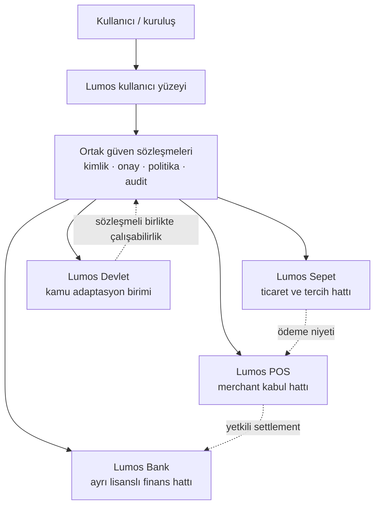

# Lumos Kurumsal Hizmet Hatları — Foundation ve Olasılık Modeli

| Alan | Değer |
|------|-------|
| Durum | **Karar destek — foundation**; uygulama bekliyor |
| Tarih | 2026-07-13 |
| Hedef | Lumos Bank · Lumos Sepet · Lumos POS · Lumos Devlet için sistemli kuruluş, aşama ve risk çerçevesi |
| Canonical karar | [`ADR-015`](../decisions/ADR-015-regulated-service-entity-boundaries.md) |
| Üst sınır | [`lumos-karar-sozlesmesi.md`](../lumos-karar-sozlesmesi.md), [`payment-scope-decision.md`](../memory/payment-scope-decision.md) |

## 1. Niyet

Bu yapı dört adı aynı uygulamanın menüleri olarak değil, ayrı sorumluluk ve denetim alanları olarak ele alır. Kullanıcı deneyimi Lumos'ta tutarlı kalabilir; fakat para, merchant operasyonu, ticaret tercihi ve kamu verisi aynı yetki veya veri havuzuna girmez.

## 2. Kuruluş topolojisi



Kesikli oklar otomatik yetki aktarımı değildir. Her geçiş yeni kapsam, politika ve açık onay değerlendirmesi gerektirir.

## 3. Sorumluluk matrisi

| Alan | Sahip olduğu bağlam | Sahip olmadığı bağlam | İlk güvenli çıktı |
|------|---------------------|-----------------------|------------------|
| Lumos Bank | Lisans sonrası finansal hesap/işlem sorumluluğu | Sepet kataloğu, merchant cihaz yönetimi, kamu yetkisi | Lisans ve partner gereksinim haritası |
| Lumos Sepet | Ürün/hizmet seçimi, tercih, teklif ve sipariş niyeti | Para saklama, settlement, tek taraflı satın alma | Sentetik katalog + onay akışı simülasyonu |
| Lumos POS | Merchant onboarding, ödeme kabul niyeti, iade/mutabakat orkestrasyonu | Banka lisansı, kullanıcı sepet profili, kamu kimliği | Sentetik merchant sandbox sözleşmesi |
| Lumos Devlet | Kamu politika paketi, veri sınıflandırma, kurumlar arası adaptasyon | Devlet otoritesi, vatandaş adına karar, finansal yetki | Demo-safe kamu uyum kontrol listesi |

## 4. Olasılık hesabı: tahmin değil, kanıt skoru

Kanıt olmadan yüzdelik başarı tahmini üretmek yanıltıcıdır. Bunun yerine her hat için aynı **100 puanlık hazır olma skoru** kullanılır:

| Boyut | Ağırlık | Kanıt örneği |
|-------|---------|--------------|
| Hukuk/lisans/yetki | 30 | Yazılı hukuk görüşü, lisans sınıfı, yetkili partner/sözleşme |
| Güvenlik ve veri izolasyonu | 25 | Threat model, bağımsız test, veri yerleşimi ve incident planı |
| Operasyon | 20 | Sorumlu ekip, destek, mutabakat/itiraz veya kamu olay süreci |
| Partner ve teknik uygulanabilirlik | 15 | Sandbox, resmi API, SLA, geri dönüş planı |
| Kullanıcı/kamu değeri | 10 | Pilot kanıtı, erişilebilirlik ve ölçülebilir ihtiyaç |

```text
readiness_score = legal*0.30 + security*0.25 + operations*0.20
                + partner*0.15 + value*0.10
```

Her boyut 0–100 arası yalnızca belgelendirilmiş kanıtla puanlanır. Sonuç istatistiksel başarı olasılığı değildir; yatırım ve aşama kararı için karşılaştırılabilir kanıt skorudur.

| Skor | Karar sınıfı | İzin verilen seviye |
|------|--------------|---------------------|
| 0–39 | Keşif | Doküman ve sentetik sandbox |
| 40–59 | Pilot adayı | Eksik kapılar kapatılır; canlı kullanıcı/para/kamu verisi yok |
| 60–79 | Kontrollü pilot incelemesi | Sınırlı partner ve izole ortam; ayrıca insan onayı |
| 80–100 | Üretim incelemesi | Otomatik yayın değil; bağımsız hukuk/güvenlik/operasyon onayı |

### Sıfırlayan kapılar

Aşağıdaki koşullardan biri yoksa ilgili **canlı aşama skordan bağımsız olarak geçilemez**:

- Lumos Bank: gerekli lisans/yetki veya lisanslı partner sözleşmesi.
- Lumos POS: merchant/PSP hukuki modeli, settlement ve itiraz sorumlusu.
- Lumos Sepet: açık satın alma onayı, iade/iptal ve tüketici hakları akışı.
- Lumos Devlet: yetkili kamu sözleşmesi, veri sınıflandırması ve egemenlik/veri yerleşimi kararı.
- Tüm hatlar: amaç bazlı erişim, tenant izolasyonu, audit, olay müdahalesi ve geri dönüş planı.

## 5. Olasılık senaryoları

| Senaryo | Sinyal | Karar |
|---------|--------|-------|
| En iyi durum | Hukuk ve lisans yolu net; resmi partner; sandbox kanıtı; bağımsız güvenlik testi | Dar ülke/pilot paketi hazırlanır |
| Temel durum | Kullanıcı değeri net fakat lisans, partner veya veri yerleşimi eksik | Foundation + sandbox sürer; public vaat yok |
| Kötü durum | Lisans belirsiz, veri izolasyonu zayıf, partner API'si kapanıyor veya kamu yetkisi yok | Canlı hat durur; yalnız araştırma kaydı korunur |

## 6. Ülke paketi

Tek küresel varsayım yerine her ülke için sürümlü bir politika paketi gerekir:

```text
country_pack = {
  legal_authority,
  allowed_services,
  data_residency,
  identity_assurance,
  payment_and_banking_partners,
  public_sector_contract,
  language_and_accessibility,
  connectivity_and_offline_policy,
  incident_and_dispute_owner,
  effective_from,
  evidence_version
}
```

Paket kullanıcı tercihini ve Lumos önerisini sınırlar; genişletmez. Kullanıcı tercihi ülke hukukunu, kuruluş politikasını veya `SECURITY_NEVER_AUTO` sınırını aşamaz.

## 7. Uygulama sırası

1. İsim ve sorumluluk sınırlarını registry/ADR ile kilitle.
2. Dört alan için ayrı veri sınıflandırması ve threat model hazırla.
3. Sentetik sandbox sözleşmelerini birbirinden bağımsız tanımla.
4. İlk ülke için hukuk/lisans/partner kanıt paketini oluştur.
5. Yalnız sıfırlayan kapılar kapandıktan sonra kontrollü pilot kararı ver.
6. Canlı pilot sonrası skorları gerçek kanıtla güncelle; ülke çoğaltmasını ayrı karar yap.

## 8. Bu PR'ın sınırı

**Dahil:** kuruluş topolojisi, isim sınıfı, sorumluluk ayrımı, ülke paketi, kanıt skoru ve aşama kapıları.

**Dahil değil:** tüzel kişilik, ödeme/banka/PSP kodu, canlı connector, kamu sistemi bağlantısı, lisans başvurusu, production credential, web sitesi satış iddiası veya tarih/fiyat taahhüdü.
