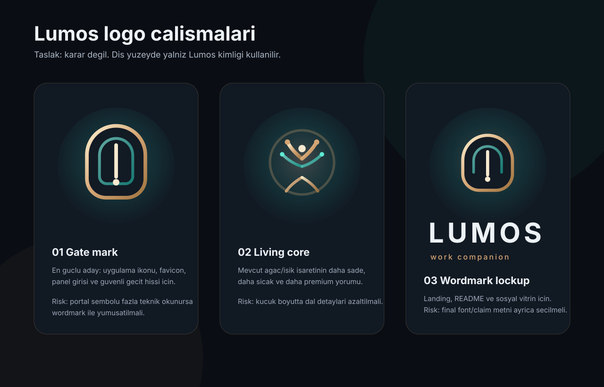

# Lumos logo calismalari — 2026-07-08

**Durum:** `draft / needs-review`  
**Kapsam:** Marka yonu ve logo adaylari. Uygulamaya baglanmadi; mevcut logo veya favicon degistirilmedi.  
**Kisit:** Dis yuzeyde yalniz **Lumos** gorunur. Kando/Cando gibi ic katman adlari marka calismasina tasinmaz.

## Cikis ilkesi

Lumos icin logo dili sakin, guven veren ve teknik detay gostermeyen bir yerde durmali. Mevcut kayitlarda skull logo `needs-review`; bu nedenle bu calismada skull birincil aday yapilmadi. Adaylar urun yuzeyi, README/landing ve sosyal vitrin icin degerlendirme taslagi olarak tutulur.

## Adaylar

| Aday | Dosya | Kullanim dusuncesi | Not |
|------|-------|--------------------|-----|
| 01 Gate mark | [`assets/lumos-logo-studies/lumos-logo-study-01-gate-mark.svg`](./assets/lumos-logo-studies/lumos-logo-study-01-gate-mark.svg) | App icon, favicon, panel girisi | En guclu birincil aday; guvenli gecit hissi verir |
| 02 Living core | [`assets/lumos-logo-studies/lumos-logo-study-02-living-core-mark.svg`](./assets/lumos-logo-studies/lumos-logo-study-02-living-core-mark.svg) | Mevcut agac/isik cizgisine devam | Kucuk boyut icin sade versiyon gerekebilir |
| 03 Wordmark lockup | [`assets/lumos-logo-studies/lumos-logo-study-03-wordmark-lockup.svg`](./assets/lumos-logo-studies/lumos-logo-study-03-wordmark-lockup.svg) | Landing, README, sosyal profil | Final font ve alt metin ayrica kararlastirilmali |

## Onizleme

## Karar bekleyenler

- Birincil yon: `Gate mark` mi, `Living core` mu?
- Wordmark: `LUMOS` buyuk harf mi, `Lumos` baslik bicimi mi?
- Skull mark: tamamen arka plana mi alinacak, yoksa opsiyonel kampanya/seri ogesi mi kalacak?
- Final paket: ikon-only, yatay lockup, ters renk, min boyut ve bosluk kurallari.

## Uygulama disi tutulanlar

- Aktif UI logo/favikon degisimi.
- Renk token degisimi.
- Dosya tasima veya mevcut asset silme.
- Kando/Cando/WeLockAI gibi ic veya cati isimleriyle gorunen logo lockup.
