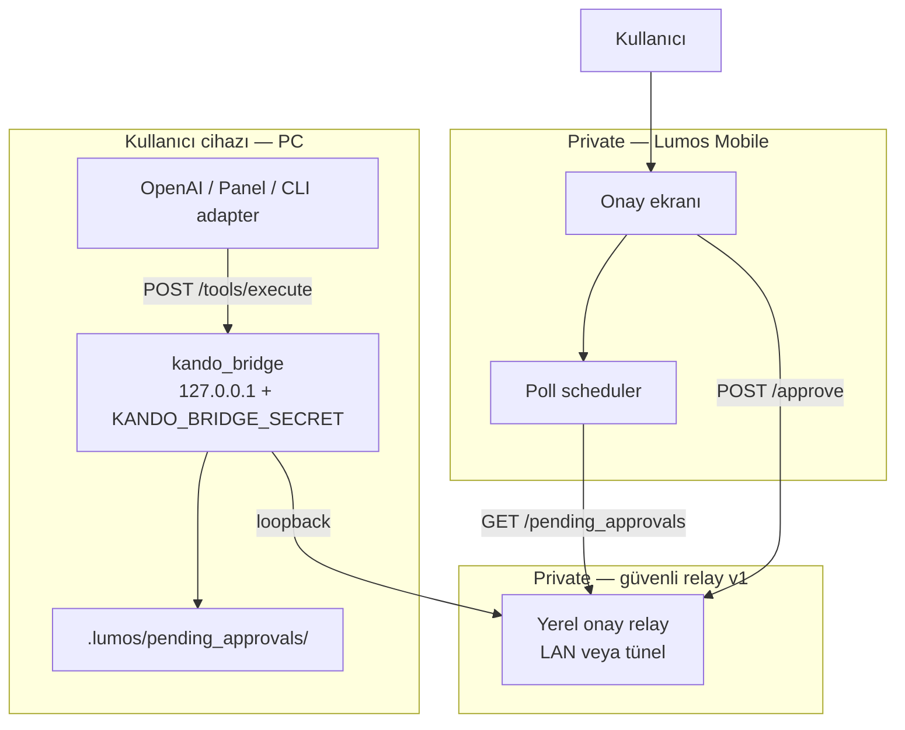
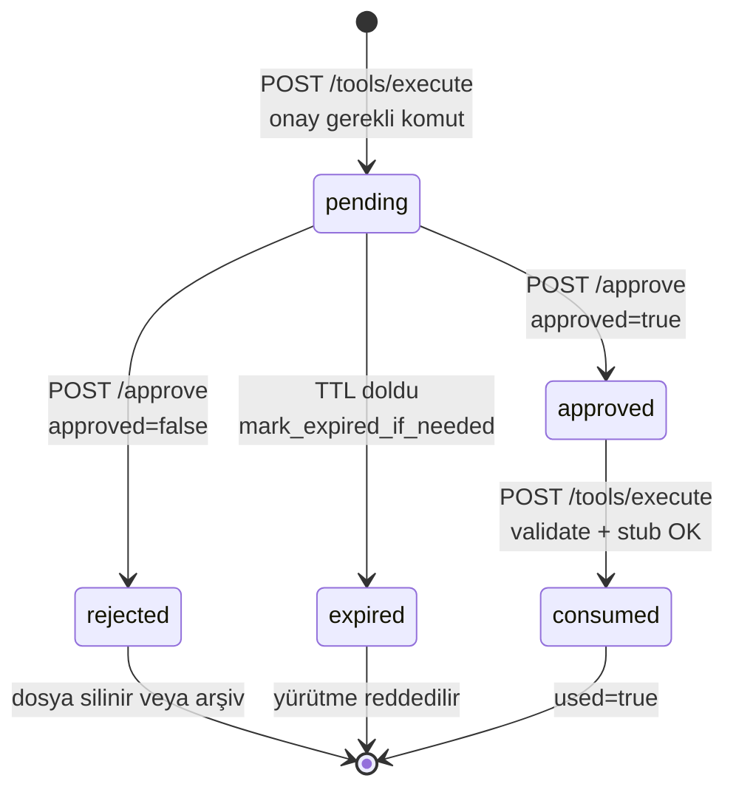
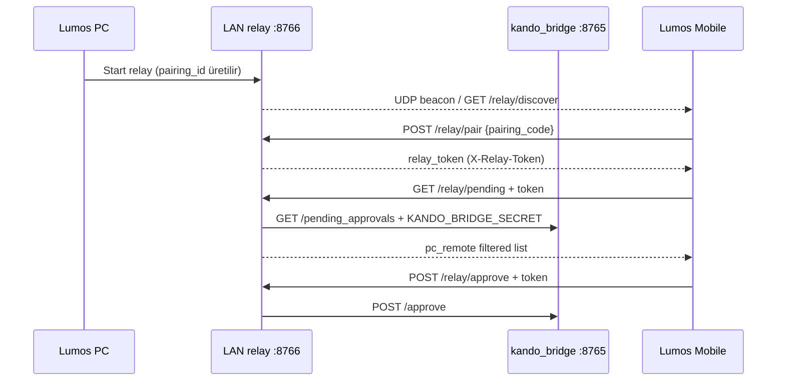

# Lumos Mobile Onay Akışı — MVP Mimari Planı

| Alan | Değer |
|------|-------|
| Durum | **Uygulama** — PR-RB-05 loopback client + PR-RB-06 LAN relay (OSS demo) |
| Tarih | 2026-06-21 |
| Önkoşul | PR #513 / **PR-RB-04** merge — PC remote pending disk sözleşmesi |
| Şema | `lumos.pc_remote_pending_approval.v1` |
| İlgili | [pc-remote-pending-approval-contract.md](pc-remote-pending-approval-contract.md), [lumos-pc-remote-bridge-plan.md](lumos-pc-remote-bridge-plan.md), [lumos-pc-remote-bridge-skeleton-verification.md](lumos-pc-remote-bridge-skeleton-verification.md), [device-connection-architecture-draft.md](device-connection-architecture-draft.md), [device-connection-information-architecture.md](device-connection-information-architecture.md), [ADR-012](../decisions/ADR-012-lumos-security-codex.md) |

---

## 1. RB-04 sonrası eksik halka

### Tamamlanan (OSS — PR-RB-04)

| Bileşen | Durum | Kanıt |
|---------|-------|-------|
| Disk sözleşmesi | ✓ | `.lumos/pending_approvals/` — `lumos.pc_remote_pending_approval.v1` |
| Pending yazımı | ✓ | `pending_approvals.py` → `write_pending_approval`, `build_pc_remote_pending_record` |
| PC remote persist | ✓ | `pc_remote_tools._persist_pending_approval` — onay gerektiren 5 komut |
| Token doğrulama | ✓ | `validate_approval_token` — `approval_granted` bayrağı tek başına yetmez |
| Tek kullanımlık tüketim | ✓ | `consume_pending_record` — stub yürütme sonrası `used=true` |
| TTL / expire | ✓ | `expires_at` (varsayılan 900s), `mark_expired_if_needed` → `status=expired` |
| CU4 shadow (opt-in) | ✓ | `attach_bridge_pending_confirmation` + `validate_bridge_confirmation` |
| Köprü HTTP uçları | ✓ | `GET /pending_approvals`, `POST /approve`, `POST /tools/execute` |
| Onay / red state | ✓ | `approve_pending_record`, `reject_pending_record` |

### Eksik halka (Mobile MVP hedefi)

| Eksik | Açıklama |
|-------|----------|
| **Mobile istemci yok** | Lumos Mobile uygulaması henüz yok; poll + onay UI tasarlanacak |
| **Loopback erişim köprüsü** | `kando_bridge` yalnızca `127.0.0.1` — telefon doğrudan köprüye bağlanamaz |
| **Güvenli taşıma kanalı** | Mobile ↔ PC arasında şifreli, kimlik doğrulamalı relay/tünel (private katman) |
| **Cihaz eşleştirme** | Multi-device registry, pairing protokolü, QR/kod akışı tanımlı değil |
| **Push bildirimi** | FCM/APNs entegrasyonu yok; anlık uyarı kanalı yok |
| **GET yanıt sözleşmesi (Mobile)** | `build_pending_approvals_list` legacy `/task` + PC remote karışık liste döner; Mobile için `source=pc_remote` filtresi ve alan alt kümesi netleştirilmeli |
| **Audit / rate limit** | PC remote yolunda audit log ve flood koruması plan dışı kaldı |

**Özet:** RB-04, onay **verisini** ve **köprü API'sini** hazırladı. Eksik parça, bu API'ye **güvenli kanaldan** ulaşan bir Mobile onay yüzeyidir.

---

## 2. MVP mimari özeti

Lumos Mobile onay MVP'si, mevcut köprü uçlarını **yeniden icat etmeden** tüketen ince bir istemci + güvenli yerel relay katmanından oluşur. Model veya panel bir PC remote komutu tetikler → köprü diske pending yazar → Mobile periyodik poll ile listeler → kullanıcı onaylar/reddeder → köprü durumu günceller → (isteğe bağlı) orijinal adapter `POST /tools/execute` ile onaylı stub yürütür.



**Bileşen sorumlulukları:**

| Bileşen | Katman | Rol |
|---------|--------|-----|
| `kando_bridge` | OSS | Pending CRUD, onay kapısı, stub yürütme |
| `.lumos/pending_approvals/` | OSS sözleşme | Tek kaynak (source of truth) |
| Yerel onay relay | **Private** | Loopback secret'ı Mobile'a taşımadan, kimlik doğrulamalı HTTP proxy |
| Lumos Mobile app | **Private** | Poll, onay/red UI, kullanıcı rızası |
| Panel (alternatif v1) | OSS | Aynı uçları kullanan geçici onay yüzeyi — Mobile gelene kadar |

---

## 3. Pending taşıma modeli

### Seçenekler

| Model | Avantaj | Dezavantaj | v1 uygunluk |
|-------|---------|------------|-------------|
| **Poll** | Mevcut `GET /pending_approvals` hazır; push altyapısı gerekmez; ADR-012 loopback modeli korunur | Gecikme (interval); pil tüketimi; relay gerekir | **Önerilen** |
| **Push (FCM/APNs)** | Anlık bildirim; kullanıcı deneyimi | Backend, device token, pairing, prod operasyon — public sınır dışı | v1 **hayır** |
| **Hybrid** | Poll + push birleşimi | Her iki sistemin karmaşıklığı | v2+ |

### v1 önerisi: **Poll-first (hybrid değil)**

1. Mobile (veya geçici panel istemcisi) relay üzerinden `GET /pending_approvals` veya `GET /pending-approvals` çağırır.
2. Yanıt içinden `source=pc_remote` ve `status=pending` kayıtları filtrelenir.
3. Poll aralığı: **foreground 3–5s**, **background 15–30s** (Mobile uygulama politikası — private katman kararı).
4. Yeni pending algılandığında yerel bildirim (OS notification, push servisi olmadan) opsiyonel — uygulama açıkken yeterli MVP.

**Neden poll:** RB-04 köprü uçlarını tam olarak poll modeline göre tasarladı. Loopback + secret modelinde Mobile doğrudan köprüye bağlanamaz; relay kurulduktan sonra poll en düşük riskli yol. Push, pairing ve operasyonel backend gerektirir — MVP kapsamı dışı.

### Soru 1 yanıtı — Pending approval kayıtları mobile nasıl taşınacak?

**Taşıma yolu:** PC diskindeki `.lumos/pending_approvals/*.json` → köprü `build_pending_approvals_list()` → `GET /pending_approvals` JSON dizisi → **güvenli relay** → Mobile poll.

**Taşınmayan:** Ham disk dosyası Mobile'a sync edilmez; yalnızca köprünün ürettiği API kayıtları taşınır. `KANDO_BRIDGE_SECRET` Mobile'a **asla** yazılmaz — relay, PC tarafında loopback'e proxy yapar ve Mobile'a ayrı kısa ömürlü oturum kimliği verir (private katman).

---

## 4. Token format spesifikasyonu

Mevcut sözleşme ile **birebir hizalı**; MVP'de format değiştirilmez.

### Alan tanımı

| Alan | Format | Not |
|------|--------|-----|
| `approval_token` | `secrets.token_hex(16)` → **32 karakter hex** (128 bit) | Tahmin edilemez; CSPRNG |
| `approval_id` | `pc_remote_<unix_ms>` | Dosya adı kökü |
| `approval_file` | `.lumos/pending_approvals/<approval_id>.json` | `POST /approve` için |
| `expires_at` | ISO-8601 UTC | Varsayılan TTL 900s |

### Doğrulama kuralları (değişmez)

1. **Oluşturma:** Pending yazılırken token yalnızca JSON dosyasında ve ilk `pending_approval` yanıtında.
2. **Onay (`POST /approve`):** `approval_file` (veya legacy `task_id`) + `approval_token` zorunlu; birebir eşleşme; `used=false`; süre dolmamış.
3. **Yürütme (`POST /tools/execute`):** `approval_token` + `approval_id`; disk kaydı `status=approved`, token eşleşmesi, `used=false`, `expires_at` geçmemiş.
4. **Tüketim:** Başarılı yürütme → `used=true`, `consumed_at`.

### HMAC / imza — v1 gerekli mi?

**Hayır.** MVP'de token zaten yüksek entropili tek kullanımlık sır; ek HMAC katmanı relay + HTTPS/TLS ile birlikte v1'de gereksiz karmaşıklık. Gerekçe:

- Token, pending JSON'da PC diskinde durur; doğrulama köprüde yapılır.
- Mobile, onay anında token'ı relay'e iletir; kanal TLS + relay oturum auth ile korunur.
- v2'de uzaktan relay veya offline onay gerekirse `approval_token` yerine veya yanında **imzalı onay intent** (`Ed25519`, `DeviceIdentity` hizası) değerlendirilebilir — **açık karar**, MVP dışı.

### Soru 2 yanıtı — Approval token formatı nasıl olacak?

**32 hex karakter**, `approval_id` ile eşleştirilmiş, disk-backed, TTL'li, tek kullanımlık token. Mevcut `pc-remote-pending-approval-contract.md` spesifikasyonu MVP'nin tek kaynağıdır; Mobile yalnızca taşır ve `POST /approve` / `POST /tools/execute` gövdelerine yerleştirir.

---

## 5. Onay / Red state machine

### Durum geçişleri



### Durum tablosu

| Durum | Anlam | Mobile UI | Köprü davranışı |
|-------|-------|-----------|-----------------|
| `pending` | Kullanıcı kararı bekleniyor | Onayla / Reddet göster | Listede görünür |
| `approved` | Kullanıcı onayladı; yürütme bekliyor | «Onaylandı — PC'de uygulanacak» | `POST /tools/execute` kabul eder |
| `rejected` | Kullanıcı reddetti | «Reddedildi» | Yürütme reddedilir; dosya silinebilir |
| `expired` | TTL doldu | «Süre doldu» | Token geçersiz |
| `used=true` | Yürütüldü | «Tamamlandı» | Replay engellenir |

### API akışı (yeniden kullanılan köprü uçları)

```
[A] Pending oluşumu
POST /tools/execute
  Headers: X-Kando-Token: <KANDO_BRIDGE_SECRET>
  Body: { "command": "pc_open_url", "arguments": { "url": "https://..." } }
  → status: pending_approval
  → approval_id, approval_file, approval_token, expires_at

[B] Mobile poll
GET /pending_approvals
  Headers: X-Kando-Token (relay üzerinden)
  → [ { approval_id, command, status, risk_level, required_user_action, ... } ]

[C] Onay
POST /approve
  Body: {
    "approval_file": ".lumos/pending_approvals/pc_remote_1735123456789.json",
    "approval_token": "<32-hex>",
    "approved": true
  }
  → accepted: true, pc_remote_approval: { status: "approved", ... }

[D] Red
POST /approve
  Body: { "approval_file": "...", "approval_token": "...", "approved": false }
  → accepted: true, closed: true, applied: false
  → (PC remote) dosya silinir

[E] Stub yürütme (adapter / panel)
POST /tools/execute
  Body: {
    "command": "pc_open_url",
    "arguments": { "url": "https://..." },
    "approval_id": "pc_remote_...",
    "approval_token": "<32-hex>"
  }
  → status: stub, used consumed
```

**CU4 shadow (opt-in):** `LUMOS_CONFIRMATION_ENABLED=true` iken `[C]` adımında `validate_bridge_confirmation` çalışır; Mobile bu bayrağı yönetmez.

### Soru 3 yanıtı — Onay / Red akışı nasıl işleyecek?

Kullanıcı Mobile'da pending kartını görür → **Onayla** → `POST /approve` (`approved: true`) → köprü `status=approved` yazar → orijinal istemci (panel/CLI) aynı token ile `POST /tools/execute` çağırır → stub yürütülür → `used=true`. **Reddet** → `POST /approve` (`approved: false`) → `status=rejected`, dosya silinir, yürütme yok. Otomatik yeniden deneme yok.

---

## 6. Push notification değerlendirmesi

### v1 kararı: **Hayır**

| Kriter | Değerlendirme |
|--------|---------------|
| MVP hedefi | Onay zincirini uçtan uca doğrulamak |
| Mevcut altyapı | FCM/APNs, device token store, push backend yok |
| Public sınır | Push servisi operasyonel backend — OSS dışı |
| Alternatif | Poll (3–5s foreground) + uygulama içi liste yeterli |
| Güvenlik | Push payload'da `approval_token` taşınmamalı; push yalnızca «onay bekliyor» der — yine de backend gerekir |

**v2 adayı:** Pairing tamamlandıktan sonra «pending_count > 0» özet push; token push ile gitmez, Mobile yine poll ile detay çeker.

### Soru 4 yanıtı — İlk versiyonda push notification gerekir mi?

**Gerekmez.** Poll-first MVP, RB-04 köprü sözleşmesiyle uyumlu minimum yol. Push, private katmanda pairing + backend sonrası değerlendirilir.

---

## 7. QR eşleştirme değerlendirmesi

### v1 kararı: **Hayır**

| Kriter | Değerlendirme |
|--------|---------------|
| MVP kapsamı | Tek PC + tek Mobile; aynı güven halkasında manuel kurulum |
| Mevcut repo | QR/pairing protokolü tanımlı değil ([device-connection-architecture-draft §5](device-connection-architecture-draft.md)) |
| Alternatif v1 | Kullanıcı, Mobile'da «PC'ye bağlan» → relay URL + tek seferlik pairing kodu (6–8 hane, ekranda gösterilir, TTL 5 dk) — QR olmadan |
| IA hedefi | QR, [device-connection-information-architecture §5.2](device-connection-information-architecture.md) yolculuğunda v2+ «Cihaz eşleştir» akışına aittir |

**Not:** QR, pairing UX'inin bir **sunum katmanı**dır; MVP'de eşleştirme protokolü olmadan QR anlamsız. İlk relay kurulumu: panel veya CLI'dan gösterilen **tek seferlik kod** yeterli.

### Soru 5 yanıtı — QR eşleştirme gerekir mi?

**v1'de gerekmez.** Manuel / tek seferlik kod ile relay eşleştirmesi yeterli. QR, eşleştirme protokolü oturduktan sonra UX iyileştirmesi olarak eklenir.

---

## 8. Minimum güvenli MVP kapsamı

### Soru 6 yanıtı — Minimum güvenli MVP nedir?

**Tanım:** Kullanıcı, Mobile (veya geçici panel) üzerinden PC remote pending kaydını görür, onaylar veya reddeder; onay yalnızca geçerli `approval_token` + disk `status=approved` ile stub yürütmeye izin verir; credential exfil ve otomatik yüksek risk yürütme yok.

### Kapsam tablosu

| Konu | v1 MVP — **dahil** | v1 MVP — **hariç** |
|------|-------------------|-------------------|
| Pending disk sözleşmesi | ✓ (RB-04 tamam) | — |
| `GET /pending_approvals` poll | ✓ | — |
| `POST /approve` onay/red | ✓ | — |
| Token doğrulama + TTL + `used` | ✓ | — |
| CU4 shadow (opt-in) | ✓ mevcut wire | Zorunlu enforcement |
| Lumos Mobile uygulama iskeleti | ✓ private | OSS repo |
| Yerel onay relay (TLS + oturum) | ✓ private | `0.0.0.0` köprü bind |
| Panel fallback onay UI | ✓ opsiyonel OSS | — |
| Push (FCM/APNs) | — | ✓ |
| QR pairing | — | ✓ |
| Multi-device registry | — | ✓ |
| Gerçek OS otomasyonu | — | ✓ (stub only) |
| Uzaktan internet tüneli | — | ✓ (yalnızca LAN/localhost relay) |
| Rate limit / audit log | — | ✓ (sonraki PR) |
| `approval_token` HMAC | — | ✓ |

### ADR-012 / güvenlik checklist

- [x] Köprü **yalnızca loopback** — Mobile doğrudan bind genişletilmez
- [x] `KANDO_BRIDGE_SECRET` Mobile'a **taşınmaz** — relay ayrı oturum
- [x] **Credential exfil yok** — yanıtlarda keystore/passphrase/API key yok
- [x] `SECURITY_NEVER_AUTO` otomatik değil
- [x] Onay **açık kullanıcı eylemi** — sessiz otomasyon yok
- [x] Red → otomatik yeniden deneme yok
- [x] Stub-only OSS — gerçek device control private

### MVP one-liner

> **Poll-based Mobile onay istemcisi, güvenli yerel relay üzerinden mevcut `GET /pending_approvals` + `POST /approve` uçlarını tüketir; token disk sözleşmesi RB-04 ile aynı kalır.**

---

## 9. Uygulama PR planı

Küçük, tek sorumluluklu PR'lar. RB-04 OSS'te kapandı; Mobile hattı **private ağırlıklı** devam eder.

| PR | Başlık | Katman | İçerik | Bağımlılık |
|----|--------|--------|--------|------------|
| **PR-RB-05** | Mobile poll sözleşmesi + liste filtresi | OSS | ✓ Uygulandı — `source=pc_remote` filtresi, demo client, e2e testler | RB-04 ✓ |
| **PR-RB-06** | Onay relay iskeleti | OSS demo | ✓ Uygulandı — `lan_relay.py`, UDP beacon, pairing token (TLS v2); bridge secret PC'de kalır | RB-05 ✓ |
| **PR-RB-07** | Mobile onay ekranı MVP | **Private** | Pending liste, detay, Onayla/Reddet, poll scheduler, hata durumları | RB-06 |
| **PR-RB-08** | Panel geçici onay kartı (opsiyonel) | OSS | Mobile gelene kadar panelden aynı uçlar; «PC remote onay bekliyor» kartı | RB-05 |
| **PR-RB-09** | E2E doğrulama + runbook | OSS docs | Poll → approve → execute stub zinciri; pytest entegrasyon senaryosu | RB-05, RB-07 |
| **PR-RB-10** | Audit + rate limit (dar) | OSS | `/tools/execute` + `/approve` için minimal audit metadata | RB-09 |
| **PR-RB-11+** | Push, QR, multi-device | **Private** | v2 — pairing protokolü oturduktan sonra | RB-07 |

**OSS PR disiplini:** Her OSS PR'da public boundary review — device control, prod auth, operasyonel backend **commitlenmez**.

---

## 10. Public vs private katman

| Öğe | Public OSS (`lumos-core`) | Private / professional |
|-----|---------------------------|------------------------|
| `pending_approvals.py` sözleşmesi | ✓ | — |
| `GET /pending_approvals`, `POST /approve`, `POST /tools/execute` | ✓ | — |
| PC remote stub executor | ✓ | Gerçek OS executor swap |
| Pending JSON şeması dokümantasyonu | ✓ | — |
| `confirmation_policy` CU4 shadow | ✓ (opt-in) | Zorunlu prod enforcement |
| Lumos Mobile uygulaması | — | ✓ |
| Onay relay / TLS proxy | — | ✓ |
| Pairing (QR, kod, registry) | — | ✓ |
| Push notification backend | — | ✓ |
| FCM/APNs device token | — | ✓ |
| Uzaktan internet erişimi | — | ✓ |
| Panel geçici onay UI | ✓ (opsiyonel demo) | — |

**Kural:** Public repoda Mobile wire **implementasyonu** yok; yalnızca köprü uçları, disk sözleşmesi ve bu plan belgesi. Mobile MVP **private repoda** veya ayrı uygulama deposunda geliştirilir.

---

## 11. Açık kararlar / varsayımlar

### Varsayımlar

1. Lumos Mobile uygulaması **henüz yok** — bu plan, uygulama geliştirildiğinde tüketilecek sözleşmedir.
2. v1 «bağlı cihaz» = **aynı LAN / aynı kullanıcı**; internet üzerinden uzaktan onay MVP dışı.
3. Onay yürütmesini (`POST /tools/execute`) Mobile değil, **orijinal adapter** (panel/CLI) tetikler — Mobile yalnızca onay/red kararı verir. *(Alternatif: Mobile onay sonrası relay execute — açık karar D2.)*
4. Poll yanıtında `approval_token` kalır — kanal TLS + relay auth ile korunur; token push ile taşınmaz.
5. Legacy `/task` pending kayıtları ile PC remote kayıtları aynı dizini paylaşır; Mobile `source=pc_remote` ile filtreler.

### Açık kararlar

| # | Konu | Seçenekler | MVP önerisi |
|---|------|------------|-------------|
| D1 | Relay kimlik modeli | Tek seferlik kod / mutual TLS / DeviceIdentity imza | Tek seferlik kod + TLS (v1) |
| D2 | Execute tetikleyici | Adapter poll vs Mobile execute | **Adapter poll** — Mobile sadece approve |
| D3 | GET filtre | Query param `?source=pc_remote` vs istemci filtresi | OSS query param (PR-RB-05) |
| D4 | Red sonrası dosya | Sil vs `rejected` arşiv | Mevcut: sil — koru |
| D5 | Panel fallback | PR-RB-08 şimdi vs Mobile sonrası | Mobile gecikirse panel kartı |
| D6 | Foreground poll aralığı | 3s vs 5s | 5s (MVP); ayarlanabilir private |
| D7 | v2 push scope | Sadece «pending var» vs komut özeti | Sadece «pending var» — token asla push'ta değil |

---

## Kullanıcı soruları — özet cevaplar

| # | Soru | MVP cevabı |
|---|------|------------|
| 1 | Pending mobile nasıl taşınır? | Poll: disk → `GET /pending_approvals` → güvenli relay → Mobile |
| 2 | Token formatı? | `secrets.token_hex(16)` — 32 hex, TTL, tek kullanımlık; HMAC v1 yok |
| 3 | Onay/Red akışı? | `pending` → `POST /approve` → `approved`/`rejected` → execute + `used` |
| 4 | Push gerekir mi? | **Hayır** (v1) |
| 5 | QR gerekir mi? | **Hayır** (v1) |
| 6 | Minimum güvenli MVP? | Poll + relay + approve uçları; stub-only; loopback+secret; no exfil |

---

## Referanslar

| Kaynak | İçerik |
|--------|--------|
| `packages/kando_bridge/src/kando_bridge/pending_approvals.py` | Disk sözleşmesi, token doğrulama |
| `packages/kando_bridge/src/kando_bridge/pc_remote_tools.py` | Pending persist, approve handler |
| `packages/kando_bridge/src/kando_bridge/server.py` | HTTP uçları |
| `docs/analysis/pc-remote-pending-approval-contract.md` | RB-04 sözleşme |
| `docs/decisions/ADR-012-lumos-security-codex.md` | Güvenlik codex |

---

*Son güncelleme: 2026-06-22 — MVP plan + PR-RB-05/06 uygulama notları*

---

## PR-RB-05 — Uygulandı (OSS demo client)

| Alan | Değer |
|------|-------|
| Durum | **Uygulandı** — poll tabanlı demo istemci |
| Modül | `packages/kando_bridge/src/kando_bridge/mobile_approval_client.py` |
| CLI | `scripts/mobile_approval_cli.py` |
| Test | `tests/test_mobile_approval_mvp_e2e.py` |

### Köprü filtresi

`GET /pending_approvals?source=pc_remote` — legacy `/task` pending kayıtlarını hariç tutar. Yanıt kayıtlarında `source`, `schema_version`, `command` alanları döner.

### Demo akışı (3 terminal)

**Terminal 1 — köprü:**

```bash
export KANDO_BRIDGE_SECRET='test123'
./scripts/bridge_start.sh
```

**Terminal 2 — PC adapter pending oluşturur:**

```bash
export KANDO_BRIDGE_SECRET='test123'
curl -s -X POST http://127.0.0.1:8765/tools/execute \
  -H "Content-Type: application/json" \
  -H "X-Kando-Token: $KANDO_BRIDGE_SECRET" \
  -d '{"command":"pc_open_url","arguments":{"url":"https://example.com"}}'
```

Yanıttaki `approval_id`, `approval_token`, `approval_file` değerlerini not edin.

**Terminal 3 — demo mobile client poll + onay:**

```bash
export KANDO_BRIDGE_SECRET='test123'
python scripts/mobile_approval_cli.py list-pending
python scripts/mobile_approval_cli.py approve <approval_id> --token <approval_token>
```

**Terminal 2 — onaylı stub yürütme:**

```bash
curl -s -X POST http://127.0.0.1:8765/tools/execute \
  -H "Content-Type: application/json" \
  -H "X-Kando-Token: $KANDO_BRIDGE_SECRET" \
  -d '{"command":"pc_open_url","arguments":{"url":"https://example.com"},"approval_id":"<approval_id>","approval_token":"<approval_token>"}'
```

Beklenen: `"status":"stub"`, disk kaydında `used:true`. Gerçek OS URL açma yok (stub only).

### Sınırlar (loopback demo)

- Push ve QR yok — doğrudan loopback poll (PR-RB-05 demo).
- `KANDO_BRIDGE_SECRET` yalnızca loopback demo istemcisinde; prod Mobile secret taşımaz.
- Aynı LAN relay akışı için bkz. **PR-RB-06** aşağıda.

---

## PR-RB-06 — LAN relay MVP ✅

**Durum:** Uygulandı (`feat/pr-rb-06-lan-relay`)

### Bileşenler

| Bileşen | Yol |
|---------|-----|
| LAN relay modülü | `packages/kando_bridge/src/kando_bridge/lan_relay.py` |
| Relay sunucu script | `scripts/lan_relay_server.py` |
| Mobile CLI | `packages/kando_bridge/src/kando_bridge/mobile_approval_client.py` |
| E2E testler | `tests/test_lan_relay_mvp_e2e.py` (relay); `tests/test_mobile_approval_mvp_e2e.py` (loopback client) |

### Portlar

| Servis | Varsayılan | Not |
|--------|------------|-----|
| kando_bridge | `127.0.0.1:8765` | Loopback; `KANDO_BRIDGE_SECRET` |
| LAN relay HTTP | `0.0.0.0:8766` | Mobile erişimi; bridge secret **expose edilmez** |
| UDP beacon | `8767` | `pairing_id`, `relay_port`, `pc_name` only |

### Keşif ve eşleştirme akışı



1. **Keşif:** Mobile `GET /relay/discover` veya UDP beacon dinler (`pairing_id`, `relay_port`, `pc_name`). Bridge secret beacon'da **yok**.
2. **Eşleştirme:** Mobile `POST /relay/pair` ile 6 karakter `pairing_code` gönderir (≈10 dk TTL). Yanıt: `relay_token`.
3. **Kimlik doğrulama:** Korunan uçlar `X-Relay-Token` ister (`discover` / beacon hariç).
4. **Onay:** `GET /relay/pending` → köprüden `pc_remote` kayıtları filtrelenir. `POST /relay/approve` veya `/relay/reject` → köprü `/approve` proxy.

### Demo komutları (LAN)

**PC (terminal 1 — köprü):**

```bash
export KANDO_BRIDGE_SECRET='your-local-dev-secret'
PYTHONPATH=src:packages/kando_runtime/src:packages/kando_bridge/src \
  python -m kando_bridge --host 127.0.0.1 --port 8765
```

**PC (terminal 2 — relay):**

```bash
export KANDO_BRIDGE_SECRET='your-local-dev-secret'
PYTHONPATH=packages/kando_bridge/src python scripts/lan_relay_server.py \
  --host 0.0.0.0 --port 8766
```

Terminalde görünen `pairing=XXXXXX` kodunu not edin.

**PC — örnek pending oluştur (stub):**

```bash
curl -s -X POST http://127.0.0.1:8765/tools/execute \
  -H "Content-Type: application/json" \
  -H "X-Kando-Token: $KANDO_BRIDGE_SECRET" \
  -d '{"command":"pc_open_app","arguments":{"app_name":"Safari"}}'
```

**Mobile / ikinci makine (aynı LAN):**

```bash
export PYTHONPATH=packages/kando_bridge/src
RELAY=http://192.168.x.x:8766   # PC LAN IP

python -m kando_bridge.mobile_approval_client discover --relay-url "$RELAY"
python -m kando_bridge.mobile_approval_client pair ABCDEF --relay-url "$RELAY" --save-token
export LUMOS_RELAY_TOKEN='…'    # pair çıktısından

python -m kando_bridge.mobile_approval_client pending --relay-url "$RELAY"
python -m kando_bridge.mobile_approval_client approve --relay-url "$RELAY" \
  --approval-file '.lumos/pending_approvals/pc_remote_….json' \
  --approval-token '…'
```

UDP beacon ile keşif:

```bash
python -m kando_bridge.mobile_approval_client discover --beacon
```

### Güvenlik (demo MVP)

- `KANDO_BRIDGE_SECRET` yalnızca PC loopback köprüsünde kalır.
- Mobile yalnızca süre sınırlı `relay_token` alır.
- Eşleştirme kodu ~10 dk sonra geçersiz olur.
- Stub only: gerçek uygulama açma / OS kontrolü yok.

### Test

```bash
PYTHONPATH=src:packages/kando_runtime/src:packages/kando_bridge/src \
  KANDO_MOCK=1 pytest -q tests/test_lan_relay_mvp_e2e.py tests/test_mobile_approval_mvp_e2e.py
```

---

## Sonraki adımlar (kapsam dışı)

- Push bildirimleri
- QR eşleştirme
- Gerçek OS executor (private katman)
- mDNS / Bonjour (UDP beacon yerine)
