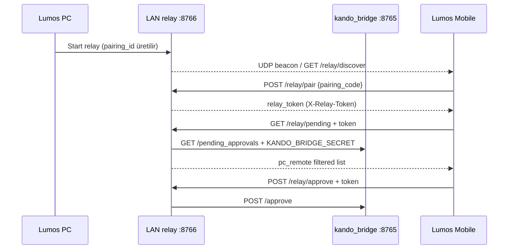

# Lumos Mobile Approval MVP Plan

| Alan | Değer |
|------|-------|
| Durum | **Uygulama** — PR-RB-06 LAN relay MVP |
| Tarih | 2026-06-21 |
| Kapsam | PC ↔ Mobile onay taşıma (demo-safe, public OSS) |

## Amaç

Aynı LAN üzerinde Lumos PC (loopback köprü) ile Lumos Mobile arasında **minimum çalışan relay katmanı**: keşif, eşleştirme kimliği, onay listesi ve approve/reject iletimi. Gerçek OS otomasyonu ve push bildirimi **yok**.

---

## PR-RB-06 — LAN relay MVP ✅

**Durum:** Uygulandı (`feat/pr-rb-06-lan-relay`)

### Bileşenler

| Bileşen | Yol |
|---------|-----|
| LAN relay modülü | `packages/kando_bridge/src/kando_bridge/lan_relay.py` |
| Relay sunucu script | `scripts/lan_relay_server.py` |
| Mobile CLI | `packages/kando_bridge/src/kando_bridge/mobile_approval_client.py` |
| E2E testler | `tests/test_lan_relay_mvp_e2e.py`, `tests/test_mobile_approval_mvp_e2e.py` |

### Portlar

| Servis | Varsayılan | Not |
|--------|------------|-----|
| kando_bridge | `127.0.0.1:8765` | Loopback; `KANDO_BRIDGE_SECRET` |
| LAN relay HTTP | `0.0.0.0:8766` | Mobile erişimi; bridge secret **expose edilmez** |
| UDP beacon | `8767` | `pairing_id`, `relay_port`, `pc_name` only |

### Keşif ve eşleştirme akışı



1. **Keşif:** Mobile `GET /relay/discover` veya UDP beacon dinler (`pairing_id`, `relay_port`, `pc_name`). Bridge secret beacon'da **yok**.
2. **Eşleştirme:** Mobile `POST /relay/pair` ile 6 karakter `pairing_code` gönderir (≈10 dk TTL). Yanıt: `relay_token`.
3. **Kimlik doğrulama:** Korunan uçlar `X-Relay-Token` ister (`discover` / beacon hariç).
4. **Onay:** `GET /relay/pending` → köprüden `pc_remote` kayıtları filtrelenir. `POST /relay/approve` veya `/relay/reject` → köprü `/approve` proxy.

### Demo komutları (LAN)

**PC (terminal 1 — köprü):**

```bash
export KANDO_BRIDGE_SECRET='your-local-dev-secret'
PYTHONPATH=src:packages/kando_runtime/src:packages/kando_bridge/src \
  python -m kando_bridge --host 127.0.0.1 --port 8765
```

**PC (terminal 2 — relay):**

```bash
export KANDO_BRIDGE_SECRET='your-local-dev-secret'
PYTHONPATH=packages/kando_bridge/src python scripts/lan_relay_server.py \
  --host 0.0.0.0 --port 8766
```

Terminalde görünen `pairing=XXXXXX` kodunu not edin.

**PC — örnek pending oluştur (stub):**

```bash
curl -s -X POST http://127.0.0.1:8765/tools/execute \
  -H "Content-Type: application/json" \
  -H "X-Kando-Token: $KANDO_BRIDGE_SECRET" \
  -d '{"command":"pc_open_app","arguments":{"app_name":"Safari"}}'
```

**Mobile / ikinci makine (aynı LAN):**

```bash
export PYTHONPATH=packages/kando_bridge/src
RELAY=http://192.168.x.x:8766   # PC LAN IP

python -m kando_bridge.mobile_approval_client discover --relay-url "$RELAY"
python -m kando_bridge.mobile_approval_client pair ABCDEF --relay-url "$RELAY" --save-token
export LUMOS_RELAY_TOKEN='…'    # pair çıktısından

python -m kando_bridge.mobile_approval_client pending --relay-url "$RELAY"
python -m kando_bridge.mobile_approval_client approve --relay-url "$RELAY" \
  --approval-file '.lumos/pending_approvals/pc_remote_….json' \
  --approval-token '…'
```

UDP beacon ile keşif:

```bash
python -m kando_bridge.mobile_approval_client discover --beacon
```

### Güvenlik (demo MVP)

- `KANDO_BRIDGE_SECRET` yalnızca PC loopback köprüsünde kalır.
- Mobile yalnızca süre sınırlı `relay_token` alır.
- Eşleştirme kodu ~10 dk sonra geçersiz olur.
- Stub only: gerçek uygulama açma / OS kontrolü yok.

### Test

```bash
PYTHONPATH=src:packages/kando_runtime/src:packages/kando_bridge/src \
  KANDO_MOCK=1 pytest -q tests/test_lan_relay_mvp_e2e.py tests/test_mobile_approval_mvp_e2e.py
```

---

## Sonraki adımlar (kapsam dışı)

- Push bildirimleri
- QR eşleştirme
- Gerçek OS executor (private katman)
- mDNS / Bonjour (UDP beacon yerine)
