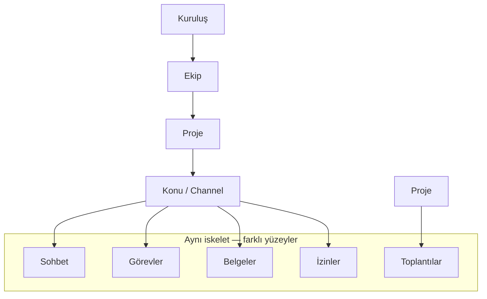
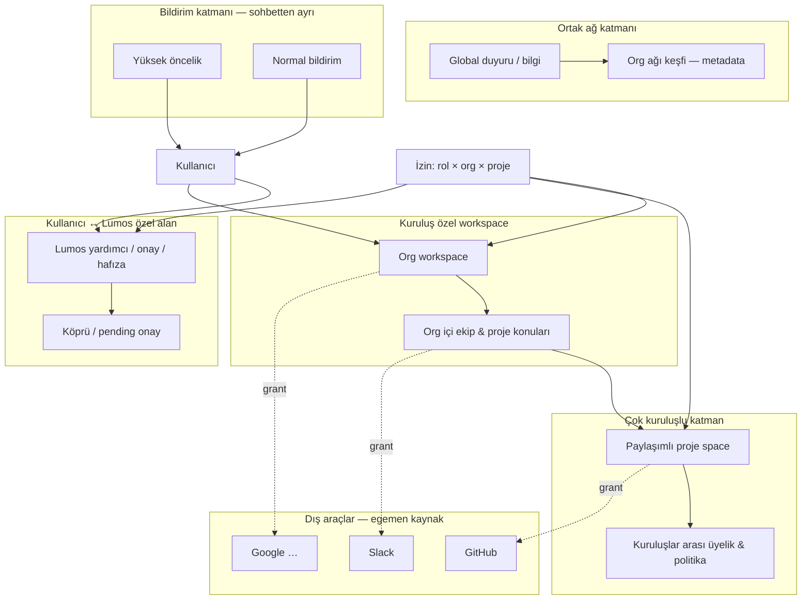

# Lumos Kuruluş Modeli (Taslak)

| Alan | Değer |
|------|-------|
| Durum | **Mimari foundation taslak** — kod yok; karar destek belgesi |
| Tarih | 2026-06-26 |
| Kapsam | Gelecek kuruluş ağı modeli; Slack kanal adları değil, hiyerarşik org yapısı |
| İlgili | [`lumos-approved-naming-registry.md`](./lumos-approved-naming-registry.md), [`welockai-charter-draft.md`](./welockai-charter-draft.md), [`welockai-trust-model-draft.md`](./welockai-trust-model-draft.md), [`device-connection-information-architecture.md`](./device-connection-information-architecture.md), [`integrations-overview.md`](../integrations-overview.md), [`public-repo-boundary.md`](../memory/public-repo-boundary.md) |

**Sınır notu:** Bu belge `lumos-core` public deposunda **yalnızca mimari foundation** olarak tutulur. Üretim çok kiracılı backend, SSO provisioning veya Slack workspace eşlemesi bu repoda **yer almaz** ([`public-repo-boundary.md`](../memory/public-repo-boundary.md)).

**İsim kaydı:** Onay gerektirmeyen (APPROVED LOCKED) ve yalnızca örnek (EXAMPLE) isimler [`lumos-approved-naming-registry.md`](./lumos-approved-naming-registry.md) dosyasında sabitlenmiştir. Bu belgedeki **Kuruluş → Ekip → Proje → Konu** terimleri registry §A.2 ile kilitlidir; kuruluş **adı** örnekleri registry §B kalıplarını kullanır (`ÖrnekKuruluş-A` vb.).

---

## 1. Amaç ve kapsam (Slack kanalları değil — org modeli)

Bu belge, Lumos ekosisteminin **gelecek kuruluş organizasyon modelini** tanımlar.

**Kapsam dışı:** Slack kanal adları, `#general` benzeri yüzey isimleri veya mevcut bir iş yeri sohbet aracının kanal listesinin birebir kopyası.

**Kapsam içi:**

- Kuruluşun **birinci sınıf nesne** (first-class object) olarak modellenmesi
- Hiyerarşik **kuruluş ağı** (organization network): kuruluşlar, ekipler, projeler ve konular arası ilişkiler
- Özel workspace, çok kuruluşlu paylaşımlı proje alanları ve ortak duyuru katmanı
- İzinlerin **kanal tabanlı değil**, rol × kuruluş × proje ilişkilerinden türetilmesi
- Sohbet, görev, belge, toplantı ve izinler için **uzun vadede aynı iskelet**

Bu taslak, [`welockai-charter-draft.md`](./welockai-charter-draft.md) ve [`welockai-trust-model-draft.md`](./welockai-trust-model-draft.md) ile uyumludur; mevcut güvenlik sözleşmesini gevşetmez.

---

## 2. Cursor notu

Aşağıdaki blok, mimari tartışma sırasında kullanıcı tarafından Cursor'a bırakılan notun **niyet korunarak** aktarımıdır.

> **Cursor note:**
>
> - Topic is future organization model, not Slack channels
> - Think **hierarchical organization network**, not channel names
> - Principles:
>   - Organization = first-class object
>   - Each org has private workspace
>   - Org ↔ Lumos private comms area separate
>   - Multi-org shared project spaces
>   - Global announcement/info channels = common network layer
>   - High-priority notifications independent from normal chat
>   - Permissions from role, org, project relationships — NOT channel-based
>   - **Structure working for 3 orgs today must scale to 300 without redesign**
>
> **Additional:**
>
> - Don't fix names — **EXAMPLE only** (registry §B): Apple/Android/Huawei are org-name illustrations, not product names; system treats any org equally (municipality, university, hospital, startup)
>
> **Hierarchy insight:**
>
> - Channel may be lowest level
> - **Organization → Team → Project → Topic (Channel)**
> - Same skeleton for chat, tasks, documents, meetings, permissions long-term

---

## 3. Temel ilkeler

Aşağıdaki ilkeler genişletilebilir karar çerçevesidir; uygulama detayı §11 açık kararlara bırakılmıştır.

### 3.1 Kuruluş birinci sınıf nesnedir

Her kuruluş (org) kendi kimliği, politikası, üyelik grafiği ve özel workspace sınırıyla tanımlanır. Kuruluş, Slack kanalı veya sohbet odası adının üstüne yapıştırılmış bir etiket değildir.

### 3.2 Her kuruluşun özel workspace'i vardır

Kuruluş içi sohbet, görev, belge ve toplantı bağlamı varsayılan olarak **kuruluş özel workspace** içinde yaşar. Dış araçlar (Slack, GitHub vb.) bu workspace'e bağlanır; workspace'in yerine geçmez ([`integrations-overview.md`](../integrations-overview.md) — araç egemenliği).

### 3.3 Kuruluş ↔ Lumos özel iletişim alanı ayrıdır

Kullanıcı–Lumos etkileşimi (yardımcı, onay, hafıza, köprü) kuruluş içi ekip sohbetinden **mantıksal olarak ayrı** bir iletişim alanıdır. Kurumsal politika (WeLockAI) ile kullanıcı onayı (Lumos) birleşik kapı oluşturur; biri diğerinin yerine geçmez ([`welockai-charter-draft.md`](./welockai-charter-draft.md) §2).

### 3.4 Çok kuruluşlu paylaşımlı proje alanları

Birden fazla kuruluşun ortak yürüttüğü işler için **paylaşımlı proje space** tanımlanır. Üyelik ve izinler proje düzeyinde kuruluşlar arası ilişkiden türetilir; tek bir kuruluşun özel workspace'ine sızmaz.

### 3.5 Global duyuru / bilgi = ortak ağ katmanı

Tüm ağa veya tanımlı alt kümeye yayılan duyuru ve bilgi akışı, kuruluş özel sohbetinden ayrı bir **ortak ağ katmanı**dır. Okuma geniş; yazma kısıtlı ve politika + onay ile hizalıdır.

### 3.6 Yüksek öncelikli bildirimler sohbetten bağımsızdır

Acil onay, güvenlik uyarısı, köprü pending, mobil onay gibi sinyaller **normal sohbet akışına gömülmez**. Bildirim kanalı ayrı teslimat ve sessize alma kurallarına sahiptir ([`device-connection-information-architecture.md`](./device-connection-information-architecture.md) — izin durumu ve cihaz katmanı ile uyumlu).

### 3.7 İzinler kanal tabanlı değil, ilişki tabanlıdır

Erişim kararı: **rol** (kullanıcı / yönetici / misafir vb.) × **kuruluş üyeliği** × **proje ilişkisi** × **WeLockAI kurumsal politika** × **Lumos onay profili** birleşiminden gelir. «Bu kanala erişimi var» tek başına yetki modeli değildir ([`welockai-trust-model-draft.md`](./welockai-trust-model-draft.md) §4).

### 3.8 Tek iskelet, çok yüzey

Kuruluş → Ekip → Proje → Konu hiyerarşisi; sohbet, görev, belge, toplantı ve izinler için **uzun vadede aynı omurgayı** taşır. Yüzey (panel, CLI, Slack, mobil) farklı render eder; canonical bağlam aynı kalır.

---

## 4. Hiyerarşi: Kuruluş → Ekip → Proje → Konu

**APPROVED LOCKED** (registry §A.2): TR **Kuruluş · Ekip · Proje · Konu** — EN **Organization · Team · Project · Topic**. Bu dört seviye adı ürün ve dokümantasyonda onay beklemeden kullanılır.

| Seviye | Tanım | Örnek bağlam (**EXAMPLE** — registry §B; sabit isim değil) |
|--------|--------|----------------------------------|
| **Kuruluş** | Yasal veya operasyonel bütün; özel workspace sahibi | *EXAMPLE tür:* belediye, üniversite, hastane, startup — *EXAMPLE ad:* `ÖrnekKuruluş-A` … `ÖrnekKuruluş-C` |
| **Ekip** | Kuruluş içi çalışma birimi; üyelik ve rol taşır | *EXAMPLE:* ürün ekibi, operasyon, araştırma grubu |
| **Proje** | Hedef, zaman ve katılımcı kümesi; tek veya çok kuruluşlu olabilir | *EXAMPLE:* ortak pilot, ürün lansmanı, araştırma grant'i |
| **Konu** | En alt bağlam; sohbet, görev dizisi veya belge koleksiyonunun yaşadığı yer | *EXAMPLE:* sprint kanalı, incident thread, spec tartışması |

**Okuma kuralı:** Yukarıdan aşağı «hangi kuruluşta → hangi ekipte → hangi projede → hangi konuda» sorusu her yüzeyde aynı şekilde cevaplanır.

**Kanal konumu:** Konu (channel), hiyerarşinin **en alt seviyesi** olabilir; üst seviyeler olmadan anlamlı izin veya arşiv politikası tanımlanmaz.



---

## 5. İletişim katmanları diyagramı

Aşağıdaki diyagram, kuruluş modelinin **iletişim katmanlarını** (Slack kanal listesi değil) gösterir.



**Katman özeti:**

| Katman | Amaç | Slack ile ilişki |
|--------|------|------------------|
| Kullanıcı ↔ Lumos özel | Onay, görev, kişisel hafıza; kurumsal sohbetten ayrı | Slack içi Lumos deneyimi bu alana bağlanır; kanal listesi değildir |
| Kuruluş özel workspace | Kurum içi varsayılan çalışma alanı | Slack workspace eşlemesi olabilir; model Slack'e indirgenmez |
| Paylaşımlı proje space | Çok kuruluşlu iş birliği | Ortak kanal değil; proje üyeliği esas |
| Ortak ağ katmanı | Duyuru, bilgi, org keşfi | Broadcast benzeri; kanal adı tasarım birimi değil |
| Bildirim katmanı | Acil / normal teslimat | Sohbet mesajı ile karıştırılmaz |

---

## 6. İzin modeli — rol / kuruluş / proje türetimi

İzin kararı **kanal adından değil**, aşağıdaki boyutların kesişiminden türetilir. Ayrıntılı rol matrisi ve onay zinciri: [`welockai-trust-model-draft.md`](./welockai-trust-model-draft.md).

### 6.1 Türetim formülü (kavramsal)

```
effective_permission =
  f( user_role,
     org_membership,
     team_membership,
     project_membership,
     welockai_tenant_policy,
     lumos_profile,
     lumos_confirmation,
     integration_grant )
```

### 6.2 Boyutlar

| Boyut | Sahip katman | Örnek |
|-------|--------------|-------|
| **Rol** | Kuruluş / proje | Üye, yönetici, misafir, denetçi |
| **Kuruluş üyeliği** | WeLockAI (private) + Lumos bağlamı | *EXAMPLE:* «Bu kullanıcı ÖrnekKuruluş-A'da aktif» |
| **Ekip üyeliği** | Kuruluş içi | Ekip düzeyi varsayılan erişim |
| **Proje ilişkisi** | Tek veya çok org | Paylaşımlı projede hangi org adına katılım |
| **Kurumsal politika** | WeLockAI | «Bu kiracıda Gmail kapalı» |
| **Lumos profili** | Lumos OSS | `rapor` / `guvenli_yurut` / `kisitli_otonom` |
| **Onay** | Lumos | İşlem bazlı confirmation; `SECURITY_NEVER_AUTO` |
| **Entegrasyon grant** | Lumos güvenli geçidi | `{platform}_read` / `_create` / `_update` / `_delete` |

### 6.3 Kanal tabanlı anti-pattern

Aşağıdakiler **hedef model değildir**:

- `#proj-x` kanalına yazma hakkı = proje yöneticisi yetkisi
- Slack kanal listesinin doğrudan izin kaynağı olması
- Kanal oluşturmanın otomatik olarak entegrasyon grant'i açması

Doğru model: proje üyeliği ve rol → hangi konularda (topic/channel) hangi eylemlerin mümkün olduğu → dış araçta hangi grant'in gerekli olduğu ([`integrations-overview.md`](../integrations-overview.md)).

### 6.4 Panel ve cihaz IA ile hizalama

[`device-connection-information-architecture.md`](./device-connection-information-architecture.md) «İzin durumu» özeti, kuruluş/proje bağlamını tek bakışta gösterecek şekilde genişletilebilir; bu taslak IA yönünü tanımlar, panel kodu içermez.

---

## 7. Ölçeklenebilirlik (3 → 300 kuruluş)

**Tasarım kısıtı:** Bugün 3 kuruluşla çalışan yapı, yeniden tasarım gerektirmeden **300 kuruluşa** ölçeklenmelidir.

| İlke | 3 org | 300 org | Uygulama notu |
|------|-------|---------|---------------|
| **Düz org listesi yok** | Az sayıda org doğrudan seçilir | Org keşfi, arama, federasyon metadata gerekir | Ortak ağ katmanı §5 |
| **İzin O(üyelik), O(kanal)** | Küçük graf hesaplanabilir | Üyelik grafiği indekslenir; kanal sayısıyla çarpılmaz | §6 türetim |
| **Workspace izolasyonu** | Manuel yönetilebilir | Kiracı sınırı katı; çapraz sızıntı yok | WeLockAI multi-tenant |
| **Paylaşımlı proje** | Elle koordine | Proje sözleşmesi ve org-on-org politika şablonları | §3.4 |
| **Duyuru fan-out** | Broadcast yeterli | Katmanlı abonelik; throttling ve öncelik | Bildirim katmanı ayrı |
| **Metadata vs içerik** | Tam bağlam taşınabilir | Özet + provenance; kaynak sistem authoritative | Charter §6 |

**Kırmızı çizgi:** Ölçek büyüdükçe «her şeyi tek global kanala» veya «her org için ayrı Slack kopyası» modeline kaymak — ikisi de bu taslağın dışındadır.

---

## 8. Generic org — örnek isimler sabitlenmez

Sistem **herhangi bir kuruluş türünü eşit** modeller. Aşağıdaki isimler **EXAMPLE** (registry §B); ürün, UI veya kodda **literal kuruluş adı** olarak sabitlenmez:

| Örnek (**EXAMPLE** — ship etme) | Gerçek kullanım |
|---------------------------------|-----------------|
| Apple / Android / Huawei | Teknoloji şirketi **tartışma örneği** — ürün adı değil |
| Belediye / üniversite / hastane / startup | Kurum **türü** örneği |
| `ÖrnekKuruluş-A`, `ÖrnekKuruluş-B`, `ÖrnekKuruluş-C` | Çok kiracılı senaryo **yer tutucu adı** (tercih edilen kalıp — registry §A.8) |
| Acme Corp, Org A | Eski jenerik demo — **yeni metinde kullanma**; `ÖrnekKuruluş-A` kullan |

**Kural:** Org tipi için hard-coded davranış yok; politika şablonları (WeLockAI) ve kullanıcı tercihleri (Lumos) ile özelleştirme yapılır. Onaylı terimler ve yasaklı örnekler: [`lumos-approved-naming-registry.md`](./lumos-approved-naming-registry.md).

---

## 9. Lumos / WeLockAI / Slack konumlandırması (charter uyumu)

[`welockai-charter-draft.md`](./welockai-charter-draft.md) ile hizalı özet:

| Aktör | Kuruluş modelindeki rol |
|-------|-------------------------|
| **WeLockAI** | Kurumsal kimlik, kiracı (tenant), org provisioning, kurumsal politika, multi-tenant orchestration, kurumsal audit |
| **Lumos** | Kullanıcıya bakan yardımcı; org/ekip/proje **bağlamında** sohbet, görev, onay; tek dış kapı (ADR-012) |
| **Slack** | Dış araç; iş yeri bağlamı ve kontrollü bildirim ([`integrations-overview.md`](../integrations-overview.md)); org modelinin kendisi değil |
| **Cursor** | Geliştirme ortamı; org modeli runtime'ı değil |

**Slack içi Lumos:** Charter'da «çalışma arkadaşı» yüzeyi olarak geçer; bu, Slack kanal adlarının org hiyerarşisini tanımlaması anlamına gelmez. Lumos, Slack'te **bağlamı** (Kuruluş → Ekip → Proje → Konu) taşır; Slack workspace **Kuruluş özel alanı** ile eşlenebilir. Ürün metninde sabit kanal adları (`#general` vb.) kullanılmaz — duyuru için **duyuru konusu** / **announcement topic** (registry §A.8). Slack workspace yapısı authoritative kaynak olabilir ama izin modeli ondan türetilmez (§6).

**Karar verme ayrımı** (charter §2): WeLockAI politika enforcement; Lumos kullanıcı onayı — org modeli her iki kapıyı da destekleyecek şekilde tasarlanır.

---

## 10. OSS vs private katman

| Kavram | Lumos OSS (`lumos-core`) | WeLockAI private |
|--------|--------------------------|------------------|
| Org hiyerarşisi sözleşmesi | Bu belge; demo-safe tipler / stub | Gerçek tenant, SSO, org graph |
| Üyelik & rol | Bağlam taşıyıcı iskelet; yerel `.lumos/` | Authoritative membership, SCIM, kurumsal dizin |
| Paylaşımlı proje | Taslak politika; test fixture | Üretim sözleşme ve billing |
| Slack / GitHub grant | Gateway, confirmation, stub connector | OAuth, webhook, enterprise SLA |
| Global duyuru ağı | Dokümantasyon; simülasyon | Üretim fan-out, compliance |
| Audit | Yerel `lumos.audit_event.v1` | Kurumsal arşiv |

**Kural:** Public repoda yalnızca foundation ve sözleşme; 300 org ölçeğindeki provisioning ve federasyon **private katmanda** yaşar ([`welockai-trust-model-draft.md`](./welockai-trust-model-draft.md) §7).

---

## 11. Açık kararlar / sonraki adımlar (docs only)

Bu bölüm yalnızca belge ve karar takibi içindir; kod veya PR içermez.

| # | Açık karar | Not |
|---|------------|-----|
| 1 | Org graph'ın authoritative kaynağı (WeLockAI vs dış IdP) | SSO charter kapsamında |
| 2 | Paylaşımlı proje space'in hukuki / veri residency sözleşmesi | Çok kuruluşlu pilot öncesi |
| 3 | Global duyuru katmanında abonelik modeli | Fan-out ve sessize alma |
| 4 | Slack workspace ↔ org workspace eşleme kuralları | Entegrasyon; kanal ≠ izin |
| 5 | Konu (channel) ile görev/board kimliği birleşimi | Tek iskelet §3.8 — UX kararı |
| 6 | Org keşfi ve federasyon metadata şeması | 300 org ölçeği |
| 7 | Break-glass kurumsal erişim | Trust model §9 ile hizalanacak |

**Önerilen docs sırası (uygulama yok):**

1. Bu belgeyi [`welockai-trust-model-draft.md`](./welockai-trust-model-draft.md) §4 matrisine org/proje boyutu ekleyecek şekilde çapraz referansla güncellemek (ayrı edit).
2. [`device-connection-information-architecture.md`](./device-connection-information-architecture.md) panel IA'sına «kuruluş bağlamı» drill-down taslağı eklemek (ayrı edit).
3. [`integrations-overview.md`](../integrations-overview.md) Slack satırına «org bağlamı, kanal grant değil» dipnotu (isteğe bağlı).

---

## Çapraz referanslar

| Belge | İlişki |
|-------|--------|
| [`welockai-charter-draft.md`](./welockai-charter-draft.md) | Rol ayrımı, Slack matrisi, bilgi akışı, multi-tenant |
| [`welockai-trust-model-draft.md`](./welockai-trust-model-draft.md) | Rol × yetki, onay zinciri, OSS/private |
| [`device-connection-information-architecture.md`](./device-connection-information-architecture.md) | Cihaz, köprü, izin özeti IA |
| [`integrations-overview.md`](../integrations-overview.md) | Dış araç grant'leri; Slack konumlandırma |
| [`public-repo-boundary.md`](../memory/public-repo-boundary.md) | Public vs private sınır |
| [`lumos-approved-naming-registry.md`](./lumos-approved-naming-registry.md) | APPROVED LOCKED vs EXAMPLE isim kaydı |

---

*Bu dosya mimari notların canonical aktarımıdır. Uygulama, kullanıcı açıkça istemedikçe bu repoda yapılmaz.*
