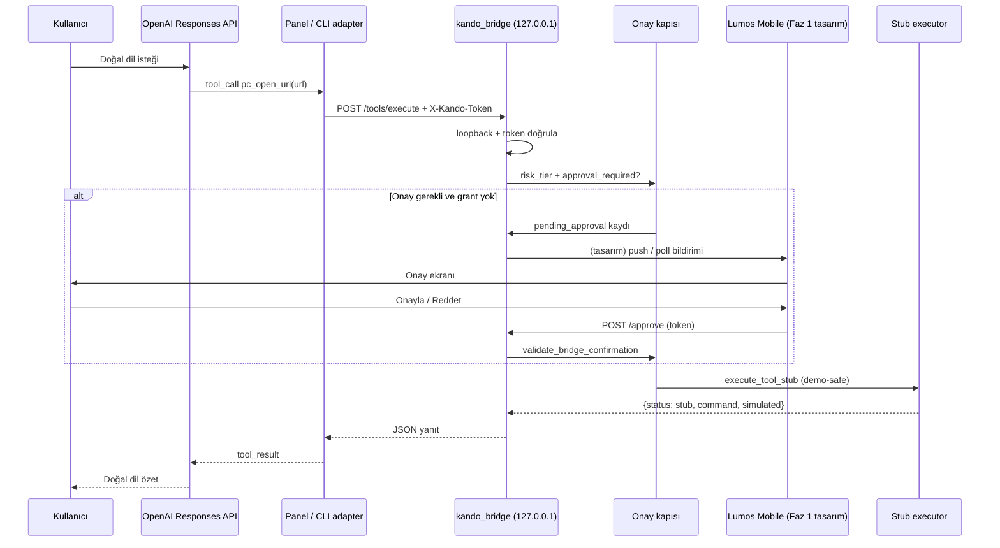

# Lumos PC Remote-Control Bridge — Mimari ve Uygulama Planı

| Alan | Değer |
|------|-------|
| Durum | **Plan** — mimari + demo-safe iskelet; gerçek OS otomasyonu yok |
| Tarih | 2026-06-21 |
| Kapsam | OpenAI Responses API + tool calling → yerel köprü → onay kapısı → stub yürütme |
| İlgili | [ADR-012](../decisions/ADR-012-lumos-security-codex.md), [device-connection-architecture-draft](device-connection-architecture-draft.md), [device-connection-information-architecture](device-connection-information-architecture.md), [external-integrations-permissions](../memory/external-integrations-permissions.md), `packages/kando_bridge`, `packages/kando_runtime/controlled_bridge.py`, `src/policy/confirmation_policy.py`, `src/task_engine/profiles.py` |

---

## 1. Mimari özet

Lumos PC remote-control bridge, **modelin tool/function call üretmesi** ile **kullanıcı cihazında yerel köprünün (kando_bridge) dar HTTP yüzeyi** arasında güvenli bir katman kurar. Akış: OpenAI Responses API bir `pc_*` aracı çağırır → istemci (panel, mobil veya CLI adapter) köprüye `POST /tools/execute` ile iletir → köprü **loopback + token** doğrular → **risk katmanı + onay kapısı** (`confirmation_policy`, `lumos_gate` ile hizalı) geçilir → yalnızca onaylı ve düşük riskli okuma komutları stub/simülasyon yanıtı döner; gerçek OS otomasyonu **private katmana ertelenir**.

**Bileşenler:**

| Bileşen | Rol | Repo karşılığı |
|---------|-----|----------------|
| **OpenAI Responses API** | Model reasoning + structured tool calls | `build_chat_reply` Responses API örneği (`kando_bridge/server.py`); yeni `pc_remote` tool set |
| **Tool schema katmanı** | JSON Schema / function definitions; demo-safe, versiyonlu | `kando_bridge/pc_remote_tools.py` — `lumos.pc_remote_tools.v1` |
| **Yerel köprü HTTP** | Loopback-only, token korumalı `/tools/*` | `packages/kando_bridge` — mevcut `/controlled`, `/approve` ile aynı güvenlik modeli |
| **Lumos çekirdek / policy** | Profil, `SECURITY_NEVER_AUTO`, confirmation | `confirmation_policy`, `profiles.py`, `lumos_gate` |
| **Mobile onay kanalı (Faz 1 tasarım)** | Push/poll/token ile ikinci cihaz onayı | **Tasarım only** — public repoda wire yok; `.lumos/pending_approvals` ile köprü uyumu |

**Public OSS sınırı:** Bu repoda yalnızca plan, tool şeması ve **stub handler** (`status: "stub"`). Gerçek uygulama açma, ekran okuma, klavye/fare otomasyonu **private/professional Lumos katmanına** aittir ([public-repo-boundary](../memory/public-repo-boundary.md)).

---

## 2. Sequence diyagramı



---

## 3. İlk bridge komut listesi

| Komut | API adı | Risk | Onay gerekli | Faz 1 (OSS) | Gelecek (private) |
|-------|---------|------|--------------|-------------|-------------------|
| Uygulama aç | `pc_open_app` | **Yüksek** | Evet | Stub — `not_implemented` | OS launcher / AppleScript / Win32 |
| URL aç | `pc_open_url` | Orta | Evet | Stub — simüle edilmiş URL | Tarayıcı / deep link |
| Ekrandaki durumu oku | `pc_read_screen_state` | Düşük | Hayır | Stub — sabit demo snapshot | Accessibility / OCR / CU |
| Metin yaz | `pc_type_text` | Yüksek | Evet | Stub — metin yankısı | Klavye otomasyonu |
| Tıklama öner | `pc_suggest_click` | Orta | Evet | Stub — koordinat önerisi, **tıklama yok** | Öneri → onaylı `pc_click` (private) |
| Dosya seçme isteği | `pc_request_file_picker` | Orta | Evet | Stub — `picker_token` placeholder | Native file dialog |
| Kullanıcı onayı iste | `pc_request_user_approval` | Meta | N/A (kapı) | Pending kayıt oluşturur | Mobile push wire |

**Toplam komut:** 7  
**Onay gerektiren (yürütme):** 5 (`pc_open_app`, `pc_open_url`, `pc_type_text`, `pc_suggest_click`, `pc_request_file_picker`)  
**Onay gerektirmeyen:** 1 okuma (`pc_read_screen_state`)  
**Meta / kapı:** 1 (`pc_request_user_approval`)

---

## 4. Onay gerektiren işlemler matrisi

| İşlem | confirmation action_key (hedef) | SECURITY_NEVER_AUTO | Köprü pending | Mobile Faz 1 |
|-------|-----------------------------------|---------------------|---------------|--------------|
| `pc_open_app` | `bridge_high_risk_execute` | `irreversible_user_op` adayı | Evet | Push + token |
| `pc_open_url` | `bridge_medium_dispatch` | — | Evet | Push + token |
| `pc_type_text` | `cu_act_type` (gelecek) | `irreversible_user_op` adayı | Evet | Push + token |
| `pc_suggest_click` | `cu_act_click` (gelecek) | — | Evet (öneri bile) | Push + token |
| `pc_request_file_picker` | `cu_act_file_send` adayı | — | Evet | Push + token |
| `pc_read_screen_state` | — | — | Hayır | — |
| Kalıcı silme / shell | — | **Asla otomatik** | Reddedilir | — |
| Dış servise yazma | `external_write` | **Asla otomatik** | Reddedilir | — |

**ADR-012 hizası:** Panel, CLI ve köprü aynı `confirmation_policy` grant store'unu paylaşır ([ADR-012-enforcement-decision-matrix](ADR-012-enforcement-decision-matrix.md)). Stub fazında enforcement **opt-in** (`LUMOS_CONFIRMATION_ENABLED`); yine de pending kayıtları ve token sözleşmesi üretilir.

---

## 5. Lumos Mobile — Faz 1 onay cihazı (tasarım)

Public repoda **yalnızca kavramsal akış**; implementasyon private veya sonraki dal.

```
1. Köprü yüksek/orta risk tool call → `.lumos/pending_approvals/approval_<ts>.json`
   └─ approval_token, command, arguments özeti, risk_level, expires_at

2. Mobile (eşleştirilmiş cihaz — gelecek)
   └─ Poll: GET /pending_approvals (loopback proxy veya güvenli tünel — private)
   └─ Push: (private) FCM/APNs — device pairing sonrası

3. Kullanıcı Mobile'da onaylar
   └─ POST /approve { approval_file, approval_token, approved: true }
   └─ validate_bridge_confirmation (CU4)

4. Tek kullanımlık token → stub execute veya (private) gerçek executor
```

**Güven ilkeleri:**

- Mobile, köprü secret'ını **saklamaz**; eşleştirme sonrası kısa ömürlü onay token'ı taşır.
- Onay reddedilirse pending dosyası silinir; otomatik yeniden deneme yok.
- `suggest_click` asla otomatik tıklamaz; onay yalnızca **öneriyi gösterme** veya gelecekteki `pc_click` için ayrı kapı.

---

## 6. Güvenlik sınırı — köprü MUST NOT

| Kural | Gerekçe |
|-------|---------|
| **Yalnızca loopback** (`127.0.0.1`, `::1`) | Mevcut `BridgeHandler._check_loopback` — değiştirilmez |
| **Token zorunlu** (`KANDO_BRIDGE_SECRET`) | POST `/tools/*` mevcut `_check_secret` ile |
| **Credential exfil yok** | Yanıtlarda API key, passphrase, keystore içeriği dönülmez |
| **SECURITY_NEVER_AUTO otomatik değil** | `permanent_delete`, `external_write`, `irreversible_user_op`, `critical_system_config` |
| **Gerçek OS otomasyonu yok (OSS)** | Stub-only; private katmana defer |
| **Destructive surface reddi** | `controlled_bridge.surface_blocked` ile uyumlu probe |
| **0.0.0.0 bind yasak** | `_ALLOWED_BIND_HOSTS` |
| **Trash / çekirdek state'e yazma yok** | Tool yürütme `.lumos/` pending/onay dışında state değiştirmez (stub) |

---

## 7. Uygulama PR planı (fazlı)

| PR | Başlık | İçerik | Repo |
|----|--------|--------|------|
| **PR-RB-01** | Plan belgesi | Bu dosya | OSS ✓ |
| **PR-RB-02** | Tool schemas | `pc_remote_tools.py` — OpenAI function JSON + TypedDict | OSS ✓ |
| **PR-RB-03** | Stub bridge routes | `GET /tools/schema`, `POST /tools/execute`, approval gate placeholder | OSS ✓ |
| **PR-RB-04** | Mobile approval disk wire | Pending disk sözleşmesi, token doğrulama | OSS ✓ |
| **PR-RB-05** | Mobile approval client | Loopback poll + POST /approve CLI | OSS ✓ |
| **PR-RB-06** | LAN relay MVP | Pairing, relay token, pending proxy | OSS ✓ |
| **PR-RB-07** | OpenAI tool-loop adapter | Responses API tool call → `/tools/execute` → onay → stub | OSS ✓ |

**PR-RB-03 kabul kriterleri:**

- Tüm komutlar `{status: "stub", ...}` veya `{status: "pending_approval", ...}` döner
- Onaysız yüksek risk → `approval_required: true`, yürütme yok
- `pytest` + `ruff` yeşil
- Gerçek subprocess / OS API çağrısı yok

---

## 8. OpenAI Responses API entegrasyon notları

**API key:** Kullanıcı tarafında mevcut varsayılır; platform ayarları / yeni key oluşturma **kapsam dışı**.

**Tool tanımı şekli (örnek — API key yok):**

```json
{
  "type": "function",
  "name": "pc_open_url",
  "description": "Kullanıcı onayı sonrası URL açmayı köprüye iletir (stub fazında simüle edilir).",
  "parameters": {
    "type": "object",
    "properties": {
      "url": { "type": "string", "description": "https:// ile başlayan URL" }
    },
    "required": ["url"],
    "additionalProperties": false
  }
}
```

**Responses API çağrı akışı (konsept):**

1. `responses.create(model=..., input=..., tools=[...])`
2. Çıktıda `function_call` / tool call item → istemci `POST /tools/execute`
3. Tool result → ikinci `responses.create` veya conversation item ekleme
4. Mevcut `build_chat_reply` iki adımlı INTENT modeli ile birleştirilebilir; PC remote için ayrı `build_pc_remote_turn` adapter önerilir (PR-RB-04 öncesi private veya panel-only).

**İstemci sorumluluğu:** Model doğrudan köprüye bağlanmaz; her zaman yerel adapter token taşır.

---

## 9. Mevcut kod ile hizalama

| Kalıp | Kullanım |
|-------|----------|
| `controlled_bridge` | Dar komut yüzeyi, `surface_blocked`, workspace sandbox — PC remote **ayrı modül**, aynı red listesi |
| `POST /approve` | Pending onay tüketimi — tool pending kayıtları uyumlu alanlar |
| `confirmation_policy.attach_bridge_pending_confirmation` | Gölge CU4 kaydı (opt-in enforcement) |
| `lumos_gate.run_lumos_gate` | İleride birleşik gate; stub fazında `pc_remote_tools.check_approval_gate` yeterli |
| `device-connection-architecture-draft` | Kullanıcı cihazı / köprü / bağlı cihaz terminolojisi |

---

## 10. Private katmana ertelenenler

- Gerçek uygulama başlatma (macOS `open`, Windows `ShellExecute`)
- Ekran görüntüsü / accessibility tree okuma
- Klavye/fare enjeksiyonu
- Native file picker
- Lumos Mobile push, cihaz eşleştirme protokolü, uzaktan tünel
- Production OpenAI tool-loop orchestrator (cloud agent)

---

## 11. PR-RB-07 — OpenAI tool-loop adapter (OSS MVP)

**Modül:** `packages/kando_bridge/src/kando_bridge/openai_tool_adapter.py`  
**Demo CLI:** `scripts/openai_tool_loop_demo.py`

Akış: OpenAI Responses API `function_call` → adapter parse → `POST /tools/execute` → disk pending → RB-05 `approve_pending` → token ile tekrar execute → `{status: stub, used: true}`.

Mock (CI-safe, ağ yok):

```bash
export KANDO_BRIDGE_SECRET='your-local-dev-secret'
PYTHONPATH=src:packages/kando_bridge/src \
  pytest -q tests/test_openai_tool_loop_adapter_mvp.py

# Köprü çalışırken demo (mock canned pc_open_url):
PYTHONPATH=src:packages/kando_bridge/src \
  python scripts/openai_tool_loop_demo.py --mock --url https://example.com
```

Live (OPENAI_API_KEY gerekli; CI'da atlanır):

```bash
export OPENAI_API_KEY='sk-...'
export KANDO_BRIDGE_SECRET='your-local-dev-secret'
PYTHONPATH=src:packages/kando_bridge/src \
  python scripts/openai_tool_loop_demo.py --live --prompt 'Open https://example.com'
```

---

## 12. Sonraki adım (tek)

Private katmanda executor swap: `execute_tool_stub` → `execute_tool_real`; Lumos Mobile push/eşleştirme wire.
