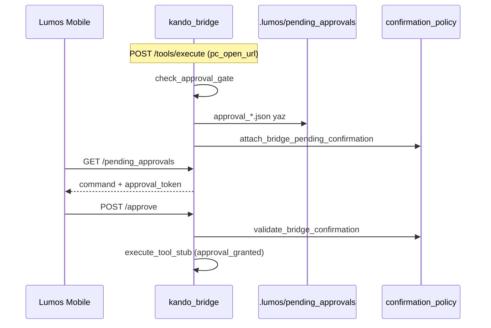

# Lumos PC Remote Bridge — İskelet Doğrulama ve Karar Raporu

| Alan | Değer |
|------|-------|
| Durum | **Doğrulama raporu** — PR #512 merge sonrası (main); kod değişikliği yok |
| Tarih | 2026-06-21 |
| Kapsam | `pc_remote_tools.py`, köprü `/tools/*` rotaları, onay iskeleti, public/private sınır |
| İlgili | [lumos-pc-remote-bridge-plan.md](lumos-pc-remote-bridge-plan.md), PR #512, ADR-012, [device-connection-architecture-draft.md](device-connection-architecture-draft.md) |

---

## Özet karar

**Hazırlık durumu:** İskelet **kısmen hazır** — tool şeması, stub yürütme, loopback+token HTTP yüzeyi ve temel testler yerinde; onay diski/CU4/Mobile wire **henüz bağlı değil**, gerçek OS otomasyonu bilinçli olarak yok.

**En kritik 3 güvenlik boşluğu:**

1. **Onay token'ı kalıcı değil** — `check_approval_gate` bellek içi `secrets.token_hex(16)` üretir; `.lumos/pending_approvals/` dosyası yazılmaz → Mobile poll ve çapraz istek onayı imkânsız.
2. **`approval_granted=True` token doğrulamasız geçiş** — `execute_tool_stub` içindeki gate yalnızca `approval_granted` bayrağına bakar; `handle_tools_execute_body` üst seviye token kontrolü pending dışı yürütmeye taşınmıyor.
3. **`confirmation_policy` entegrasyonu yok** — `attach_bridge_pending_confirmation` / `validate_bridge_confirmation` PC remote yolunda çağrılmıyor; `/task` onay zinciri ile ayrık, opt-in CU4 enforcement devre dışı kalır.

---

## 1. Komut listesi

Kaynak: `packages/kando_bridge/src/kando_bridge/pc_remote_tools.py` — `COMMAND_SPECS` (L62–112), `execute_tool_stub` (L338–432).

| id | name | purpose | current behavior (stub) | risk tier |
|----|------|---------|-------------------------|-----------|
| 1 | `pc_open_app` | Belirtilen uygulamayı açmayı köprüye iletir | Onaysız → `pending_approval`; onaylı → `{status:"stub", simulated:{action:"open_app", app_name}}` | **high** |
| 2 | `pc_open_url` | HTTPS URL açmayı iletir | Onaysız → `pending_approval`; onaylı → stub simülasyon (`open_url`, url yankısı) | **medium** |
| 3 | `pc_read_screen_state` | Ekran durumunu okur | Onay gerekmez; sabit demo snapshot (`active_window_title: "[demo] Lumos Panel"`) | **low** |
| 4 | `pc_type_text` | Klavye ile metin yazmayı iletir | Onaysız → `pending_approval`; onaylı → metin yankısı (`text_echo`, max 500 char) | **high** |
| 5 | `pc_suggest_click` | Tıklama koordinatı önerir; **otomatik tıklama yok** | Onaylı stub → `auto_click: false`, koordinat önerisi | **medium** |
| 6 | `pc_request_file_picker` | Native dosya seçici isteği | Onaylı stub → `picker_token: stub-picker-<hex>` placeholder | **medium** |
| 7 | `pc_request_user_approval` | Genel kullanıcı onayı meta kapısı | Gate geçer → `{status:"approval_recorded", simulated:{approval_token}}`; OS etkisi yok | **meta** |

**Doğrulama:** `tests/test_pc_remote_bridge_stubs.py` — `len(ALL_COMMANDS) == 7` (L26–27), `stub_only: True` payload (L34–38).

---

## 2. Onay matrisi

### 2.1 Komut bazlı onay gereksinimi

Kaynak: `COMMAND_SPECS[*].approval_required` (L62–112).

| Komut | Onay gerekli (Y/N) | `action_key` (hedef) |
|-------|-------------------|----------------------|
| `pc_open_app` | **Y** | `bridge_high_risk_execute` |
| `pc_open_url` | **Y** | `bridge_medium_dispatch` |
| `pc_read_screen_state` | **N** | — |
| `pc_type_text` | **Y** | `cu_act_type` |
| `pc_suggest_click` | **Y** | `cu_act_click` |
| `pc_request_file_picker` | **Y** | `cu_act_file_send` |
| `pc_request_user_approval` | **N** (meta kapı) | — |

**Plan ile uyum:** Plan belgesi 5 yürütme komutu + 1 meta kapı diyor ([plan §3](lumos-pc-remote-bridge-plan.md#L66-L79)); kod aynı.

### 2.2 Gate mekanizması (kod)

| Katman | Fonksiyon / rota | Davranış |
|--------|------------------|----------|
| Argüman doğrulama | `validate_command_arguments` (L279–305) | Bilinmeyen komut, `surface_blocked` (shell/sil/trash regex L115–121), URL şeması, zorunlu alanlar |
| Onay kapısı | `check_approval_gate` (L308–335) | `approval_required=False` → `allowed=True`; aksi halde `approval_granted=True` → geç; değilse `pending_token` üret |
| Stub yürütme | `execute_tool_stub` (L338–432) | Gate reddi → `{status:"pending_approval", approval_token, action_key, risk_tier}` |
| HTTP giriş | `handle_tools_execute_body` (L443–469) | POST gövdesi: `command`, `arguments`, `approval_granted`, `approval_token`, `expected_approval_token` |
| Köprü rotası | `BridgeHandler._handle_tools_execute` → `POST /tools/execute` (`server.py` L2446–2457) | Loopback + `KANDO_BRIDGE_SECRET` zorunlu (`do_POST` L2459–2463) |

### 2.3 Pending token akışı (mevcut vs hedef)

**Mevcut (PR #512):**

```
Client → POST /tools/execute {command, arguments}
  → check_approval_gate → secrets.token_hex(16) (bellek)
  → JSON yanıt: {status:"pending_approval", approval_token:"..."}
  → disk yazımı YOK
```

**Hedef (plan §5, `/task` ile hizalı):**

```
Client → POST /tools/execute
  → .lumos/pending_approvals/approval_<ts>.json
  → attach_bridge_pending_confirmation (CU4 shadow, opt-in)
  → Mobile poll GET /pending_approvals
  → Mobile POST /approve {approval_file, approval_token, approved:true}
  → validate_bridge_confirmation → stub execute (veya private executor)
```

**CU4 action_key kaydı:** `_ACTION_KEY_BY_COMMAND` (L43–51) pending yanıtta `action_key` olarak döner; `confirmation_policy.REQUIRES_CONFIRMATION_ACTIONS` içinde `bridge_high_risk_execute`, `bridge_medium_dispatch`, `cu_act_type`, `cu_act_click`, `cu_act_file_send` tanımlı (`confirmation_policy.py` L32–52).

**Enforcement:** `LUMOS_CONFIRMATION_ENABLED` varsayılan kapalı → `is_confirmation_enabled()` no-op (`confirmation_policy.py` L101–105). Plan ile uyumlu ([plan §4](lumos-pc-remote-bridge-plan.md#L96)).

---

## 3. Demo modu sınırları

Public OSS'te **tüm 7 komut** demo-safe kalmalıdır.

| Kanıt | Konum |
|-------|-------|
| Global `stub_only: True` | `tools_schema_payload()` L269 |
| Her komut `stub_only: True` | `COMMAND_SPECS` L68, L75, L81, L89, L96, L103, L110 |
| Stub yürütme; OS API yok | `execute_tool_stub` docstring L344–346; yanıt `status: "stub"` L376 |
| Private defer notu | `note: "not_implemented — private layer executor"` L381 |

**Demo-safe kalması gereken komutlar (gerçek etki = private katman):**

| Komut | OSS'te kalmalı | Gerekçe |
|-------|----------------|---------|
| `pc_open_app` | Stub | OS launcher / AppleScript / Win32 — device control |
| `pc_open_url` | Stub | Tarayıcı/deep link — kullanıcı cihazı etkisi |
| `pc_read_screen_state` | Stub (demo snapshot) | Accessibility/OCR — hassas ekran verisi |
| `pc_type_text` | Stub | Klavye enjeksiyonu |
| `pc_suggest_click` | Stub (`auto_click: false`) | Fare otomasyonu öncesi; plan explicit |
| `pc_request_file_picker` | Stub token | Native file dialog |
| `pc_request_user_approval` | Kayıt/simülasyon only | Meta kapı; push/tünel private |

**Yüzey engeli (demo katmanı):** `_BLOCKED_SURFACE_RE` terminal/shell/kalıcı sil/trash ifadelerini argümanlarda reddeder (L115–121, L274–276). Test: `test_type_text_blocked_surface` (`tests/test_pc_remote_bridge_stubs.py` L85–87).

---

## 4. Private layer sınırı değerlendirmesi

**Karar: DOĞRU (bilinçli defer) — küçük entegrasyon boşlukları var.**

| Kriter | Değerlendirme | Kanıt |
|--------|---------------|-------|
| Gerçek OS otomasyonu OSS'te yok | ✓ Doğru | Modül docstring L1–6; `execute_tool_stub` subprocess/OS çağrısı içermez |
| Device control public sınır dışı | ✓ Doğru | [public-repo-boundary.md](../memory/public-repo-boundary.md); workspace `public-github-boundary` — device control listed |
| Plan ↔ kod hizası | ✓ Doğru | [plan §10](lumos-pc-remote-bridge-plan.md#L205-L212) ertelenenler listesi kod davranışıyla örtüşür |
| Credential exfil yok | ✓ Doğru | Yanıtlar yalnızca argüman preview / demo snapshot |
| Loopback + token | ✓ Doğru | `_check_loopback` L1530–1535; `_check_secret` L1537–1552; tools rotaları aynı `do_POST` zinciri |
| Onay diski / Mobile | ✗ Boşluk | PC remote pending dosyaya yazmıyor — plan §5 henüz uygulanmadı (PR-RB-04 defer) |
| `lumos_gate` birleşik kapı | ✗ Boşluk | Plan: stub fazında `check_approval_gate` yeterli ([plan §9](lumos-pc-remote-bridge-plan.md#L200)); ileride birleşim açık |

**Public boundary ihlali yok:** İskelet yalnızca şema + simülasyon; production device control, push, tünel, eşleştirme repoda yok — plan ile tutarlı.

---

## 5. Lumos Mobile bağlantı noktaları (PR-RB-04)

Public repoda Mobile wire **tasarım only** ([plan §5](lumos-pc-remote-bridge-plan.md#L100-L117)). Mevcut köprü altyapısı ve PC remote'un bağlanması gereken noktalar:

### 5.1 Mevcut köprü hook'ları (Mobile için hazır altyapı)

| Hook | Dosya / satır | Rol |
|------|---------------|-----|
| Pending listeleme | `build_pending_approvals_list()` — `server.py` L1168–1217 | `.lumos/pending_approvals/*.json` → API kayıt listesi |
| GET poll (dizi) | `do_GET` → `/pending_approvals` — L1667–1670 | Mobile poll hedefi (plan §5.2) |
| GET poll (sarmalı) | `do_GET` → `/pending-approvals` — L1672–1675 | Panel uyumlu sarmalayıcı |
| Onay tüketimi | `_handle_approve` — L2204–2412 | `approval_file` + `approval_token` + `approved` |
| Pending dosya yazımı | `_attach_pending_approval_to_out` — L1565–1599 | `/task` gate pending → disk |
| CU4 shadow grant | `attach_bridge_pending_confirmation` — `confirmation_policy.py` L486–514 | Parallel `.lumos/pending_confirmations/` |
| CU4 doğrulama | `validate_bridge_confirmation` — `confirmation_policy.py` L530–560 | Opt-in enforcement |
| Güvenli path | `_safe_pending_approval_path` — `server.py` L55–67 | Path traversal koruması |

### 5.2 PC remote'un bağlanması gereken noktalar (henüz YOK)

| Eksik bağlantı | Hedef fonksiyon / rota | PR-RB-04 işi |
|----------------|------------------------|--------------|
| Pending persist | `_attach_pending_approval_to_out` veya PC-remote özel writer | `execute_tool_stub` pending → `.lumos/pending_approvals/approval_<ts>.json` |
| CU4 shadow | `attach_bridge_pending_confirmation(pending_record, base_dir=ROOT/.lumos, risk=..., source="pc_remote")` | action_key eşlemesi `_ACTION_KEY_BY_COMMAND` ile |
| Mobile poll görünürlük | `build_pending_approvals_list` | PC remote kayıtlarında `command`, `arguments_preview`, `schema_version` alanları |
| Onay sonrası yürütme | `_handle_approve` → PC remote resume | Onaylı `POST /tools/execute` veya approve handler içinde `execute_tool_stub(..., approval_granted=True)` + token eşleşmesi |
| Token tek kullanımlık | `_handle_approve` L2267–2268 `used` bayrağı | PC remote pending kaydına `used` + silme |

**Akış özeti (hedef wire):**



---

## 6. Eksik güvenlik sınırları

| Boşluk | Mevcut durum | Risk | Kod referansı |
|--------|--------------|------|---------------|
| Pending disk persist | Token yalnızca JSON yanıtta | Mobile/onay zinciri kırık | `check_approval_gate` L329–335; `execute_tool_stub` pending L360–371 |
| Token doğrulama bypass | `approval_granted=True` yeterli | Yetkisiz stub yürütme (ileride gerçek executor'da kritik) | `execute_tool_stub` L358 — token parametresi yok |
| `confirmation_policy` wire | PC remote çağırmıyor | CU4 opt-in enforcement atlanır | `handle_tools_execute_body`; karşılaştır `_handle_approve` L2351–2361 |
| Rate limit | Yok | Loopback'te abuse / flood | `/tools/execute` handler L2446–2457 |
| Komut allowlist HTTP | `validate_command_arguments` var; ek HTTP katmanı yok | Yalnızca gövde doğrulama | `ALL_COMMANDS` L27–35 |
| Audit log | `/task` `append_audit_log` var; tools yok | İzlenebilirlik | `_send_lumos_pipeline_out` L1803–1808 vs `_handle_tools_execute` |
| `lumos_gate` / profil | Tools yolu gate dışı | Profil matrisi (`rapor`/`guvenli_yurut`) uygulanmaz | Plan stub fazı kabul; production'da gap |
| Pending TTL / expires_at | PC remote yanıtta yok | Sonsuz pending token (bellek/disk sonrası) | Plan §5 `expires_at` — kod yok |
| Tek kullanımlık token | `used` bayrağı PC remote'da yok | Token replay | `_handle_approve` pattern L2267 — PC remote'a taşınmadı |
| OpenAI tool loop | `build_chat_reply` tools bağlı değil | Model → köprü otomasyonu ayrı adapter gerekir | Plan §8 L187 |

---

## 7. Stub → gerçek kullanıma hazırlık

| Komut | Demo stub | Onay zinciri | Gerçek OS (private) | Genel |
|-------|-----------|--------------|---------------------|-------|
| `pc_open_app` | ✓ Hazır | ✗ Kısmi (pending persist yok) | ✗ Not ready | **partial** |
| `pc_open_url` | ✓ Hazır | ✗ Kısmi | ✗ Not ready | **partial** |
| `pc_read_screen_state` | ✓ Hazır | N/A (onay yok) | ✗ Not ready | **partial** (demo okuma only) |
| `pc_type_text` | ✓ Hazır | ✗ Kısmi | ✗ Not ready | **partial** |
| `pc_suggest_click` | ✓ Hazır (`auto_click: false` test L76–82) | ✗ Kısmi | ✗ Not ready | **partial** |
| `pc_request_file_picker` | ✓ Hazır | ✗ Kısmi | ✗ Not ready | **partial** |
| `pc_request_user_approval` | ✓ Kayıt simülasyonu | ✗ Disk/CU4 yok | ✗ Meta only | **partial** |

**Modül düzeyi:**

| Bileşen | Durum |
|---------|-------|
| Tool schema + OpenAI definitions | **ready** |
| HTTP `/tools/schema`, `/tools/execute` | **ready** (demo) |
| Loopback + secret | **ready** |
| pytest + ruff (PR kabul kriteri) | **ready** (7 komut testleri mevcut) |
| Mobile approval wire (PR-RB-04) | **not ready** |
| Private executor swap | **not ready** (bilinçli) |
| End-to-end OpenAI tool loop | **not ready** |

---

## 8. Bir sonraki en güvenli uygulama adımı

**Tek önerilen adım:** PC remote `pending_approval` yanıtını mevcut köprü `_attach_pending_approval_to_out` / `.lumos/pending_approvals/` sözleşmesine bağla — pending JSON'a `command`, `arguments_preview`, `action_key`, `approval_token`, `used:false`, `expires_at` yaz; `attach_bridge_pending_confirmation` ile CU4 shadow ekle; onay sonrası yürütmede `approval_token` eşleşmesini zorunlu kıl (`approval_granted` bayrağı tek başına yetmesin).

Bu adım: (1) Mobile poll'u anında besler (`GET /pending_approvals`), (2) mevcut `POST /approve` + `validate_bridge_confirmation` yolunu yeniden kullanır, (3) gerçek OS executor gelmeden önce token bypass açığını kapatır, (4) public OSS sınırını korur (yine stub yürütme).

---

## Ek: Kullanıcı soruları — kısa cevaplar

1. **7 stub komut:** §1 tablosu.
2. **5 onay gerektiren:** `pc_open_app`, `pc_open_url`, `pc_type_text`, `pc_suggest_click`, `pc_request_file_picker`.
3. **Demo-safe kalan:** OSS'te **7'si de** stub_only; gerçek OS etkisi private katmana ertelenmiş (§3).
4. **Private layer sınırı:** Doğru; device control public repoda yok, kod uyumlu (§4).
5. **Lumos Mobile bağlantı noktaları:** Mevcut `GET /pending_approvals`, `POST /approve`, `_attach_pending_approval_to_out`, `attach_bridge_pending_confirmation` — PC remote henüz wire edilmedi (§5).

---

## Doğrulama kanıtı (test özeti)

| Test | Dosya | Ne kanıtlar |
|------|-------|-------------|
| 7 komut sayısı | `test_all_commands_count` L26–27 | ALL_COMMANDS |
| Stub only payload | `test_tools_schema_payload_stub_only` L34–38 | Public demo sınırı |
| Okuma onaysız | `test_read_screen_no_approval_stub` L41–48 | LOW risk |
| URL pending | `test_open_url_requires_approval_pending` L51–62 | Onay kapısı |
| Surface block | `test_type_text_blocked_surface` L85–87 | Destructive yüzey |
| HTTP route | `test_server_tools_execute_route` L141–158 | `/tools/execute` + token |
| Schema auth | `test_server_tools_schema_requires_token` L161–184 | Secret zorunlu |

**CI notu:** Bu rapor kod değişikliği içermez; merge sonrası CI durumu bu belgede doğrulanmadı.
