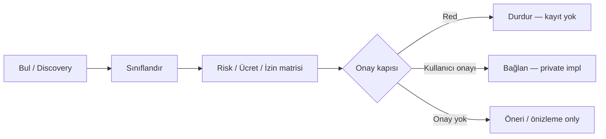

# Lumos Quantum Layer — Mimari (Planlı)

| Alan | Değer |
|------|-------|
| Durum | **Planlı** — docs + kayıt iskeleti; otomatik bağlantı yok |
| Tarih | 2026-06-26 |
| Dil | Türkçe (birincil) |
| İlgili | [ADR-001](../decisions/ADR-001-lumos-quantum-modules.md), [ADR-013](../decisions/ADR-013-lumos-quantum-security-readiness.md), [provider kataloğu](./lumos-quantum-provider-catalog.md), [`integrations-overview.md`](../integrations-overview.md) |

**Kullanıcı komutu (gelecek):** «Lumos, kuantum kaynaklarını tara ve kullanılabilir olanları güvenli bağlantı listesine al.»

**Temel ilke:** Lumos **asla** otonom olarak kuantum bulutuna veya ücretli hesaplamaya bağlanmaz. Akış her zaman **bul → sınıflandır → risk/ücret/izin çıkar → kullanıcı onayı → bağlan** şeklindedir.

---

## Katman ağacı

```
Lumos (OSS çekirdek)
├── Güvenlik / karar sözleşmesi (SECURITY_NEVER_AUTO, profiller)
├── Entegrasyonlar (GitHub, Mail, Device, …)
├── Quantum Readiness (ADR-013) — yerel salt okunur PQC hazırlık tarayıcısı  ← mevcut, ayrı ürün yüzeyi
└── Quantum Layer (bu belge) — kuantum kaynak keşfi / onay / bağlantı planı  ← planlı, bağlantı yok
    ├── Discovery (bul)
    ├── Classification (sınıflandır)
    ├── Risk / Cost / Permission matrix
    ├── Approval gate (onay kapısı)
    └── Connect (yalnızca onay sonrası — private katmanda)
```

### `/cyber` ile ilişki

| Yüzey | Rol | Kuantum Layer ile bağ |
|-------|-----|------------------------|
| **`/cyber`** (Lumos Cyber) | Güvenlik odaklı ürün varyantı; erken erişim landing | Aynı **onay ve NEVER_AUTO** felsefesi; kuantum hesaplama yüzeyi **değil** |
| **Panel `#panel-kuantum`** | Quantum Readiness (ADR-013) — yerel rapor | Güvenlik hazırlığı; kaynak bağlantısı yok |
| **Quantum Layer** | Bulut / çerçeve / simülatör kataloğu + onaylı bağlantı planı | `/cyber` altında **değil**; entegrasyon katmanında ayrı planlı blok |

Kaynak: [`lumos-approved-naming-registry.md`](./lumos-approved-naming-registry.md) — `/cyber` = Lumos Cyber; Quantum Layer ayrı planlı katman olarak bu belgede tanımlıdır.

---

## Akış: Discovery → Classification → Matrix → Approval → Connect



### 1. Bul (Discovery)

- Yerel katalog ve dokümantasyon referansları (`lumos-quantum-provider-catalog.md`, `src/integrations/quantum_registry.py`).
- Harici API taraması **public OSS'te yok**; `discover` aksiyonu `quantum_discover_not_configured` döner.
- Entropy Lab (`qiskit_aer`, `ibm_runtime`) readiness raporunda **ayrı deneysel** etiket; Quantum Layer bağlantısı sayılmaz.

### 2. Sınıflandır (Classification)

Türler: `cloud` · `framework` · `simulator` · `research`

Her kayıt için: sağlayıcı kimliği, auth modeli özeti, demo-safe / production ayrımı.

### 3. Risk / ücret / izin matrisi

| Boyut | Soru | Public OSS |
|-------|------|------------|
| **Maliyet riski** | Job başına / dakika ücreti var mı? | Katalog metadata; canlı fiyat API yok |
| **Veri egress** | Devre / sonuç dışarı taşınır mı? | Katalog notu; otomatik upload yok |
| **Kimlik bilgisi** | API key / OAuth / IAM gerekir mi? | Vault yazımı **onaysız yok** |
| **Dış hesaplama** | Harici kuantum işi submit edilir mi? | `external_write` + NEVER_AUTO sınıfı |

Detay tablolar: [`lumos-quantum-provider-catalog.md`](./lumos-quantum-provider-catalog.md).

### 4. Onay kapısı (Approval gate)

AnchorUSB ve mail entegrasyonu ile **aynı omurga**:

| Desen | Örnek | Quantum Layer |
|-------|-------|---------------|
| Salt okunur katalog | `list_catalog` | **İzinli** (yerel metadata) |
| Harici tarama | Bulut job listesi | **Onaysız yok** — stub `not_configured` |
| Kimlik bilgisi yazma | API token vault'a kayıt | **OWNER onayı** — public'te yok |
| İş gönderme / bağlan | QPU job submit | **İşlem bazlı onay** + private impl |

Karşılaştırma:

- **AnchorUSB:** Plugin enable, backup, dış rapor — kullanıcı komutu + NEVER_AUTO tablosu ([`secure-device-framework.md`](./secure-device-framework.md)).
- **Mail (OD-031):** Varsayılan kapalı; okuma bile explicit grant ([`external-integrations-permissions.md`](../memory/external-integrations-permissions.md)).
- **Quantum Layer:** Varsayılan **hiç bağlı değil**; `connect` her zaman `approval_required` + `quantum_provider_not_configured` (OSS).

### 5. Bağlan (Connect)

- Yalnızca kullanıcı açık onayı ve private orchestration katmanında (WeLockAI).
- Public repoda **handler iskeleti yok** — yalnızca reddeden stub.
- CI'da canlı API çağrısı, credential veya otomatik job submit **yasak**.

---

## NEVER_AUTO — kuantum alanı

Lumos `SECURITY_NEVER_AUTO` (`src/task_engine/profiles.py`) ile hizalı; kuantum için **genişletilmiş politika notu** (kod değişikliği bu PR'da yok — dokümantasyon):

| ID | Asla otomatik | Gerekçe |
|----|---------------|---------|
| Q-01 | Kuantum bulutuna otonom bağlantı | Dış hesaplama + faturalama |
| Q-02 | API anahtarı / token yazma veya vault güncelleme | `external_write` / credential |
| Q-03 | Ücretli job / circuit submit | Faturalama + geri dönüşsüz dış etki |
| Q-04 | Sonuçların onaysız dışa aktarımı | Veri egress |
| Q-05 | «Kuantum güvenli» veya donanım iddiası | Public OSS sınırı |
| Q-06 | Entropy sağlayıcıyı readiness olmadan prod'a alma | ADR-013 sınırı |

AnchorUSB NEVER_AUTO (A-01–A-07) ile **kavramsal paralel**: sistem bilgilendirir; dış etki kullanıcı onayı olmadan gitmez.

---

## Public OSS vs private sınır

| Public `lumos-core` | Private / WeLockAI |
|---------------------|---------------------|
| Mimari + katalog belgeleri | OAuth, IAM, enterprise billing limitleri |
| `quantum_registry.py` metadata stub | Canlı discover / job router |
| `list_catalog` (yerel) | Credential bridge, vault |
| Quantum Readiness tarayıcısı (ADR-013) | Üretim kuantum workload yönetimi |
| Demo-safe `not_configured` handler'lar | Onay UX + işlem onay ekranı |

Kaynak: [`public-repo-boundary.md`](../memory/public-repo-boundary.md).

**Dürüst sınır:** Mevcut kodda Qiskit Aer / IBM Runtime yalnızca **Entropy Lab** (deneysel) ve readiness envanterinde geçer; **Quantum Layer bağlantısı veya üretim kuantum iddiası yok**.

---

## Kod referansları (OSS)

| Parça | Yol | Durum |
|-------|-----|-------|
| Katalog metadata | `src/integrations/quantum_registry.py` | Stub |
| Entegrasyon handler | `src/integrations/providers/quantum_provider.py` | `not_configured` |
| Readiness tarayıcı | `src/security/readiness/scanner.py` | Faz-2 kısmi (ADR-013) |
| Entropy (deneysel) | `src/security/entropy/providers/` | Readiness'ten ayrı |

---

## Mevcut repo envanteri (2026-06-26)

| Bulgu | Konum | Quantum Layer ile ilişki |
|-------|-------|--------------------------|
| Quantum Readiness | ADR-013, panel `GET /quantum-readiness` | **Ayrı** — PQC hazırlık, bağlantı yok |
| Entropy Lab | `qiskit_aer.py`, `ibm_runtime.py` | Deneysel; Layer connect değil |
| Panel kuantum UI | `ui/`, landing i18n | Vizyon + readiness; üretim iddiası yok |
| `lumos-quantum/` dizin drift | Belgelerde placeholder | Fiziksel dizin yok |

---

## Sonraki adımlar (onay gerektirir)

1. Private katmanda tek sağlayıcı pilotu (ör. salt okunur IBM hesap metadata — job submit yok).
2. Onay UX: maliyet tahmini + işlem onay ekranı (OD-041 hibrit model ile hizalı).
3. Panel entegrasyonu: katalog önizlemesi (salt okunur).

*Bu belge uygulama taahhüdü içermez; CI yeşil olmadan «tamamlandı» denmez.*
