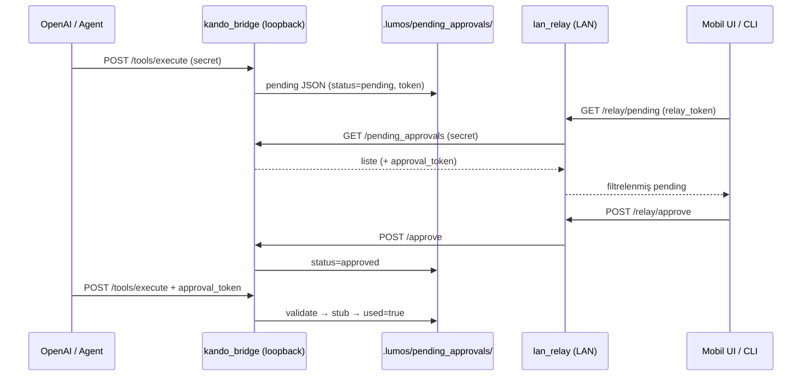

# Mobil Onay Akışı — Güvenlik İncelemesi

| Alan | Değer |
|------|-------|
| Tarih | 2026-06-22 |
| Kapsam | PC remote pending approval + mobil onay (loopback + LAN relay) |
| Mod | Salt okuma analiz; kod/PR yok |
| Referans sözleşme | `docs/analysis/pc-remote-pending-approval-contract.md` |
| UI doğrulama notu | `docs/analysis/mobile-approve-reject-ui-verification.md` — **mevcut değil** |

---

## 1. Kapsam ve varsayımlar

### İncelenen bileşenler

| Bileşen | Rol |
|---------|-----|
| `pending_approvals.py` | Disk sözleşmesi, token doğrulama, expire/used durumu |
| `pc_remote_tools.py` | Onay kapısı, stub yürütme, tüketim (`consume_pending_record`) |
| `server.py` | `POST /approve`, `POST /tools/execute`, `GET /pending_approvals` |
| `lan_relay.py` | LAN üzerinden mobil proxy; pairing + relay token |
| `mobile_approval_client.py` | Loopback ve relay istemci CLI |
| `openai_tool_adapter.py` | OpenAI tool → pending → approve → execute döngüsü |

### Varsayımlar

- **Bridge** varsayılan olarak yalnızca **loopback** (`127.0.0.1`) dinler; tüm `POST` istekleri `KANDO_BRIDGE_SECRET` gerektirir.
- **LAN relay** varsayılan olarak **`0.0.0.0:8766`** dinler; bridge secret mobil istemciye verilmez, bunun yerine **relay token** kullanılır.
- Yürütme katmanı **stub-only** (`stub_only: true`); gerçek OS otomasyonu private katmandadır.
- Tehdit aktörü: aynı LAN’deki cihaz, köprü secret’ına erişimi olan yerel süreç, veya onay token’ını ele geçiren ara katman (MITM / log sızıntısı).
- Onay kayıtları **dosya tabanlı JSON**; dağıtık kilit veya transactional store yok.

---

## 2. Tehdit modeli özeti



**Koruma katmanları (tasarım niyeti):**

1. Bridge secret — ağ + kimlik (loopback veya relay arkası).
2. `approval_token` — işlem başına gizli, onay + yürütme için zorunlu.
3. `status` + `used` + `expires_at` — durum makinesi.
4. Relay token — mobil istemci yetkilendirmesi (pairing sonrası).

**Bilinen zayıf noktalar (MVP):** atomik olmayan tüketim, pairing brute-force yüzeyi, token’ların list API’de açık dönmesi, TLS yok.

---

## 3. Bulgu tablosu (kullanıcı soruları)

| # | Soru | Sonuç | Severity | Kanıt |
|---|------|-------|----------|-------|
| 1 | Replay attack mümkün mü? | **Kısmen** | **High** (eşzamanlı yürütme); Low (ardışık approve) | `pending_approvals.py:200-201`, `pc_remote_tools.py:575-581`, `server.py:2290-2292` |
| 2 | Çift onay mümkün mü? | **Kısmen** | **High** (race); Low (çift POST /approve) | `pc_remote_tools.py:626-663`, `server.py:2227-2327`, `ThreadingHTTPServer` |
| 3 | Expire olmuş token kullanılabiliyor mu? | **Hayır** (doğrulanmış yollar) | Low (sınır durumları opsiyonel) | `pending_approvals.py:189-211`, `pc_remote_tools.py:634-636`, test: `test_expired_pending_rejected` |
| 4 | Aynı `approval_id` tekrar çalıştırılabiliyor mu? | **Kısmen** | **High** (TOCTOU); Hayır (ardışık, `used` sonrası) | `pending_approvals.py:231-235`, `pc_remote_tools.py:502-511`, `575-581` |
| 5 | Reject sonrası yeniden kullanım mümkün mü? | **Hayır** | — | `pending_approvals.py:196-197`, `server.py:2307-2315`, test: `test_mobile_approval_reject_flow`, `test_reject_via_relay` |

---

## 4. Replay attack analizi

### Token single-use (`used`)

Başarılı stub yürütmeden sonra kayıt `used=true` yapılır:

```231:235:packages/kando_bridge/src/kando_bridge/pending_approvals.py
def consume_pending_record(path: Path, record: dict[str, Any]) -> dict[str, Any]:
    record["used"] = True
    record["consumed_at"] = _iso(_utc_now())
    path.write_text(json.dumps(record, ensure_ascii=False, indent=2), encoding="utf-8")
    return record
```

`validate_approval_token` tüketilmiş kaydı reddeder (`approval_already_used`):

```200:201:packages/kando_bridge/src/kando_bridge/pending_approvals.py
    if bool(record.get("used")):
        return False, "approval_already_used", None
```

**Ardışık replay (POST /tools/execute):** İlk yürütmeden sonra ikinci istek reddedilir. E2E test kanıtı: `test_mobile_approval_mvp_e2e_pc_open_url` — execute sonrası `used is True`; tekrar execute testi yok ama `validate_approval_token` birim mantığı ve expire testi mevcut.

### `approval_id` uniqueness

Yeni pending her çağrıda benzersiz ID üretir (`new_approval_id`: timestamp + 4 byte hex). Aynı komut tekrarlandığında **yeni** pending oluşur; eski `approval_id` başka bir kayda ait kalır.

### Ağ replay senaryoları

| Senaryo | Sonuç |
|---------|--------|
| Aynı `POST /tools/execute` gövdesini ağdan tekrar göndermek (onaylı + tüketilmiş) | **Engellenir** — `used=true` |
| Aynı `POST /approve` tekrarı (pending → approved) | **Kabul edilir** — `approve_pc_remote_pending` `status==pending` kontrolü yapmaz; yan etki sınırlı (zaten approved) |
| Aynı onaylı token ile **eşzamanlı** iki execute | **Engellenmez güvenilir şekilde** — read-modify-write yarışı (bkz. §5) |
| Ele geçirilmiş `approval_token` + bridge secret ile tek seferlik yürütme | **Mümkün** — tasarım gereği token taşıyıcı yetkilidir |

**Özet:** Mantıksal replay koruması `used` bayrağı ile **ardışık** isteklerde çalışır; **eşzamanlı** replay için atomik tüketim yok → **High**.

---

## 5. Çift onay analizi

### Çift POST /approve

`_handle_approve` akışı:

1. Token eşleşmesi (`server.py:2287-2288`)
2. `used` kontrolü (`server.py:2290-2292`)
3. PC remote dalında `approve_pc_remote_pending` (`server.py:2297-2327`)

`approve_pc_remote_pending` **yalnızca** `expired` ve `used` kontrol eder; `status==pending` şartı yok:

```634:638:packages/kando_bridge/src/kando_bridge/pc_remote_tools.py
    mark_expired_if_needed(path, record)
    if str(record.get("status") or "") == "expired":
        return False, "approval_expired", None
    if bool(record.get("used")):
        return False, "zaten kullanıldı", None
```

**Sonuç:** Aynı pending için iki kez `approved:true` göndermek mümkün; kayıt zaten `approved` iken tekrar yazılır. İşlevsel olarak çift yürütmeye yol açmaz (`used` hâlâ false), fakat audit/idempotency açısından zayıf → **Low**.

### Race condition (double execute)

`execute_tool_stub` akışı:

1. `validate_approval_token` (okuma)
2. Stub yürütme
3. `consume_pending_record` (yazma)

`ThreadingHTTPServer` (`server.py:2683`) eşzamanlı istekleri destekler; JSON dosyasında **kilit yok**. İki thread aynı anda adım 1’i geçebilir → **çift stub yürütme** (private katmanda gerçek executor ile **Critical** risk).

**Test durumu:** Çift execute / concurrent test **yok**.

---

## 6. Expire analizi

### `expires_at` enforcement

| Yol | Expire kontrolü |
|-----|-----------------|
| `validate_approval_token` | `mark_expired_if_needed` + `status==expired` + `_utc_now() > exp` (`pending_approvals.py:189-211`) |
| `approve_pc_remote_pending` | `mark_expired_if_needed` + `status==expired` (`pc_remote_tools.py:634-636`) |
| `POST /approve` (pc_remote öncesi) | `used` kontrolü; expire `approve_pc_remote_pending` içinde |

Süresi dolmuş **approved** kayıt execute’ta reddedilir — test kanıtı:

```
tests/test_pc_remote_bridge_stubs.py::test_expired_pending_rejected PASSED
```

### Sınır durumları (opsiyonel)

- `expires_at` boş/parse edilemez → expire kontrolü atlanır (`_parse_expires_at` → `None`). `build_pc_remote_pending_record` her zaman `expires_at` yazar; manuel JSON enjeksiyonu teorik risk.
- Onay anı ile yürütme anı arasında TTL dolması: execute yolunda tekrar kontrol edilir → reddedilir.

**Özet:** Normal akışta expire olmuş token **kullanılamaz** → soru 3 cevabı **Hayır**.

---

## 7. `approval_id` reuse — idempotency vs re-execution

| Durum | Davranış |
|-------|----------|
| `status=pending`, token yok | Yeni pending veya `approval_not_approved` |
| `status=approved`, `used=false` | **Bir kez** yürütme beklenir |
| `used=true` | `approval_already_used` — **tekrar çalıştırılamaz** |
| `status=rejected` / dosya silinmiş | `approval_rejected` veya `approval_not_found` |
| Yeni `POST /tools/execute` (tokensız) | **Yeni** `approval_id` — eski ID yeniden kullanılmaz |

Idempotency: **Approve idempotent değil** (çift yazım mümkün). **Execute tek kullanımlık** (`used`), ancak atomik değil.

---

## 8. Reject sonrası durum

### PC remote reject akışı

1. `reject_pending_record` → `status=rejected` (`pending_approvals.py:224-228`)
2. `_handle_approve` pc_remote + `approved=false` → dosya **silinir** (`server.py:2307-2311`)

```2307:2315:packages/kando_bridge/src/kando_bridge/server.py
            if not approved:
                try:
                    path.unlink()
                except OSError:
                    pass
                self._send_json(
                    200,
                    {"accepted": True, "closed": True, "applied": False},
                )
```

`validate_approval_token` reddedilmiş kaydı kabul etmez:

```196:197:packages/kando_bridge/src/kando_bridge/pending_approvals.py
    if status == STATUS_REJECTED:
        return False, "approval_rejected", None
```

**Sonuç:** Reject sonrası aynı token/ID ile approve veya execute **mümkün değil** (dosya yok veya status rejected). Test: `test_mobile_approval_reject_flow`, `test_reject_via_relay`.

**Not:** Reject öncesi `status=pending` kontrolü yok; zaten rejected kayıt üzerinde tekrar reject denemesi dosya silindikten sonra `approval_not_found` üretir.

---

## 9. Relay katmanı ek riskler

| Risk | Açıklama | Severity |
|------|----------|----------|
| **Relay token theft** | Pairing sonrası token `sessionStorage` + URL query (`lan_relay.py:170`, `build_mobile_ui_html`) — log/history/referrer sızıntısı | **Medium** |
| **Pairing brute force** | 6 karakter, `A-Z0-9` (~2.2×10⁹), TTL 600s, **rate limit yok** (`lan_relay.py:51-54`, `99-107`) | **High** (hostile LAN) |
| **LAN MITM** | HTTP düz metin; TLS yok; token + approval_token ağda okunabilir | **Medium** (kavramsal; production blocker) |
| **Relay `0.0.0.0` bind** | Varsayılan tüm arayüzler (`lan_relay.py:29`, `DEFAULT_RELAY_HOST`) | **Medium** |
| **Bridge secret izolasyonu** | Relay bridge secret’ı mobil istemciye vermez — **doğru** (`lan_relay.py:4-6`, `131-144`) | Olumlu |
| **CORS `*`** | Relay ve bridge geniş CORS (`lan_relay.py:506`, `server.py:1479`) | **Low** (browser kökenli ek yüzey) |
| **`approval_token` list sızıntısı** | `GET /pending_approvals` token döner (`server.py:1219`); relay proxy ile mobile’a iletilir | **High** (relay token ele geçirildiyse tüm pending token’lar açık) |

---

## 10. Mevcut test kapsamı

### Pytest sonucu (2026-06-22)

```text
.venv/bin/pytest tests/test_pc_remote_bridge_stubs.py \
  tests/test_mobile_approval_mvp_e2e.py \
  tests/test_lan_relay_mvp_e2e.py \
  tests/test_openai_tool_loop_adapter_mvp.py -q

48 passed in 1.99s
```

### Test edilen güvenlik davranışları

| Davranış | Test |
|----------|------|
| Token olmadan yürütme reddi | `test_open_url_requires_approval_pending`, `test_approval_granted_flag_ignored_without_token` |
| Onaylı token ile stub yürütme | `test_open_url_with_approval_stub`, `test_mobile_approval_mvp_e2e_pc_open_url` |
| Expire reddi | `test_expired_pending_rejected` |
| Geçersiz token reddi (client) | `test_mobile_approval_invalid_token_rejected` |
| Reject akışı | `test_mobile_approval_reject_flow`, `test_reject_via_relay` |
| `used=true` after execute | `test_mobile_approval_mvp_e2e_pc_open_url`, `test_openai_tool_loop_adapter_mvp_e2e` |
| Relay token zorunluluğu | `test_pending_requires_relay_token` |
| Geçersiz pairing kodu | `test_pairing_requires_valid_code` |
| Pairing expire | `test_handler_unit_pairing_expired` |
| Bridge secret discover’da yok | `test_discover_no_secret`, `test_udp_beacon_loopback` |
| Bridge auth (tools schema) | `test_server_tools_schema_requires_token` |

### Eksik testler (güvenlik boşlukları)

| Eksik senaryo | İlgili risk |
|---------------|-------------|
| İkinci `POST /tools/execute` ardışık (explicit) | Replay doğrulama |
| Eşzamanlı çift execute | TOCTOU / race |
| Çift `POST /approve` | Idempotency |
| Expire sonrası `POST /approve` | Onay yolu expire |
| Reject sonrası approve/execute denemesi | Reject reuse (kod incelemesiyle kapalı, test yok) |
| `approval_already_used` hata kodu assert | Used gate |
| Pairing brute-force / rate limit | LAN relay |
| Relay token expire | `validate_relay_token` TTL |

---

## 11. Öneriler (öncelikli — uygulama yok)

### P0 — Production öncesi (private katman)

1. **Atomik tüketim:** `validate + consume` tek adımda; dosya kilidi (`fcntl`/portalocker) veya `used` için compare-and-swap (okuma → yazma öncesi status/used re-check).
2. **Gerçek executor swap noktasında** yürütmeyi tüketimden **önce** değil, **tek transaction içinde** yap.
3. **LAN relay:** TLS veya en azından Noise/PAKE ile pairing; pairing kodu uzunluğu ↑ veya tek kullanımlık QR; **rate limit** (`/relay/pair`).
4. **`approval_token`’ı list API’den kaldır** veya maskele; onay için yalnızca mobil oturum + relay token yeterli olacak şekilde tasarım değiştir (token yalnızca approve POST gövdesinde, listede değil).

### P1 — Kısa vadeli sertleştirme (OSS + private)

5. `approve_pc_remote_pending` ve `_handle_approve` içinde `status==pending` zorunluluğu.
6. Relay varsayılan bind: `127.0.0.1` veya açık opt-in ile `0.0.0.0`; dokümante et.
7. Relay token’ı URL query yerine POST pair yanıtında yalnızca body / secure storage.
8. Expire sonrası approve için explicit test + `_handle_approve` üst seviye expire check (savunma derinliği).

### P2 — İyileştirme / opsiyonel

9. Audit log: approve / reject / consume olayları (sözleşmede PR kapsamı dışı denmiş).
10. Rate limit `POST /tools/execute` pending oluşturma.
11. `ThreadingHTTPServer` yerine serializing handler veya queue tabanlı execute.

---

## 12. OSS vs private ayrımı

| Konu | OSS (lumos-core) | Private / production |
|------|------------------|----------------------|
| Stub yürütme | `execute_tool_stub`, `stub_only: true` | Gerçek OS/UI otomasyon executor |
| Mobil istemci | Poll CLI + LAN relay demo HTML | Lumos Mobile uygulaması, push, biyometri |
| Pairing UX | 6 haneli kod + UDP beacon | QR, hesap bağlama, cihaz sertifikası |
| Transport | HTTP LAN / loopback | TLS, certificate pinning, VPN/tunnel |
| Onay politikası | Opt-in CU4 shadow | Tam confirmation policy + presence |
| Rate limit / audit | Dokümante edilmiş boşluk | Zorunlu |
| Token listeleme | MVP’de açık token | Maskelenmiş veya server-side session |
| Atomik tüketim | Bilinen gap (stub riski sınırlı) | **Zorunlu** |

Public repo sınırı (`public-github-boundary`): bu incelemedeki bulgular demo-safe MVP için kabul edilebilir; **gerçek cihaz kontrolü private katmana taşınmadan** P0 maddeleri uygulanmamalı.

---

## Ek: `approval_granted` bayrağı

Sözleşme ve kod: `approval_granted` tek başına yürütmeye yetmez. Test: `test_approval_granted_flag_ignored_without_token` — onaylı kayıt olsa bile tokensız ikinci execute yeni pending üretir; tokenlı yürütme gerekir.

---

## Özet skor kartı

| Severity | Adet | Öne çıkan |
|----------|------|-----------|
| **Critical** | **0** | Stub katmanda doğrudan bypass yok; TOCTOU private executor ile Critical olur |
| **High** | **3** | TOCTOU tüketim yarışı; pairing brute-force; pending listesinde token açığa çıkması |
| Medium | 4 | LAN MITM, relay 0.0.0.0, relay token URL’de, CORS |
| Low | 3 | Çift approve idempotency, expire edge cases, reject status guard |

**Genel risk duruşu (tek satır):** MVP stub katmanında expire/used/token kapıları ardışık akışta çalışıyor ve 48/48 test geçiyor; ancak atomik olmayan tüketim, LAN pairing sertliği ve pending listesinde token ifşası production öncesi kapatılmadan gerçek cihaz kontrolüne geçilmemeli.
