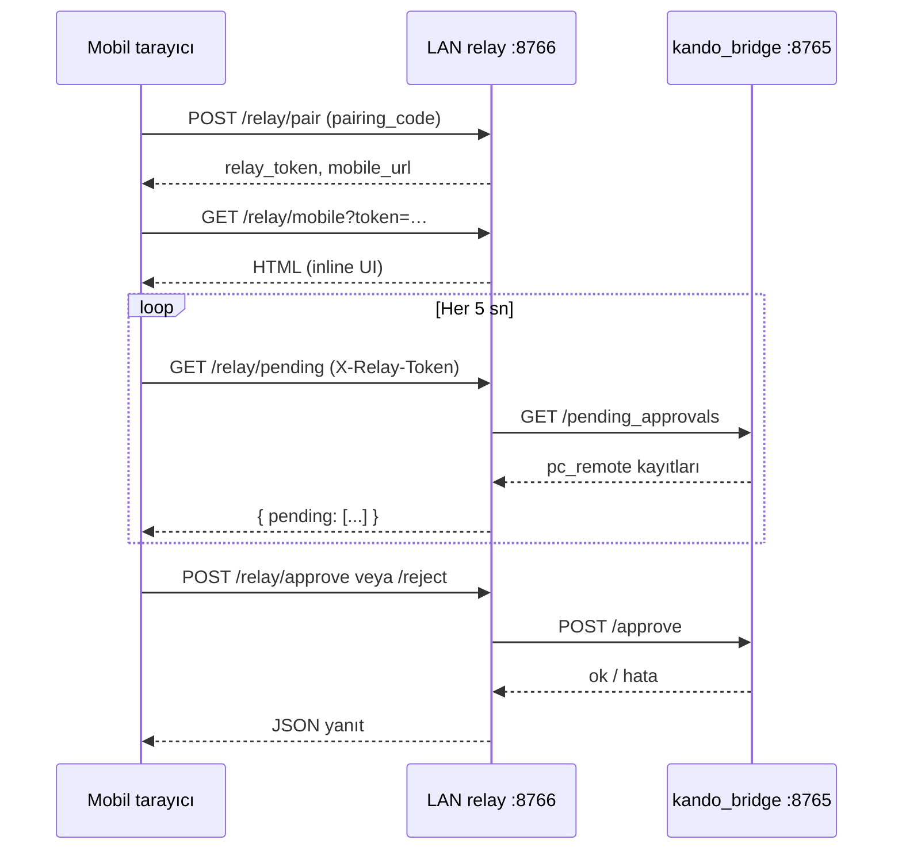
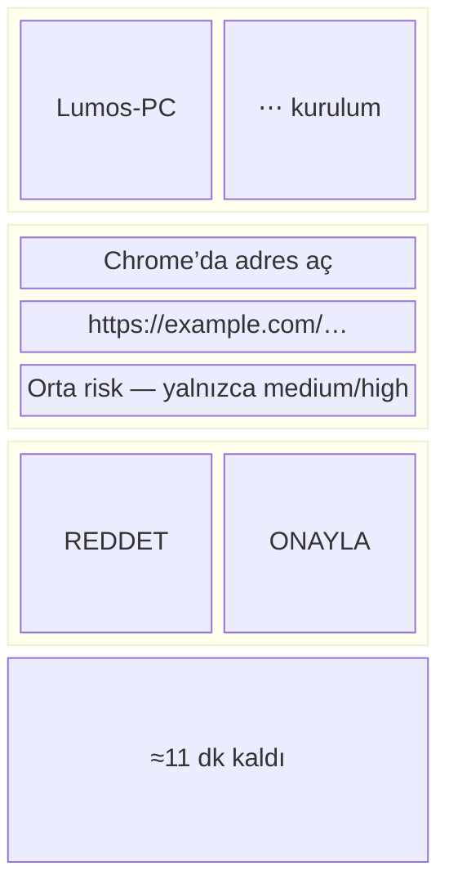

# Mobil Onay / Red UX İncelemesi

| Alan | Değer |
|------|-------|
| Durum | **Analiz** — kod değişikliği yok |
| Tarih | 2026-06-22 |
| Hedef | Tek elle **2 saniyede** güvenli karar |
| Kaynak kod | `packages/kando_bridge/src/kando_bridge/lan_relay.py` → `build_mobile_ui_html()` |
| Statik varlık | Yok — HTML/CSS/JS tamamen inline |
| İlgili | [`device-connection-information-architecture.md`](device-connection-information-architecture.md), [`mobile-approve-reject-ui-verification.md`](mobile-approve-reject-ui-verification.md), RB-17 `inactiveBadge` dili |

---

## 1. Mevcut ekran akışı

Kaynak: `build_mobile_ui_html()` (satır ~174–341, `lan_relay.py`).

### 1.1 Eşleştirme (pair)

1. PC tarafında LAN relay çalışır (`:8766`); 6 karakter `pairing_id` üretilir.
2. Mobil cihaz `POST /relay/pair` ile kodu gönderir.
3. Yanıt: `relay_token` + `mobile_url` → `/relay/mobile?token=<relay_token>`.
4. Tarayıcı bu URL’yi açar; JS `params.get("token")` ile token’ı `sessionStorage` (`lumos_relay_token`) içine yazar ve token giriş kutusunu gizler.

**Token yoksa:** Header altında `#token-setup` görünür — metin alanı + «Kaydet / Save» düğmesi; kullanıcı token’ı elle yapıştırmalı.

### 1.2 Bekleyen listeyi görme

1. Sayfa yüklenince `poll()` çağrılır; ardından **5 sn** aralıkla `setInterval(poll, 5000)`.
2. `GET /relay/pending` (`X-Relay-Token` header) → köprüden filtrelenmiş `pc_remote` kayıtları.
3. Header `#status`: önce «Yükleniyor… / Loading…», sonra `"N bekleyen / pending"`.
4. `#list` içinde **her kayıt için ayrı kart** oluşturulur (`renderItem`); boşsa «Bekleyen istek yok / No pending requests».

### 1.3 Kart içeriği (tek pending)

Her kart (`article.card`) sırasıyla:

| Sıra | DOM | Veri kaynağı |
|------|-----|--------------|
| 1 | `.cmd` (kalın) | `item.command` veya yoksa `item.approval_id` |
| 2 | `.meta` | `item.required_user_action` (TR+EN birleşik metin) |
| 3 | `.risk` (sarı rozet) | `item.risk_level` veya `"unknown"` |
| 4 | `.meta` | `Bitiş / Expires: ` + ham ISO `expires_at` |
| 5 | `pre.preview` (monospace) | `JSON.stringify(arguments_preview \|\| arguments, null, 2)` |
| 6 | `.actions` 2 sütun grid | «Onayla / Approve» (yeşil) · «Reddet / Reject» (kırmızı) |

### 1.4 Onay / red + geri bildirim

1. Düğmeye tıklanınca her iki düğme `disabled` olur.
2. `POST /relay/approve` veya `POST /relay/reject` — gövde: `approval_file`, `approval_token`, `approval_id` (kullanıcıya gösterilmez).
3. Başarı: `#status` → «Onaylandı / Approved» veya «Reddedildi / Rejected»; `poll()` yeniden listeler.
4. Hata: `#status` → «Hata / Error: …»; düğmeler tekrar etkin.

### 1.5 Akış diyagramı



---

## 2. Gereksiz alanlar

2 saniyelik tek elle kullanım için **kaldırılmalı veya varsayılan kapalı** tutulmalı alanlar (mevcut HTML’e dayalı):

### 2.1 Çift dilli (TR/EN) her satır

- Başlık: «Lumos Onay / Approval»
- Alt başlık, durum, düğmeler, boş durum — hepsi iki dil.
- **Etki:** Okuma yükü ~2×; 2 sn hedefi için tek dil (cihaz `lang` veya kullanıcı tercihi) yeterli.

### 2.2 Teknik komut adı birincil başlık

- `.cmd` doğrudan `pc_open_url`, `pc_type_text` vb. gösterir.
- `required_user_action` zaten anlamlı metin içerir (`pc_remote_tools._REQUIRED_USER_ACTION`).
- **Etki:** Kullanıcı önce makine adını okur; asıl karar metni ikinci sırada kalır.

### 2.3 Ham JSON `arguments_preview`

- `pre.preview` tüm argümanları pretty-print JSON olarak gösterir (monospace, kaydırılabilir).
- Örnek: `{ "url": "https://…" }` — URL tek satırda yeterli; JSON süslü parantezleri gürültü.
- **Etki:** Dikey alan tüketir; başparmak bölgesinden uzaklaştırır; tek elle kaydırma gerektirir.

### 2.4 Risk rozeti — her zaman, tüm seviyeler

- `.risk` **low** dahil her kayıtta gösterilir; stil tek tip sarı (`#fef3c7` / koyu mod `#422006`).
- `unknown` da aynı rozetle çıkar.
- RB-17 ilkesi: `preview` / `unknown` nötr outline; success/error (ve yüksek risk) ayrı dil (**device-connection IA §2.3, §4**).
- **Etki:** Düşük riskte rozet dikkat çalar ama anlam taşımaz; «unknown» korkutucu/teknik.

### 2.5 Ham ISO `expires_at`

- «Bitiş / Expires: 2026-06-22T14:30:00+00:00» — kullanıcı yerel «≈12 dk kaldı» bekler.
- **Etki:** Teknik; acil karar için ikincil bilgi (collapse veya sadece <2 dk kala uyarı).

### 2.6 Header alanı (sticky)

- `h1` + `.sub` + `#status` + olası token kutusu sticky (`position: sticky`).
- **Etki:** Küçük ekranda ~80–120 px sürekli kaplar; kart ve düğmeler aşağı iter.

### 2.7 Çoklu kart listesi

- `items.forEach` — tüm pending’ler aynı anda render.
- Sıralama / «en yeni önce» UI tarafında yok (sunucu sırasına bağlı).
- **Etki:** Birden fazla istekte hangi karta odaklanılacağı belirsiz; 2 sn hedefi **tek kart** odaklı akışa aykırı.

### 2.8 Durum satırı sayacı

- «3 bekleyen / pending» — operatör bilgisi; karar anında gereksiz.
- **Etki:** Header’da ekstra satır; tek pending senaryosunda anlamsız.

### 2.9 Token kurulum kutusu (ilk oturum)

- Pair sonrası URL’de token varsa sorun yok; yoksa manuel yapıştırma gerekir.
- Placeholder «Relay token / eşleştirme token» teknik.
- IA: secret/token değerleri panelde gösterilmez (**§6**); mobilde de kalıcı gösterim minimum olmalı — bu kutu zorunlu ama **onay akışının parçası değil**, ayrı «kurulum» modu olmalı.

---

## 3. Eksik alanlar

Hızlı ve güvenli karar için mevcut HTML’de **olmayan** öğeler:

### 3.1 Düz dilde tek satırlık eylem özeti

- Mevcut: komut adı + uzun `required_user_action` + JSON.
- Eksik: «**Chrome’da şu adresi aç**» gibi argümandan türetilmiş **tek cümle** (`description_tr` + `url` / `app_name` birleşimi).
- Backend’de `COMMAND_SPECS.description_tr` ve `arguments_preview` var; UI bunları birleştirmiyor.

### 3.2 Büyük başparmak hedefleri (thumb zone)

- Düğmeler: `padding: 0.75rem`, `font-size: 0.9375rem`, 2 eşit sütun.
- Tahmini yükseklik ~44–48 px — sınırda; geniş ekranlarda yatay alan iyi, **tek elle ulaşım için alt sabit (sticky footer) veya tam genişlik dikey stack** yok.
- **Eksik:** Approve sağ-alt «başparmak bölgesi» (≈72 px yükseklik); Reject ikincil / uzak veya swipe.

### 3.3 Tek pending odak modu

- En yeni veya tek bekleyen tam ekran kart; diğerleri «+2 daha» özeti.
- **Eksik:** Liste-first tasarım; odak modu yok.

### 3.4 Risk rozeti — koşullu ve anlamlı

- **Eksik:** `low` → rozet yok; `medium` → nötr outline (RB-17 «Önizleme» tonu); `high` → uyarı rengi (amber/kırmızı outline, success yeşili değil).
- `meta` risk tier için ayrı renk yok.

### 3.5 Haptic / titreşim geri bildirimi

- Web: `navigator.vibrate` onay/red sonrası (destekleyen cihazlarda).
- **Eksik:** Tamamen yok.

### 3.6 Kaydırma jestleri (swipe)

- Swipe right → onay, swipe left → red (onay diyaloğu veya geri alma penceresi ile).
- **Eksik:** Yalnızca düğme tıklaması.

### 3.7 Anlık görsel geri bildirim

- Başarıda kart animasyonu / tam ekran ✓; hatada net mesaj (RB-17: korkutmadan, «doğrulanamadı» dili).
- Mevcut: yalnızca `#status` metin değişimi.

### 3.8 PC / cihaz bağlamı

- `target_device`, `requested_by`, `device_name` (relay state) kartta yok.
- **Eksik:** «Lumos-PC isteği» tek satır bağlam (hangi makineye onay verildiği).

### 3.9 Süre uyarısı (kritik eşik)

- TTL 900 sn (**mobile-approve-reject-ui-verification.md §4**); UI ham timestamp gösterir.
- **Eksik:** «Son 2 dakika» vurgusu veya progress göstergesi.

### 3.10 Yüksek risk için ek onay

- `pc_open_app`, `pc_type_text` → `high`; tek dokunuş red yeterli olabilir ama **high için Reject kolay, Approve çift adım** (basılı tut / «Emin misin?») yok.

---

## 4. Örnek wireframe (optimize layout)

Hedef: tek pending, minimal header, büyük düğmeler, risk yalnızca medium/high.

### 4.1 ASCII

```
┌─────────────────────────────────────┐
│ Lumos-PC · Onay bekliyor      [···] │  ← cihaz adı + overflow (token/kurulum)
├─────────────────────────────────────┤
│                                     │
│   Chrome’da adres aç                │  ← description_tr + argüman özeti
│   https://example.com/docs          │  ← tek satır, truncate + tap-to-expand
│                                     │
│              [ Orta risk ]            │  ← yalnızca medium/high; outline badge
│                                     │
│                                     │
│                                     │
├─────────────────────────────────────┤
│  ┌─────────────┐ ┌─────────────┐   │
│  │   REDDET    │ │   ONAYLA    │   │  ← min 56px yükseklik; ONAYLA sağda yeşil
│  └─────────────┘ └─────────────┘   │
│         ≈11 dk kaldı                │  ← göreli süre; ham ISO yok
└─────────────────────────────────────┘
     ↑ safe-area-inset-bottom (iPhone)

Boş durum:
┌─────────────────────────────────────┐
│ Lumos-PC                            │
│                                     │
│         Bekleyen istek yok          │
│    PC’de yeni bir işlem gelince     │
│         bildirim alırsınız          │
└─────────────────────────────────────┘
```

### 4.2 Mermaid (bileşen hiyerarşisi)



**Bilinçli olarak yok:** `pc_open_url`, `approval_id`, `approval_file`, ham JSON, çift dil aynı satırda.

---

## 5. 2 saniye hedefi — önerilen değişiklikler listesi

Öncelik: **P0** = doğrudan 2 sn engeli · **P1** = güven/karar kalitesi · **P2** = cilalı deneyim.

| # | Öncelik | Değişiklik | Gerekçe (mevcut HTML) |
|---|---------|------------|------------------------|
| 1 | **P0** | Tek pending tam ekran; diğerleri collapsed | `forEach` çoklu kart scroll gerektirir |
| 2 | **P0** | Birincil metin = düz dil özet (`description_tr` + argüman); `command` gizle | `.cmd` şu an `pc_*` gösteriyor |
| 3 | **P0** | JSON `pre.preview` kaldır; URL/metin tek satır, «detay» ile expand | Monospace blok en büyük gürültü kaynağı |
| 4 | **P0** | Tek dil (TR varsayılan); `/` ile birleşik çift dili kaldır | Her etikette okuma süresi 2× |
| 5 | **P0** | Onay/Red düğmeleri sticky footer, min **56×48 px**, Approve sağ | `.actions` kart içinde, `0.75rem` padding |
| 6 | **P1** | Risk rozeti yalnız `medium`/`high`; `low` gizle; renk RB-17 outline/nötr | `.risk` her zaman sarı, `unknown` dahil |
| 7 | **P1** | `expires_at` → göreli süre («≈12 dk»); ham ISO gizle | `.meta` ham ISO gösteriyor |
| 8 | **P1** | Header sadeleştir: sticky kaldır veya tek satır | `header` sticky + 3 satır metin |
| 9 | **P1** | «Lumos-PC» cihaz adı (relay `device_name`) kart üstünde | Bağlam IA §1.2 ile hizalı |
| 10 | **P1** | `high` risk: Approve için basılı tut veya ikinci onay | Tek dokunuş yüksek riskte yetersiz |
| 11 | **P2** | Swipe right/left jestleri + `navigator.vibrate` | Tamamen eksik |
| 12 | **P2** | Onay/red sonrası tam ekran kısa feedback (1 sn) | Yalnızca `#status` metni |
| 13 | **P2** | Poll aralığı: pending varken 2 sn, boşken 10 sn | Sabit 5 sn |
| 14 | **P2** | Token kurulumu ayrı `/relay/mobile/setup` veya modal; onay ekranından ayır | `#token-setup` header’da karışık |
| 15 | **P2** | RB-17 «Önizleme» banner (demo MVP) | OSS demo sınırı; «tam ürün değil» beklentisi |

*Bu liste gelecek PR için öneridir; bu görevde uygulanmadı.*

---

## 6. Erişilebilirlik

Mevcut CSS ölçüleri (`build_mobile_ui_html`) ve WCAG / platform rehberleri karşılaştırması.

### 6.1 Dokunma hedefi boyutu

| Öğe | Mevcut | Apple HIG / Material | Durum |
|-----|--------|----------------------|-------|
| Onay / Red düğmesi | `padding: 0.75rem` (12px) × 2 + ~15px metin ≈ **39–44 px** yükseklik | Min **44×44 pt** (Apple), **48 dp** (Material öneri) | **Sınırda / düşük** — özellikle yan yana 2 sütunda genişlik ~50% ekran |
| Token kaydet | Aynı `button` stili | 44 px | Sınırda |
| Token input | `padding: 0.625rem` | 44 px dokunma alanı | Input yüksekliği ~**~36 px** — düşük |

**Öneri:** Primary aksiyonlar min **56 px** yükseklik; düğmeler arası gap ≥ **8 px** (mevcut `0.5rem` = 8 px — OK).

### 6.2 Kontrast

| Öğe | Renk | Not |
|-----|------|-----|
| Onayla | `#fff` on `#16a34a` | WCAG AA büyük metin için genelde yeterli |
| Reddet | `#fff` on `#dc2626` | Yeterli |
| `.sub`, `#status`, `.meta` | `#71717a` on `#f4f4f5` (light) | Küçük metin (`0.75–0.8125rem`) için kontrast **sınırda** (~4.2:1); caption için AA Large altı |
| `.risk` rozeti | `#92400e` on `#fef3c7` | Okunabilir; ancak tüm riskler aynı — anlamsal ayrım yok |
| Dark mode | `--muted: #a1a1aa` on `#09090b` | Daha iyi kontrast |

**Öneri:** Durum/meta metinleri min **4.5:1**; risk rozeti RB-17 outline stili (`border` + `text-secondary`, success/error ile karışmaz).

### 6.3 Diğer a11y boşlukları

- **Focus görünürlüğü:** `button` için `:focus-visible` outline tanımlı değil.
- **Ekran okuyucu:** Kartlar `article` ama `aria-live` yok; `#status` değişimleri duyurulmuyor.
- **Hareket:** `prefers-reduced-motion` desteği yok.
- **Dil:** `html lang="tr"` sabit; EN içerik karışık — ekran okuyucu telaffuz tutarsız.
- **Renk tek başına:** Reddet yalnızca kırmızı; «Reddet» metni var — OK.

### 6.4 RB-17 dil hizası

Panel inactive modül rozeti:

- TR: **«Önizleme»** — «Bilgi ve önizleme ekranı — tam modül işlevi aktif değil»
- Stil: outline, `text-secondary`; success/error ile karışmaz

Mobil onay ekranı **operasyonel** (preview değil); ancak OSS demo MVP olduğu için:

- Üst banner: «Demo onay ekranı — gerçek OS kontrolü yok» (nötr, RB-17 tonu)
- `unknown` / bağlantı hatası: «Doğrulanamadı» (kırmızı alarm değil, IA §2.3 `unknown` nötr)
- Risk rozetleri success yeşili ile karışmamalı (Approve yeşili zaten var — risk rozeti outline kalmalı)

---

## 7. Özet karar

| Boyut | Mevcut | 2 sn hedefi |
|-------|--------|-------------|
| İlk anlamlı bilgi | `pc_open_url` | «Chrome’da adres aç» + URL |
| Karar süresi tahmini | 5–15 sn (okuma + scroll) | ≤ 2 sn (tek kart + büyük Approve) |
| Tek elle ergonomi | Orta (düğmeler kart ortasında) | Yüksek (sticky footer, sağ Approve) |
| RB-17 hizası | Risk rozeti her zaman sarı | Koşullu, nötr/outline |
| Gizlilik (IA §6) | Token URL’de; JSON argüman açık | Token kurulum ayrı; tek satır özet |

**Doğrulama referansı:** [`mobile-approve-reject-ui-verification.md`](mobile-approve-reject-ui-verification.md) — fonksiyonel akış (pair, poll, approve/reject) **pass**; bu belge **UX katmanını** değerlendirir.

---

*Son güncelleme: 2026-06-22 — analiz only; kod değişikliği yok.*
