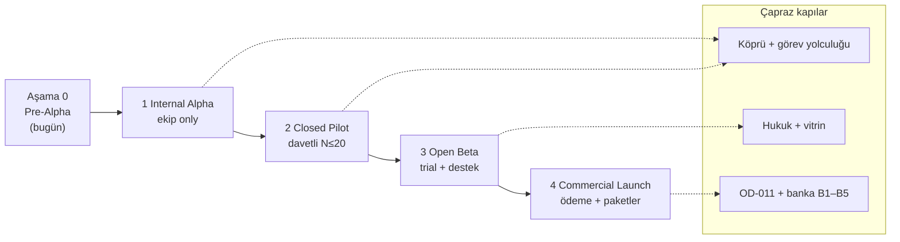

# Lumos — Ticari Öncesi Release Planı

| Alan | Değer |
|------|--------|
| **Belge ID** | `pre-commercial-release-plan` |
| **Durum** | `planlama` — strateji ve aşama tanımı; kod veya taahhüt tarihi içermez |
| **Tarih** | 2026-06-21 |
| **Kapsam** | Internal Alpha → Closed Pilot → Open Beta → Commercial Launch |
| **Dil** | Türkçe (birincil) |
| **Üst sınır** | [`docs/lumos-karar-sozlesmesi.md`](../lumos-karar-sozlesmesi.md) — güvenlik, yetki, kalıcı silme ve onay kuralları gevşetilmez |
| **Public sınır** | [`docs/memory/public-repo-boundary.md`](../memory/public-repo-boundary.md) — production credential, PSP detayı, operasyonel endpoint public repoda yok |
| **Ödeme kararı** | OD-011 — [`payment-scope-decision.md`](../memory/payment-scope-decision.md) (`decision-approved` / `implementation-pending`) |
| **Güvenlik codex** | ADR-012 — **kabul edildi, CLOSED değil**; Alpha için enforcement tam kapanış **zorunlu değil**; Commercial Launch öncesi bilinçli durum kaydı gerekir |
| **Son güncelleme** | 2026-06-21 |

---

## Feragat

Bu belge **ürün stratejisi ve aşama tanımıdır**; yasal taahhüt, gelir projeksiyonu veya sabit takvim **değildir**. Örnek süreler yalnızca planlama çerçevesi olarak etiketlenir. Nihai fiyat, PSP, hukuki metinler ve KKTC banka prosedürleri için [`bank-readiness-checklist.md`](./bank-readiness-checklist.md) feragatı geçerlidir. Kod değişikliği veya PR **içermez**.

---

## Yönetici özeti

Lumos bugün **Aşama 0 (Pre-Alpha / foundation)** konumundadır: açık kaynak geliştirme build'i, canlı panel iskeleti (`welockai.com/panel`), Sınırlı mod ve yerel görevler mevcuttur; resmi ücretli hizmet, checkout, entegrasyonlar ve banka hazırlığı **henüz tamamlanmamıştır** ([`README.md`](../../README.md), [`first-customer-reality-check.md`](./first-customer-reality-check.md)).

Ticari öncesi yolculuk dört kullanıcı tanımlı aşamadan geçer:

| Aşama | Amaç | Birincil kitle |
|-------|------|----------------|
| **1 — Internal Alpha** | Kritik hata temizliği, çekirdek yolculuk stabilizasyonu | Yalnızca ekip |
| **2 — Closed Pilot** | Gerçek senaryolar, sınırlı davet, geri bildirim | Davetli erken kullanıcılar (≤10–20) |
| **3 — Open Beta** | Deneme sürümü, destek süreci, onboarding doğrulama | Geniş beta kaydı (self-serve veya waitlist) |
| **4 — Commercial Launch** | Ödeme aktif, paketler aktif, satış hattı açık | Pro / Business müşterileri |

**Commercial Launch için tek cümlelik ana kapı:** OD-011 uygulama paketi + KKTC banka checklist kritik maddeleri (PSP/checkout, yayınlanmış hukuki sayfalar, fiyat/vitrin) kapanmadan canlı tahsilat **açılmaz**.

ADR-012 Security Codex **Alpha'yı bloklamaz**; bilinçli defer + müşteri yüzünde demo/erken erişim sınırı yeterlidir. **Launch öncesi** codex durumu (CLOSED veya resmi defer kaydı) ve müşteri güven iddiası hizalanmalıdır.

---

## Aşama zaman çizelgesi (örnek — taahhüt değil)

*Örnek süre aralıkları (yalnızca planlama): Alpha 4–8 hafta → Pilot 6–12 hafta → Beta 8–16 hafta → Launch (pilot/beta metrikleri + banka hazırlığı sonrası).*

---

## Mevcut durum — Aşama 0 (Pre-Alpha)

| Boyut | Durum | Kanıt |
|-------|--------|-------|
| Panel / deploy | Canlı; Sınırlı mod varsayılan | [`LUMOS_V1_READINESS.md`](../LUMOS_V1_READINESS.md) |
| Ürün olgunluğu | Erken aktif geliştirme; modüller çoğunlukla iskelet | [`README.md`](../../README.md), [`ROADMAP.md`](../../ROADMAP.md) |
| Resmi hizmet / ödeme | Yayınlanmadı | README Release Tracks; OD-011 `implementation-pending` |
| Müşteri güven yüzeyi | Hukuk, fiyat, landing eksik | [`bank-readiness-checklist.md`](./bank-readiness-checklist.md) B3–B5 |
| ADR-012 | Kabul; **CLOSED değil** | [`ADR-012`](../decisions/ADR-012-lumos-security-codex.md) §204–214 |
| Banka / sanal POS | Hazır değil | Bank checklist — B1, B2, B4 |

**Önerilen mevcut aşama:** **Aşama 0 — Pre-Alpha** (Internal Alpha giriş kriterlerinin bir kısmı henüz karşılanmıyor).

---

## Aşama 1 — Internal Alpha

**Amaç:** Yalnızca ekip içinde çalışan, kritik regresyonların giderildiği, «foundation build» olarak etiketlenebilir çekirdek yolculuk.

### Giriş kriterleri

- [ ] Ekip release kapsamı yazılı tanımlandı (minimum: panel + yerel görevler ± köprü ile sohbet; entegrasyon/posta **dışı**).
- [ ] CI yeşil (son merge'den itibaren en az bir tam `ci.yml` run).
- [ ] Bilinen P0/P1 hata listesi oluşturuldu ve sahipleri atandı.
- [ ] README / panel metni «erken geliştirme / alpha» ile hizalı ([`RB-09`](./release-blockers.md#rb-09-readme-kararlı-oss-ürün-iddiası-yok) — bilinçli etiketleme).
- [ ] ADR-012 durumu dokümante: **Alpha, codex CLOSED beklemez**; açık maddeler (PR-C6 wiring, LockState, P2 genişletme, Trust Faz 4) defer veya yol haritası kaydı var.

### Çıkış kriterleri

- [ ] Tanımlı çekirdek yolculuklar ekip içinde **≥2 hafta** kesintisiz tekrarlanabilir:
  - Panel açılış → görev ekleme/düzenleme (yerel)
  - Köprü yapılandırılmış ortamda sohbet gönder/al (veya bilinçli «pilot dışı» defer)
- [ ] P0 hata sayısı = 0; P1'ler kapatıldı veya Pilot'a defer kayıtlı.
- [ ] Kritik regresyon yok: görev verisi kaybı, sessiz kalıcı silme, panel çöküşü (crash).
- [ ] Release checklist referansı düzeltildi veya geçici runbook yazıldı ([`RB-07`](./release-blockers.md#rb-07-release-checklist-dosyası-eksik-readme-kırık-referans)).
- [ ] Ekip «Closed Pilot davet listesi» ve destek yükü tahmini onaylandı.

### Ölçülecek metrikler

| Metrik | Hedef (Alpha) | Not |
|--------|---------------|-----|
| P0 açık hata | 0 | Ekip triage |
| Panel JS crash rate | 0 bilinen repro / hafta | Manuel + prod smoke |
| Görev yolculuğu tamamlama | ≥95% ekip denemesi | time-to-first-task ≤5 dk (ekip) |
| CI başarı oranı | ≥95% merge sonrası 7 gün | `.github/workflows/ci.yml` |
| Köprü+sohbet (yapılandırılmış) | ≥1 güvenilir demo ortamı | Prod Sınırlı mod ayrı izlenir |
| ADR-012 açık madde sayısı | Değişebilir; **Alpha çıkışı için CLOSED şart değil** | Defer kaydı zorunlu |

### Başarısızlık / dur koşulları

- Aynı P0 hata **2+ kez** regresyon → Alpha süresi dondur; kök neden analizi.
- Görev verisi kaybı veya onaysız kalıcı silme kanıtı → **hemen dur**; güvenlik incelemesi.
- CI sürekli kırmızı (>3 ardışık merge) → Alpha genişletme yok.
- Ekip çekirdek yolculuğu 4 hafta içinde tekrarlanamıyorsa → kapsam daralt veya köprü önkoşulunu yeniden tanımla.

### Release blocker / banka eşlemesi (Alpha)

| Kaynak | Alpha'da kapanması | Alpha'da bilinçli defer |
|--------|-------------------|-------------------------|
| RB-01 ADR-012 CLOSED | Hayır | Evet — defer kaydı |
| RB-02, RB-03, RB-04, RB-05 | Hayır (teknik) | Evet — müşteri yok |
| RB-06, RB-08 packaging/CI publish | Kısmi | PyPI zorunlu değil; temiz kurulum notu yeterli |
| RB-09, RB-17 erken geliştirme etiketi | **Evet** | — |
| RB-10 vault prod | Hayır | Demo-stub etiketi |
| Bank B1–B5 | Hayır | Tümü defer — ödeme yok |
| OD-011 uygulama | Hayır | Bilinçli kapsam dışı |

---

## Aşama 2 — Closed Pilot

**Amaç:** Sınırlı davetli kullanıcılarla gerçek iş senaryolarını doğrulamak; ürün-metni ezikliklerini ([`first-customer-reality-check.md`](./first-customer-reality-check.md) E1–E10) erken yakalamak.

### Giriş kriterleri

- [ ] Internal Alpha **çıkış kriterleri** tamamlandı.
- [ ] Pilot kullanıcı sözleşmesi / erken erişim metni hazır (ücretli veya ücretsiz pilot — **checkout şart değil**).
- [ ] Davet listesi ≤20; segment: Pro hedef persona ([`commercial-product-packaging.md`](./commercial-product-packaging.md) §2).
- [ ] Panelde **Sınırlı mod** ve «ne çalışır / ne çalışmaz» onboarding metni yayında ([`first-customer-reality-check.md`](./first-customer-reality-check.md) E2, E3).
- [ ] Destek kanalı (en az e-posta veya doğrudan kurucu hattı) **yazılı** ve yanıt SLA'si «best effort» olarak bildirildi (E9).
- [ ] Modül menüsünde planlanmamış özellikler **«henüz aktif değil»** ile işaretlendi veya gizlendi (E3, E4).
- [ ] Köprü: pilot kohort için en az bir barındırılmış köprü **veya** yazılı self-host kurulum rehberi.

### Çıkış kriterleri

- [ ] ≥5 pilot kullanıcı **≥14 gün** aktif (haftada ≥2 oturum veya ≥3 görev işlemi).
- [ ] Pilot geri bildirim döngüsü tamamlandı (anket veya yapılandırılmış görüşme).
- [ ] Kritik UX/regresyon bulguları P0/P1 olarak kapatıldı veya Beta defer kayıtlı.
- [ ] «Resmi hizmet henüz satışta değil / pilot» mesajı tüm pilot yüzeylerinde tutarlı (E1).
- [ ] Churn nedenleri dokümante (en az 3 kategori: Sınırlı mod, boş modül, destek gecikmesi vb.).
- [ ] OSS vs Pro farkı pilot onboarding'de **tek sayfa** özet ([`commercial-product-packaging.md`](./commercial-product-packaging.md) §1.3; E6).

### Ölçülecek metrikler

| Metrik | Hedef (Pilot) | Not |
|--------|---------------|-----|
| Aktif pilot kullanıcı (14 gün) | ≥5 / davetli ≤20 | Gerçek kullanım |
| time-to-first-task | Medyan ≤10 dk | İlk görev kaydı |
| 7-gün retention | ≥50% davetliler | Oturum veya görev aktivitesi |
| Pilot NPS (veya CSAT 1–5) | ≥20 (NPS) veya ortalama ≥3,5 | Küçük N — trend önemli |
| Destek ilk yanıt süresi | Medyan ≤48 saat | Best effort; SLA iddiası yok |
| Sınırlı mod → köprü kurulum oranı | İzlenir; hedef TBD | Köprü ops yükü |
| P0 müşteri-yüzü hata | 0 açık | Veri kaybı, yanıltıcı prod iddiası |
| Crash / panel yükleme hatası | <2% oturum (raporlanan) | Destek + telemetry (varsa) |

### Başarısızlık / dur koşulları

- Pilot NPS **<0** veya ≥3 kullanıcı aynı P0 sorunu → pilot genişletme durdur; Alpha'ya geri dönüş değerlendir.
- «Ödedim / resmi hizmet sandım» anlaşmazlığı (ücretli pilot varsa) → satış durdur; metin düzelt.
- Gizlilik/onay ihlali şüphesi → **hemen dur**; [`lumos-karar-sozlesmesi.md`](../lumos-karar-sozlesmesi.md).
- ≥50% pilot 7 gün içinde churn + «hiçbir şey yapamadım» → köprü/kapsam yeniden tanımı zorunlu.
- Boş modül keşfi kaynaklı güven kaybı tekrarlanıyorsa → menü/rozet düzeltmesi olmadan Beta'ya geçilmez.

### Release blocker / banka eşlemesi (Pilot)

| Kaynak | Pilot'ta kapanması | Pilot'ta defer |
|--------|-------------------|----------------|
| RB-02 köprü wiring | Kısmi — pilot sohbet gerekiyorsa | Teknik borç kabul edilebilir; müşteriye «beta» etiketi |
| RB-03 LockState | Kısmi | Tutarsız kilit algısı pilot geri bildiriminde izlenir |
| RB-16 stub vs prod iddiası | **Evet** (müşteri dili) | — |
| RB-17 iskelet modüller | **Evet** (rozet/gizleme) | — |
| First-customer #1 iş yapabilirlik | **Kısmi hedef** | Yerel görev + (opsiyonel) köprü sohbet |
| First-customer #2 ödeme | Defer | Checkout yok — pilot sözleşmesi |
| Bank B1–B5 | Defer | Ön kayıt / pilot görüşmesi only |
| OD-011 | Defer | Bilinçli |

---

## Aşama 3 — Open Beta

**Amaç:** Deneme (trial) sürümü ile daha geniş kitle; destek süreci, onboarding ve self-serve kayıt akışını doğrulamak — **henüz tam ticari tahsilat olmadan**.

### Giriş kriterleri

- [ ] Closed Pilot **çıkış kriterleri** tamamlandı.
- [ ] Beta katılım politikası: waitlist veya açık kayıt; kapasite üst sınırı tanımlı (ör. 100–500 — **örnek**).
- [ ] **Yayınlanmış** minimum hukuki yüzey:
  - Gizlilik politikası taslağı (hukuk gözden geçirmiş)
  - Kullanım koşulları (beta / erken erişim maddesi)
  - İptal/iade çerçevesi (checkout yoksa «beta ücretsiz / trial» net)
- [ ] İletişim sayfası: şirket adı, erişilebilir e-posta, **[KKTC]** için fiziksel adres veya kayıtlı iş adresi ([`bank-readiness-checklist.md`](./bank-readiness-checklist.md) §3).
- [ ] Landing / vitrin (OD-048) beta iddia seviyesi ile — paket isimleri Packaging ile uyumlu; **fiyat TBD** açıkça yazılı.
- [ ] Destek süreci: ticket/e-posta akışı, iç runbook, escalation yolu.
- [ ] Onboarding: Sınırlı mod, Starter vs beta hizmet farkı, modül durumu.
- [ ] Trial süresi tanımı (ör. 14 gün — Packaging §5.2 **öneri**); checkout **Beta girişinde zorunlu değil**, checkout'suz trial veya «beta ücretsiz» modeli seçilmeli.

### Çıkış kriterleri

- [ ] ≥30 beta kullanıcı ≥30 gün kayıtlı; ≥15'i aktif (haftalık oturum).
- [ ] Destek süreci en az **20 ticket** veya eşdeğer talep ile doğrulandı; medyan ilk yanıt ve çözüm süreleri kayıtlı.
- [ ] Onboarding tamamlama oranı ≥60% (tanımlı adımlar: hesap/kayıt → ilk görev → modül turu).
- [ ] Bilinen P0 = 0; P1 <5 veya Launch defer kayıtlı.
- [ ] Beta geri bildirimi: en az 2 iterasyon (UX/copy) uygulandı.
- [ ] Launch go/no-go brifingi: Commercial Launch giriş checklist'i %80+ hazır (banka + OD-011 planı).

### Ölçülecek metrikler

| Metrik | Hedef (Beta) | Not |
|--------|--------------|-----|
| Beta kayıt → ilk görev (TTFT) | Medyan ≤8 dk | Onboarding kalitesi |
| 30-gün retention | ≥35% kayıtlılar | Gerçekçi erken ürün |
| Trial → «devam etmek istiyorum» (intent) | ≥40% anket yanıtı | Ödeme öncesi niyet |
| Destek CSAT | Ortalama ≥3,5 / 5 | Süreç doğrulama |
| Destek medyan ilk yanıt | ≤24 saat (beta hedef) | Packaging Pro SLA öncesi prova |
| Crash rate (raporlanan) | <1% oturum | |
| Modül «boş keşif» şikâyeti | Haftalık trend ↓ | E3 takibi |
| Hukuki sayfa görüntüleme / kabul | ≥90% kayıt akışında | KVKK onay noktası |

### Başarısızlık / dur koşulları

- Hukuki sayfalar yayınlanmadan geniş beta **açılmaz** (bank checklist B3).
- Destek kuyruğu >72 saat medyan yanıt **4 hafta** → beta büyümesi durdur; süreç düzelt.
- 30-gün retention **<20%** ve birincil neden «ürün değer vermiyor» → Launch ertele; kapsam gözden geçir.
- Checkout'suz «14 gün deneme» metni checkout olmadan yayınlanamaz (E7) — beta modeli netleştir.
- Veri/gizlilik şikâyeti veya medya riski → beta dondur.

### Release blocker / banka eşlemesi (Beta)

| Kaynak | Beta'da kapanması | Beta'da defer |
|--------|-------------------|---------------|
| Bank B3 hukuki sayfalar | **Evet** (yayınlanmış) | — |
| Bank B5 landing + iletişim | **Evet** (minimum) | Tam fiyat listesi defer edilebilir («TBD») |
| Bank B2 checkout | Defer | Beta ücretsiz / waitlist |
| Bank B1 PSP | Defer | Launch öncesi |
| RB-07 release checklist | **Evet** | Beta release notları |
| RB-09 README hizası | **Evet** | Beta etiketi |
| OD-041 ticari onay UX | Kısmi | Tam ödeme akışı yok |
| ADR-012 CLOSED | Defer | Launch brifinginde durum raporu |

---

## Aşama 4 — Commercial Launch

**Amaç:** Ödeme aktif, Pro/Business paketleri satışta, KKTC banka/sanal POS uyumlu tahsilat, satış ve destek hattı operasyonel.

### Giriş kriterleri

- [ ] Open Beta **çıkış kriterleri** tamamlandı.
- [ ] **OD-011 uygulama paketi** onaylandı ve uygulandı (PSP, checkout, webhook, abonelik durumu — private katman).
- [ ] [`bank-readiness-checklist.md`](./bank-readiness-checklist.md) **kritik blockers** kapalı:
  - **B1** PSP seçimi + merchant/sanal POS başvuru paketi
  - **B2** Checkout / ödeme akışı (sandbox + canlı test)
  - **B3** Yayınlanmış hukuki sayfalar (gizlilik, kullanım, iade, çerez)
  - **B4** Fiyat listesi + vergi/fatura akışı **[KKTC]** mali müşavir onayı
  - **B5** Ticari landing, iletişim, destek kanalı
- [ ] Pro paket self-serve veya teklif usulü Business yolu tanımlı ([`commercial-product-packaging.md`](./commercial-product-packaging.md) §3).
- [ ] PCI ilkesi: kart verisi Lumos yüzeyinde tutulmaz — PSP hosted/embedded ([`bank-readiness-checklist.md`](./bank-readiness-checklist.md) §1).
- [ ] İptal/iade self-servis veya destek yolu **canlı** (Packaging §6).
- [ ] ADR-012: **CLOSED** veya resmi «accepted-as-is / defer» kaydı + müşteri güven iddiası ile uyumlu release notu (**Launch için bilinçli durum zorunlu**).
- [ ] Vault/entegrasyon iddiası: prod değilse README/panel **demo-stub sınırı** ([`RB-10`](./release-blockers.md#rb-10-vault-kritik-kararlar-implementation-pending-od-001005), [`RB-16`](./release-blockers.md#rb-16-mailvault-public-stub-vs-prod-iddiası)).
- [ ] Publish/release CI veya resmi manuel release runbook ([`RB-08`](./release-blockers.md#rb-08-publishrelease-ci-pipeline-yok)).
- [ ] Hukuk + mali onay: fiyat, vergi, mesafeli satış **[KKTC]**, e-fatura/e-arşiv süreci.

### Çıkış kriterleri

*Commercial Launch «çıkış» = operasyonel sürdürülebilirlik doğrulaması (ör. ilk 90 gün).*

- [ ] Canlı tahsilat: ≥1 başarılı Pro abonelik + (varsa) ≥1 Business sözleşmesi.
- [ ] Sandbox → production geçişi tamamlandı; reconciliation süreci işliyor.
- [ ] Chargeback/itiraz runbook test edildi (Packaging §6.3).
- [ ] Destek SLA hedefleri ölçülüyor (Pro: ilk yanıt hedefi — Packaging §7.2 **TBD değerler**).
- [ ] Launch sonrası 30 gün: ödeme başarı oranı, churn, P0 = 0.
- [ ] Banka/PSP periyodik raporlama gereksinimleri karşılanıyor **[KKTC]**.

### Ölçülecek metrikler

| Metrik | Hedef (Launch — ilk 90 gün) | Not |
|--------|----------------------------|-----|
| Ödeme başarı oranı | ≥95% (PSP onaylı işlemler) | 3DS hariç kullanıcı iptali ayrı |
| Checkout → aktif abonelik | ≥60% tamamlanan | Sepet terk izlenir |
| time-to-first-paid-value | Medyan ≤24 saat (ödeme sonrası ilk görev) | |
| 30-gün ücretli retention | ≥70% Pro | Erken churn alarmı |
| NPS (ücretli) | ≥30 | Küçük N |
| Destek ilk yanıt (Pro) | ≤2 iş günü (SLA hedefi) | Packaging §7.2 |
| Crash rate | <0,5% oturum | |
| Chargeback oranı | <0,5% işlem hacmi | PSP eşiği altında |
| Fatura teslim süresi | ≤24 saat (e-arşiv hedef) | **[KKTC]** mali süreç |
| Fair use / kota ihlali | İzlenir; otomatik askı yok (onay ilkesi) | Packaging §5.3 |

### Başarısızlık / dur koşulları

- OD-011 uygulama veya banka B1–B5 kapanmadan **canlı tahsilat açılmaz** — Launch ertelenir.
- Ödeme başarı oranı **<90%** (7 gün) → checkout kapat; PSP incelemesi.
- Hukuki/vergi uyumsuzluk bulgusu → tahsilat durdur; hukuk onayı.
- ADR-012 açık maddeler müşteri iddiası ile çelişiyorsa (ör. «tam güvenlik» pazarlama) → metin düzelt veya defer kapat.
- Chargeback oranı PSP eşiğini aşarsa → risk incelemesi; yeni satış durdurulabilir.
- «Planlanan» modül Pro tablosunda **«var»** gibi sunulduysa → iade baskısı; derhal vitrin düzeltmesi ([`first-customer-reality-check.md`](./first-customer-reality-check.md) E3, E6).

### Release blocker / banka eşlemesi (Launch)

| Kaynak | Launch'ta kapanması |
|--------|---------------------|
| Bank B1–B5 | **Evet** (kritik) |
| OD-011 uygulama | **Evet** |
| RB-08 publish/release | **Evet** (kanal tanımlı) |
| RB-06 packaging (Pro barındırma) | **Evet** (müşteri pip kurulumu beklememeli) |
| RB-01 ADR-012 | **CLOSED veya resmi defer** + release notu |
| RB-02, RB-03, RB-04 | Karar + müşteri etkisi değerlendirmesi |
| RB-10 vault | Prod iddiası yoksa stub etiketi; iddia varsa implementation |
| First-customer #2, #4, #7, #10 | **Evet** |

---

## Çapraz aşama bağımlılıkları

```mermaid
flowchart TB
  subgraph technical ["Teknik / ürün"]
    T1["Alpha: CI + çekirdek yolculuk"]
    T2["Pilot: köprü + müşteri dili"]
    T3["Beta: onboarding + destek"]
    T4["Launch: OD-011 + artifact"]
    T1 --> T2 --> T3 --> T4
  end

  subgraph legal ["Hukuk / vitrin"]
    L1["Pilot: erken erişim metni"]
    L2["Beta: gizlilik + kullanım + iletişim"]
    L3["Launch: iade + vergi + KKTC fatura"]
    L1 --> L2 --> L3
  end

  subgraph bank ["Banka / KKTC"]
    B1["Pilot/Beta: ödeme yok"]
    B2["Launch: PSP + sanal POS + checkout"]
    B1 --> B2
  end

  subgraph security ["ADR-012"]
    S1["Alpha–Beta: defer OK"]
    S2["Launch: CLOSED veya resmi defer"]
    S1 --> S2
  end
```

| Bağımlılık | Açıklama |
|------------|----------|
| Alpha → Pilot | Çekirdek yolculuk stabil; P0=0 |
| Pilot → Beta | Geri bildirim döngüsü; eziklik metinleri düzeltildi |
| Beta → Launch | Hukuki minimum + destek süreci kanıtlandı |
| Launch ← Bank checklist | B1–B5 **Commercial Launch girişinde** zorunlu |
| Launch ← OD-011 | Uygulama paketi; ilke onayı tek başına yetmez |
| ADR-012 | Alpha/Pilot/Beta **bloklamaz**; Launch'ta bilinçli durum şart |
| Packaging Pro/Business | Launch'ta aktif; Starter OSS paralel kalır |

---

## Release blocker → aşama matrisi (ticari / müşteri lensi)

Tam teknik liste: [`release-blockers.md`](./release-blockers.md). Aşağıda **müşteri veya ticari etkisi** olan maddeler.

| RB | Konu | Alpha | Pilot | Beta | Launch |
|----|------|:-----:|:-----:|:----:|:------:|
| RB-01 | ADR-012 CLOSED | defer | defer | defer | **kapat/defer kayıtlı** |
| RB-02 | Köprü consume_confirmation | defer | izle | izle | karar |
| RB-03 | Panel LockState | defer | izle | izle | karar |
| RB-04 | P2 SECURITY_NEVER_AUTO | defer | defer | defer | karar |
| RB-09 | Erken geliştirme etiketi | **kapat** | **kapat** | **kapat** | **kapat** |
| RB-10 | Vault OD-001–005 | stub etiket | stub etiket | stub etiket | iddia hizası |
| RB-16 | Stub vs prod iddiası | **kapat** | **kapat** | **kapat** | **kapat** |
| RB-17 | Modül iskelet | etiket | **kapat** | **kapat** | **kapat** |
| RB-06 | Python packaging | defer | defer | kısmi | **kapat** |
| RB-07 | Release checklist | kısmi | kısmi | **kapat** | **kapat** |
| RB-08 | Publish CI | defer | defer | defer | **kapat** |
| OD-011 | Ödeme | defer | defer | defer | **kapat** |

*RB-05, RB-11, RB-12, RB-13, RB-14, RB-15: ağırlıklı iç teknik; Launch brifinginde durum raporu yeterli (müşteri görünürlüğü düşük).*

---

## Banka checklist → aşama matrisi

Kaynak: [`bank-readiness-checklist.md`](./bank-readiness-checklist.md). §1–§5 toplam 66 madde; özet kritik kapılar:

| Kapı | Madde | Alpha | Pilot | Beta | Launch |
|------|-------|:-----:|:-----:|:----:|:------:|
| B1 | PSP + merchant başvuru | — | — | hazırlık | **kapat** |
| B2 | Checkout / webhook | — | — | — | **kapat** |
| B3 | Hukuki sayfalar (§4) | — | çerçeve | **yayın** | **kapat** |
| B4 | Fiyat + vergi/fatura (§5) | — | — | TBD OK | **kapat** |
| B5 | Landing + iletişim + destek (§3) | — | minimum | **kapat** | **kapat** |
| §2 | Şirket evrakları | — | — | — | **Dış-only paket** |
| §1 | PCI / onaysız ödeme ilkesi | hazır | hazır | hazır | hazır |

**[KKTC] notu:** Sanal POS, vergi, e-fatura ve tüketici mevzuatı maddeleri Commercial Launch girişinde **yerel avukat ve mali müşavir** doğrulaması gerektirir; repo yalnızca planlama çerçevesi sağlar.

---

## OD-011 ve ADR-012 — aşama notları

### OD-011 (ödeme kapsamı)

| Durum | Etki |
|-------|------|
| `decision-approved` | Onaysız ödeme yasağı, public boundary, PCI ilkesi — Alpha'dan itibaren geçerli |
| `implementation-pending` | PSP, checkout, fatura — **yalnızca Commercial Launch** |
| Needs-review (PSP, vergi, abonelik modeli) | Launch brifinginden önce kapatılmalı |

Alpha / Pilot / Beta bilinçli olarak **tahsilatsız** kalabilir; «14 gün deneme» metni checkout canlı olunca ([`commercial-product-packaging.md`](./commercial-product-packaging.md) §5.2, [`first-customer-reality-check.md`](./first-customer-reality-check.md) E7).

### ADR-012 (Security Codex)

| Aşama | Beklenti |
|-------|----------|
| Internal Alpha | **CLOSED beklenmez**; açık: P2 genişletme, PR-C6 wiring, Trust Faz 4, LockState |
| Closed Pilot | Müşteri «güvenli his» ve onay metinleri; codex kapanışı **blokaj değil** |
| Open Beta | Hukuki sayfalarda sadeleştirilmiş onay/silme ilkeleri |
| Commercial Launch | **CLOSED** veya ADR/open-decisions'da resmi defer; pazarlama iddiası ile uyum zorunlu |

---

## İlk müşteri öncelikleri → aşama hedefi

Kaynak: [`first-customer-reality-check.md`](./first-customer-reality-check.md) Top 10.

| # | Öncelik | Pilot hedefi | Beta hedefi | Launch hedefi |
|---|---------|--------------|-------------|---------------|
| 1 | İş yapabilirlik | Yerel görev + (ops.) köprü sohbet | + onboarding TTFT | + ücretli değer yolu |
| 2 | Kayıt / ödeme | Pilot sözleşmesi | Waitlist/trial | Checkout + fatura |
| 3 | Gizlilik güveni | README ilke | Yayınlanmış politika | Tam hukuk paketi |
| 4 | Entegrasyonlar | «Planlanan» etiket | Aynı | Kademeli Pro özellik |
| 5 | OSS vs Pro farkı | Tek sayfa | Landing tablosu | Fiyat sayfası |
| 6 | Destek | Best effort yazılı | Ticket süreci | SLA ölçümü |
| 7 | İptal/iade | Pilot metni | Beta koşulları | Self-servis + §6 |
| 8 | Onay modeli | Panel metinleri | Günlük kanıt (köprü) | OD-041 UX |
| 9 | Şirket gerçekliği | E-posta | İletişim sayfası | Tam vitrin |
| 10 | Fiyat öngörülebilirliği | Defer | «TBD» şeffaf | Yayınlanmış fiyat |

---

## Go / No-Go brifing şablonu (Launch öncesi)

Her aşama geçişinde kısa brifing önerilir:

1. **Metrikler:** yukarıdaki aşama tablosu — hedef vs gerçek
2. **Açık P0/P1:** sayı ve müşteri etkisi
3. **Eziklik maddeleri:** first-customer E1–E10 durumu
4. **Bank / OD-011:** B1–B5 ve uygulama yüzdesi
5. **ADR-012:** CLOSED / defer durumu
6. **Karar:** geç / geçme / kapsam daralt

---

## Sonraki adımlar (bu belgeye bağlı)

1. Ekip: Internal Alpha giriş checklist'ini mevcut Pre-Alpha boşluklarına göre doldur.
2. [`release-roadmap.md`](./release-roadmap.md) GAP maddelerini Alpha/Beta teknik dalgaları ile eşle (ayrı çalışma).
3. Hukuk: Beta öncesi gizlilik + kullanım taslağı ([`bank-readiness-checklist.md`](./bank-readiness-checklist.md) §4).
4. OD-011 uygulama paketi kickoff — Launch takvimi **bu belgeden türetilmez**; banka hazırlığı tamamlanınca planlanır.
5. Panel: Sınırlı mod + modül rozetleri — Pilot giriş önkoşulu ([`first-customer-reality-check.md`](./first-customer-reality-check.md) E2, E3).

---

## Çapraz referanslar

| Belge | İlişki |
|-------|--------|
| [`commercial-product-packaging.md`](./commercial-product-packaging.md) | Paketler, SLA, iptal/iade çerçevesi |
| [`bank-readiness-checklist.md`](./bank-readiness-checklist.md) | KKTC banka / sanal POS — Launch kapıları |
| [`first-customer-reality-check.md`](./first-customer-reality-check.md) | Müşteri öncelikleri ve eziklik kaynakları |
| [`release-blockers.md`](./release-blockers.md) | RB envanteri (teknik eksen) |
| [`release-readiness-gap-analysis.md`](./release-readiness-gap-analysis.md) | Paketlenebilir sürüm boşlukları |
| [`release-roadmap.md`](./release-roadmap.md) | GAP dalga bağımlılıkları |
| [`payment-scope-decision.md`](../memory/payment-scope-decision.md) | OD-011 |
| [`ADR-012`](../decisions/ADR-012-lumos-security-codex.md) | Security Codex durumu |
| [`README.md`](../../README.md) / [`ROADMAP.md`](../../ROADMAP.md) | Mevcut ürün durumu |

---

*Son güncelleme: 2026-06-21 — strateji belgesi; kod, PR, credential veya taahhüt tarihi yok.*
