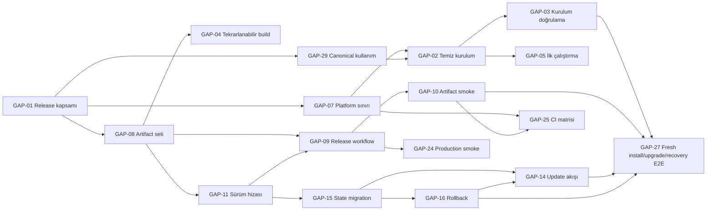

# Lumos — Release Roadmap Bağımlılık Haritası

| Alan | Değer |
|---|---|
| Kaynak | `docs/analysis/release-readiness-gap-analysis.md` |
| Madde sayısı | 31 |
| Minimum kapsam | Limited web panel + sürümlü kaynak/CLI artifact’i |
| Hariç | Kod, refactor, runtime değişikliği, PR, Enforcement/Trust kararı |

## Sınıflandırma ve dalga modeli

Bu roadmap öncelik veya çözüm tavsiyesi değildir. Dalgalar yalnız teknik önkoşul ve kapsam
bağımlılıklarını gösterir.

- **Wave 1 — Kapsam ve sözleşme:** Release yüzeyi, artifact seti, platform sınırı, sürüm
  kaynakları ve canonical belge tabanı.
- **Wave 2 — Üretim ve yaşam döngüsü:** Kurulum, ilk çalıştırma, artifact üretimi,
  migration, rollback ve koşullu connected/backend yüzeyleri.
- **Wave 3 — Release kanıtı:** Temiz kurulum, artifact, platform, production ve kritik
  kullanıcı yolculuğu kapıları.

Sınıf sütununda:

- **Zorunlu:** Minimum kapsam için release öncesi kapanması gereken madde.
- **Ertelenebilir:** Minimum kapsam dışına alınabilen madde.
- **Ertelenebilir (koşullu):** Minimum kapsamda ertelenebilir; ilgili yüzey release’e dahil
  edilirse zorunlu olur.

## Bağımlılık özeti



## Wave 1 — Kapsam ve sözleşme

| Madde | Zorunlu / ertelenebilir sınıfı | Bağımlı olduğu maddeler | Tahmini uygulama dalgası | Release’e etkisi |
|---|---|---|---|---|
| GAP-01 | **Zorunlu** | Yok | Wave 1 | Desteklenen ürün yüzeyi ve sonraki tüm kapsam koşulları tanımsız kalır. |
| GAP-07 | **Zorunlu** | GAP-01 | Wave 1 | R1/R2/R7 için desteklenen işletim sistemi ve runtime sınırı kurulamaz. |
| GAP-08 | **Zorunlu** | GAP-01 | Wave 1 | R2 için hangi artifact’lerin aynı release’i oluşturduğu belirlenemez. |
| GAP-11 | **Zorunlu** | GAP-01, GAP-08 | Wave 1 | Artifact uyumluluğu, hata raporu ve rollback sürüm eşlemesi kurulamaz. |
| GAP-12 | **Zorunlu** | GAP-01 | Wave 1 | Canonical release checklist ve temel kullanıcı belge girişleri eksik kalır. |
| GAP-13 | **Ertelenebilir** | GAP-01, GAP-11 | Wave 1 | Otomatik/canonical changelog eksik kalır; minimumda versioned release notu düzeyiyle sınırlanabilir. |
| GAP-18 | **Ertelenebilir (connected release’te zorunlu)** | GAP-01 | Wave 1 | Connected kapsam seçilirse R4 için account/session yaşam döngüsü tanımsız kalır. |
| GAP-22 | **Ertelenebilir (backend release’te zorunlu)** | GAP-01, GAP-08 | Wave 1 | Backend kapsam seçilirse R4/R6/R7 CI yüzeyi tanımsız kalır. |
| GAP-29 | **Zorunlu** | GAP-01 | Wave 1 | Kurulum ve runtime topolojisi tek canonical kaynaktan okunamaz. |
| GAP-30 | **Zorunlu** | GAP-01, GAP-29 | Wave 1 | Legacy endpoint/yüzey bilgisi release kanıtıyla karışmaya devam eder. |
| GAP-31 | **Ertelenebilir** | GAP-01, GAP-12 | Wave 1 | Geniş katkı/support belgeleri eksik kalır; minimum iletişim yüzeyi GAP-12 kapsamına bağlıdır. |

## Wave 2 — Üretim ve yaşam döngüsü

| Madde | Zorunlu / ertelenebilir sınıfı | Bağımlı olduğu maddeler | Tahmini uygulama dalgası | Release’e etkisi |
|---|---|---|---|---|
| GAP-02 | **Zorunlu** | GAP-01, GAP-07, GAP-08, GAP-29 | Wave 2 | R1/R3 için ürün bileşenleri temiz makinede ortak kurulum akışına giremez. |
| GAP-04 | **Zorunlu** | GAP-08 | Wave 2 | Aynı commit’in dependency çözümü ve UI build sonucu tekrarlanabilir olmaz. |
| GAP-05 | **Zorunlu** | GAP-01, GAP-02, GAP-06, GAP-29 | Wave 2 | İlk açılışta limited/local çalışma ve eksik servis durumu güvenilir biçimde ayrılamaz. |
| GAP-06 | **Zorunlu** | GAP-01, GAP-02 | Wave 2 | Identity/keystore ilk kurulum ve recovery komutları çalıştırılamaz. |
| GAP-09 | **Zorunlu** | GAP-04, GAP-08, GAP-11 | Wave 2 | Tag/sürüm girdisinden doğrulanabilir release artifact’i üretilemez. |
| GAP-14 | **Zorunlu** | GAP-01, GAP-08, GAP-11, GAP-15, GAP-16 | Wave 2 | R5 için sürümler arası geçiş ve uyumluluk akışı kurulamaz. |
| GAP-15 | **Zorunlu** | GAP-01, GAP-11 | Wave 2 | Kalıcı state’in eski ve yeni sürüm arasında okunabilirliği tanımsız kalır. |
| GAP-16 | **Zorunlu** | GAP-08, GAP-11, GAP-15 | Wave 2 | Artifact veya state değişikliği sonrası önceki çalışan sürüme dönüş kanıtlanamaz. |
| GAP-17 | **Ertelenebilir** | GAP-02, GAP-05, GAP-11 | Wave 2 | Birleşik tanı yüzeyi eksik kalır; minimum kurulum doğrulaması GAP-03 tarafından taşınır. |
| GAP-19 | **Ertelenebilir (connected release’te zorunlu)** | GAP-01, GAP-18 | Wave 2 | Connected kapsamda uzak/çok kullanıcılı bridge kimlik doğrulaması kurulamaz. |
| GAP-20 | **Ertelenebilir (connected release’te zorunlu)** | GAP-02, GAP-05, GAP-19 | Wave 2 | Connected kapsamda servis restart/readiness/shutdown yaşam döngüsü tanımsız kalır. |
| GAP-23 | **Ertelenebilir (backend release’te zorunlu)** | GAP-11, GAP-22 | Wave 2 | Backend kapsamda versioned ve geri alınabilir schema geçişi kurulamaz. |
| GAP-26 | **Zorunlu** | GAP-04 | Wave 2 | Duplicate i18n key uyarısı release build’inde sessiz değer ezilmesi bırakır. |

## Wave 3 — Release kanıtı

| Madde | Zorunlu / ertelenebilir sınıfı | Bağımlı olduğu maddeler | Tahmini uygulama dalgası | Release’e etkisi |
|---|---|---|---|---|
| GAP-03 | **Zorunlu** | GAP-02, GAP-04, GAP-06 | Wave 3 | R1/R7 için dokümante edilen temiz kurulumun gerçekten çalıştığı kanıtlanamaz. |
| GAP-10 | **Zorunlu** | GAP-02, GAP-03, GAP-09, GAP-11 | Wave 3 | Source checkout testleri geçse bile yayımlanan artifact’in kurulabilirliği bilinmez. |
| GAP-21 | **Ertelenebilir (connected release’te zorunlu)** | GAP-10, GAP-18, GAP-19, GAP-20, GAP-24 | Wave 3 | Connected kapsamın auth→proxy→bridge→sonuç yolculuğu release artifact’i üzerinde kanıtlanmaz. |
| GAP-24 | **Zorunlu** | GAP-09, GAP-26 | Wave 3 | Deploy sonrası limited panelin temel üretim sağlığı otomatik release kanıtına girmez. |
| GAP-25 | **Zorunlu** | GAP-03, GAP-07, GAP-10 | Wave 3 | İlan edilen platform/runtime aralığı yalnız tek CI ortamında doğrulanmış kalır. |
| GAP-27 | **Zorunlu** | GAP-03, GAP-10, GAP-14, GAP-15, GAP-16 | Wave 3 | Fresh install, upgrade, bozuk state/config ve rollback yolculukları release kapısından geçmez. |
| GAP-28 | **Zorunlu — minimum skip görünürlüğü** | GAP-03, GAP-10 | Wave 3 | Beklenmeyen skip’ler release kanıtındaki eksikleri gizleyebilir; gelişmiş bütçe/raporlama ertelenebilir. |

## Kapsam koşullarının sınıf etkisi

| Release kapsamı | Zorunluya dönen koşullu maddeler | Ek bağımlılık zinciri |
|---|---|---|
| Minimum limited panel + kaynak/CLI artifact | Yok | Temel Wave 1 → Wave 2 → Wave 3 zinciri |
| Connected/full-mode dahil | GAP-18, GAP-19, GAP-20, GAP-21 | GAP-01 → GAP-18 → GAP-19 → GAP-20 → GAP-21 |
| Express/Prisma backend dahil | GAP-22, GAP-23 | GAP-01/GAP-08 → GAP-22 → GAP-23; ardından GAP-27 test kapsamı |
| Connected mode + backend dahil | GAP-18–GAP-23 | İki koşullu zincir Wave 3 full-mode kanıtında birleşir |

## Minimum yayınlanabilir sürüm için en küçük iş kümesi

Bu küme kaynak rapordaki **limited web panel + sürümlü kaynak/CLI artifact’i** minimumuna göre
çıkarılmıştır. Connected/full-mode ve Express/Prisma backend bu kapsamda release artifact’ine
dahil değildir.

### Wave 1 — 7 madde

| Madde | Minimum kapsamdaki rolü |
|---|---|
| GAP-01 | Release yüzeyi ve kapsam sınırı |
| GAP-07 | Desteklenen platform/runtime sınırı |
| GAP-08 | Artifact seti |
| GAP-11 | Bileşen sürüm hizası |
| GAP-12 | Canonical release checklist ve belge girişleri |
| GAP-29 | Canonical kurulum/runtime topolojisi |
| GAP-30 | Stale/çelişkili release kanıtının ayrılması |

### Wave 2 — 9 madde

| Madde | Minimum kapsamdaki rolü |
|---|---|
| GAP-02 | Temiz kurulum akışı |
| GAP-04 | Tekrarlanabilir UI build sözleşmesi |
| GAP-05 | İlk çalıştırma/limited-mode başlangıcı |
| GAP-06 | Identity/keystore init ve recovery yüzeyi |
| GAP-09 | Versioned artifact üretimi |
| GAP-14 | Güncelleme akışı |
| GAP-15 | State version/migration sınırı |
| GAP-16 | Artifact + state rollback sınırı |
| GAP-26 | Uyarısız release build kapısı |

### Wave 3 — 6 madde

| Madde | Minimum kapsamdaki rolü |
|---|---|
| GAP-03 | Temiz kurulum doğrulaması |
| GAP-10 | Üretilmiş artifact install-smoke |
| GAP-24 | Otomatik limited production smoke |
| GAP-25 | İlan edilen platform/runtime CI matrisi |
| GAP-27 | Fresh install + upgrade + recovery + rollback E2E |
| GAP-28 | Minimum unexpected-skip görünürlüğü |

**Toplam minimum iş kümesi: 22 GAP maddesi.**

```text
GAP-01, GAP-02, GAP-03, GAP-04, GAP-05, GAP-06, GAP-07, GAP-08,
GAP-09, GAP-10, GAP-11, GAP-12, GAP-14, GAP-15, GAP-16, GAP-24,
GAP-25, GAP-26, GAP-27, GAP-28, GAP-29, GAP-30
```

Minimum küme dışındaki 9 madde:

```text
GAP-13, GAP-17, GAP-18, GAP-19, GAP-20, GAP-21, GAP-22, GAP-23, GAP-31
```

Bu dış kümede GAP-18–GAP-21 connected release’e, GAP-22–GAP-23 backend release’e dahil
edildiğinde koşullu olarak minimum kümeye eklenir.
