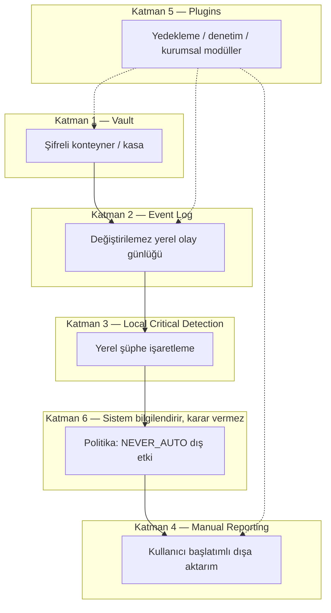

# AnchorUSB — Güvenli Taşınabilir Vault Çerçevesi

| Alan | Değer |
|------|-------|
| Durum | **Mimari** — docs only; uygulama kodu yok |
| Tarih | 2026-06-26 |
| Çalışma adı | **AnchorUSB** (kilitli) |
| Kapsam | USB üzerinde şifreli vault, yerel olay günlüğü, insan-onaylı dış etki |
| İlgili | [`secure-device/README.md`](./secure-device/README.md), [`lumos-karar-sozlesmesi.md`](../lumos-karar-sozlesmesi.md), [`public-repo-boundary.md`](../memory/public-repo-boundary.md) |

**Public OSS sınırı:** Bu belge yalnızca mimari ve politika tanımlar. Polis API entegrasyonu, gizli telemetri, otomatik dış bildirim veya üretim cihaz sırları **kapsam dışıdır**.

---

## Yönetici özeti

**AnchorUSB**, kullanıcının fiziksel USB belleğinde taşınan, şifreli bir **vault** (kasa) ve yerel **olay günlüğü** üzerine kurulu, **insan-onaylı** bir güvenlik çerçevesidir. Sistem **bilgilendirir, karar vermez**: şüpheli durumları yerelde işaretler; dış dünyaya (polis, kurumsal SOC, bulut) herhangi bir ileti yalnızca kullanıcının **açık ve bilinçli** eylemiyle gider.

Model, ev/banka alarm sistemlerine benzer: sensörler olayı kaydeder ve kullanıcıyı uyarır; **otomatik polis çağrısı** veya **gizli uzaktan müdahale** tasarımın parçası değildir. Lumos çekirdeği ile **bağımsız ürün** olarak konumlanır; gelecekte WeLockAI orkestratörüne **isteğe bağlı** kanca takılabilir — zorunlu entegrasyon yoktur.

**MVP önerisi:** Taşınabilir uygulama + USB üzerinde şifreli konteyner dosyası; Rust çekirdek kripto, Python eklenti/CLI katmanı. Ayrıntı: [`secure-device/anchorusb-technical-architecture.md`](./secure-device/anchorusb-technical-architecture.md).

---

## Altı katmanlı mimari

Kullanıcı tarafından onaylanan katman modeli:

### Katman 1 — Vault (Kasa)

USB üzerinde **AES-256-XTS** veya LUKS-benzeri tam-disk/konteyner şifreleme. Anahtar türetimi cihazda; **anahtarlar cihaz dışına çıkmaz**. Kilitsiz mount yalnızca kullanıcı parolası / pairing sonrası ve kullanıcı hazırken.

### Katman 2 — Event Log (Olay günlüğü)

Vault içinde veya konteyner metadata'sında **append-only**, hash-zincirli veya imzalı yerel günlük. Olaylar: mount/unmount, başarısız parola, dosya erişim özeti, şüphe bayrakları. Günlük **dışa otomatik gönderilmez**.

### Katman 3 — Local Critical Detection (Yerel kritik tespit)

Heuristik veya kural tabanlı **yerel** işaretleme: çoklu başarısız kilitleme, beklenmeyen host, hızlı toplu okuma, vault dışı kopya girişimi vb. Çıktı: **bayrak + kullanıcı bildirimi** — otomatik dış aksiyon yok.

### Katman 4 — Manual Reporting (Manuel raporlama)

Kullanıcı «rapor dışa aktar» derse: imzalı, şifreli veya düz metin (kullanıcı seçimi) paket oluşturulur. Hedef: avukat, sigorta, kurumsal IT — **kullanıcı kanalı seçer**. Sistem hedef adres veya API **otomatik seçmez**.

### Katman 5 — Plugins (Eklentiler)

Sözleşmeli arayüz: `encryption`, `backup`, `audit`, `enterprise`. Eklentiler vault ve günlüğe **kullanıcı onayı** ile erişir. Kurumsal eklenti uzaktan silme (wipe) yalnızca **açık kurumsal politika + kullanıcı/kurum onayı** ile; varsayılan yok.

### Katman 6 — «Sistem bilgilendirir, karar vermez»

Tüm katmanları saran politika: AnchorUSB **asla** otomatik polis bildirimi, gizli telemetri veya kullanıcı bilgisi olmadan dış yazma yapmaz. Lumos `SECURITY_NEVER_AUTO` ve karar sözleşmesi ile hizalıdır.

---

## Model karşılaştırması: alarm/banka vs yanlış «otomatik polis»

| Boyut | Alarm / banka modeli (doğru) | «Otomatik polis» modeli (yanlış) |
|-------|------------------------------|----------------------------------|
| Olay algılama | Sensör / yerel kural | Aynı — yerel olabilir |
| İlk tepki | Uyar, kaydet, göster | Sessizce dış API çağır |
| Dış etki | Kullanıcı veya sözleşmeli monitoring merkezi **onaylar** | Sistem tek başına karar verir |
| Kanıt zinciri | Yerel günlük + kullanıcı export | Üçüncü tarafa öncelik; kullanıcı habersiz |
| Hukuki / etik risk | Düşük — şeffaf | Yüksek — rıza, yanlış pozitif, gizlilik |
| Lumos hizası | `SECURITY_NEVER_AUTO`, insan-onaylı | Sözleşmeye aykırı |

**AnchorUSB pozisyonu:** Banka şubesindeki panik butonu kullanıcı veya görevli tarafından basılır; sistem «şüphe var» diye tek başına 112'yi aramaz. Vault çerçevesi aynı ayrımı taşınabilir depolama için uygular.

---

## Lumos sınır notu

| Konu | Karar |
|------|-------|
| Ürün kimliği | AnchorUSB, Lumos OSS çekirdeğinden **bağımsız** ürün / modül hattı |
| Repo | Mimari **public-safe**; üretim sırları ve canlı API yok |
| WeLockAI | İsteğe bağlı gelecek kanca: onay relay, panel görevi, audit ingest — **zorunlu değil** |
| Çekirdek dokunma | `task_engine`, `profiles.py`, workspace sözleşmesi bu PR'da **değişmez** |
| Ortak ilke | Karar katmanları ve NEVER_AUTO listesi **paylaşılan felsefe**, kod birleşmesi şart değil |

---

## İsimlendirme (§Naming)

| Ad | Durum | Not |
|----|-------|-----|
| **AnchorUSB** | **Kilitli çalışma adı** | Bu belge paketinde sabit |
| AegisVault | Alternatif | Kurumsal ton; §C onayı gerekir |
| SilentVault | Alternatif | «Sessiz güvenlik» vurgusu; §C onayı gerekir |

Kayıt güncellemesi ayrı iş: [`lumos-approved-naming-registry.md`](./lumos-approved-naming-registry.md) §C.

---

## Anti-pattern tablosu — NEVER_AUTO (AnchorUSB alanı)

Bu alan için **asla otomatik** yapılmayacak işlemler. Lumos `SECURITY_NEVER_AUTO` ile kavramsal hizalı; AnchorUSB'ye özgü genişletme.

| ID | Anti-pattern | Neden yasak | Doğru alternatif |
|----|--------------|-------------|------------------|
| A-01 | Otomatik polis / acil servis API çağrısı | Rıza, yanlış pozitif, hukuki risk | Kullanıcı manuel rapor veya kendi kanalı |
| A-02 | Gizli telemetri / beacon (kullanıcı bilgisi olmadan) | Gizlilik, public boundary | Açık opt-in audit eklentisi |
| A-03 | Uzaktan wipe (varsayılan) | Geri dönüşsüz veri kaybı | Enterprise modül + çift onay + kayıt |
| A-04 | Vault anahtarını buluta yedekleme (varsayılan) | Anahtar sızıntısı | Yerel passphrase; isteğe bağlı kullanıcı yedek |
| A-05 | Kilitsiz otomatik mount (host güvenilir sanma) | Fiziksel erişim riski | Her seferinde kullanıcı unlock |
| A-06 | Olay günlüğünü otomatik dışa POST | İzinsiz veri aktarımı | Manuel export (Katman 4) |
| A-07 | Şüphe bayrağında otomatik dosya silme | Kanıt kaybı, panik | Kilitle + bildir + kullanıcı kararı |
| A-08 | Covert screenshot / keylog | Casus yazılım sınırı | Kapsam dışı; asla |
| A-09 | «Güvenlik» adıyla arka plan ağ taraması | İzinsiz keşif | Yalnızca kullanıcı tetikli tanılama |
| A-10 | Rapor içeriğini otomatik hukuk/SOC adresine gönderme | Hedef seçimi kullanıcıya ait | Export dosyası; kullanıcı iletir |

---

## Çapraz referanslar

| Belge | Rol |
|-------|-----|
| [`secure-device/README.md`](./secure-device/README.md) | Paket indeksi |
| [`secure-device/anchorusb-technical-architecture.md`](./secure-device/anchorusb-technical-architecture.md) | Teknik mimari, klasör ağacı, eklenti sözleşmesi |
| [`secure-device/anchorusb-lifecycle.md`](./secure-device/anchorusb-lifecycle.md) | USB yaşam döngüsü («USB takınız») |
| [`secure-device/anchorusb-mvp-plan.md`](./secure-device/anchorusb-mvp-plan.md) | 1–2 haftalık MVP planı |
| [`grounded-phase-roadmap.md`](./grounded-phase-roadmap.md) | Ana yol haritası — ayrı iz |

---

*Son güncelleme: 2026-06-26 — AnchorUSB mimari çerçeve; uygulama taahhüdü yok.*
