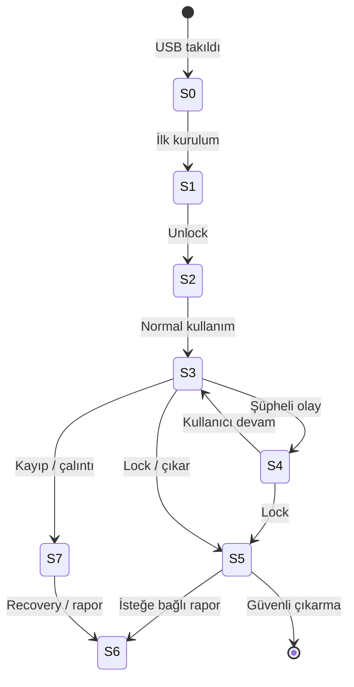

# AnchorUSB — USB Yaşam Döngüsü («USB takınız»)

| Alan | Değer |
|------|-------|
| Durum | **Operasyonel model** — docs only |
| Tarih | 2026-06-26 |
| Üst belge | [`../secure-device-framework.md`](../secure-device-framework.md) |

Her aşamada üç sütun: **kullanıcı ne görür**, **sistem ne yapar**, **asla otomatik olmayan**.

---

## Genel akış

---

## Aşama 0 — Başlatılmamış USB algılandı

| | |
|--|--|
| **Kullanıcı görür** | «Yeni veya tanınmayan USB. AnchorUSB vault bulunamadı.» — Kurulum veya iptal seçenekleri. |
| **Sistem yapar** | Cihaz kimliği (seri / volume UUID) yerel önbelleğe **yazmaz** (henüz eşleşme yok). Salt okunur tarama: vault imzası var mı? |
| **Asla otomatik** | Disk formatlama; gizli partition oluşturma; arka plan kopyalama. |

---

## Aşama 1 — İlk takma: eşleştirme / parola kurulumu

| | |
|--|--|
| **Kullanıcı görür** | Parola + parola tekrar; opsiyonel kurtarma anahtarı (kağıt önerisi); «Bu USB bu bilgisayarla eşleştirilsin mi?» (opsiyonel host fingerprint — bilgilendirme amaçlı). |
| **Sistem yapar** | `AnchorUSB.vault` oluşturur; Argon2id ile anahtar türetir; ilk event log kaydı: `VAULT_INITIALIZED`. Host'a kalıcı secret **yazmaz**. |
| **Asla otomatik** | Bulut yedek; otomatik güçlü parola atama (kullanıcı seçer); polis kaydı. |

---

## Aşama 2 — Kilidi aç / vault mount (kullanıcı hazır)

| | |
|--|--|
| **Kullanıcı görür** | Parola veya kurtarma anahtarı istemi; başarıda «Vault açık — süre sayacı (opsiyonel)». |
| **Sistem yapar** | KDF → anahtar RAM'de; konteyner mount; `VAULT_UNLOCKED` günlüğe; yerel detector aktif. |
| **Asla otomatik** | Parolasız mount; «güvenilir PC» önbelleği ile sessiz açılış (MVP); başarısız denemelerde dış alarm. |

---

## Aşama 3 — Normal kullanım (vault içi okuma/yazma)

| | |
|--|--|
| **Kullanıcı görür** | Dosya işlemleri (CLI veya gelecekte UI); durum çubuğu: kilitli/açık. |
| **Sistem yapar** | Şifreli I/O; dosya erişim özetlerini event log'a (metadata düzeyi); idle timeout uyarısı. |
| **Asla otomatik** | Vault dışına dosya kopyalama; içerik tarama sonucu dış gönderim; otomatik silme «temizlik» adına. |

---

## Aşama 4 — Şüpheli olay (yalnızca yerel bayrak)

| | |
|--|--|
| **Kullanıcı görür** | Banner: «Şüpheli etkinlik işaretlendi» + olay özeti (ör. 5 başarısız parola, olağandışı toplu okuma). Seçenekler: kilitle, görmezden gel, rapor hazırla (S6). |
| **Sistem yapar** | `SUSPICIOUS_*` event; yerel bayrak dosyası (vault metadata); isteğe bağlı otomatik **kilitle** (yalnızca kullanıcı önceden «şüphede kilitle» seçtiyse — varsayılan **kapalı**). |
| **Asla otomatik** | Polis / SOC API; gizli fotoğraf; uzaktan wipe; dosya silme; ağ üzerinden alarm. |

---

## Aşama 5 — Kilitle / unmount / güvenli çıkarma

| | |
|--|--|
| **Kullanıcı görür** | «Vault kilitlendi. USB güvenle çıkarılabilir.» — OS «güvenle kaldır» ile uyumlu mesaj. |
| **Sistem yapar** | Anahtar `zeroize`; konteyner flush; `VAULT_LOCKED`; buffer temizliği. |
| **Asla otomatik** | Kullanıcı onayı olmadan USB'yi OS'ten zorla çıkarma (MVP); kilit açıkken çıkarma engelinde veri sızdırma logu dışarı gönderme. |

---

## Aşama 6 — İsteğe bağlı manuel rapor dışa aktarımı

| | |
|--|--|
| **Kullanıcı görür** | «Rapor oluştur» sihirbazı: zaman aralığı, format (JSON/PDF imzalı paket), şifreleme (opsiyonel). Çıktı dosya yolu **kullanıcı seçer**. |
| **Sistem yapar** | Event log + metadata paketler; isteğe bağlı kullanıcı passphrase ile şifreli zip; `REPORT_EXPORTED` kaydı. |
| **Asla otomatik** | Raporu e-posta / API ile gönderme; alıcı adresi tahmini; arka planda periyodik export. |

---

## Aşama 7 — Kayıp / çalıntı kurtarma yolu

| | |
|--|--|
| **Kullanıcı görür** | «USB kayıp» sihirbazı: kurtarma anahtarı ile yeni cihaza taşıma; veya «içerik artık erişilemez» bilgilendirmesi; yasal/hukuki adımlar için S6 raporu önerisi (metin, otomatik gönderim değil). |
| **Sistem yapar** | Yerel politika: vault **read-only freeze** bayrağı (yeni vault kopyasında) — yalnızca kullanıcı recovery ile; eski USB bulunursa parola bilgisi olmadan erişim yok. |
| **Asla otomatik** | Uzaktan wipe (varsayılan); konum takibi; IMEI benzeri gizli işaretleme; «çalıntı modunda» otomatik polis bildirimi. |

**Enterprise istisnası:** Kurumsal `ent.wipe` modülü, açık sözleşme + çift onay + audit ile ayrı belgede; MVP **dışı**.

---

## Özet tablo

| Aşama | Kullanıcı | Sistem | NEVER_AUTO vurgusu |
|-------|-----------|--------|-------------------|
| 0 | Tanınmayan USB uyarısı | İmza tarama | Format / gizli yazma |
| 1 | Parola kurulumu | Vault create + log | Bulut yedek |
| 2 | Unlock istemi | RAM anahtar, mount | Sessiz açılış |
| 3 | Dosya işleri | Şifreli I/O + log | Dış sızıntı |
| 4 | Şüphe banner | Yerel bayrak | Polis / SOC |
| 5 | Kilit onayı | zeroize + lock | Zorla çıkarma telemetrisi |
| 6 | Export sihirbazı | Paket dosyası | Otomatik gönderim |
| 7 | Recovery / bilgi | Taşıma veya kilit | Uzaktan wipe (varsayılan) |

---

*Son güncelleme: 2026-06-26 — USB yaşam döngüsü modeli.*
