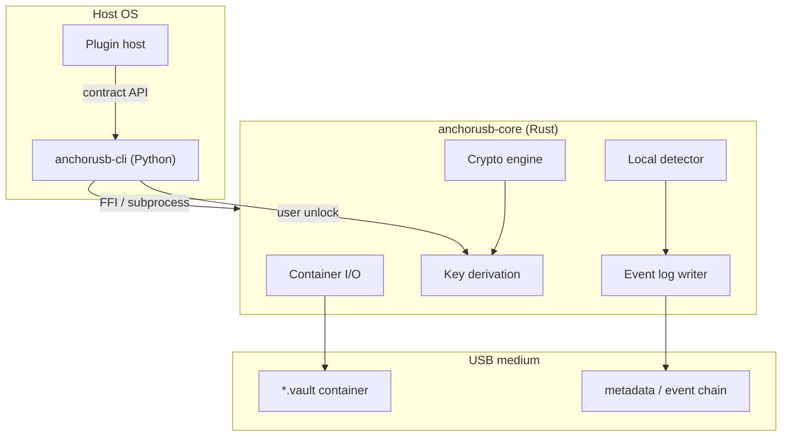

# AnchorUSB — Teknik Mimari

| Alan | Değer |
|------|-------|
| Durum | **Teknik tasarım** — docs only |
| Tarih | 2026-06-26 |
| Üst belge | [`../secure-device-framework.md`](../secure-device-framework.md) |
| MVP plan | [`anchorusb-mvp-plan.md`](./anchorusb-mvp-plan.md) |

---

## 1. Dil ve runtime önerisi

| Katman | Dil | Gerekçe |
|--------|-----|---------|
| **Kripto / konteyner çekirdeği** | **Rust** | Bellek güvenliği, `zeroize`, olgun kripto crate ekosistemi (`aes-gcm`, `argon2`, `ring`), cross-platform native binary; USB taşınabilir uygulama için tek statik çekirdek |
| **Eklentiler / CLI MVP** | **Python** | Lumos repo ile uyum, hızlı iterasyon, pytest ile test, kullanıcı komut yüzeyi; FFI veya subprocess ile Rust çekirdeğe ince bağ |
| **UI (opsiyonel, MVP sonrası)** | Tauri veya minimal webview | Rust backend paylaşımı; MVP'de CLI yeterli |

**Neden Go/Node değil:** Kripto çekirdekte bellek modeli ve statik dağıtım önceliği Rust'ı öne çıkarır. Python yalnızca **güven sınırı dışı** orchestration ve eklenti sandbox'ında kalır; anahtar materyali Python'a taşınmaz.

---

## 2. USB boot vs taşınabilir uygulama

| Yaklaşım | Artı | Eksi | MVP uygunluk |
|----------|------|------|--------------|
| **USB boot (live OS)** | Tam ortam kontrolü | Donanım uyumu, imza, güncelleme ağır | Düşük |
| **Taşınabilir uygulama + şifreli konteyner dosyası** | Hızlı MVP, mevcut OS, tek `.vault` dosyası | Host OS güvenilirliğine bağımlı | **Yüksek (önerilen)** |
| **Tam disk şifreleme (LUKS raw partition)** | Güçlü fiziksel model | İlk kurulum, platform farkları | Orta (v2) |

### Önerilen MVP kararı

**Taşınabilir uygulama + USB üzerinde şifreli konteyner dosyası** (`AnchorUSB.vault` veya gizli segment).

- Uygulama: `anchorusb` CLI (host'a kurulabilir veya USB'de `bin/` altında taşınabilir).
- Vault: tek dosya veya dosya + sidecar metadata; **AES-256-XTS** veya **AES-256-GCM** ile sector/chunk şifreleme (LUKS-benzeri header).
- Mount semantiği: FUSE veya kullanıcı alanı sanal dosya sistemi (MVP: extract-to-temp encrypted session **değil** — doğrudan şifreli okuma/yazma API).

---

## 3. Modül diyagramı



---

## 4. Klasör yapısı (hedef repo ağacı)

Uygulama kodu henüz yok; hedef yapı:

```
anchorusb/                          # gelecekte monorepo alt paket veya ayrı repo
├── README.md
├── Cargo.toml                      # workspace root
├── crates/
│   ├── anchorusb-core/             # Rust: container, crypto, event log
│   │   ├── src/
│   │   │   ├── lib.rs
│   │   │   ├── container/
│   │   │   │   ├── mod.rs
│   │   │   │   ├── header.rs       # LUKS-style superblock
│   │   │   │   └── io.rs
│   │   │   ├── crypto/
│   │   │   │   ├── mod.rs
│   │   │   │   ├── aes_xts.rs
│   │   │   │   └── kdf.rs          # Argon2id
│   │   │   ├── event_log/
│   │   │   │   ├── mod.rs
│   │   │   │   ├── chain.rs        # hash chain
│   │   │   │   └── record.rs
│   │   │   └── detect/
│   │   │       ├── mod.rs
│   │   │       └── rules.rs
│   │   └── tests/
│   └── anchorusb-ffi/              # C ABI for Python
│       └── src/lib.rs
├── python/
│   ├── pyproject.toml
│   ├── anchorusb/
│   │   ├── __init__.py
│   │   ├── cli/
│   │   │   └── main.py             # init, unlock, lock, status, export-report
│   │   ├── plugins/
│   │   │   ├── __init__.py
│   │   │   ├── base.py             # Plugin contract
│   │   │   ├── registry.py
│   │   │   └── builtin/
│   │   │       ├── encryption_audit.py
│   │   │       └── backup_local.py
│   │   └── ffi_bridge.py
│   └── tests/
├── docs/                           # lumos-core docs/analysis/secure-device mirror veya symlink
└── scripts/
    └── dev-build.sh
```

**lumos-core içinde (şimdilik):** yalnızca `docs/analysis/secure-device/` — kaynak ağacı yukarıdaki hedef.

---

## 5. Eklenti arayüz sözleşmesi

### 5.1 Ortak kurallar

- Eklenti **yüklenmeden önce** kullanıcı onayı (CLI `plugins enable <id>`).
- Anahtar materyali eklentiye **verilmez**; yalnızca `VaultSession` handle (mount süresi sınırlı).
- Dış ağ: varsayılan **kapalı**; `enterprise` sınıfı açıkça opt-in.
- Her eklenti çağrısı `event_log`'a yazılır.

### 5.2 Sınıflar

| Sınıf | ID öneki | İzinler | Örnek |
|-------|----------|---------|-------|
| `encryption` | `enc.` | Metadata, algoritma raporu | Şifreleme durumu denetimi |
| `backup` | `bak.` | Salt okunur vault export | Yerel ikinci kopya |
| `audit` | `aud.` | Event log okuma | Uyumluluk özeti |
| `enterprise` | `ent.` | Politika dosyası, **onaylı** uzak işlem | IT wipe playbook (çift onay) |

### 5.3 Python sözleşme (taslak)

```python
class AnchorPlugin(Protocol):
    plugin_id: str
    plugin_class: Literal["encryption", "backup", "audit", "enterprise"]

    def on_register(self, config: dict) -> None: ...
    def on_vault_unlocked(self, session: VaultSessionView) -> None: ...
    def on_vault_locking(self, session: VaultSessionView) -> None: ...
    def on_event(self, record: EventRecord) -> None: ...
```

`VaultSessionView`: dosya listesi özeti, **içerik byte'ı yok** (backup eklentisi hariç — o da kullanıcı onaylı tam export).

### 5.4 Enterprise özel şart

- Uzaktan wipe: `ent.wipe` yalnızca kurumsal politika dosyası + **iki aşamalı onay** (kullanıcı + IT token).
- Varsayılan kurulumda `enterprise` eklentileri **devre dışı**.

---

## 6. Kriptografi

| Öğe | Seçim |
|-----|-------|
| Konteyner şifreleme | **AES-256-XTS** (disk-benzeri) veya **AES-256-GCM** (chunk); MVP: XTS veya GCM — header'ta algoritma bayrağı |
| KDF | **Argon2id** (memory-hard); parametreler cihaz sınıfına göre profil |
| Parola | Kullanıcı passphrase; **sunucuya gönderilmez** |
| Anahtar saklama | Yalnızca RAM'de unlock süresi; `zeroize` on drop |
| Anahtar yedek | Varsayılan **yok**; kullanıcı isteğe bağlı recovery key (kağıt / ikinci USB) |
| Bütünlük | Event log hash zinciri; konteyner için AEAD veya XTS doğal bütünlük |
| Rastgelelik | OS CSPRNG (`getrandom` / `OsRng`) |

**Kural:** Anahtarlar ve türetilmiş materyal **cihaz dışına çıkmaz** (A-04). Bulut HSM entegrasyonu yalnızca enterprise eklentisi ve açık onay ile değerlendirilir — MVP dışı.

---

## 7. Host güvenlik sınırları

| Risk | MVP mitigasyon |
|------|----------------|
| Kötü niyetli host OS | Kullanıcı eğitimi; vault süresi kısa; lock on suspend |
| USB kaybı | Güçlü passphrase; opsiyonel recovery; **uzaktan wipe yok** (varsayılan) |
| Cold boot | Anahtar RAM'de minimum süre; lock komutu |

---

## 8. Lumos / WeLockAI entegrasyon noktası (opsiyonel)

Gelecek kanca (zorunlu değil):

- `export-report` çıktısının Lumos görevine eklenmesi (kullanıcı sürükler).
- WeLockAI panelinde «vault durumu» salt okunur widget — **vault içeriği gönderilmez**.

---

*Son güncelleme: 2026-06-26 — teknik mimari taslağı.*
