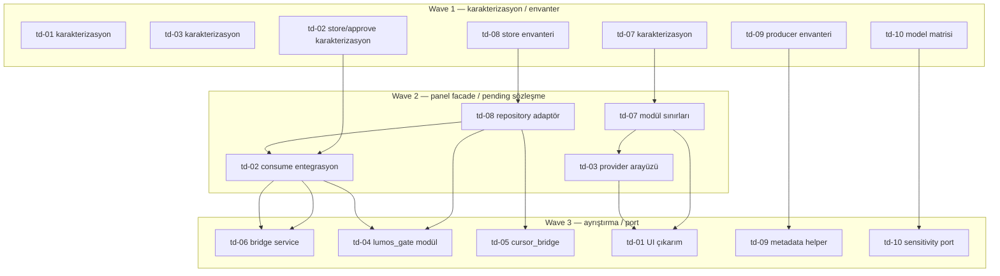

# Lumos Core — İlk 10 Teknik Borç Bağımlılık Grafiği

| Alan | Değer |
|---|---|
| **Belge türü** | Salt-okunur bağımlılık / dalga topolojisi analizi |
| **Tarih** | 2026-06-21 |
| **Durum** | Keşif tamamlandı — uygulama yok |
| **Kapsam** | İlk 10 madde (td-01..td-10); yalnızca teknik önkoşul ve dosya çakışması ilişkileri |
| **Kaynak birincil** | [technical-debt-execution-map.md](technical-debt-execution-map.md) |
| **Kaynak çapraz** | [technical-debt-architecture-concentration-2026-06.md](technical-debt-architecture-concentration-2026-06.md), [ADR-012-enforcement-prep-assessment.md](ADR-012-enforcement-prep-assessment.md), [lumos-runtime-enforcement-map.md](lumos-runtime-enforcement-map.md), [release-blockers.md](release-blockers.md) (RB çapraz) |
| **Hariç** | Kod/refactor/runtime değişikliği; tavsiye, öncelik veya ürün kararı dili |

PR dilimi, test yüzeyi ve geri dönüş planları için bkz. [execution-map](technical-debt-execution-map.md). Release engelleri için bkz. [release-blockers](release-blockers.md).

Bu belge yalnızca kaynak belgelerdeki dosya, store ve side-effect zinciri ilişkilerini grafikleştirır. **Tavsiye veya tercih içermez.**

---

## Grup özeti (kaynak: execution-map)

| Grup | Maddeler | Ortak bağımlılık | Çakışma alanı |
|---|---|---|---|
| A — Panel yüzeyi | td-01, td-03, td-07 | `panel.astro` → `panel_tasks_server.py` → `panel_bridge_state.py` | Panel sözleşmesi, mutasyon kapısı, read-state payload |
| B — Köprü/onay orkestrasyonu | td-02, td-04, td-05, td-06, td-08 | `server.py` → `lumos_gate.py` / `task_dispatch.py` → confirmation ve Cursor yolları | Pending şemaları, approve/execute zinciri, modül sınırları |
| C — Task engine sınıflaması | td-09 | `TaskStep` → `profiles.py` → `engine.py` | Action anahtarı üretimi ve engine kapsamı |
| D — Değişiklik hassasiyeti | td-10 | `write_interceptor.py` → `change_sensitivity.py`; gate ile doğrudan bağ yok | Dosya hassasiyeti ile gate risk modeli sözleşme sınırı |

Grup B içinde td-02 ve td-08 aynı state/consume zincirine dokunur; td-04–td-06 aynı büyük dosyalarda td-02/td-08 ile satır çakışması riski taşır (execution-map L61–63).

---

## Madde bazlı bağımlılık tablosu

### {#td-01-panel-astro} td-01 — `panel.astro` monolitik UI yüzeyi

| Alan | Değer |
|---|---|
| **Dalga** | Wave 1 (karakterizasyon); tamamlama dilimi Wave 3 |
| **Blokladığı maddeler** | — (ilk dilimlerde); UI modül çıkarım dilimleri td-07 ve td-03 facade stabilitesine bağlıdır |
| **Bağımlı olduğu maddeler** | Karakterizasyon: yok. Modül/asset çıkarımı: **td-07** (read-state/gate facade), **td-03** (panel backend/provider yüzeyi) |
| **Paralel yürüyebilecek maddeler** | td-03, td-07 (Grup A karakterizasyon); td-09, td-10 (ortak dosya yok); td-02, td-08 yalnızca karakterizasyon dilimlerinde dosya çakışması olmadığı sürece |

---

### {#td-02-bridge-cu4-gap} td-02 — Bridge approve yolu / confirmation consume zinciri

| Alan | Değer |
|---|---|
| **Dalga** | Wave 1 (store/approve karakterizasyonu); consume entegrasyonu Wave 2 |
| **Blokladığı maddeler** | **td-06** (approve service sınırı), **td-04** (pending sözleşmesi sabitlenmeden gate taşıması), td-08 korelasyon adaptörü ortak sınır |
| **Bağımlı olduğu maddeler** | Karakterizasyon: yok (td-08 ile eşzamanlı sıra 2). Consume entegrasyonu: **td-08** (repository adaptörleri önce; execution-map sıra 6) |
| **Paralel yürüyebilecek maddeler** | td-09, td-10; Grup A karakterizasyonu (td-01, td-03, td-07). **td-08** ile yüksek dosya çakışması — aynı pending dosyalarında paralel uygulama çatışma üretir |

---

### {#td-03-panel-lockstate-env} td-03 — Panel env vekili / `LockState` kopukluğu

| Alan | Değer |
|---|---|
| **Dalga** | Wave 1 (karakterizasyon); provider arayüzü Wave 2 |
| **Blokladığı maddeler** | **td-01** UI modül çıkarımları (panel backend yüzeyi stabil olmalı) |
| **Bağımlı olduğu maddeler** | Karakterizasyon: yok. Provider arayüzü: **td-07** modül sınırları (execution-map sıra 4→5: “#7 … #3 için daha dar entegrasyon yüzeyi”) |
| **Paralel yürüyebilecek maddeler** | td-01, td-07 (Grup A); td-09, td-10 |

---

### {#td-04-lumos-gate-monolith} td-04 — `lumos_gate.py` yoğun sorumluluk

| Alan | Değer |
|---|---|
| **Dalga** | Wave 3 |
| **Blokladığı maddeler** | — |
| **Bağımlı olduğu maddeler** | **td-02**, **td-08** (pending sözleşmesi ve approve side-effect sırası sabitlenmeden modül taşıması; execution-map sıra 8) |
| **Paralel yürüyebilecek maddeler** | td-09, td-10 (engine/sensitivity zincirleri ayrı). td-05, td-06 ile aynı Grup B dosyalarında çakışma riski |

---

### {#td-05-cursor-bridge-hub} td-05 — `cursor_bridge.py` orchestration hub

| Alan | Değer |
|---|---|
| **Dalga** | Wave 3 |
| **Blokladığı maddeler** | — |
| **Bağımlı olduğu maddeler** | **td-08** (ortak pending terminoloji ve store envanteri; execution-map sıra 9) |
| **Paralel yürüyebilecek maddeler** | td-09, td-10. td-04, td-06 ile fiziksel store formatı korunurken terminoloji netleşmesi gerekir |

---

### {#td-06-bridge-server-monolith} td-06 — `kando_bridge/server.py` yoğunlaşması

| Alan | Değer |
|---|---|
| **Dalga** | Wave 3 |
| **Blokladığı maddeler** | — |
| **Bağımlı olduğu maddeler** | **td-02**, **td-08** (approve sınırı sabitlenmeden handler/service ayrımı; execution-map sıra 7) |
| **Paralel yürüyebilecek maddeler** | td-09, td-10. td-04 ile `server.py` / approve yollarında çakışma |

---

### {#td-07-panel-bridge-state} td-07 — `panel_bridge_state.py` yoğunlaşması

| Alan | Değer |
|---|---|
| **Dalga** | Wave 1 (karakterizasyon); modül sınırları Wave 2 |
| **Blokladığı maddeler** | **td-03** (provider için dar entegrasyon yüzeyi), **td-01** (payload facade sabitliği) |
| **Bağımlı olduğu maddeler** | Karakterizasyon: yok |
| **Paralel yürüyebilecek maddeler** | td-01, td-03 (Grup A); td-09, td-10 |

---

### {#td-08-parallel-pending-stores} td-08 — Paralel pending state mağazaları

| Alan | Değer |
|---|---|
| **Dalga** | Wave 1 (store/şema envanteri); repository adaptörleri Wave 2 |
| **Blokladığı maddeler** | **td-02** (consume entegrasyonu), **td-04**, **td-05**, **td-06** |
| **Bağımlı olduğu maddeler** | Karakterizasyon: yok. td-02 approve testleri td-08 entegrasyon doğrulaması olarak execution-map’te bağlanır |
| **Paralel yürüyebilecek maddeler** | td-09, td-10; Grup A karakterizasyonu. **td-02** ile yüksek çakışma — aynı PR serisi dışında paralel değişiklik riski |

---

### {#td-09-p2-never-auto-narrow} td-09 — `SECURITY_NEVER_AUTO` engine kapsamı

| Alan | Değer |
|---|---|
| **Dalga** | Wave 1 (producer envanteri); metadata helper Wave 3 |
| **Blokladığı maddeler** | — (engine kapsam değişikliği execution-map kapsam dışı) |
| **Bağımlı olduğu maddeler** | Yok — Grup C; `action_policy.py` dolaylı, engine dalı doğrudan panel/köprü grubuna bağlı değil |
| **Paralel yürüyebilecek maddeler** | td-01..td-08, td-10 (ortak dosya yok; enforcement-map P2 dalı bağımsız zincir) |

---

### {#td-10-sensitivity-gate-gap} td-10 — `change_sensitivity` ↔ gate kopukluğu

| Alan | Değer |
|---|---|
| **Dalga** | Wave 1 (model giriş/çıkış matrisi); context/port Wave 3 |
| **Blokladığı maddeler** | — (risk eşlemesi ve sonuç davranışı execution-map kapsam dışı) |
| **Bağımlı olduğu maddeler** | Yok — ADR-012 prep ve execution-map: `lumos_gate` import/use yok |
| **Paralel yürüyebilecek maddeler** | td-01..td-09 (gate entegrasyonu olmadan bağımsız `src/core` zinciri) |

---

## Topolojik dalga özeti

| Dalga | Maddeler | Gerekçe (execution-map sıra 1–11) |
|---|---|---|
| **Wave 1** | td-01, td-03, td-07, td-02, td-08, td-09, td-10 | Önkoşulsuz karakterizasyon, store envanteri veya bağımsız sınıflandırma envanteri (sıra 1–3) |
| **Wave 2** | td-07 (modül sınırları), td-03 (provider), td-08 (repo adaptör), td-02 (consume sınırı) | Panel facade daraltma ve pending dosyalarında sıralı değişiklik (sıra 4–6) |
| **Wave 3** | td-06, td-04, td-05, td-01 (UI çıkarım), td-09 (metadata helper), td-10 (sensitivity port) | Köprü sözleşmesi sabitlendikten sonra büyük dosya ayrıştırma ve davranışsız sözleşme dilimleri (sıra 7–11) |

Not: td-01, td-07, td-09, td-10 çok PR’lı maddelerdir; Wave 1 yalnızca ilk dilimlerini, Wave 3 kalan dilimlerini kapsar.

---

## Bağımlılık diyagramı (Mermaid)

Kesik çizgi yok: td-09/td-10 karakterizasyon dalları panel/köprü grafiğine execution-map ve enforcement-map’e göre teknik kenar taşımaz.

---

## İlk uygulama dalgası (Wave 1)

Bağımlılık grafiğine göre Wave 1 — önkoşulsuz veya en düşük çapraz-coupling dilimleri:

| Anchor | Madde | Wave 1 dilimi |
|---|---|---|
| [td-01](#td-01-panel-astro) | `panel.astro` monolit | DOM/endpoint/localStorage karakterizasyon testleri |
| [td-03](#td-03-panel-lockstate-env) | Panel env / LockState | Env ve `LockState` yaşam döngüsü karakterizasyonu |
| [td-07](#td-07-panel-bridge-state) | `panel_bridge_state.py` | Gate ve read-state payload karakterizasyonu |
| [td-02](#td-02-bridge-cu4-gap) | Bridge approve / consume | İki pending şeması ve mevcut approve davranışı test matrisi |
| [td-08](#td-08-parallel-pending-stores) | Paralel pending mağazalar | Store/şema envanteri ve fixture karakterizasyonu |
| [td-09](#td-09-p2-never-auto-narrow) | SECURITY_NEVER_AUTO | TaskStep producer ve serialization envanteri |
| [td-10](#td-10-sensitivity-gate-gap) | change_sensitivity ↔ gate | İki modelin giriş/çıkış matrisi karakterizasyonu |

**Tek satır liste:** td-01, td-03, td-07, td-02, td-08, td-09, td-10

---

## Enforcement / ADR çapraz referans (salt gerçek)

| Madde | enforcement-map / ADR-012 prep bağlantısı |
|---|---|
| td-02 | PR-C6 shadow adapter; köprü yürütmede `consume_confirmation` yok |
| td-03 | Panel `LUMOS_SESSION_UNLOCKED` env vekili; `LockState` panelde doğrulanmıyor |
| td-08 | Üç fiziksel store: `pending_approvals/`, `pending_confirmations/`, `cursor_bridge/pending_approvals.json` |
| td-09 | P2 engine dalı dar; producer metadata eksikliği bypass yüzeyi |
| td-10 | `lumos_gate` içinde `change_sensitivity` import/use yok (ADR-006 gap) |

---

## Belge sınırı

Bu dosya **tavsiye, öncelik veya tercih dili içermez**. Dalga atamaları yalnızca [technical-debt-execution-map.md](technical-debt-execution-map.md) § “Tahmini uygulama bağımlılık sırası” ve grup çakışma tablosundan türetilmiş topolojik sıralamadır. “İlk uygulanacak 5 madde” etki/karmaşıklık tablosu bu belgeye dahil edilmemiştir (farklı eksen: etki/maliyet, bağımlılık değil).
