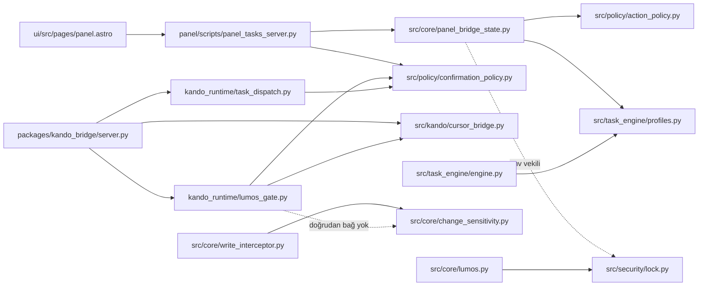

# Lumos Core — İlk 10 Teknik Borç Uygulanabilirlik Haritası

| Alan | Değer |
|---|---|
| **Belge türü** | Salt-okunur uygulanabilirlik / PR dilimi haritası |
| **Tarih** | 2026-06-21 |
| **Durum** | Keşif tamamlandı — uygulama yok |
| **Kaynak** | [technical-debt-architecture-concentration-2026-06.md](technical-debt-architecture-concentration-2026-06.md) (td-01..td-10) |
| **Referans** | [bağımlılık grafiği](technical-debt-dependency-graph.md) (dalga topolojisi), [release blockers](release-blockers.md) (RB çapraz), [ADR-012 prep](ADR-012-enforcement-prep-assessment.md) |
| **Kapsam** | İlk 10 madde; salt-okunur kaynak ve test keşfi |
| **Hariç** | Kod/refactor/runtime değişikliği; enforcement, Trust ve ADR kararı |

Bağımlılık sırası ve Wave 1–3 topolojisi için bkz. [dependency-graph](technical-debt-dependency-graph.md). Release engelleri (RB-XX) için bkz. [release-blockers](release-blockers.md).

## Doğrulama özeti

İlk 10 maddenin tamamında raporda belirtilen ana kaynak dosyaları ve yoğunlaşma noktaları
mevcuttur. Keşif iki kanıt düzeltmesi üretmiştir:

- **td-04:** Adında `lumos_gate` geçen tek birim test dosyası yoktur; ancak
  `tests/test_lumos_audit_replay.py`, `tests/test_lumos_plan_substep_gate.py`,
  `tests/test_task_dispatch.py`, `tests/test_bridge_confirmation_adapter.py` ve
  `tests/test_persona_security_simdi_checkpoint.py` modülü doğrudan kullanır. Bu nedenle
  test yüzeyi “yok” değil, dağınıktır.
- **td-09:** Engine kapsamının ana eşleme ve yürütme zinciri
  `src/task_engine/profiles.py` → `TaskStep.action_key` →
  `src/task_engine/engine.py` şeklindedir. `src/policy/action_policy.py` panel/CLI eylem
  anahtarlarının dolaylı kaynağıdır; engine dalının doğrudan bağımlılığı değildir.

Bu belge karar verilmiş bir hedef mimari tanımlamaz. PR sınırları, mevcut davranışı
karakterize ederek küçük ve geri alınabilir dilimlere ayırmak için tahmin edilmiştir.

## Gerçek bağımlılık haritası

### Birbirine bağlı madde grupları

Grup tanımları [dependency-graph § Grup özeti](technical-debt-dependency-graph.md#grup-özeti-kaynak-execution-map) ile aynıdır:

| Grup | Maddeler | Ortak bağımlılık | Çakışma alanı |
|---|---|---|---|
| A — Panel yüzeyi | td-01, td-03, td-07 | `panel.astro` → `panel_tasks_server.py` → `panel_bridge_state.py` | Panel sözleşmesi, mutasyon kapısı ve read-state payload |
| B — Köprü/onay orkestrasyonu | td-02, td-04, td-05, td-06, td-08 | `server.py` → `lumos_gate.py` / `task_dispatch.py` → confirmation ve Cursor yolları | Pending kayıt şemaları, approve/execute zinciri ve modül sınırları |
| C — Task engine sınıflaması | td-09 | `TaskStep` → `profiles.py` → `engine.py` | Action anahtarı üretimi ve engine kapsamı |
| D — Değişiklik hassasiyeti | td-10 | `write_interceptor.py` → `change_sensitivity.py`; gate ile bağ yok | Dosya hassasiyeti ile gate risk modelinin sözleşme sınırı |

Grup B içindeki td-02 ve td-08 aynı state/consume zincirine dokunur. td-04–td-06 bu zincirin
yer aldığı büyük dosyaların ayrıştırma sınırlarını etkiler. Ayrı PR serileri olsalar bile
aynı satırlarda çatışma olasılıkları yüksektir.

## td-01 — `panel.astro` monolitik UI yüzeyi {#td-01-panel-astro}

**Doğrulama:** Doğrulandı. Dosya 15.497 satırdır; Astro frontmatter, yaklaşık 4,2K
satırlık inline stil, HTML yüzeyi ve yaklaşık 9,5K satırlık istemci scripti aynı dosyadadır.
Script; kullanıcı modu, chat, transkripsiyon, görevler, evidence, quantum-readiness,
i18n ve bridge durumunu birlikte yönetir.

**Kapsam**

- Mevcut DOM kimliklerini, API URL’lerini, localStorage anahtarlarını ve global i18n
  sözleşmesini değiştirmeden stil/script sorumluluklarının çıkarılabilir sınırlarını belirleme.
- İlk sınırlar: shell/user-mode, chat/transkripsiyon, görevler/evidence,
  quantum-readiness ve ortak görünür metin/i18n yardımcıları.
- Backend endpoint veya payload değişikliği kapsam dışıdır.

**Etkilenen dosyalar**

- Ana: `ui/src/pages/panel.astro`
- Derleme/çalıştırma: `ui/package.json`, `ui/astro.config.mjs`
- API sözleşmesi: `panel/scripts/panel_tasks_server.py`,
  `packages/kando_bridge/src/kando_bridge/server.py`
- Karakterizasyon testleri: `tests/test_panel_i18n_v1.py`,
  `tests/test_panel_gorev_create_ec2_01.py`, `tests/test_panel_gorev_delete_phase1.py`,
  `tests/test_panel_gorevler_empty_state.py`, `tests/test_panel_gorevler_sync_badge.py`,
  `tests/test_panel_full_audio_reply.py`, `tests/test_panel_evidence_correlation_ui_ec2_08.py`,
  `tests/test_panel_evidence_disconnect_resume_ec2_12.py`,
  `tests/test_panel_evidence_queue_ec2_02.py`, `tests/test_panel_quantum_readiness_route.py`,
  `tests/test_panel_ux_tur12.py`
- E2E: `ui/e2e/smoke-panel.mjs`, `ui/e2e/smoke-prod.mjs`,
  `ui/e2e/tasks-offline-online.mjs`, `ui/e2e/confirmation-panel-api.mjs`

**Risk:** Kritik. Statik metin/selector testleri dosya içi yerleşime bağlı olabilir; script
çıkarma sırası, Astro asset yükleme ve global değişken görünürlüğünü etkileyebilir.

**Test etkisi**

- Her dilimde `npm run build --prefix ui` zorunlu doğrulama yüzeyidir.
- Panel statik sözleşme testleri dosya bölündüğünde yeni dosyaları da okuyacak biçimde
  uyarlanmak zorundadır; bu test değişikliği runtime değişikliği değildir.
- Görev, evidence, chat/audio ve offline/online E2E senaryoları dilim bazında çalıştırılır.

**Tahmini PR sayısı:** 5–7.

**Tahmini PR sınırları ve uygulama sırası**

1. Mevcut DOM, endpoint, localStorage ve global API sözleşmelerini karakterize eden testler.
2. Inline CSS’in davranışsız asset dilimlerine ayrılması.
3. Shell/user-mode ve ortak i18n yardımcılarının çıkarılması.
4. Görevler + evidence istemci modülünün çıkarılması.
5. Chat + transkripsiyon istemci modülünün çıkarılması.
6. Quantum-readiness ve kalan bağımsız modüllerin çıkarılması.
7. Yalnızca artık kullanılmayan bağlayıcıların temizlenmesi.

**Geri dönüş planı:** Her çıkarma PR’ı tek özellik dilimiyle sınırlanır. Sorun halinde ilgili
asset importu ve yeni dosyalar birlikte geri alınarak inline blok önceki haline döndürülür;
endpoint, selector ve storage anahtarlarında migration olmadığı için veri geri dönüşü gerekmez.

## td-02 — Bridge approve yolu ile confirmation consume zinciri ayrık {#td-02-bridge-cu4-gap}

**Doğrulama:** Doğrulandı. `lumos_gate.py` ve `task_dispatch.py` pending kaydına
`confirmation_id`/`confirmation_scope_hash` ekler. `server.py::_handle_approve` ise
`approval_token` doğrulayıp pending kaydı execute eder; `consume_confirmation()` çağrısı yoktur.

**Kapsam**

- Mevcut pending kayıt alanları ile approve handler arasındaki teknik sözleşmenin
  karakterizasyonu.
- Token doğrulama, pending doğrulama, confirmation tüketimi ve execute adımlarının
  ayrı fonksiyon sınırlarına alınabilmesi.
- Hangi aksiyonun confirmation gerektireceği kararı kapsam dışıdır.

**Etkilenen dosyalar**

- `packages/kando_bridge/src/kando_bridge/server.py`
- `packages/kando_runtime/src/kando_runtime/lumos_gate.py`
- `packages/kando_runtime/src/kando_runtime/task_dispatch.py`
- `src/policy/confirmation_policy.py`
- `tests/test_bridge_confirmation_adapter.py`
- `tests/test_confirmation_policy.py`
- `tests/test_task_dispatch.py`
- `tests/test_pending_approvals_list.py`
- Yeni bridge approve sözleşme testi

**Risk:** Kritik. Tek-kullanım, scope hash, expiry ve legacy token davranışları aynı yürütme
zincirinde birleşir; yanlış sıra onaylı işin çalışmamasına veya kaydın erken tüketilmesine yol açar.

**Test etkisi**

- Başarılı consume + execute, yanlış scope, süresi geçmiş kayıt, ikinci kullanım ve execute
  hatasında kayıt durumu ayrı senaryolar olmalıdır.
- Hem high-risk `lumos_gate` hem medium `task_dispatch` pending şeması aynı approve
  sözleşme matrisinde denenmelidir.
- Mevcut `approval_token` geriye uyumluluk senaryosu korunmalıdır.

**Tahmini PR sayısı:** 2–3.

**Tahmini PR sınırları ve uygulama sırası**

1. İki pending şemasını ve mevcut approve davranışını karakterize eden test matrisi.
2. Consume/validate işlemini side-effect sırası açık tek bridge yardımcı sınırına alma.
3. Gerekirse legacy kayıt uyumluluğunu ayrı adaptöre taşıma.

**Geri dönüş planı:** Handler entegrasyon PR’ı geri alınır; `approval_token` yolu ve pending
dosya şemaları değişmeden kaldığı için mevcut kayıtlar tekrar eski handler tarafından okunabilir.

## td-03 — Panel koruma sinyali env vekili ile `LockState` arasında bağ yok {#td-03-panel-lockstate-env}

**Doğrulama:** Doğrulandı. `panel_bridge_state.py::_panel_policy_context()` yalnızca
`LUMOS_SESSION_UNLOCKED` okur. `LockState` yalnızca `src/core/lumos.py` tarafından kullanılır;
panel server ile ortak state sağlayıcısı yoktur.

**Kapsam**

- Panel process’i ile `Lumos.lock_state` yaşam döngüsünün teknik olarak ayrı olduğunu belgelemek.
- `task_action_gate()` girdisinin injectable/session-state provider sınırına alınabilirliğini
  karakterize etmek.
- Unlock kaynağı, oturum sahipliği ve politika kararı kapsam dışıdır.

**Etkilenen dosyalar**

- `src/core/panel_bridge_state.py`
- `panel/scripts/panel_tasks_server.py`
- `src/security/lock.py`
- `src/core/lumos.py`
- `tests/test_panel_bridge_codex_gate.py`
- `tests/test_panel_put_tasks_json_policy_gate.py`
- `tests/test_panel_restore_policy_gate.py`
- `tests/test_panel_delete_permanent_policy_gate.py`

**Risk:** Kritik. Farklı process’lerde in-memory `LockState` doğrudan paylaşılamaz; provider
sınırı kurulmadan env’in kaldırılması davranış kopmasına neden olur.

**Test etkisi**

- Mevcut env tabanlı davranış önce karakterize edilir.
- Kilitli/kilitsiz/unknown state ve process yeniden başlatma senaryoları gerekir.
- Panel endpoint testleri gate sonucunu provider üzerinden enjekte edebilmelidir.

**Tahmini PR sayısı:** 2–3.

**Tahmini PR sınırları ve uygulama sırası**

1. Env ve `LockState` yaşam döngüsü için karakterizasyon testleri.
2. Davranışı koruyan session-state provider arayüzü ve mevcut env adaptörü.
3. Karar sonrası seçilecek canonical kaynağın adaptörü; bu keşfin kapsamı dışındadır.

**Geri dönüş planı:** Provider çağrısı geri alınıp `_panel_policy_context()` doğrudan env
okumasına döndürülür. Env adı ve endpoint payload’ı değişmeden tutulduğu sürece veri migration’ı yoktur.

## td-04 — `lumos_gate.py` yoğun sorumluluk kümesi {#td-04-lumos-gate-monolith}

**Doğrulama:** Doğrulandı; test yokluğu iddiası düzeltilmiştir. Dosya 2.799 satırdır ve
normalization, LLM reasoning, risk, plan, execute, pending approval, audit/replay ve result
payload sorumluluklarını taşır.

**Kapsam**

- Saf yardımcılar ile side-effect üreten yürütme yollarını ayıracak mevcut çağrı sınırları.
- İlk çıkarılabilir kümeler: normalization/validation, risk yardımcıları, pending record,
  plan execution ve result/audit üretimi.
- Risk/politika kurallarının içeriğini değiştirmek kapsam dışıdır.

**Etkilenen dosyalar**

- `packages/kando_runtime/src/kando_runtime/lumos_gate.py`
- `packages/kando_runtime/src/kando_runtime/bridge_intent.py`
- `packages/kando_runtime/src/kando_runtime/task_dispatch.py`
- `packages/kando_bridge/src/kando_bridge/server.py`
- `tests/test_lumos_audit_replay.py`
- `tests/test_lumos_plan_substep_gate.py`
- `tests/test_task_dispatch.py`
- `tests/test_bridge_confirmation_adapter.py`
- `tests/test_persona_security_simdi_checkpoint.py`

**Risk:** Yüksek. Dışarıdan import edilen çok sayıda fonksiyon vardır; fonksiyon taşıma
monkeypatch hedeflerini, import fallback’lerini ve audit payload sırasını bozabilir.

**Test etkisi**

- Önce public/import edilen sembol envanteri ve payload snapshot’ları sabitlenir.
- Her çıkarma diliminde eski modülden re-export ile import uyumluluğu test edilir.
- Replay, plan substep, pending approval ve dispatch entegrasyon testleri birlikte çalıştırılır.

**Tahmini PR sayısı:** 4–6.

**Tahmini PR sınırları ve uygulama sırası**

1. Public sembol ve sonuç payload karakterizasyonu.
2. Saf normalization/validation yardımcıları.
3. Risk ve pending-record yardımcıları.
4. Plan execute yardımcıları.
5. Audit/result/replay yardımcıları.
6. Re-export kullanımının azaltılması.

**Geri dönüş planı:** Her modül çıkarımı bağımsız geri alınır; eski `lumos_gate.py` public
sembolleri re-export katmanı kaldırılana kadar korunur. Kalıcı veri şeması değiştirilmez.

## td-05 — `cursor_bridge.py` orchestration hub’ı {#td-05-cursor-bridge-hub}

**Doğrulama:** Doğrulandı. Dosya 3.253 satırdır. Pending approval belleği/disk kalıcılığı,
APPROVE eşleme, patch yürütme, rollback ve execution packet zenginleştirme aynı modüldedir.
Cursor pending dosyası `.lumos/cursor_bridge/pending_approvals.json` olup bridge pending
dizininden ayrıdır.

**Kapsam**

- Pending store, approve parser/matcher, patch execution ve rollback kümelerini ayırma sınırları.
- `handle_cursor_command()` ve execution packet sözleşmesini sabit tutma.
- Confirmation/enforcement davranışı kapsam dışıdır.

**Etkilenen dosyalar**

- `src/kando/cursor_bridge.py`
- `src/kando/cursor_packet.py`
- `src/kando/cursor_executor.py`
- `src/kando/file_patch_executor.py`
- `src/kando/patch_pending.py`
- `src/kando/agent_runner.py`
- `src/task_engine/executors/patch_apply_executor.py`
- `packages/kando_bridge/src/kando_bridge/server.py`
- `tests/kando/test_cursor_bridge_contract.py`
- `tests/kando/test_agent_runner.py`
- `tests/test_bridge_agent_result_evidence_ec2_13.py`

**Risk:** Yüksek. Test yüzeyi güçlü fakat tek sözleşme dosyasında yoğunlaşmıştır; global
pending state ve disk merge sırası modül taşımasına hassastır.

**Test etkisi**

- 36 testlik Cursor bridge sözleşmesi temel regresyon setidir.
- Process restart/disk merge, duplicate APPROVE, not-found, rollback ve patch result
  senaryoları çıkarılan modüller için birim testlere bölünmelidir.
- Bridge agent-result evidence testi entegrasyon sınırını korur.

**Tahmini PR sayısı:** 4–5.

**Tahmini PR sınırları ve uygulama sırası**

1. Global state ve public komut sözleşmesi karakterizasyonu.
2. Pending approval store’un çıkarılması.
3. APPROVE parse/match akışının çıkarılması.
4. Patch execute/result zenginleştirme sınırının çıkarılması.
5. Rollback yardımcılarının çıkarılması.

**Geri dönüş planı:** Yeni modüller yalnızca `cursor_bridge.py` üzerinden çağrılır; her PR
geri alındığında ilgili fonksiyonlar aynı public giriş noktasına inline döner. Pending JSON
formatı korunur.

## td-06 — `kando_bridge/server.py` HTTP ve yürütme yoğunlaşması {#td-06-bridge-server-monolith}

**Doğrulama:** Doğrulandı. Dosya 2.586 satırdır. HTTP routing, chat, upload/transcribe,
task post, pending list, approve, replay, outbox/evidence ve agent/direct-patch adaptörlerini
tek `BridgeHandler` çevresinde toplar.

**Kapsam**

- Saf request/response dönüştürücüleri, pending repository, task service ve HTTP handler
  sınırlarının çıkarılabilirliğini belirleme.
- Route, status code, payload ve bind/secret davranışını sabit tutma.
- Onay politikasının içeriği kapsam dışıdır.

**Etkilenen dosyalar**

- `packages/kando_bridge/src/kando_bridge/server.py`
- `packages/kando_bridge/src/kando_bridge/__main__.py`
- `scripts/kando_bridge_server.py`
- `packages/kando_runtime/src/kando_runtime/lumos_gate.py`
- `packages/kando_runtime/src/kando_runtime/task_dispatch.py`
- `src/kando/agent_runner.py`
- `tests/test_pending_approvals_list.py`
- `tests/test_bridge_post_task_source.py`
- `tests/test_bridge_post_task_evidence_ec2_03.py`
- `tests/test_bridge_confirmation_adapter.py`

**Risk:** Yüksek. Handler sınıfı global `ROOT` ve dosya sabitlerine bağlıdır; import fallback’leri
paketli ve repo-içi çalıştırma biçimlerini farklı etkileyebilir.

**Test etkisi**

- Route/status/payload sözleşmeleri için handler seviyesinde karakterizasyon gerekir.
- Post-task source/evidence, pending list ve approve senaryoları her servis çıkarımında çalışır.
- `python -m kando_bridge` ve wrapper script başlangıç smoke testi gerekir.

**Tahmini PR sayısı:** 3–5.

**Tahmini PR sınırları ve uygulama sırası**

1. Route tablosu ve HTTP sözleşmesi karakterizasyonu.
2. Pending repository + approve service sınırı.
3. Task post/outbox/evidence service sınırı.
4. Chat/upload/transcribe yardımcıları.
5. İnce HTTP dispatch katmanı ve import uyumluluğu temizliği.

**Geri dönüş planı:** Route’lar `BridgeHandler` üzerinde kalırken servis delegasyonu PR bazında
geri alınır. Global dizinler ve JSON şemaları değişmediği için dosya migration’ı gerekmez.

## td-07 — `panel_bridge_state.py` read-state, gate ve UX payload yoğunlaşması {#td-07-panel-bridge-state}

**Doğrulama:** Doğrulandı. Dosya 970 satırdır. `task_action_gate()`/`task_actions_gate()`,
tasks/trash/log/evidence okumaları, health hesapları ve `build_panel_read_state()` payload’ı
aynı modüldedir. `panel_tasks_server.py` mutasyonlar için gate’i doğrudan çağırır;
`src/core/panel_runtime.py` read-state builder’ı kullanır.

**Kapsam**

- Gate, store reader, health/status ve presentation payload kümelerini ayırma.
- `task_action_gate()` ve `build_panel_read_state()` dönüş sözleşmelerini koruma.
- Gate kararlarının içeriği ve kullanıcı metni değişikliği kapsam dışıdır.

**Etkilenen dosyalar**

- `src/core/panel_bridge_state.py`
- `src/core/panel_runtime.py`
- `src/core/product_features.py`
- `panel/scripts/panel_tasks_server.py`
- `src/policy/action_policy.py`
- `src/policy/confirmation_policy.py`
- `src/task_engine/profiles.py`
- `tests/test_panel_bridge_codex_gate.py`
- `tests/test_panel_bridge_adr011_faz3.py`
- `tests/test_evidence_store_registry_ec2_05.py`
- Panel mutation gate testleri

**Risk:** Yüksek. Read-state payload’ı UI tarafından gevşek sözleşmeyle tüketilir; alan adı,
default ve hata toleransı değişiklikleri doğrudan panel regresyonu üretir.

**Test etkisi**

- Read-state payload snapshot/alan sözleşmesi önce sabitlenir.
- Gate testleri ile tasks/trash/log/evidence reader testleri farklı paketlere ayrılır.
- Panel server mutation testleri public gate facade üzerinden çalışmaya devam eder.

**Tahmini PR sayısı:** 3–4.

**Tahmini PR sınırları ve uygulama sırası**

1. Gate ve read-state payload karakterizasyonu.
2. Salt-okunur store reader + health yardımcıları.
3. Gate/policy facade’ı.
4. Presentation/read-state assembler ve eski modülden re-export.

**Geri dönüş planı:** `panel_bridge_state.py` public facade olarak korunur. Çıkarılan her küme
geri alındığında fonksiyonlar facade içine döner; payload alanları ve `.lumos` dosyaları değişmez.

## td-08 — Paralel pending state mağazaları {#td-08-parallel-pending-stores}

**Doğrulama:** Doğrulandı ve kapsam genişliği netleştirildi. En az üç farklı fiziksel state vardır:

- `.lumos/pending_approvals/*.json`: bridge/gate/dispatch legacy kayıtları,
- `.lumos/pending_confirmations/*.json`: confirmation grant kayıtları,
- `.lumos/cursor_bridge/pending_approvals.json`: Cursor bridge belleğinin disk kopyası.

`lumos_gate.py` ve `task_dispatch.py`, legacy pending kaydına confirmation kimliğini bağlayan
shadow kayıt üretir; approve handler yalnızca legacy token/state’i tüketir.

**Kapsam**

- Üç store’un sahiplik, şema, oluşturma, listeleme, tüketme ve expiry matrisini çıkarma.
- Repository/adaptör sınırlarının belirlenmesi ve kayıtlar arası korelasyon alanlarının sabitlenmesi.
- Hangi store’un canonical olacağı kararı kapsam dışıdır.

**Etkilenen dosyalar**

- `src/policy/confirmation_policy.py`
- `packages/kando_bridge/src/kando_bridge/server.py`
- `packages/kando_runtime/src/kando_runtime/lumos_gate.py`
- `packages/kando_runtime/src/kando_runtime/task_dispatch.py`
- `src/kando/cursor_bridge.py`
- `tests/test_confirmation_policy.py`
- `tests/test_bridge_confirmation_adapter.py`
- `tests/test_task_dispatch.py`
- `tests/test_pending_approvals_list.py`
- `tests/kando/test_cursor_bridge_contract.py`

**Risk:** Yüksek. Store’ları tek PR’da birleştirmek mevcut pending kayıtlarını okunamaz hale
getirebilir; aynı “pending_approvals” adı iki farklı format ve lokasyonu ifade eder.

**Test etkisi**

- Her şema için round-trip, restart, duplicate, expiry, consume ve bozuk kayıt testleri gerekir.
- Cross-store correlation ve legacy kayıt okuma matrisi oluşturulur.
- td-02 approve testleri bu maddenin entegrasyon doğrulamasıdır.

**Tahmini PR sayısı:** 3–4; td-02 ile ortak bir PR paylaşabilir.

**Tahmini PR sınırları ve uygulama sırası**

1. Store/şema envanteri ve fixture tabanlı karakterizasyon.
2. Davranış değiştirmeyen repository arayüzleri.
3. Legacy + confirmation korelasyon adaptörü (td-02 ile ortak sınır).
4. Canonical store seçimine bağlı migration; bu keşfin kapsamı dışındadır.

**Geri dönüş planı:** Adaptörler geri alınır ve her üretici kendi mevcut yoluna döner. Eski
formatta yazma, geçiş tamamlanana kadar durdurulmaz; fixture’lar geri dönüş okunabilirliğini doğrular.

## td-09 — `SECURITY_NEVER_AUTO` engine kapsamı {#td-09-p2-never-auto-narrow}

**Doğrulama:** Kısmen doğrulandı ve bağımlılık düzeltilmiştir. Küme dört üyedir;
`profiles.py` engine kullanımında `permanent_delete` üyesini kasıtlı olarak hariç tutar.
Engine yalnızca `TaskStep.step_kind`, `action_key`, `action_tag` veya `policy_action` alanlarından
biri eşleşirse dalı çalıştırır. Bu alanların tüm producer’larda doldurulduğuna dair merkezi
sözleşme yoktur.

**Kapsam**

- `TaskStep` üreten planner/registry yollarında dört sınıflandırma alanının doluluk envanteri.
- Engine dalının mevcut girdileri için karakterizasyon ve producer-contract testleri.
- Küme üyeliği veya otomasyon politikası kararı kapsam dışıdır.

**Etkilenen dosyalar**

- `src/task_engine/profiles.py`
- `src/task_engine/engine.py`
- `src/task_engine/planner.py`
- `src/task_engine/action_registry.py`
- `src/task_engine/diagnostics.py`
- Dolaylı: `src/policy/action_policy.py`
- `tests/test_security_never_auto_engine.py`
- `tests/test_core_inviolable.py`
- `tests/test_task_engine.py`
- Planner/registry producer-contract testleri

**Risk:** Yüksek. Sorun engine kontrolünün varlığından çok producer metadata’sının eksik
kalabilmesidir; engine-only değişiklik sessiz bypass yüzeyini kapatmayabilir.

**Test etkisi**

- Mevcut 7 engine testi korunur.
- Her TaskStep producer için dört metadata alanının beklenen taşınma testi gerekir.
- Serialize/deserialize sonrası `action_key` kaybı olmadığı doğrulanır.
- `permanent_delete` mevcut istisna davranışı karar verilene kadar snapshot olarak korunur.

**Tahmini PR sayısı:** 2–3.

**Tahmini PR sınırları ve uygulama sırası**

1. TaskStep producer ve serialization envanteri + karakterizasyon testleri.
2. Metadata üretimini tek helper/registry sözleşmesinde toplama.
3. Engine kapsam değişikliği ancak ayrı karar sonrası; bu keşfin kapsamı dışındadır.

**Geri dönüş planı:** Producer helper kullanımı geri alınır; `TaskStep` alanları ve serialized
şema değişmeden kalır. Engine dalına dokunan ayrı bir PR varsa bağımsız geri alınır.

## td-10 — `change_sensitivity` ile `lumos_gate` arasında bağ yok {#td-10-sensitivity-gate-gap}

**Doğrulama:** Doğrulandı. `change_sensitivity.py` doğrudan `write_interceptor.py`,
`change_plan.py`, `decision_explorer.py` ve `decision_model.py` tarafından kullanılır.
`lumos_gate.py` import veya çağrı yapmaz; kendi metin/path tabanlı `classify_risk()` modelini kullanır.

**Kapsam**

- Dosya hassasiyeti ve task risk çıktılarının veri şekli, girişleri ve çağrı zamanını karşılaştırma.
- Gate normalizasyonuna hassasiyet eklenebilmesi için davranışsız context/port sınırı.
- Risk seviyelerinin nasıl eşleneceği ve sonuç davranışı kapsam dışıdır.

**Etkilenen dosyalar**

- `src/core/change_sensitivity.py`
- `src/core/write_interceptor.py`
- `src/core/change_plan.py`
- `src/core/decision_explorer.py`
- `src/core/decision_model.py`
- `packages/kando_runtime/src/kando_runtime/lumos_gate.py`
- `tests/test_change_sensitivity.py`
- `tests/test_write_interceptor_sensitivity.py`
- `tests/test_write_interceptor.py`
- `tests/test_change_plan.py`
- Yeni gate-context sözleşme testi

**Risk:** Orta. Modeller farklı enum/etiket ve farklı kök-path varsayımları kullanır;
doğrudan import paket sınırını ve `sys.path` çalışma biçimlerini etkileyebilir.

**Test etkisi**

- Mevcut path sınıflandırma ve interceptor testleri korunur.
- Aynı path için sensitivity context’in gate’e taşındığı fakat sonucu değiştirmediği ilk test dilimi gerekir.
- Repo kökü dışı, göreli path, bulunmayan dosya ve çoklu hedef senaryoları eklenir.
- Davranış eşlemesi yapılacaksa ayrı karar ve regresyon matrisi gerektirir.

**Tahmini PR sayısı:** 2–3.

**Tahmini PR sınırları ve uygulama sırası**

1. İki modelin giriş/çıkış matrisi ve edge-case karakterizasyonu.
2. Runtime package’ın `src/core`a ters bağımlılığını önleyen küçük bir sensitivity context/port’u.
3. Risk sonucuna etkisi ancak ayrı karar sonrası; bu keşfin kapsamı dışındadır.

**Geri dönüş planı:** Ek context alanı optional ve sonuç üretiminde etkisiz tutulur; port/adaptör
geri alındığında mevcut `classify_risk()` ve interceptor yolları değişmeden çalışır.

## Tahmini uygulama bağımlılık sırası

Bu sıra öncelik tavsiyesi değildir; yalnızca teknik önkoşul ve aynı dosyada çakışma azaltma
ilişkisini gösterir.

| Sıra | Madde/dilim | Teknik gerekçe |
|---:|---|---|
| 1 | td-01 karakterizasyon; td-03 provider karakterizasyonu; td-07 payload karakterizasyonu | Panel grubunun mevcut sözleşmelerini sabitler |
| 2 | td-02/td-08 store ve approve karakterizasyonu | Köprü grubunun şema ve side-effect sırasını sabitler |
| 3 | td-09 producer envanteri; td-10 model matrisi | Bağımsız sınıflandırma zincirlerinin girdilerini sabitler |
| 4 | td-07 read-state/gate modül sınırları | td-03 için daha dar entegrasyon yüzeyi üretir |
| 5 | td-03 provider arayüzü | Mevcut env adaptörünü koruyarak teknik seam oluşturur |
| 6 | td-08 repository adaptörleri, ardından td-02 consume entegrasyon sınırı | Aynı pending dosyalarındaki paralel değişiklikleri sıralar |
| 7 | td-06 bridge service ayrımları | td-02/td-08 approve sınırı sabitlendikten sonra handler küçültülür |
| 8 | td-04 gate modül ayrımları | td-02/td-08 pending sözleşmesi sabitlendikten sonra taşıma yapılır |
| 9 | td-05 Cursor store/approve ayrımları | Ortak terminoloji netleşir; fiziksel store formatı korunur |
| 10 | td-01 davranışsız asset/modül çıkarımları | Panel backend ve payload facade’ları sabitken UI dilimleri ayrılır |
| 11 | td-09 metadata helper; td-10 sensitivity context/port | Karakterizasyon sonrası davranışsız sözleşme merkezileştirmesi |

## İlk uygulanacak 5 madde — yalnızca etki/karmaşıklık sıralaması

Sıralama; kaynak rapordaki risk seviyesi, tahmini bakım maliyeti ve bu keşifte görülen dosya,
store ve test yayılımına göre hesaplanmıştır. Mimari veya ürün tavsiyesi içermez.

| Sıra | Madde | Etki | Karmaşıklık | Veri özeti |
|---:|---|---|---|---|
| 1 | td-03 Panel env/`LockState` kopukluğu | Kritik | Orta | 4 ana kaynak; 2–3 PR; process yaşam döngüsü ek karmaşıklık |
| 2 | td-09 `SECURITY_NEVER_AUTO` engine kapsamı | Yüksek | Orta | Ana açık producer metadata’sında; 7 doğrudan engine testi; 2–3 PR |
| 3 | td-07 `panel_bridge_state.py` yoğunlaşması | Yüksek | Orta | 970 satır; iki public facade; 3–4 PR; mevcut panel test yüzeyi |
| 4 | td-08 Paralel pending mağazaları | Yüksek | Orta | 3 fiziksel store; 5 ana kaynak; 3–4 PR; td-02 ile dosya çakışması |
| 5 | td-06 `kando_bridge/server.py` yoğunlaşması | Yüksek | Orta | 2.586 satır; HTTP ve yürütme yüzeyleri; 3–5 PR |

## Doğrulama komutları

Bu keşifte kod veya runtime değiştirilmedi. Dosya ve bağımlılık tespiti repo kökü altında
`rg`, `wc -l`, `sed`, `git status` ve dosya varlık kontrolleriyle yapıldı. Uygulama yapılmadığı
için runtime test paketi çalıştırılmadı.

## İlgili belgeler

- [Bağımlılık grafiği — Wave 1–3 topolojisi](technical-debt-dependency-graph.md)
- [Mimari yoğunlaşma analizi — 20 madde envanter](technical-debt-architecture-concentration-2026-06.md)
- [Release blockers — RB çapraz](release-blockers.md)
- [ADR-012 enforcement prep assessment](ADR-012-enforcement-prep-assessment.md)
