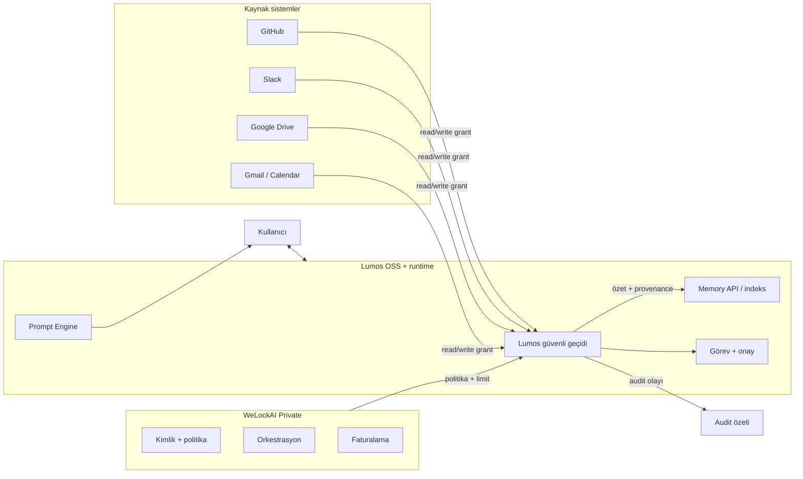
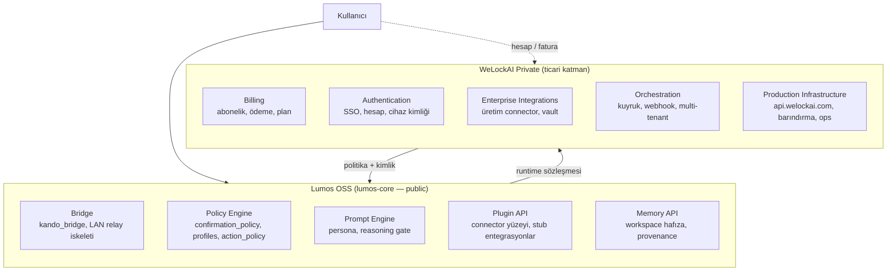

# WeLockAI Ürün Şartnamesi (Taslak)

| Alan | Değer |
|------|-------|
| Durum | **Mimari foundation taslak** — kod yok; karar destek belgesi |
| Tarih | 2026-06-26 |
| Kapsam | WeLockAI ticari katmanı ile Lumos açık kaynak çekirdeği arasındaki rol, sınır ve entegrasyon ilkeleri |
| İlgili | [`lumos-approved-naming-registry.md`](./lumos-approved-naming-registry.md), [`lumos-privacy-manifesto-draft.md`](./lumos-privacy-manifesto-draft.md), [`lumos-audit-log-contract.md`](./lumos-audit-log-contract.md), [`public-repo-boundary.md`](../memory/public-repo-boundary.md), [ADR-012](../decisions/ADR-012-lumos-security-codex.md), [`device-connection-information-architecture.md`](./device-connection-information-architecture.md), [`external-integrations-permissions.md`](../memory/external-integrations-permissions.md) |

**Sınır notu:** WeLockAI ticari ve özel katmandır. Bu belge `lumos-core` public deposunda **yalnızca mimari foundation** olarak tutulur; üretim kodu, credential, faturalama uygulaması veya operasyonel backend bu repoda **yer almaz** ([`public-repo-boundary.md`](../memory/public-repo-boundary.md)).

**İsim kaydı:** Ürün adları (**Lumos**, **WeLockAI**, **welockai.com**), yüzey rotaları (`/panel`, `/integrations`, …), rol adları ve izin sembolleri (**Read ✅**, **Write 🔒**, **Delete 🚫**) [`lumos-approved-naming-registry.md`](./lumos-approved-naming-registry.md) §A'da kilitlidir. Örnek kuruluş adları (Apple/Android/Huawei vb.) §B'de **EXAMPLE** olarak işaretlenmiştir.

---

## 1. Rol özeti

### WeLockAI

WeLockAI, Lumos ürün ailesinin **ticari omurgasıdır**: kurumsal kimlik ve yetkilendirme, abonelik ve faturalama, üretim orkestrasyonu, politika uygulama motoru ve denetim (audit) altyapısını sağlar. Kullanıcıya doğrudan sohbet deneyimi sunmaz; bunun yerine Lumos'un güvenli çalışması için gerekli **hesap, ödeme, politika ve altyapı sözleşmelerini** işletir. `welockai.com` markası altında barındırılan API, kimlik ve kurumsal entegrasyonlar bu katmandadır.

### Lumos

Lumos, kullanıcının günlük iş akışında **birincil yapay zekâ yardımcısıdır**: sohbet, görev yönetimi, karar önerisi, hafıza, yardımcı ajanlar ve panel/CLI/köprü yüzeyleri üzerinden etkileşim sağlar. Lumos tek dış kapı (ADR-012) olarak davranır; dış araçlara erişim Lumos güvenli geçidinden ve kullanıcı onayından geçer. Açık kaynak çekirdeği (`lumos-core`) demo-güvenli foundation; üretim sırları ve ticari orkestrasyon bu repoda değildir.

### Cursor

Cursor, **geliştirme ortamı ve ajan çalışma yüzeyidir**: kod düzenleme, terminal, repo bağlamı ve IDE içi yapay zekâ asistanı sağlar. Lumos ile ilişkisi **ortak kullanıcı ve iş bağlamı** düzeyindedir; Cursor Lumos'un yerine geçmez ve WeLockAI politika motorunun kapsamına girmez. Geliştirici, Cursor'da kod yazar; Lumos ise ürün davranışı, onay ve entegrasyon omurgasını taşır.

### ChatGPT

ChatGPT (ve benzeri genel amaçlı sohbet ürünleri), **geniş bilgi ve sohbet platformudur**: model erişimi, genel konuşma ve üçüncü taraf eklenti ekosistemi sunar. Lumos, ChatGPT'nin yerine geçmek için tasarlanmamıştır; iş odaklı görev, onay, hafıza politikası ve kurumsal entegrasyon sınırları Lumos'a özgüdür. ChatGPT Saved Memories ve oturum bağlamı canonical kaynak değildir; repo içi `docs/memory/` esas alınır.

---

## 2. WeLockAI yapar / Lumos yapar

| Alan | WeLockAI | Lumos |
|------|----------|-------|
| **Kimlik ve yetkilendirme** | Hesap, oturum, kurumsal SSO, cihaz eşleştirme kimliği, abonelik durumu | Yerel kilit, keystore, presence, consent sinyalleri; online modda kimlik açık olmadan işlem yok (ADR-012) |
| **Orchestration** | Üretim iş kuyruğu, connector pilotları, webhook/poll altyapısı, çok kiracılı kaynak yönetimi | Görev motoru, köprü (`kando_bridge`), panel/CLI yönlendirme; kullanıcı onaylı adım zinciri |
| **Faturalama** | Abonelik, ödeme, plan limitleri, ticari onay kapısı (OD-041) | Faturalama yapmaz; limit aşımında kullanıcıya bilgi ve yönlendirme |
| **Policy uygulama** | Kurumsal politika setleri, kiracı bazlı kısıtlar, compliance kuralları | `confirmation_policy`, profil matrisi (`rapor` / `guvenli_yurut` / `kisitli_otonom`), `SECURITY_NEVER_AUTO` yerel enforcement |
| **Audit** | Kurumsal audit arşivi, uzun süreli saklama, yönetici raporlama | Yerel audit olayları (`lumos.audit_event.v1`), guard/policy blok kayıtları, kanıt zinciri özeti |
| **Kullanıcıyla iletişim** | Destek kanalları, durum sayfası, hesap bildirimleri (ticari) | Sohbet, panel, CLI, Slack içi çalışma arkadaşı deneyimi |
| **Karar verme** | **Politika enforcement:** kurumsal kuralın teknik uygulanması; oturum/plan limiti; yasaklı aksiyon listesi | **Kullanıcıya dönük karar:** öneri, onay isteme, genel onay modu, işlem bazlı confirmation; kullanıcı «evet/hayır» verir |
| **Yapay zekâ deneyimi** | Model routing altyapısı (private), maliyet/limit politikası | Prompt engine, persona katmanları, reasoning gate, simülasyon/gerçek ayrımı |
| **Hafıza** | Kurumsal retention, silme talebi iş akışı (private) | Memory API, workspace hafızası, provenance; kullanıcı politikasına göre indeksleme |
| **Yardımcı ajanlar** | Kurumsal ajan orkestrasyonu, üretim agent network (private) | Demo-safe yardımcı ajan iskeleti, görev adımları, köprü üzerinden PC remote onay |

### «Karar verme» ayrımı (kritik)

| Kavram | Sahip | Anlam |
|--------|-------|-------|
| **Politika enforcement** | WeLockAI | «Bu kiracıda Gmail gönderimi kapalı», «bu plan PR merge yapamaz», «audit zorunlu» — **sistem kuralı** |
| **Kullanıcı onayı / kararı** | Lumos | «Bu e-postayı göndereyim mi?», «Bu dosyayı sileyim mi?», «Genel onayı aç» — **insan rızası** |

Lumos, WeLockAI politikasını **aşamaz**; WeLockAI, Lumos'un kullanıcıya sorduğu onayı **sessizce geçersiz kılmaz**. İkisi birleşik kapı oluşturur: önce politika izin verir, sonra Lumos kullanıcıdan onay ister (risk seviyesine göre).

---

## 3. WeLockAI yapar / yapmaz

### WeLockAI yapar

- Kurumsal ve bireysel **hesap kimliği** ile oturum yönetimi
- **Abonelik, faturalama ve plan limitleri** (ticari katman)
- **Kurumsal politika** tanımı ve kiracı bazlı enforcement
- **Üretim orkestrasyonu:** connector'lar, webhook, güvenli credential vault köprüsü
- **Kurumsal audit** arşivi ve yönetici raporlama
- **Üretim altyapısı:** barındırma, API (`api.welockai.com`), durum ve destek operasyonu
- Lumos OSS sürümü ile **sürüm uyumu** ve güvenlik yama dağıtımı (private pipeline)

### WeLockAI yapmaz

- Kullanıcıyla **birincil sohbet deneyimi** sunmak (bu Lumos'un işidir)
- Lumos çekirdek **güvenlik sözleşmesini** gevşetmek (`SECURITY_NEVER_AUTO`, trash prensibi, workspace omurgası)
- Onaysız **kalıcı silme**, dış yazma veya geri dönüşsüz kullanıcı işlemi tetiklemek
- Kullanıcı verisini **satmak** veya reklam profili üretmek ([`lumos-privacy-manifesto-draft.md`](./lumos-privacy-manifesto-draft.md))
- Public OSS repoda **üretim sırrı**, credential veya operasyonel runbook barındırmak
- ChatGPT/Cursor yerine geçerek **genel amaçlı sohbet platformu** olmak
- Lumos'un **tek dış kapı** rolünü bypass ederek doğrudan iç state'e yazmak

---

## 4. Lumos konumu

Lumos, kullanıcının iş ortamında **Slack içi çalışma arkadaşı** ve WeLockAI'nin **yerel temsilcisi** olarak konumlanır.

| Boyut | Konum |
|-------|-------|
| **Kullanıcı yüzeyi** | Slack, panel (`welockai.com/panel`), CLI, mobil onay (private), yerel köprü |
| **WeLockAI temsilcisi** | Kimlik durumu, plan limiti, kurumsal politika özeti — Lumos bunları okur ve kullanıcıya şeffaf gösterir; enforcement WeLockAI'de kalır |
| **Güven geçidi** | Tüm dış etki Lumos gateway + onay zincirinden geçer (ADR-012) |
| **Yerel egemenlik** | `.lumos/` workspace, görevler, hafıza, trash — kullanıcı cihazında veya yetkili ortamda |

**Özet cümle:** Kullanıcı Lumos ile konuşur ve iş yapar; WeLockAI arka planda kimlik, ödeme ve kurumsal kuralları işletir. Lumos, WeLockAI'yi kullanıcıya «gizli operatör» gibi göstermez; bağlantı ve politika durumu panelde görünür olmalıdır ([`device-connection-information-architecture.md`](./device-connection-information-architecture.md)).

---

## 5. Entegrasyon matrisi

Semboller: **Read ✅** · **Write 🔒 (onaylı)** · **Delete 🚫 (özel izin)**

| Entegrasyon | Read ✅ | Write 🔒 | Delete 🚫 | Kısa not |
|-------------|---------|----------|-----------|----------|
| **GitHub** | Repo metadata, issue/PR listesi, diff özeti, CI durumu özeti | Issue/PR yorumu, label, assign; merge **ayrı yüksek risk onayı** | Repo/issue/PR silme; branch force — `SECURITY_NEVER_AUTO` veya özel kurumsal izin | UI'da manuel kısayol mevcut; connector pilotu Katman 1 (OD-033). Okuma bağlam için; yazma görev onayı + confirmation |
| **Slack** | Kanal mesaj özeti (kapsam içi), mention/thread bağlamı, bildirim okuma | Mesaj gönderme, kanala post, reaksiyon (granüler grant) | Mesaj/kanal silme — nadiren; kurumsal politika + açık onay | İş yeri bağlamı; hafızaya yalnızca politika kapsamındaki özet gider (§6). Mail kanalı ile karıştırılmaz |
| **Google Drive** | Dosya listesi, metadata, içerik özeti (izinli scope) | Dosya oluşturma, güncelleme, paylaşım linki — onaylı | Dosya/klasör silme, paylaşım iptali — özel izin + `delete_permanent` benzeri kapı | Kalıcı import onaysız yok; indeks ≠ tam kopya arşivi |
| **Google Calendar** | Etkinlik listesi, müsaitlik, katılımcı metadata | Etkinlik oluşturma, taşıma, RSVP — granüler `cal_*` grant + onay | Etkinlik iptali/silme — ayrı onay (`cal_cancel`) | Takvim ↔ kişiler OD-032; çalışma araçlarından ayrı |
| **Gmail** | Inbox özeti, önem sırası, thread metadata (ADR-002) | Gönderme, taslak, yanıt — **işlem bazlı onay** (OD-031) | Silme, arşiv — ayrı grant; varsayılan kapalı | Varsayılan **kapalı**; okuma bile açık izin gerektirir |

**Ortak ilke:** Read, analiz ve öneri profili (`rapor`) ile uyumludur. Write, `kisitli_otonom` + genel onay veya işlem bazlı confirmation gerektirir. Delete ve geri dönüşsüz dış etki `SECURITY_NEVER_AUTO` sınıfına yakın muamele görür; otomatik yapılmaz.

---

## 6. Bilgi akışı ilkesi

> **Her araç kendi verisinin sahibidir; Lumos yalnızca gerekli kısmı işler ve kullanıcı politikalarına göre erişir.**

### 6.1 İlke bileşenleri

| Bileşen | Açıklama |
|---------|----------|
| **Veri egemenliği** | GitHub, Slack, Google vb. kaynak sistemler authoritative source'dur; Lumos tam kopya arşiv oluşturmaz (onaysız) |
| **Minimum gerekli** | İş tamamlamak için gereken özet, metadata ve bağlam çekilir; ham içerik hafızada tutulmaz (politika izin vermedikçe) |
| **Provenance** | Her dış özet hangi hesap, kanal, dosya veya thread'den geldiğini taşır ([`external-integrations-permissions.md`](../memory/external-integrations-permissions.md)) |
| **Politika filtresi** | WeLockAI kurumsal politikası + Lumos profil/onay katmanı erişimi kısıtlar |
| **Audit ayrımı** | Ne oldu (olay tipi, sonuç) kaydedilir; ham kullanıcı metni audit'e taşınmaz ([`lumos-audit-log-contract.md`](./lumos-audit-log-contract.md)) |

### 6.2 Yüksek seviye akış

### 6.3 Platform bazlı akış notları

| Kaynak | Lumos'a ne girer | Lumos'ta ne kalır | Ne gitmez |
|--------|------------------|-------------------|-----------|
| **GitHub** | Issue/PR başlığı, durum, yorum özeti, dosya yolu metadata | Görev bağlantısı, karar bağlamı | Tam repo klonu, secret, Actions log ham içeriği |
| **Slack** | Politika kapsamındaki mesaj özeti, kanal adı, thread kimliği | Hafıza politikasının izin verdiği çalışma bağlamı | Tüm workspace arşivi, DM içeriği (grant yoksa) |
| **Google Drive** | Dosya adı, tip, kısa özet, link referansı | İndeks kaydı (scope içi) | Onaysız tam dosya içeriği arşivi |
| **Gmail / Calendar** | Öncelikli inbox özeti, etkinlik slot metadata | Onaylı görev önerisi bağlamı | Ham mail gövdesi kalıcı hafızada (varsayılan hayır) |

---

## 7. Public OSS vs WeLockAI Private

### Katman özeti

| Lumos OSS (public foundation) | WeLockAI Private |
|------------------------------|------------------|
| Bridge (demo-safe köprü, pending onay sözleşmesi) | Gerçek OS otomasyonu, push backend, native mobile |
| Policy Engine (profil, confirmation, SECURITY_NEVER_AUTO) | Kurumsal politika setleri, kiracı compliance |
| Prompt Engine (persona, simülasyon ayrımı) | Model routing, maliyet optimizasyonu |
| Plugin API (stub connector, gateway sözleşmesi) | Üretim OAuth, webhook, enterprise SLA |
| Memory API (yerel indeks, gizlilik ilkeleri) | Kurumsal retention, legal hold |

**Public repoda olmaması gerekenler:** faturalama mantığı, üretim kimlik sırları, operasyonel runbook, canlı infra detayı — bkz. [`public-repo-boundary.md`](../memory/public-repo-boundary.md).

---

## 8. Çapraz referanslar

| Belge | Bu şartname ile ilişki |
|-------|------------------------|
| [`lumos-privacy-manifesto-draft.md`](./lumos-privacy-manifesto-draft.md) | Veri satmama, reklam yok, audit dengesi — Lumos kullanıcı taahhüdü |
| [`lumos-audit-log-contract.md`](./lumos-audit-log-contract.md) | Audit olay tipleri, SECURITY_NEVER_AUTO blok kaydı, pending ≠ audit |
| [`public-repo-boundary.md`](../memory/public-repo-boundary.md) | OSS vs private içerik sınırı; WeLockAI üretim detayı public'te yok |
| [ADR-012](../decisions/ADR-012-lumos-security-codex.md) | Tek dış kapı, onay + kanıt, profil matrisi, trash prensibi |
| [`device-connection-information-architecture.md`](./device-connection-information-architecture.md) | Bağlantılar hub, izin durumu, köprü vs entegrasyon ayrımı |
| [`external-integrations-permissions.md`](../memory/external-integrations-permissions.md) | Entegrasyon felsefesi, granüler grant, gateway ilkesi |
| [`lumos-approved-naming-registry.md`](./lumos-approved-naming-registry.md) | APPROVED LOCKED vs EXAMPLE isim kaydı |

---

## 9. Açık noktalar (taslak)

| # | Konu | Durum |
|---|------|-------|
| 1 | WeLockAI politika API'sinin Lumos Policy Engine'e bağlanma şekli | Taslak — private taslak gerekir |
| 2 | Slack içi Lumos deneyiminin birincil yüzey olup olmayacağı | Ürün kararı bekliyor |
| 3 | Kurumsal audit'in WeLockAI'de ne kadar süre saklanacağı | Compliance kararı — private |
| 4 | OSS köprü ile üretim orkestrasyon sürüm uyumu | Operasyonel — CI/CD private |

**Alpha notu (2026-06-26):** Maddeler 1–4 **deferred to WeLockAI private** veya Launch; OSS foundation ([trust model D1–D7](welockai-trust-model-draft.md#9-açık-kararlar)) ile hizalı. Public repoda uygulama beklenmez.

---

*Bu belge mimari foundation taslaktır; hukuki sözleşme veya SLA değildir. Üretim kararları private katmanda ve ilgili ADR/karar kayıtlarında güncellenir.*
