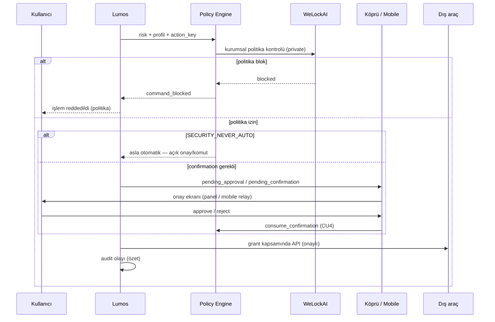

# WeLockAI Güven ve Yetki Modeli (Taslak)

| Alan | Değer |
|------|-------|
| Durum | **Mimari foundation taslak** — kod yok; yetki karışıklığını önleme belgesi |
| Tarih | 2026-06-26 |
| Önkoşul | [`welockai-charter-draft.md`](./welockai-charter-draft.md) |
| İlgili | [ADR-012](../decisions/ADR-012-lumos-security-codex.md), [`lumos-audit-log-contract.md`](./lumos-audit-log-contract.md), [`lumos-privacy-manifesto-draft.md`](./lumos-privacy-manifesto-draft.md), [`public-repo-boundary.md`](../memory/public-repo-boundary.md), [`device-connection-information-architecture.md`](./device-connection-information-architecture.md), [`lumos-mobile-approval-mvp-plan.md`](./lumos-mobile-approval-mvp-plan.md), `src/policy/confirmation_policy.py`, `src/task_engine/profiles.py` |

**Sınır notu:** Bu model Lumos açık kaynak çekirdeği ve WeLockAI ticari katmanı için **ortak güven sözleşmesidir**. Üretim kimlik, faturalama ve kurumsal politika uygulaması yalnızca WeLockAI private katmanında yaşar; bu repoda enforcement kodu beklenmez.

---

## 1. Amaç

Bu belgenin amacı, Lumos ekosisteminde **yetki ve güven sınırlarının gelecekte karışmasını önlemektir**.

Özellikle şu hatalar tanımlanır ve engellenir:

| Risk | Örnek hata | Bu modelin cevabı |
|------|------------|-------------------|
| **Rol kapması** | Lumos'un faturalama veya kurumsal SSO kararı vermesi | Rol × yetki matrisi (§4) |
| **Sessiz delegasyon** | WeLockAI'nin kullanıcı onayını atlatarak dış yazma yapması | Onay zinciri (§6); `SECURITY_NEVER_AUTO` |
| **Araç egemenliği ihlali** | Slack/GitHub verisinin onaysız tam arşivlenmesi | Trust boundary + bilgi akışı ilkesi (charter §6) |
| **OSS/private sızıntısı** | Public repoda üretim credential veya ödeme akışı | OSS vs private rol ayrımı (§7) |
| **Yanlış onay yüzeyi** | Köprü secret'ının mobile taşınması | Mobil onay MVP — relay token, loopback kuralı |

Bu taslak, mevcut repo sözleşmelerine (`confirmation_policy`, `profiles.SECURITY_NEVER_AUTO`, device-connection IA, mobil/köprü onay) dayanır; yeni gevşetme getirmez.

---

## 2. Roller

### 2.1 Kullanıcı

**Tanım:** Lumos'u kullanan gerçek kişi veya yetkili kurumsal kullanıcı.

| Yetki | Sınır |
|-------|-------|
| Nihai onay mercii | Yüksek riskli ve dış etkili işlemlerde «evet/hayır» |
| Politika tercihi | Profil seçimi, genel onay modu, entegrasyon grant'leri |
| İptal | Consent ve bağlantıları anında geri çekme |
| Sorumluluk | Onay verdiği işlemlerin sonucu |

Kullanıcı, sistemin yerine «otomatik karar veren» taraf değildir; Lumos önerir, kullanıcı onaylar ([`lumos-karar-sozlesmesi.md`](../lumos-karar-sozlesmesi.md)).

### 2.2 Lumos

**Tanım:** Kullanıcıya bakan yapay zekâ yardımcısı ve tek dış kapı (ADR-012).

| Yapar | Yapmaz |
|-------|--------|
| Sohbet, görev, öneri, hafıza yüzeyi | Kurumsal faturalama veya SSO işletmek |
| `confirmation_policy` ile onay istemek | `SECURITY_NEVER_AUTO` işlemleri otomatik yapmak |
| Profil matrisini uygulamak (`rapor` / `guvenli_yurut` / `kisitli_otonom`) | WeLockAI politikasını sessizce aşmak |
| Köprü üzerinden pending onay oluşturmak | Köprü secret'ını mobile veya dış ağa sızdırmak |
| Audit olayı özeti yazmak (içerik-güvenli) | Ham kullanıcı metnini audit'e kopyalamak |

**Kod referansı:** `src/policy/confirmation_policy.py` — `REQUIRES_CONFIRMATION_ACTIONS`, bridge pending → confirmation namespace (PR-C6).

### 2.3 WeLockAI

**Tanım:** Ticari omurga — kimlik, faturalama, kurumsal politika, üretim orkestrasyon.

| Yapar | Yapmaz |
|-------|--------|
| Hesap, abonelik, plan limiti | Kullanıcıyla birincil sohbet |
| Kurumsal politika enforcement | Lumos çekirdek güvenlik sözleşmesini gevşetmek |
| Üretim connector ve vault köprüsü | Onaysız kalıcı silme veya dış yazma |
| Kurumsal audit arşivi | Kullanıcı verisini satmak veya reklama çevirmek |

WeLockAI, Lumos'un **yerel temsilcisi değil, arka plan otoritesidir**; kullanıcıya görünür politika özeti sunulur, gizli manipülasyon yoktur.

### 2.4 Araçlar (Slack, GitHub, Gmail, Drive, Calendar…)

**Tanım:** Dış sistemler — kendi verisinin **authoritative** sahibi.

| İlke | Uygulama |
|------|----------|
| Egemenlik | Veri kaynak sistemde kalır; Lumos yalnızca grant kapsamında okur/yazar |
| Minimum erişim | `{platform}_read`, `_create`, `_update`, `_delete` granüler grant (OD-033) |
| Provenance | Özet ve öneriler kaynak atıfı taşır |
| Otomatik genişleme yok | Connector kullanıcı onayı olmadan eklenmez |

Araçlar **delegasyon almaz**; Lumos kullanıcı adına API çağrısı yapar, araçlar Lumos'a yetki vermez.

### 2.5 İnsan yönetici

**Tanım:** Kurumsal tenant yöneticisi veya WeLockAI operasyon ekibi (kurumsal bağlam).

| Yapar | Yapmaz |
|-------|--------|
| Kurumsal politika tanımlama (WeLockAI) | Son kullanıcının işlem bazlı onayını bypass etmek (varsayılan) |
| Audit ve compliance raporu görüntüleme | Kullanıcı passphrase veya keystore içeriğine erişmek |
| Plan, kullanıcı ve entegrasyon provisioning | Lumos workspace içeriğini gizlice okumak (politika dışı) |

**Açık karar:** «Break-glass» acil erişim modeli bu taslakta tanımlı değildir — kurumsal sözleşme gerektirir (§9).

---

## 3. Güven sınırları (trust boundaries)

```mermaid
flowchart TB
  subgraph tb_user [TB-1: Kullanıcı alanı]
    U[Kullanıcı]
  end

  subgraph tb_lumos [TB-2: Lumos runtime]
    L[Lumos + köprü + panel]
    P[Policy / confirmation]
  end

  subgraph tb_welock [TB-3: WeLockAI private]
    W[Kimlik + fatura + kurumsal politika]
  end

  subgraph tb_tools [TB-4: Dış araçlar]
    T[GitHub / Slack / Google…]
  end

  subgraph tb_admin [TB-5: Yönetici]
    A[İnsan yönetici]
  end

  U <-->|onay + sohbet| L
  W -->|politika + limit read| P
  L -->|grant kapsamında API| T
  A -->|kurumsal config| W
  A -.->|audit read| W
  L -.x|secret taşımaz| U
  W -.x|sohbet yapmaz| U
```

### 3.1 Sınır kuralları

| Sınır | Geçen | Geçmeyen |
|-------|-------|----------|
| **TB-1 ↔ TB-2** | Onay kararı, sohbet, panel etkileşimi | Köprü secret, ham vault credential |
| **TB-2 ↔ TB-3** | Politika özeti, plan limiti, kimlik durumu | Kullanıcı içerik arşivi, passphrase |
| **TB-2 ↔ TB-4** | Grant kapsamında read/write | Onaysız tam import, sessiz arka plan sync |
| **TB-3 ↔ TB-4** | Üretim connector (vault üzerinden) | Lumos bypass ile doğrudan state yazma |
| **TB-5 ↔ TB-1** | Kurumsal politika (dolaylı) | Kullanıcı adına otomatik işlem (varsayılan yasak) |

### 3.2 Delegasyon kuralları

| Kaynak | Hedefe delegasyon | İzin |
|--------|-------------------|------|
| Kullanıcı | Lumos | Sohbet, görev, onay |
| Kullanıcı | Araçlar (Lumos aracılığıyla) | Açık grant + onay |
| Lumos | Araçlar | Yalnızca onaylı ve politika-izinli çağrı |
| WeLockAI | Lumos | Politika/limit **bildirimi** — kullanıcı onayı yerine geçmez |
| Lumos | WeLockAI | Kimlik/limit **sorgusu** — içerik gönderilmez |
| İnsan yönetici | WeLockAI | Kurumsal config |
| İnsan yönetici | Lumos (doğrudan) | **Varsayılan hayır** — break-glass ayrı karar |
| Araçlar | Lumos / WeLockAI | **Hayır** — araçlar delegasyon vermez |

---

## 4. Tek sayfa yetki matrisi

**Semboller:** ✅ İzinli (politika + gerekirse onay) · 🔒 Onay gerekli · ⛔ Varsayılan yasak · — Rol kapsam dışı · 👁 Salt okuma (yönetici/audit)

| Yetenek | Kullanıcı | Lumos | WeLockAI | Araçlar | İnsan yönetici |
|---------|-----------|-------|----------|---------|----------------|
| **read** (dış veri) | ✅ grant ile | ✅ gateway ile | — | ✅ (kendi verisi) | 👁 audit/policy |
| **write** (dış etki) | 🔒 onay verir | 🔒 confirmation sonrası | ⛔ doğrudan yazmaz | — (pasif API) | ⛔ kullanıcı adına |
| **approve** (işlem onayı) | ✅ nihai mercii | 🔒 istek oluşturur | — | — | ⛔ bypass (varsayılan) |
| **delete** (geri dönüşsüz) | 🔒 açık komut | ⛔ `SECURITY_NEVER_AUTO` | ⛔ otomatik değil | — | ⛔ |
| **orchestrate** (çok adımlı akış) | — | ✅ görev motoru (onaylı) | ✅ üretim kuyruk | — | ✅ tenant config |
| **audit** (olay kaydı) | 👁 kendi özeti | ✅ olay üretir | ✅ kurumsal arşiv | — | 👁 rapor |
| **bill** (ödeme/abonelik) | 🔒 işlem onayı | — | ✅ | — | ✅ plan config |
| **configure policy** | ✅ kişisel tercih | ✅ profil/mod | ✅ kurumsal kural | — | ✅ tenant politikası |

### 4.1 Lumos profil × yetenek (yerel katman)

ADR-012 ve `profiles.py` ile hizalı özet:

| Profil | read/analyze/plan | safe_local | write_local | external/critical | SECURITY_NEVER_AUTO |
|--------|-------------------|------------|-------------|-------------------|---------------------|
| `rapor` | ✅ | ⛔ | ⛔ | ⛔ | ⛔ |
| `guvenli_yurut` | ✅ | ✅ | ⛔ | ⛔ | ⛔ |
| `kisitli_otonom` | ✅ | ✅ | 🔒 genel onay ile | ⛔ | ⛔ |
| *her profil* | — | — | — | ⛔ | ⛔ **asla otomatik** |

`SECURITY_NEVER_AUTO` üyeleri (`permanent_delete`, `external_write`, `irreversible_user_op`, `critical_system_config`): profil ve genel onaydan **bağımsız** otomatik yürütülmez; audit'te yalnızca `command_blocked` görünür ([`lumos-audit-log-contract.md`](./lumos-audit-log-contract.md) §10.2).

---

## 5. Onay zinciri

Onay zinciri, mevcut Lumos **mobil/köprü onay** mimarisi ve `confirmation_policy` ile hizalıdır.

### 5.1 Zincir aşamaları



### 5.2 Mevcut repo bileşenleriyle eşleme

| Aşama | Repo / belge | Not |
|-------|--------------|-----|
| Risk sınıflandırma | `lumos_gate`, `pc_remote_tools` | Yüksek/orta/düşük risk tier |
| Profil kontrolü | `src/task_engine/profiles.py` | `is_allowed_for_profile` |
| İşlem onayı | `src/policy/confirmation_policy.py` | `REQUIRES_CONFIRMATION_ACTIONS`, TTL, scope |
| Köprü pending | `.lumos/pending_approvals/` | PC remote kaynak |
| Mobil onay | `lan_relay.py`, `mobile_approval_client.py` | Relay token; köprü secret taşınmaz |
| Panel onay | `panel_tasks_server.py` | `check_policy` + confirmation gate |
| Audit | `lumos-audit-log-contract.md` | `approval_granted`, `command_blocked` |
| Opt-in enforcement | `LUMOS_CONFIRMATION_ENABLED` | Varsayılan devre dışı (OSS demo) |

### 5.3 Onay türleri

| Tür | Kim verir | Ne için | Oturum genişler mi |
|-----|-----------|---------|-------------------|
| **Genel onay** | Kullanıcı | `kisitli_otonom` + `write_local` | Mod süresince — `external`/ticari için **hayır** |
| **İşlem bazlı confirmation** | Kullanıcı | `delete_permanent`, `external_write`, köprü yüksek risk | Hayır — tek kullanımlık token |
| **Consent / grant** | Kullanıcı | Entegrasyon bağlantısı (GitHub, Gmail…) | Platform grant — ayrı sinyal |
| **Mobil onay** | Kullanıcı (eşleşmiş cihaz) | PC remote, orta/yüksek risk köprü | Pending başına |
| **Ticari onay** | Kullanıcı | Ödeme, domain (OD-041) | **Asla** oturum genişlemesi |

Consent ile confirmation **ayrı sinyallerdir** (ADR-010); biri diğerinin yerine geçmez.

---

## 6. OSS vs private — rol varlığı

| Rol / yetenek | Lumos OSS (`lumos-core`) | WeLockAI Private |
|---------------|--------------------------|------------------|
| Kullanıcı | ✅ | ✅ (hesap bağlamı) |
| Lumos (runtime) | ✅ foundation + demo stub | ✅ üretim instance |
| WeLockAI otoritesi | ⛔ yalnızca belge/sözleşme | ✅ |
| İnsan yönetici (kurumsal) | ⛔ | ✅ |
| Köprü (loopback) | ✅ demo-safe | ✅ barındırılmış köprü |
| LAN relay / mobil onay | ✅ iskelet (RB-06) | ✅ native app, push |
| Policy Engine (yerel) | ✅ | ➕ kurumsal overlay |
| Faturalama / ödeme | ⛔ | ✅ |
| Üretim SSO | ⛔ | ✅ |
| Enterprise connector | stub / sözleşme | ✅ |
| Audit (yerel özet) | ✅ sözleşme | ✅ kurumsal arşiv |
| Gerçek OS otomasyonu | ⛔ stub | ✅ |

**Kural:** Public repoda yalnızca demo-safe foundation ve sözleşme tutulur; WeLockAI'ye özgü roller bu repoda **kod olarak implement edilmez** ([`public-repo-boundary.md`](../memory/public-repo-boundary.md)).

---

## 7. Device-connection IA ile hizalama

[`device-connection-information-architecture.md`](./device-connection-information-architecture.md) alanları bu güven modeliyle eşlenir:

| IA alanı | Güven modeli rolü |
|----------|-------------------|
| **Bu cihaz** | TB-1 + TB-2 — yerel mahremiyet sınırı |
| **Bağlı cihazlar** | Mobil onay relay — eşleştirme, güven kaldırma |
| **Yerel köprü** | TB-2 — loopback, secret gösterilmez |
| **Entegrasyonlar** | TB-4 — grant + provenance |
| **İzin durumu** | Profil + confirmation + SECURITY_NEVER_AUTO özeti |

Kullanıcı «İzin durumu» ekranında hangi rolün neye izin verdiğini **tek bakışta** görür; sessiz genişleme yasaktır.

---

## 8. Çapraz referanslar

| Kaynak | Bu modelde kullanımı |
|--------|----------------------|
| [ADR-012](../decisions/ADR-012-lumos-security-codex.md) | Tek dış kapı, onay + kanıt, trash, mock ayrımı |
| [`lumos-audit-log-contract.md`](./lumos-audit-log-contract.md) | Olay tipleri, pending ≠ audit, NEVER_AUTO blok |
| [`lumos-privacy-manifesto-draft.md`](./lumos-privacy-manifesto-draft.md) | Kullanıcı kontrolü, audit dengesi |
| [`public-repo-boundary.md`](../memory/public-repo-boundary.md) | OSS vs private rol sınırı |
| [`welockai-charter-draft.md`](./welockai-charter-draft.md) | Rol özeti, entegrasyon matrisi, bilgi akışı |
| [`external-integrations-permissions.md`](../memory/external-integrations-permissions.md) | Gateway, granüler grant, provenance |
| [`lumos-mobile-approval-mvp-plan.md`](./lumos-mobile-approval-mvp-plan.md) | Poll-first onay, relay güven ilkeleri |
| `confirmation_policy.py` | Action key, bridge pending, CU4 |
| `profiles.py` | SECURITY_NEVER_AUTO, profil matrisi |

---

## 9. Açık kararlar

Aşağıdaki maddeler bilinçli olarak **bu taslakta kapatılmamıştır**; ileri karar gerektirir.

| # | Karar | Seçenekler | Öncelik |
|---|-------|------------|---------|
| D1 | Kurumsal «break-glass» yönetici erişimi | Tam yasak / süreli audit'li erişim / sadece politika config | Yüksek (enterprise) |
| D2 | WeLockAI politika overlay'in Lumos Policy Engine'e bağlanma API'si | Pull (Lumos sorgular) / Push (WeLockAI webhook) | Orta |
| D3 | Slack içi Lumos'un birincil onay yüzeyi olması | Panel + mobile / Slack interactive / hibrit | Ürün |
| D4 | `LUMOS_CONFIRMATION_ENABLED` varsayılanının üretimde açılması | Opt-in korunur (ADR-012) / varsayılan-on (yüksek risk) | Güvenlik |
| D5 | Kurumsal audit saklama süresi ve legal hold | 90 gün / 1 yıl / kiracı bazlı | Compliance |
| D6 | Çoklu cihaz eşleştirmede güven halkası modeli | LAN pairing (RB-06) / hesap bağlı QR / SSO cihaz | Orta |
| D7 | Gmail okuma grant'inin varsayılan pilot kapsamı | Sadece özet / thread düzeyi / domain filtreli | Gizlilik |

### Alpha çözüm notları (2026-06-26)

| # | Alpha kararı |
|---|--------------|
| D1 | **Deferred — WeLockAI private** + Closed Pilot sözleşmesi ([pilot-contract-template.md](pilot-contract-template.md)) |
| D2 | **Deferred — Wave 2+**; OSS Policy Engine bağımsız kalır |
| D3 | **Deferred — ürün**; Alpha onay yüzeyi panel + mobile web stub |
| D4 | **Resolved for Alpha — opt-in korunur** (ADR-012); varsayılan-on Wave 2+ |
| D5 | **Deferred — WeLockAI private** compliance |
| D6 | **Deferred — private**; OSS LAN pairing demo yeterli |
| D7 | **Deferred — Closed Pilot**; Gmail varsayılan kapalı (charter §5) |

**Sonraki adım:** D2 ve D4 Wave 2+ planı ile; D1/D5 kurumsal private katmanda.

---

*Bu belge yetki karışıklığını önlemek için foundation taslaktır. Uygulama değişikliği veya profil gevşetmesi bu metinle tek başına yapılamaz; ADR ve kod review gerekir.*
