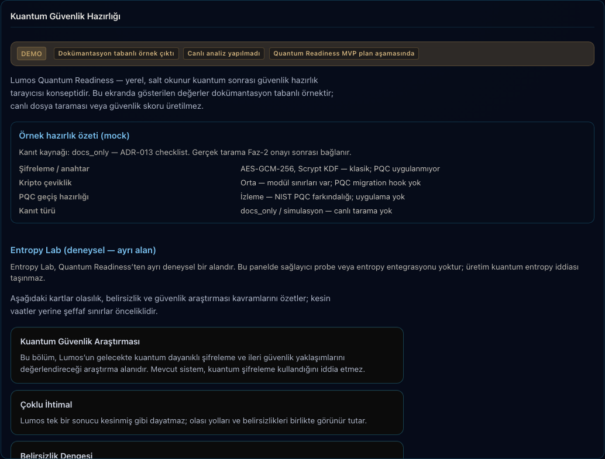

# ADR-013: Lumos Quantum Readiness (Taslak)

> **Lumos Quantum Readiness yerel, salt-okunur, kanıtlı kuantum sonrası güvenlik hazırlık tarayıcısıdır.**

| Alan | Değer |
|------|-------|
| Durum | **Taslak** — Faz-1 docs tamamlandı; **Faz-2 kısmi** (yerel tarayıcı PR #468, panel `GET /quantum-readiness` PR #469). Entropy sağlayıcı davranışı değiştirilmez |
| Tarih | 2026-06-21 |
| İlgili | [ADR-001](ADR-001-lumos-quantum-modules.md), `src/security/entropy/`, [readiness checklist](../analysis/lumos-quantum-readiness-checklist.md), `ROADMAP.md` |

## Amaç

Lumos'taki kuantum alanını **"kuantum bilgisayar kullanıyoruz"**, **"kuantum-güvenli kriptografi"** veya **"quantum secure / quantum powered"** iddiasından çıkarıp, **yerel, salt okunur, kanıtlı kuantum sonrası güvenlik hazırlık tarayıcısı** (Quantum Readiness) olarak tanımlamak.

Tarayıcı **değerlendirme ve raporlama** yapar; kriptografiyi değiştirmez, PQC uygulamaz, kuantum donanımı kullanmaz.

Bu belge **bağımsız bir hazırlık ADR'sidir**. **Entropy Lab** (deneysel entropy sağlayıcıları) ayrı ve deneysel bir alandır; bu ADR ile sağlayıcı seçimi veya fallback davranışı **değiştirilmez**.

---

## Ürün yönü

### Problem

Bugün üç algı aynı anda var:

1. **Dürüst metinler** (landing, panel i18n, ADR-001): "Kuantum şifreleme kullanmıyoruz", "aktif üretim özelliği değil".
2. **Kod gerçeği** (`src/security/entropy/`): Qiskit Aer ve IBM Runtime sağlayıcıları mevcut; varsayılan yol `os.urandom`.
3. **Kısmi kapanış (Faz-2)**: Yerel salt okunur tarayıcı (`src/security/readiness/scanner.py`), panel `GET /quantum-readiness` ve `lumos quantum-readiness` CLI mevcut. Panel kuantum sekmesinde statik kartlar (`#panel-kuantum`) korunur; `GET /quantum-readiness` fetch başarısızsa docs-only mock banner gösterilir (#471, #475).

### Hedef

**Lumos Quantum Readiness** — Lumos güvenlik mimarisinde kuantum sonrası tehditlere karşı **yerel tarama + salt okunur rapor**:

- Şifreleme, imza ve anahtar türlerini envanterler.
- Uzun ömürlü veri ve değiştirilmesi zor algoritma bağımlılıklarını işaretler.
- Kripto çeviklik (crypto agility) düzeyini ve PQC geçiş hazırlığını değerlendirir.
- Dosya/konfig kanıtlı bulguları ve önceliklendirilmiş geçiş planı sunar.
- Entropy Lab durumunu **açık etiketlerle** raporlar (aktif / kullanılamıyor / fallback) — deneysel alan olarak ayrı.
- Panel/CLI çıktısında **mock ≠ gerçek** ayrımını şeffaf tutar.

### Ne değildir

| İddia | Durum |
|-------|-------|
| Gerçek kuantum bilgisayar üretim kullanımı | **Hayır** |
| Post-quantum / kuantum-dayanıklı kriptografi (PQC) uygulaması | **Hayır** — değerlendirme ve envanter düzeyi |
| "Quantum secure" / "quantum powered" pazarlama dili | **Hayır** — public OSS sınırı |
| Entropy sağlayıcı davranışını değiştirmek | **Hayır** — bu ADR mevcut `entropy()` sözleşmesine dokunmaz |
| IBM ücretli API / prod entegrasyon | **Hayır** — sınır dokümantasyonu; maliyet/onay açılmadan aktif değil |
| Entropy Lab'i üretim hazırlığı olarak sunmak | **Hayır** — deneysel; readiness raporunda ayrı bölüm |

### Entropy Lab vs Quantum Readiness

| Alan | Quantum Readiness | Entropy Lab |
|------|-------------------|-------------|
| Amaç | Kripto envanter + PQC geçiş hazırlığı | Deneysel entropy kaynağı araştırması |
| Mod | Yerel salt okunur tarama + rapor | Opsiyonel sağlayıcı probe (Qiskit Aer, IBM Runtime) |
| Üretim iddiası | Yok — hazırlık tarayıcısı | Yok — simülatör / harici ≠ kuantum güvenli |
| Bu ADR | Ana kapsam | Sınır dokümantasyonu; davranış değişmez |

### ADR-001 ile hizalama

ADR-001 kuantumu "erken hedef değil, iptal değil, araştırma/aday" konumlar. ADR-013 bunu **somutlaştırır**: üretim iddiası yerine **yerel hazırlık taraması + raporu**. Routing, trust ve memory önceliği korunur.

---

## MVP kapsamı

### Faz-1 (bu ADR — docs-only)

1. Readiness tanımı, merkez başlık ve sınır sözleşmesi (bu belge + checklist).
2. **Rapor alanları spesifikasyonu** — aşağıdaki bölüm; Faz-2'de yerel tarama çıktısı.
3. **Yerel envanter checklist'i** — manuel tablo; ileride script bağlanabilir.
4. **PQC farkındalık bölümü** — "izleniyor / uygulanmıyor"; NIST PQC adayları referans notu (uygulama yok).
5. **Sessiz fallback uyarısı** — zorunlu kullanıcı-facing metin (aşağıda Riskler).
6. **Public OSS sınırı** — üretim kuantum iddiası yasağı.

### MVP tanımı (Faz-2 hedefi — onay sonrası)

| Özellik | MVP | Dışı |
|---------|-----|------|
| Yerel dosya/konfig taraması | Evet | Harici API / bulut tarama |
| Salt okunur JSON/Markdown rapor | Evet | Write aksiyonları |
| Kanıt etiketli bulgular | Evet | Mock'un gerçek sanılması |
| Önceliklendirilmiş geçiş planı | Evet (öneri) | Otomatik migrasyon |
| Entropy Lab probe | Evet (ayrı bölüm) | Entropy davranış değişikliği |
| PQC algoritma entegrasyonu | Hayır | — |

### Bilinçli erteleme (MVP dışı)

| Konu | Neden |
|------|-------|
| Entropy provider kod değişikliği | Ayrı onaylı PR |
| Gerçek PQC algoritma entegrasyonu | Uzmanlık + audit gerekir |
| IBM Runtime prod bağlantısı | Maliyet, credential, public boundary |
| Qiskit Aer'i "quantum entropy" olarak pazarlamak | Simülatör ≠ donanım; kripto iddiası yok |
| Panel write aksiyonları | Readiness salt okunur olmalı |

### Başarı ölçütleri

- Hiçbir kullanıcı metninde "kuantum bilgisayar kullanıyoruz", "kuantum-güvenli şifreleme" veya "quantum secure" **yok**.
- Readiness çıktısı **kanıt türü** ile etiketli (`env_ok`, `simulasyon`, `kullanılamıyor`, `fallback_aktif`, `docs_only`, `file_evidence`).
- Entropy modülü **davranış değişmeden** dokümante edilmiş; Entropy Lab readiness raporunda **deneysel** olarak ayrılmış.
- ADR-001 ve public-github-boundary ile çelişki yok.

---

## Rapor alanları (spesifikasyon)

Her readiness raporu (CLI JSON veya panel salt okunur görünüm) aşağıdaki alanları taşır. Faz-1'de checklist şablonu; Faz-2'de yerel tarama doldurur.

### 1. Şifreleme / imza / anahtar türleri (`crypto_inventory`)

| Alt alan | Açıklama | Örnek (Lumos Faz-1) |
|----------|----------|---------------------|
| `encryption_types` | Aktif simetrik/asimetrik şifreleme | AES-GCM-256 |
| `signature_types` | İmza veya MAC türleri | (yok — nonce tabanlı istek imzası) |
| `key_types` | Anahtar türetme ve saklama | Scrypt KDF, 256-bit random root |
| `quantum_exposure_note` | Klasik / kuantum sonrası tehdide açıklık | Klasik — PQC değil |
| `evidence` | Kanıt kaynağı | `file:src/security/crypto.py` |

### 2. Uzun ömürlü veri (`long_lived_data`)

| Alt alan | Açıklama |
|----------|----------|
| `data_class` | Veri sınıfı (keystore, yedek, log, config) |
| `retention` | Beklenen saklama süresi veya "indefinite" |
| `crypto_at_rest` | Dinlenirken kullanılan algoritma |
| `harvest_now_decrypt_later_risk` | "Topla-şimdi, çöz-sonra" risk notu (düşük/orta/yüksek) |
| `evidence` | Dosya veya konfig yolu |

### 3. Değiştirilmesi zor algoritma bağımlılıkları (`hard_to_change_deps`)

| Alt alan | Açıklama |
|----------|----------|
| `component` | Bileşen adı |
| `algorithm` | Sabitlenmiş algoritma |
| `change_cost` | Değiştirme maliyeti (düşük/orta/yüksek) |
| `reason` | Neden zor (format, protokol, üçüncü taraf, dağıtılmış keystore) |
| `evidence` | Kod veya konfig referansı |

### 4. Kripto çeviklik düzeyi (`crypto_agility_level`)

Skala: `dusuk` | `orta` | `yuksek` | `dogrulanamadi`

| Düzey | Kriter (değerlendirme notu) |
|-------|----------------------------|
| Düşük | Algoritma sabit; konfig veya soyutlama yok |
| Orta | Sınırlı soyutlama; env veya modül sınırı var |
| Yüksek | Açık algoritma seçimi, versiyonlama, migration hook |
| Doğrulanamadi | Tarama yetersiz veya erişim yok |

Lumos Faz-1 değerlendirme: **orta** — modül sınırları var; PQC migration hook yok.

### 5. Kuantum sonrası geçiş hazırlığı (`post_quantum_transition_readiness`)

| Alt alan | Açıklama |
|----------|----------|
| `pqc_status` | `izleme` / `degerlendirme` / `planli` / `uygulanmiyor` |
| `nist_pqc_awareness` | NIST PQC standardizasyon farkındalığı (evet/hayır) |
| `hybrid_ready` | Hibrit (klasik+PQC) geçişe uygunluk notu |
| `blockers` | Geçiş engelleri listesi |
| `evidence` | Doküman veya kod referansı |

Faz-1: `pqc_status = uygulanmiyor`, `nist_pqc_awareness = evet` (ADR/checklist).

### 6. Kanıtlı dosya / konfig bulguları (`evidenced_findings`)

Her bulgu:

```yaml
finding_id: string          # örn. CR-001
severity: dusuk | orta | yuksek
category: crypto | entropy | config | dependency
summary: string             # kısa Türkçe/İngilizce açıklama
file_path: string           # repo-relative yol
line_or_section: string     # satır veya bölüm (opsiyonel)
evidence_type: code | config | env | docs
verified: true | false        # Faz-2 probe ile doğrulandı mı
```

Örnek Faz-1 bulgular checklist'te listelenir.

### 7. Önceliklendirilmiş geçiş planı (`prioritized_migration_plan`)

| Sütun | Açıklama |
|-------|----------|
| `priority` | P0 (acil) / P1 / P2 / P3 (izleme) |
| `action` | Önerilen adım (uygulama değil — plan metni) |
| `target` | Etkilenen bileşen |
| `dependency` | Önkoşul adım |
| `effort` | tahmini efor (S/M/L) |
| `owner_hint` | örn. security / ops / ayrı ADR |
| `status` | `oneri` / `onay_bekliyor` / `ertelendi` |

Faz-1: statik öneri tablosu checklist'te; otomatik uygulama yok.

### Rapor üst bilgisi (meta)

| Alan | Açıklama |
|------|----------|
| `report_type` | `quantum_readiness` |
| `scan_mode` | `local` |
| `read_only` | `true` |
| `generated_at` | ISO-8601 (Faz-2) |
| `evidence_basis` | `docs_only` (Faz-1) / `local_scan` (Faz-2) |
| `disclaimer` | "Hazırlık raporu — kuantum güvenli veya kuantum bilgisayar iddiası taşımaz" |

---

## Panel alanları (spesifikasyon — Faz-2 kısmi uygulama)

Mevcut panel kuantum sekmesi (`ui/src/pages/panel.astro`, `#panel-kuantum`) dört statik kart taşır. Faz-2 kısmi uygulamada altına **readiness banner + özet alanı** eklendi; panel sunucusu `GET /quantum-readiness` ile `scan_quantum_readiness()` JSON döner (`panel/scripts/panel_tasks_server.py`). Canlı fetch başarısızsa mock banner ve docs-only örnek değerler kalır. Canlı yükte ek UI alanları: `meta.generated_at`, `evidenced_findings` listesi, `entropy_lab` probe özeti (salt okunur; entropy davranışı değişmez).



### Sekme banner (öneri)

Üst banner: *"Lumos Quantum Readiness — yerel hazırlık tarayıcısı; üretim kuantum özelliği değildir"*

Mevcut dört kart (Kuantum Güvenlik Araştırması, Çoklu İhtimal, Belirsizlik Dengesi, Karar Sınırı) korunabilir.

### Readiness alanları (özet → detay yukarıdaki rapor bölümü)

| Alan | Tür | Etiket | Açıklama |
|------|-----|--------|----------|
| **Genel durum** | Salt okunur badge | `hazırlık_raporu` | `tamamlandi` / `kısmi` / `doğrulanamadi` |
| **Şifreleme / imza / anahtar türleri** | Salt okunur liste | `gerçek` (tarama) | `crypto_inventory` |
| **Uzun ömürlü veri** | Salt okunur tablo | `gerçek` | `long_lived_data` + HNDL risk notu |
| **Zor değişen bağımlılıklar** | Salt okunur liste | `gerçek` | `hard_to_change_deps` |
| **Kripto çeviklik** | Salt okunur skala | `degerlendirme` | `crypto_agility_level` |
| **PQC geçiş hazırlığı** | Salt okunur | `izleme` | `post_quantum_transition_readiness` |
| **Kanıtlı bulgular** | Salt okunur liste | `file_evidence` | `evidenced_findings` |
| **Geçiş planı** | Salt okunur tablo | `oneri` | `prioritized_migration_plan` |
| **Entropy Lab (deneysel)** | Salt okunur alt panel | `deneysel` | Sağlayıcı, kullanılabilirlik, fallback — üretim değil |
| **Son kontrol zamanı** | Salt okunur | `gerçek` | ISO timestamp (Faz-2) |
| **Kanıt kaynağı** | Salt okunur | `gerçek` | `local_scan` / `docs_only` (Faz-1) |

### Faz-1 / fallback mock kuralı

Panel sunucusu veya `GET /quantum-readiness` erişilemezken:

- Sabit banner: **`DEMO`** + docs-only / fetch-unavailable rozetleri (i18n; bkz. #471); live taramada **`Yerel tarama (local_scan)`** rozeti gösterilir.
- Statik örnek değerler mock olarak işaretlenir; gerçek başarı gibi gösterilmez.

Canlı tarama bağlıyken rapor `meta.evidence_basis = local_scan` taşır; mock/fallback durumunda `docs_only` etiketi korunur.

### MVP'de olmayan aksiyonlar

| Aksiyon | MVP | Gerekçe |
|---------|-----|---------|
| Entropy sağlayıcı değiştir | Hayır | Env değişikliği = güvenlik etkisi; ayrı onay |
| IBM bağlantı testi (canlı job) | Hayır | Maliyet + external; onay kapılı |
| PQC anahtar üretimi | Hayır | Uygulama yok |
| Otomatik migrasyon | Hayır | Plan salt okunur öneri |

---

## Entropy Lab sınırları (deneysel — readiness'ten ayrı)

Entropy modülü: `src/security/entropy/` — tek giriş `entropy(n, provider)` / `get_random_bytes(n)`.

**Entropy Lab**, Quantum Readiness raporunun **ayrı deneysel alt bölümüdür**; ana kripto envanterinden bağımsız etiketlenir.

```
get_random_bytes(n)
    └── entropy(n, provider=LUMOS_ENTROPY_PROVIDER veya "os")
            └── get_provider(name)
                    ├── os          → OSUrandomProvider (os.urandom)  [VARSAYILAN]
                    ├── qiskit_aer  → QiskitAerProvider (simülatör)   [OPSİYONEL — DENEYSEL]
                    └── ibm_runtime → IBMRuntimeProvider (harici)     [OPSİYONEL — DENEYSEL]
```

**Pratik üretim yolu:** `crypto.py`, `keystore.py`, `request_signer.py` → `get_random_bytes` → env set edilmediğinde **os.urandom**. `pyproject.toml` yalnızca `cryptography>=42`; qiskit paketleri core bağımlılık değildir.

### `os` (OSUrandomProvider)

- Standart CSPRNG yolu; varsayılan ve üretime uygun referans.
- Readiness raporunda **efektif kaynak** olarak kabul edilir.

### Qiskit Aer (QiskitAerProvider) — Entropy Lab

| Konu | Sınır |
|------|-------|
| Doğası | **Klasik CPU simülasyonu** (`AerSimulator`) — kuantum donanımı değil |
| Entropy iddiası | Kriptografik QRNG **değil**; ölçüm çıktısı simüle |
| Bağımlılık | `qiskit`, `qiskit-aer` — opsiyonel pip; core deps'te yok |
| Public OSS | "Kuantum entropy kullanıyoruz" **yasak**; "Entropy Lab — simülatör probe (deneysel)" |
| Fallback | Import/init hatası → `os` — **sessiz** (`get_provider`) |

### IBM Runtime (IBMRuntimeProvider) — Entropy Lab

| Konu | Sınır |
|------|-------|
| Credential | `QiskitRuntimeService()` — token/account public repoda yok |
| Maliyet | ADR-001: maliyet açılmadı; aktif entegrasyon yok |
| Backend | Gerçek IBM queue/backend — **onaysız MVP dışı** |
| Public boundary | Production API, operasyonel backend detayı public repoya girmez |
| Fallback | Her failure → `os.urandom` — **sessiz, log yok** |
| Network | Offline mod ile çelişebilir — harici çağrı onay kapılı |

### Standart kullanıcı uyarısı (readiness metni)

> *"`LUMOS_ENTROPY_PROVIDER` qiskit_aer veya ibm_runtime olsa bile, sağlayıcı kullanılamazsa sistem uyarı vermeden os.urandom kullanabilir. Entropy Lab deneyseldir; kuantum entropy veya kuantum güvenli kullanım anlamına gelmez."*

---

## Riskler

### Sessiz fallback (birincil risk)

Fallback **üç katmanda**, çoğunlukla log/audit olmadan:

| Katman | Davranış | Risk |
|--------|----------|------|
| `get_provider("qiskit_aer")` | Import/init hatası → `_OS` | Kullanıcı "qiskit_aer seçtim" sanır; OS kullanılır |
| `entropy()` | `get_entropy` exception → `_OS` | Aynı |
| `IBMRuntimeProvider` | Her hata → `os.urandom` | "IBM quantum entropy" algısı; gerçekte OS |

**Operasyonel sonuç:** Env farklı sağlayıcı gösterse bile efektif kaynak OS olabilir — readiness panelinde **Entropy Lab altında zorunlu uyarı alanı** olmalıdır.

> **Bu ADR kapsamı dışı:** Fallback davranışını değiştirmek, log eklemek veya provider seçimini sıkılaştırmak — ayrı onaylı PR gerektirir.

### Diğer riskler

| Risk | Önem | Azaltma (Faz-2+) |
|------|------|------------------|
| Panel mock'un gerçek sanılması | Yüksek | Faz-1 banner + `simulasyon` / `docs_only` etiketi |
| "Quantum secure" pazarlama kayması | Yüksek | Public README/landing review checklist |
| Entropy Lab ile readiness karışması | Yüksek | Raporda ayrı bölüm + `deneysel` etiketi |
| Qiskit bağımlılık ekleme baskısı | Orta | Faz-2 optional extra; core deps'e ekleme |
| `lumos-quantum/` doküman drift | Orta | ADR-001 notu — placeholder dizin repo kökünde yok (2026-06-21) |
| Entropy modülü test boşluğu | Orta | Faz-2 probe testleri |

### Kriptografik dürüstlük tablosu

| İddia | Gerçek |
|-------|--------|
| "Kuantum-güvenli" / "quantum secure" | **Hayır** — AES-GCM + Scrypt klasik |
| "Post-quantum" (uygulama) | **Hayır** — yalnızca hazırlık/izleme raporu |
| "Kuantum bilgisayar" | **Hayır** — Aer simülatör; IBM opsiyonel ve kapalı |
| "Hazırlık tarayıcısı" | **Evet** — yerel salt okunur değerlendirme |

---

## Faz-1 / Faz-2 yol haritası

| Faz | Kapsam | Çıktı | Durum (2026-06-21) |
|-----|--------|-------|---------------------|
| **Faz-1** | Docs-only: ADR-013, checklist, rapor alanları, panel spesifikasyonu | ADR + checklist; entropy kodu değişmez | **Tamamlandı** |
| **Faz-2** | Yerel salt okunur readiness taraması (CLI veya panel GET) | Rapor alanları doldurulur; fallback uyarısı zorunlu | **Kısmi** — tarayıcı (#468), panel GET (#469), standalone script, `lumos quantum-readiness` CLI; landing/panel copy (#471–#475); tam panel alan seti bekliyor |
| **Faz-3** (onaylı, private olabilir) | IBM Runtime POC, maliyet/onay kapısı | Credential vault; public repoda yalnızca sınır metni | Beklemede |

### Faz-2 uygulanan / bekleyen (2026-06-21)

| Öğe | Durum |
|-----|-------|
| `src/security/readiness/scanner.py` — yerel tarama; `get_entropy` çağırmadan env/import/kod probe | **Uygulandı** (#468) |
| `scripts/quantum_readiness_scan.py` — standalone JSON çıktı | **Uygulandı** (#468) |
| `lumos quantum-readiness` — CLI JSON/summary (`src/lumos_core/quantum_readiness_cli.py`) | **Uygulandı** |
| Panel `GET /quantum-readiness` — salt okunur JSON | **Uygulandı** (#469) |
| `tests/test_quantum_readiness_scan.py` | **Uygulandı** (#468) |
| Panel kuantum sekmesi — live fetch + docs-only mock fallback | **Kısmi** (#469; copy #471, #475) |
| Lumos CLI alt komutu (`lumos quantum-readiness` vb.) | **Uygulandı** |

---

## Bilinen boşluklar (2026-06-21)

1. **`lumos-quantum/`** — Belgelerde placeholder; repo kökünde fiziksel dizin yok.
2. **Entropy testleri** — Yok.
3. **Readiness tarama yüzeyi** — Yerel tarayıcı (`scanner.py`), standalone script (`scripts/quantum_readiness_scan.py`), panel `GET /quantum-readiness` ve Lumos CLI `lumos quantum-readiness` mevcut.
4. **PQC** — Panel i18n'de gelecek tense ifade; kod yok.
5. **IBM / Qiskit** — Kod var; bağımlılık ve operasyon yok; çoğu kurulumda pratikte yalnızca `os.urandom`.
6. **Otomatik long-lived data taraması** — Faz-2.

---

## Sonuç

Lumos Quantum Readiness, kuantum alanını **yerel, salt okunur, kanıtlı kuantum sonrası güvenlik hazırlık tarayıcısı** olarak konumlandırır; üretim kuantum iddiası taşımaz. Entropy Lab deneysel kalır ve rapordan ayrılır. Faz-1 sözleşmeyi kilitledi; Faz-2 kısmi uygulamada yerel tarama ve panel GET devreye girdi — CLI alt komutu ve tam panel alan seti bekliyor.
