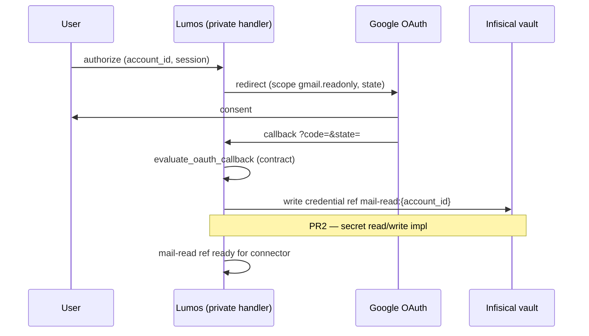

# Gmail OAuth callback contract (public-safe)

**Durum:** PR1 — contract + types only. **HTTP handler, token exchange ve Infisical yazma bu PR'da yok.**

İlgili kod: `src/integrations/mail/oauth_contract.py`  
Vault ref: `src/integrations/mail/vault_credential.py` — `mail_read_credential_ref`  
Runbook: [`vault-infisical-poc-runbook.md`](./vault-infisical-poc-runbook.md)

---

## OAuth flow overview



1. **Authorize** — kullanıcı Gmail OAuth onayına yönlendirilir; `state` payload `account_id`, `session_id`, `nonce` taşır (secret yok).
2. **Callback** — Google redirect query: `code`, `state`; hata durumunda `error`, `error_description`.
3. **Vault write** — başarılı callback sonrası OAuth token **private operatör katmanında** Infisical'a `mail-read:{account_id}` ref ile yazılır (PR2).
4. **Mail-read ref** — `GmailOAuthConnector` vault bridge üzerinden `mail_read_credential_ref(account_id)` ile okur.

---

## Route spec template

| Alan | Değer |
|------|--------|
| Path pattern | `/integrations/mail/oauth/gmail/callback` |
| Method | `GET` (Google redirect) |
| Query: success | `code` (authorization code), `state` (CSRF payload) |
| Query: error | `error`, `error_description` (opsiyonel) |

**Not:** Gerçek redirect URI Google Cloud Console'da tanımlanır — repo'da yok.

---

## Public vs private boundary

| Katman | Public repo (bu PR) | Private operatör |
|--------|---------------------|------------------|
| OAuth scope sabitleri | `GMAIL_OAUTH_SCOPE_READONLY`, `GMAIL_OAUTH_SCOPES_DAR_V1` | — |
| Callback spec + types | `oauth_contract.py`, bu belge | — |
| Vault ref adlandırma | `mail-read:{account_id}`, purpose `integration.mail.read` | Infisical secret path / RBAC |
| Client ID / secret | — | Google Cloud OAuth client |
| Redirect URI (canlı) | path pattern only | HTTPS endpoint deploy |
| HTTP callback handler | **Yok (PR1)** | Private route impl |
| Authorization code → token exchange | **Yok (PR1)** | Google token endpoint |
| Infisical token write | **Yok (PR1)** | PR2 operatör runbook |

---

## OAuthCallbackResult → vault ref mapping

Başarılı callback değerlendirmesi:

```
account_id  →  ref_id: mail-read:{account_id}
            →  purpose_code: integration.mail.read
            →  VaultCredentialRef (mail_read_credential_ref)
```

Örnek: `user@example.invalid` → `mail-read:user@example.invalid`

Connector: `GmailOAuthConnector.list_unread_summaries` vault configured ise bu ref üzerinden credential çözümler.

---

## Error codes catalog

| Kod | Anlam | Tipik tetik |
|-----|--------|-------------|
| `invalid_oauth_state` | State yok veya session eşleşmiyor | CSRF / oturum uyumsuzluğu |
| `malformed_oauth_state` | State decode edilemedi | Bozuk/base64/JSON |
| `missing_authorization_code` | `code` query yok | Kullanıcı iptal sonrası partial redirect |
| `oauth_provider_error` | Google `error` query | consent denied, policy |
| `unknown_account_id` | account_id bilinen sette değil | Kayıt dışı hesap |
| `account_id_required` | State içinde boş account_id | Bozuk authorize akışı |

---

## Explicit non-scope (PR1)

- HTTP route / handler implementasyonu yok
- Google token exchange yok
- Infisical secret read/write yok (PR2)
- Gmail API smoke test yok (PR3)
- Panel UI (M3) dokunulmadı
