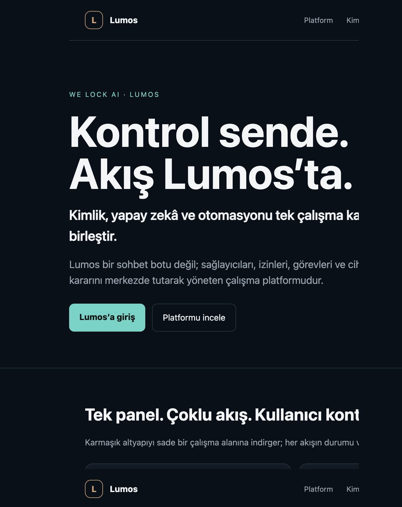
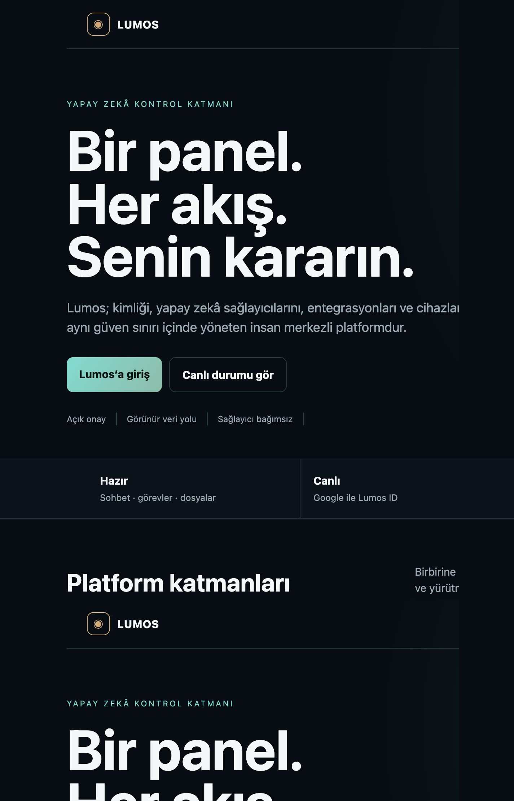
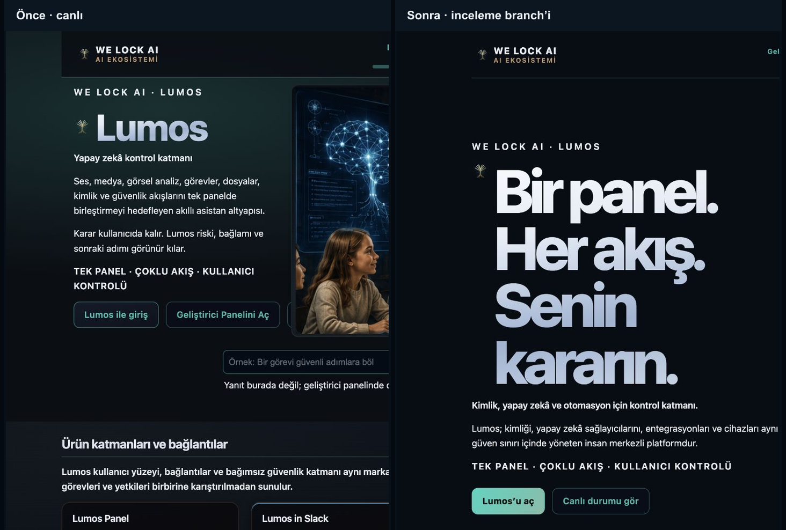
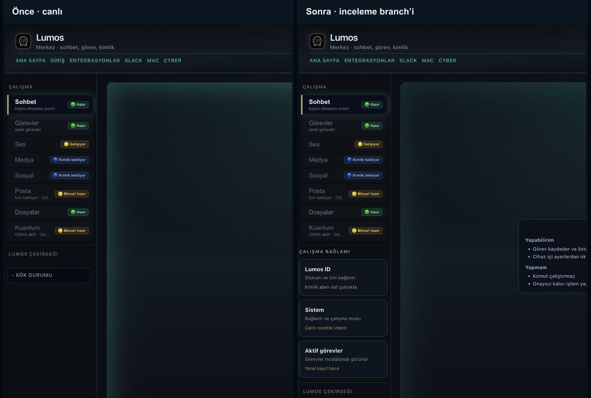

# Lumos platform yüzeyi — tasarım incelemesi

Bu çalışma üretime gönderilmemiştir. Canlı `welockai.com` görünümü 16 Temmuz 2026'da masaüstü ve mobil ölçülerde incelenmiş; seçilen tasarım ayrı inceleme branch'inde uygulanmıştır.

## Mevcut tasarımın kısa sorun raporu

- Ana mesaj doğru yönde olsa da Lumos'u platformdan çok tek bir yapay zekâ arayüzü gibi gösteriyor.
- On altı bölüm ve tekrar eden açıklamalar, kimlik–güvenlik–orkestrasyon–entegrasyon ilişkisini dağıtıyor.
- Çalışan, gelişen ve yol haritasındaki yetenekler ilk bakışta tek bir durum sistemiyle ayrışmıyor.
- Ana sayfanın ilk ekranında AI sağlayıcı ağı, Lumos ID ve cihaz ekosistemi görünmüyor.
- Panelin sol modül listesi güçlü; ancak kimlik, görev ve sistem bağlamı aynı hiyerarşide görünmediği için geliştirici konsolu hissi ağır basıyor.
- Canlı mobil panel yatayda taşıyor; başlık, ürün bağlantıları ve modül şeridi okunabilir alanı daraltıyor.

## Görsel varyantlar

### A — sade ve kurumsal

Az katman, geniş tipografi, üç temel yetenek kartı ve nötr durum paneli. Kurumsal ve sakin; fakat Lumos'un ekosistem ilişkisini sınırlı gösteriyor.

### B — platform ve ekosistem

Kimlik, çekirdek, AI sağlayıcı ağı, entegrasyonlar ve cihazları aynı kontrol haritasında gösteriyor. Durum bandı, bugün çalışanlarla yol haritasını ayırıyor. Seçilen varyant budur.

## Uygulanan tasarım kararları

- Koyu lacivert zemin, turkuaz etkileşim ve kontrollü altın vurgu korundu.
- Hero mesajı `Bir panel. Her akış. Senin kararın.` olarak kısaltıldı.
- Görsel sahne yerine ürün mimarisini anlatan gerçek HTML/CSS kontrol haritası kullanıldı.
- `Hazır / Canlı / Gelişiyor / Yol haritası` durum bandı eklendi.
- Uzun tekrar bölümleri birincil akıştan çıkarıldı; mevcut geliştirici, kurulum ve modül sözleşmeleri korundu.
- Panel masaüstünde modüller + merkez sohbet + çalışma bağlamı olarak üç alana ayrıldı.
- Mobil panel tek kolon ve yatay kayan modül şeridi olarak düzeltildi; otomatik ölçümde yatay taşma yok.
- Yeni metinlerin Türkçe ve İngilizce katalogları eklendi.
- Form ID'leri, panel modül ID'leri, `/panel?q=`, yönlendirmeler ve bağlantı rozeti korunmuştur.

## Karşılaştırma

## Doğrulama

- `npm run build` — geçti, 15 statik route üretildi.
- `pytest -q tests/test_ui_landing_tokens_css.py tests/test_panel_visual_polish.py tests/test_panel_i18n_v1.py tests/test_panel_module_nav_inactive_badge.py` — 148 test geçti.
- `.venv/bin/pytest -q` — 1320 test geçti, 3 test atlandı.
- `npm run e2e:smoke --prefix ui` — geçti.
- Mobil ana sayfa: `scrollWidth = clientWidth`.
- Mobil panel: `scrollWidth = clientWidth`, konsol hatası yok.

## Eksikler ve riskler

- Public `origin/main` branch'inde production OAuth route'ları bulunmuyor; bu tasarım onları kopyalamaz veya açık repoya taşımaz.
- `Lumos ID` sağ bağlam kartı tasarım yuvasıdır; canlı kullanıcı adı/avatarı mevcut özel OAuth katmanı birleştiğinde üst çubuktaki oturum bileşeninden gelir.
- Ana sayfanın eski uzun içerikleri kaynakta korunuyor fakat birincil görsel akıştan gizleniyor. Sonraki temizlik ayrı, içerik odaklı PR olmalıdır.
- `npm install` mevcut bağımlılıklarda 5 güvenlik uyarısı bildirdi; bu PR bağımlılık sürümü değiştirmez.
- Production deploy yapılmamıştır.

## Ekranlar

| Yüzey | Masaüstü | Mobil |
| --- | --- | --- |
| Ana sayfa | [after-home-desktop.png](./after-home-desktop.png) | [after-home-mobile.png](./after-home-mobile.png) |
| Panel | [after-panel-desktop.png](./after-panel-desktop.png) | [after-panel-mobile.png](./after-panel-mobile.png) |
